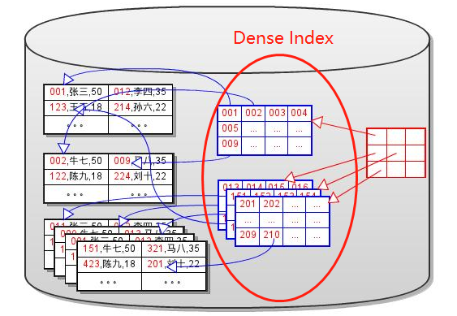
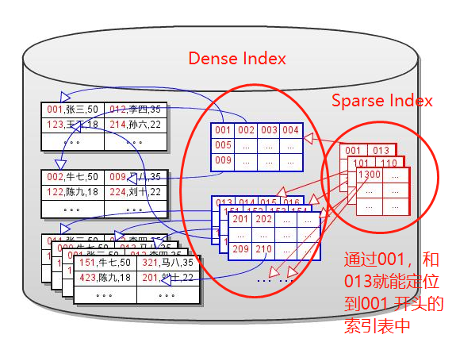

## 数据库的性能问题

- 数据库需要频繁的进行磁盘读写，由于磁盘IO性能非常低，所以严重影响了数据库性能。但是磁盘IO有一个特点就是，一次IO与读取数据的多少没有太大关系，而是进行IO的次数更影响性能，所以尽可能多读。
- 磁盘IO时顺序读写比随机读写的性能高很多（这是磁盘结构所决定的）

## 数据库数据在磁盘中的基本结构

- 磁盘空间被分成页，页的大小是由操作系统决定的
- 数据以行为单位存放在磁盘页中，访问数据时，一次从磁盘中读出或写入至少一个完整的页

## 如何查找磁盘中的数据

一个最直接的方式就是依次读磁盘中的数据块，一行一行数据进行匹配，除了大量磁盘IO带来的时空开销外，还是线性时间的查找，效率很差。

所以为了提高性能，主要需要减少磁盘IO，优化查找算法

- 减少磁盘IO，减少数据占用的空间，一次能够加载更多的数据到内存
- 减少访问无效数据，减少访问数据的总量。优化查找算法，尽量减少无效数据的访问

## 索引的诞生

### 键（key）

查找操作并不需要匹配整行数据（多数情况下），而用数据中的一列或几列值就能够定位。这些用于定位的一列或几列值称为键

所以，通过键与数据条目这样的逻辑关系就能够减少数据所占用的空间，一次读入更多的数据到内存

### Dense Index（稠密索引）

**Dense Index**是索引的祖先。依据减少无效数据访问的原则，键的值拿过来存放到独立的块中。并且为每一个键值添加一个指针， 指向原来的数据块。这形成了一个索引。

每次进行定位操作时，不再进行全表扫描，而是进行索引扫描，读出索引所在的数据页，进行键值匹配，从而定位到相应的键

所以可以给出索引的定义

### 索引概念

数据库索引是一个**单独的，物理的数据库结构**，是**某个表中一列或若干列值的集合**以及**指向表中物理标识这些值的数据页的逻辑指针的清单**

也就是说：

- 索引本身是一个实体，被组织在一个表中，也需要存储在数据页，保存在磁盘上。

- 索引由两部分组成，一个是数据表的一列或多列值（key），也即索引值（搜索码），一个是指向该值对应的那一条目数据所在的数据页的逻辑指针（row-pointer），该逻辑指针也可以理解为RID，即行标识，通过行标识可以具体找到某行的物理地址

一个例子：

**需要注意** ：不同的数据库和索引类型，逻辑指针的结构也是不同的。上图所示的右表数据列有，每一个行的最后都链接到了下一行，且左表中一个索引的逻辑指针可能指向多个右表中的内容。

## 索引的进化

### 排序的Dense Index

以上的稠密索引还时低级阶段，因为它还是需要通过全表匹配的方式来定位数据。根据一些查找算法（例如二分）的想法，可以先将Dense Index进行排序，进而可以在排序数据上进行查找（二分查找）提高查找效率，减少IO次数

工程化的二分查找的一些细节（后面有用）：

①将Dense Index排序后存储；

②查找时，读入Dense Index 数据块（可能有多个数据块），根据每一个数据块的其中一些索引（一般都是第一个索引）来进行二分查找确定存在数据的块

③在块中继续进行二分查找，找到对应的索引

其实以上两步二分查找是在同一层面的，只是情况不同。

### Sparse Index（稀疏索引）

通过二分查找理论优化了Dense Index之后可以发现，虽然每次都只进行一个索引的比较就能够筛选掉一半的无效数据，但是还是需要读入所有索引的数据块，也就是说，这一层面的有效数据仅仅是每一个索引数据块的第一个索引（也可能是中间某个索引），所以依据减少无效数据IO的原则，将每一个索引块的第一行数据拿出来组织成索引并存入块中，这样就能在这些二次索引上进行二分查找了。

### 多层Sparse Index

在Sparese Index的基础上继续优化，直到最上层的Index只占用一个块为止

### 索引树

多层Sparse Index就形成了一棵索引树

 A. 这个最上层的Sparse Index称作整个索引树的根(root).
 B. 每次进行定位操作时，都从根开始查找。
 C. 每层索引只需要读出一个块。
 D. 最底层的Dense Index或数据称作叶子(leaf).
 E. 每次查找都必须要搜索到叶子节点，才能定位到数据。
 F. 索引的层数称作索引树的高度(height).
 G. 索引的IO性能和索引树的高度密切相关。索引树越高，磁盘IO越多。

## Dense Index VS. Sparse Index

 A. Dense Index包含所有数据的键值，但是Sparse Index仅包含部分键值。后者占用更少的空间
 B. **Dense Index指向的数据可以是无序的，但是Sparse Index的数据必须是有序的。**
 C. Sparse Index 可以用来做索引的索引，但是Dense Index不可以（没效果，每个索引都有一个索引，没什么性能提升，**所以Dense Index一般都是叶子节点的索引**）
 D. 在数据是有序的时候，Sparse Index更有效。因此Dense Index仅用于无序的数据。
 E. 索引扫描(Index Scan)实际上是对Dense Index层进行遍历。

## Clustered Index & Secondary Index

Secondary Index 也称为 non-cluster Index

索引继续进化。在以上的Dense Index， 排序的Dense Index 和 多级Sparse Index中，都仅仅是对索引顺序的优化。如果数据本身是按照某一个键（key）来进行排序存储的，那么就可以直接在数据上建立Sparse Index，而不需要Dense Index层了（如果数据表太大，还是需要一个Dense Index层的）。这个**数据本身排序，直接建立的Sparse Index在另一角度上**就是常说的**聚簇索引（Clustered Index）**，数据中**用来排序的称为主键（Primary Key）**

- **一个表只能有一个Clustered Index,因为数据在物理存储时只能根据一个键排序.**
- 用其他的键来建立索引树时，必须要先建立一个dense索引层，在dense索引层上对此键的值进行排序。这样的索引树称作**辅助索引Secondary Index**.一个表上可以有多个辅助索引
  - 通过以上两点可以知道，聚簇索引的数据顺序就是物理存储的顺序，且有序；而非聚簇索引的数据的物理顺序是有序的（但是Dense Index并非对应的物理顺序）

- 对簇索引进行遍历，实际上就是对数据进行遍历。因此**簇索引的遍历效率比辅组索引低**。如SELECT count(*) 操作，使用辅组索引遍历的效率更高。

**范围搜索**

由于键值是有序的，因此可以进行范围查找。只需要将数据块或Dense Index块分别以双向链表的方式进行连接， 就可以实现高效的范围查找。如下图所示。一般是先找到范围左边界，在用链表顺序找

**出现了，是B+树**

### Cluster Index

根据cluster index的由来，所以说cluster并不是一种单独的索引类型，而是数据物理存储和索引的对应的方式。在不同的数据库引擎中有不同的实现。

Innodb通过主键聚集数据，如果没有定义主键，**innodb会选择非空的唯一索引代替**。如果没有这样的索引，**innodb会隐式的定义一个主键来作为聚簇索引**。

优点：

- 数据访问更快，因为聚簇索引将索引和数据保存在同一个B+树中，因此从聚簇索引中获取数据比非聚簇索引更快

   - 聚簇索引对于主键的排序查找和范围查找速度非常快

缺点：

   - 插入速度严重依赖于插入顺序，按照主键的**顺序插入**是最快的方式，否则将会出现页分裂，严重影响性能。因此，对于InnoDB表，我们一般都会定义一个**自增的ID列为主键**
   - **更新主键的代价很高**，因为将会导致被更新的行移动。因此，对于InnoDB表，我们一般定义主键为不可更新。

聚簇率（clustering ratio）

使用聚簇索引固然有查询方面的优势，但是在数据插入方面就产生一个问题：新插入的数据应该放在哪个数据页的什么位置？由于聚簇索引要求数据行与索引值顺序保持一致，那新插入的数据行以及其索引值是否必须寻找相应位置执行插入操作呢？如果数据页中相应位置没有足够的空间插入该怎么办呢？可以想象，如果要保证顺序的严格一致，必然会导致大量的数据迁移，这样的花销是不可接受的。所以，真正的处理办法是允许有一定的顺序不一致出现，即便有些数据是无序的，仍然认为该索引是聚簇索引。

我们把索引中满足聚簇顺序条件的（索引值，数据行）对占该索引上所有（索引值，数据行）对的比例称为聚簇率，聚簇索引中85%以上的聚簇率是可接受的。否则就需要进行重组。

### Secondary Index

在大多数数据库中，索引的结构都被组成为B+树，这样一种索引就形成了一棵B+ 树，像上图一样。

但是如果**对数据页进行管理拆分或合并操作**，那么会导致所有的B+树叶子节点都需要修改相应的页指针，特别是Secondary Index对应的B+树，这些Secondary Index所对应的页都是不连续的，所以要对不连续的页进行修改，修改时还要加锁，会降低并发性

所以InnoDB做了优化，将Secondary Index对应的B+树中的指针替换成了主键的键值

这样就将这些Secondary Index对应的B+树与实际的数据页解耦了，数据成了Cluster Index对应的B+树的独占。对页的操作仅仅影响Cluster Index，而且还是连续的。

所以InnoDB的数据文件中存储的实际上是多个孤立的B+树。

这样也造成了一个问题，在查询的时候

- 查询主键->直接在Cluster Index上查询
- 辅助索引->首先在Secondary Index上查询索引对应的主键->再用Cluster Index查询主键对应的数据。

也就是说**在使用主键值替换页指针后，辅助索引的查询效率降低了。**（增删改操作也降低了，因为要更新许多Secondary Index）

**这就涉及到了另外两个重要的概念——回表查询和索引覆盖**

所以

- 尽量用主键查询数据
- 可以用缓存来弥补性能，用缓存，那么所有键应该尽量小
- 在更新操作较多的表上尽量少建索引

## 非唯一键索引

通常假设索引的键值都是唯一的，但是在实际的工程中，**Secondary Index是允许键值重复的。**那么在查找时，如何处理索引重复的情况。

#### 结合主键

在InnoDB的Secondary Index对应的B+树中，主键也是该键的一部分，也就是说Secondary Index = 用户定义的Key + 主键。如下图所示

注意，**主键不仅作为数据出现在叶子节点，同时也是辅助索引的一部分，出现在非叶子节点**（在中途索引的时候也可能出现重复）。因为主键是唯一的，所以辅助索引也是惟一的 ，在实际操作的过程汇中（增删改查）还是优先使用用户定义的key。InnoDB对所有的辅助索引都按这种规则创建，不管是否唯一。

#### 索引压缩技术

## 实际的键-指针对

在标准的B+Tree中，每个节点都有K个键值和K+1个指针，指向K+ 1个节点

而在InnoDB的B+树中，每个节点有K个键值和K个指针，构成了键值对。

在查找时键值对也是可以分左右的，例如每个键是索引的下一个块的开头指针，那么在两个索引之间的索引，肯定存在小索引指向的块中。

但是如果要插入一个比最小的索引还要小的数据怎么办？

标准B+树中，键值会被定位到最左侧的节点。而在InnoDB的B+树中，所有的非叶子层节点最左侧都有一个MIN_REC，所有要插入的指针，无论多小，都会比MIN_REC大，所以会被插入到最左侧节点

**http://blog.codinglabs.org/articles/theory-of-mysql-index.html**

再来一篇比较好的讲解索引的文章，好的地方在于对比了MyISAM和InnoDB的具体实现

https://blog.csdn.net/idber/article/details/8087473

这是硬件层面的数据库原理

# B树

### B 树的由来：

外存的访问速度非常慢，ms级别(磁盘)，而内存的访问速度是ns级别，两者相差了10^5的样子，如果一次对内存的访问需要1s的话，同样的数据在外存访问就要一天。**但是外存有个特性，从外存中读取1b数据和1kb数据消耗的时间几乎相等**，所以我们为了减少对外存的访问次数，在从外存读取数据时一次读取大量数据放入内存中，根据数据访问的局部性原理，就诞生出了B树这么个东西

### B树的定义（约束）

一个M叉树，即一个节点最多有M个分叉，M-1个关键字，有：

- 定义任意非叶子结点最多只有M个儿子；且M>2；
- 除根结点以外的非叶子结点的儿子数为[M/2, M]；
- 每个结点存放至少 M/2-1（取上整）和至多M-1个关键字（至少2个关键字）；
- 非叶子结点的关键字以升序排列：K[1], K[2], …, K[M-1]；且K[i] < K[i+1]；
- 非叶子结点的指针：P[1], P[2], …, P[M]；其中P[1]指向关键字小于K[1]的子树，P[M]指向关键字大于K[M-1]的子树，其它P[i]指向关键字属于(K[i-1], K[i])的子树；
- **所有叶子结点位于同一层**；

### B树的使用

B树中的每个节点都存储了三类信息，如下图所示。除了和一般的树一样存储了键值和子树指针外，还存储了具体数据。这是由于B树的由来本身就是为了读取节点就能够获取部分数据。

B树从根节点开始进行查找，在实际工程中，根据根节点的信息，从磁盘中载入对应子节点的内容，如果数据在子节点中，则直接返回，如果数据未在子节点中，则继续向下寻找。这也造成了一个问题就是如果数据在叶子节点上，那么会进行更多次的IO，因为一个节点中存储了数据，一次读入的节点变少（提前读），IO次数变多。

# B+ 树

B+树对B树进行了改进，主要优化在两个方面：

- 数据全部存储在叶子节点。这样一来，在进行查找的时候就能一次将更多的节点读入内存（提前读），提高命中率，减少IO次数
- 树的所有叶子节点又被组织成一个有序链表，可以按照关键字排序的次序遍历。

用大白话概括就是，B+树中间节点只存储了导航信息，不包含实际的值；叶子节点用链表连接，便于查找遍历。

**相比B树B+树有以下几点优点：**

（1）由于B+树的中间节点没有卫星数据，因此同样大小的磁盘页可以容纳更多的节点元素，数据存放的更加紧密，具有更好的空间局部性。因此访问叶子几点上关联的数据也具有更好的缓存命中率，**查询时的I/O次数更少**。

（2）对于范围查找，例如查找3-11之间的所有数据，对于B树，查找下限3，然后中序遍历；对于B+树只需要在叶节点链表上遍历即可，**范围查找的效率更高**。

（3）由于B树在查找时最好情况是根节点，最差情况是叶子节点；B+树都是查找到叶子节点，所以**B+树的查找更加稳定**。

**但是B树也有优点**，其优点在于，由于B树的每一个节点都包含key和value，因此**经常访问的元素可能离根节点更近，因此访问也更迅速**。

**什么是卫星数据？**

索引元素所指向的数据记录，比如数据库中的某一行。

在B树中无论是中间节点还是叶子节点都带有卫星数据，但是在B+树中只有叶子节点带有卫星数据，中间节点仅仅是索引。左图是B树，右图是B+树。

# 稠密索引 稀疏索引

一、稠密索引

如果记录是排好序的，我们就可以在记录上建立稠密索引，它是这样一系列存储块：块中只存放记录的键以及指向记录本身的指针，指针就是一个指向记录或存储块地址。稠密索引文件中的索引块保持键的顺序与文件中的排序顺序一致。既然我们假定查找键和指针所占存储空间远小于记录本身，我们就可以认为存储索引文件比存储数据文件所需存储块要少得多。当内存容纳不下数据文件，但能容纳下索引文件时，索引的优势尤为明显。这时，通过使用索引文件，我们每次查询只用一次I/O操作就能找到给定键值的记录。

二、稀疏索引

稀疏索引只为数据文件的每个存储块设一个键-指针对,它比稠密索引节省了更多的存储空间，但查找给定值的记录需更多的时间。只有当数据文件是按照某个查找键排序时，在该查找键上建立的稀疏索引才能被使用，而稠密索引则可以应用在任何的查找键。稀疏索引只为每个存储块设一个键-指针对。键值是每个数据块中第一个记录的对应值