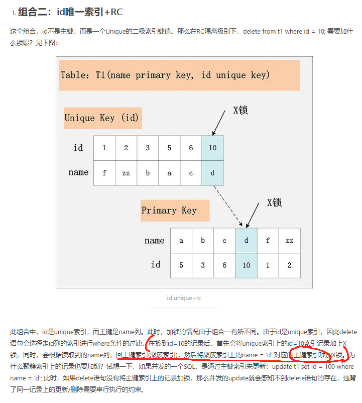

https://blog.csdn.net/qq_38238296/article/details/88362999

# Mysql锁的分类

- 粒度：行锁，表锁
- 使用方式：共享锁（Shared Lock），排他锁（eXclusive Lock）
- 锁的行为：悲观锁，乐观锁
- InnoDB中的几种**行锁**：Record Lock，Gap Lock，Next-Key Lock

# 行锁

行锁是Mysql中粒度最细的一种锁，表示只对当前操作的行进行加锁。**行级锁能大大减少数据库操作的冲突。其加锁粒度最小，但加锁的开销也最大。有可能会出现死锁的情况**

行级锁按使用方式分为共享锁（Shared Lock、S锁、读锁）和排他锁（eXclusive Lock，X锁，写锁）。

# 表锁

表级锁是Mysql中粒度最大的一种锁，表示对当前操作的整个表进行加锁。**资源开销比行锁少，不会出现死锁的情况，但是发生锁冲突的概率很大**

# 页锁

页锁一次锁定相邻的一组记录

# 乐观锁 VS. 悲观锁

悲观锁就是InnoDB实现的锁，乐观锁需要自己去实现

天下锁是一家，这里 的乐观锁也是采用类似CAS的概念，需要程序级别的实现的。在表中添加一个版本字段（version)。

但是乐观锁的状态更新（version的更新）也是需要悲观锁的，只是只有在提交更新的时候才需要获取锁，锁占有的时间少，所以才会提高并发（快的先执行）

# InnoDB锁特性

**InnoDB行锁是通过给索引上的索引项加锁来实现的**

Oracle的数据库引擎通过在**数据块中对相应数据行加锁来实现的**。

InnoDB这种行锁实现特点意味着：只有通过索引条件检索数据，InnoDB才使用行级锁，否则，InnoDB将使用表锁！

从底层原理上来将就是，InnoDB对在某个索引组织下的请求数据对应的**索引项**进行加锁，Oracle通过对查询到的**数据项**进行加锁。所以也就有了下面的第二条。另外，如果InnoDB通过不同索引访问到同一行

- 当表有多个索引的时候，**不同的事务可以通过使用不同的索引锁定不同的行**。不论是使用主键索引，唯一索引或者普通索引，InnoDB都会使用行锁来对数据进行加锁。但是使用普通索引的时候，还会对主键索引项进行加锁，从而达到行锁的效果
- 
- Mysql的行级锁是针对索引加的锁，不是针对记录加的锁，所以即使是访问不同行的记录，如果使用相同索引，还是会出现锁冲突
- 不通过索引进行查询并操作的时候，InnoDB会将**行锁升级为表锁**
- 即便在条件中使用了索引字段，但是数据库引擎还会进行相应的优化。录入数据库判定全表扫描效率更高，那么就不会用索引进行查找，此时InnoDB将使用表锁而不是行锁。所以真正判断是否用了行级锁需要检查SQL执行计划（explain）

# InnoDB索引加锁分析

链接：https://www.jianshu.com/p/13f5777966dd   **深度好文**！！！！！！  [mysql 索引加锁分析 - 简书.pdf](mysql锁.assets\mysql 索引加锁分析 - 简书.pdf) 

### MVCC  VS.  LBCC(Serializable)

**快照读：**简单的select操作，属于快照读，不加锁，不抢锁（也就是被锁住也能读，因为读的是快照）。这个快照读是基于版本的，MVCC将数据分成不同的版本进行存储（中间文件）

- select * from table where ?;

**当前读：**特殊的读操作，插入/更新/删除操作，属于当前读，需要加锁。

- select * from table where ? lock in share mode;
- select * from table where ? for update;
- insert into table values (…);
- update table set ? where ?;
- delete from table where ?;

**当前读的第一条加共享锁，当前读的其他操作都加的排他锁**

一些DML操作也是基于当前读的，因为执行模式就是先根据选择条件找到对应的行并加锁然后进行操作。还有一些细节，进连接看看

### 聚簇索引概念

### 二阶段锁概念**2PL：Two-Phase Locking**（加锁解锁不相交）

### 对基于当前读的隔离级别的解读也有一点区别

### 一些索引、隔离级别组合的加锁实例

#### Mysql对行锁升级表锁进行了一点优化的

