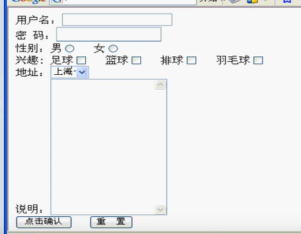

# 表单的确认

表单的确认（验证）是保证数据安全的一个环节。在客户端的确认常见的有注册时两次输入密码，验证码等，通常通过JavaScript来写。

客户端的确认可以被恶意跳过，所以，服务器端的确认必须要写。

## 客户端确认

特点

- 减少服务器负载

- 缩短用户等待时间
- 兼容性差

## 服务器端确认（必写）

特点

- 统一性确认
- 兼容性强
- 服务器负载重，等待时间长


## JavaScript

### 如何定义一个JavaScirpt

#### 方法一，耦合在html中

通常放置在当前JSP文件的`head`标签中。实际上放在任何地方都可以

```jsp

<%@ page contentType="text/html;charset=UTF-8" language="java" %>
<html>
    <head>
        
        
        <!-- 1 -->
        <!-- javascript -->
        <script type="text/javascript">
            <%-- 
                javascript的函数定义(没有变量类型，只有一个var)
                function funname(args){ function body}
            
            	document是javascript的内置对象，每个载入浏览器的html文档都会成为document对象
            --%>
            function validate(){
                var username = document.getElementById("username");
                var password = document.getElementById("password");
                var reenterpass = document.getElementById("reenterpass");

                if(username.value.length == 0){
                    alert("please enter username");
                    return false;
                }else if(password.value.length == 0 || reenterpass.value.length == 0){
                    alert("please enter password");
                    return false;
                }else if(password.value != reenterpass.value){
                    alert("enter different passwords");
                    return false;
                }
                return true;
            }
        </script>
        
               
    </head>
    <body>
        <!-- 2 -->
        <form onsubmit="return validate()">
            <!-- javascript通过id的值找到对应的标签内容 -->
            username:<input type="text" name="username" id="username"><br>
            password:<input type="text" name="password" id="password"><br>
            reenter-password:<input type="text" name="reenterpass" id = reenterpass><br>
            <input type="submit" value="submit">
        </form>
    </body>
</html>

	<!--
	注意
	在1的位置为javascript定义的方法
	在2的位置需要将javascript通过绑定事件注册到html中
	-->
```


#### 方法二，独立的.js文件

```javascript
//.js文件内容

function validate() {
    var username = document.getElementById("username");
    var password = document.getElementById("password");
    var reenterpass = document.getElementById("reenterpass");

    alert(username);
}

//注意定义方法和普通的脚本语言差不多
```


```jsp
<!-- .jsp文件中的内容 -->
<%@ page contentType="text/html;charset=UTF-8" language="java" %>
<html>
<head>
    <title>sign in validated by javascript</title>
    <!-- 1 -->
    <script src="validate.js"></script>
</head>
<body>
    <!-- 2 -->
    <form onsubmit="return validate();">
        username:<input type="text" name="username" id="username"><br>
        password:<input type="text" name="password" id="password"><br>
        reenter-password:<input type="text" name="reenterpass" id="reenterpass"><br>
        <input type="submit" value="submit">
    </form>
</body>
</html>

<!--
	注意
	在1的位置需要将javascript的源引入，相当于导入包
	在2的位置需要将javascript通过绑定事件注册到html中
	-->
```


javascript脚本是如何获取相应标签的值的呢.笔记1中讲过

##### 1、以标签中的<span style='color:red'>`id`属性</span>值为索引

```js
var username = document.getElementByName("nameValue");//js使用标签中的name属性
```

- 其实html标签中的<span style='color:red'>`id`属性</span>只是为了客户端获得相应标签内容所使用的，服务器端无法使用

  

##### 2、以标签中的<span style='color:red'>`name属性`</span>为索引

```js
var username = document.getElementsByName("username")[0];
```

- html标签中的<span style='color:red'>`name`属性</span>不同于<span style='color:red'>`id`属性</span>，它不仅常被服务器端使用，也可以被客户端使用

  - ```js
    document.getElementsByName("nameValue")[index];//js使用标签中的name属性
    ```

  - ```java
    request.getParameter("nameValue");//Servlet使用标签中的name属性
    ```

    

# JS其他的一些应用实例

## 全选

```html
<!-- html文件 -->
<html>
    <head>
        <script src="selectall.js"></script>
    </head>
    <body>
        <input type="checkbox" onclick="selectAll()"><br>select all
        <input type="checkbox"><br>1
        <input type="checkbox"><br>2
        <input type="checkbox"><br>3
        <input type="checkbox"><br>4
        <input type="checkbox"><br>5
        <input type="checkbox"><br>6
        <input type="checkbox"><br>7
    </body>
</html>
```


```js
//selectall.js文件
function selectAll(){}
```


## JS能够很轻松的操作页面中所有的标签及其属性，所以在客户端通常用JS来进行一些操作


# 实验

设计一个网页如下图



对其中的内容进行客户端、服务器端进行双重验证

要求：

用javascript进行以下验证

用户名和密码输入不能为空

用户名和密码长度均需要在4-10之间

兴趣数量在1-3之间

说明为必填项

用户填写不顾和要求的需要弹出警告对话框


用客户端进行相同的验证

如果验证通过，转向一个html，列举填写信息

如果错误，转向另一个html，列举错误信息

以上转向由Servlet实现（请求转发）


