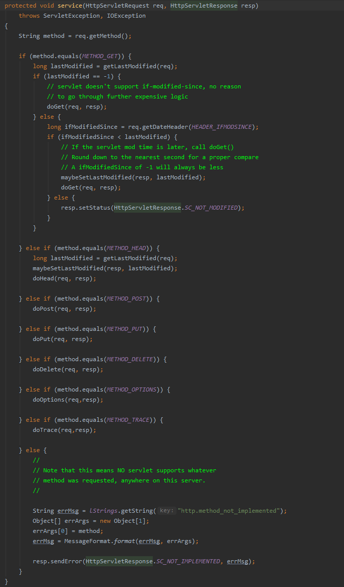

# Servlet

> 了解Servlet的功能
>
> 了解Servlet的生命周期
>
> 了解Servlet的API
>
> 掌握 创建并发布HttpServlet的方法
>
> 理解ServletContext与JavaWeb应用的关系


## Servlet简介

- Java Servlet是和平台无关的服务器端组件，运行在Servlet容器中
- Servlet容器负责Servlet和客户的通以及调用Servlet的方法
- Servlet和客户的通信采用“请求/响应”的模式（基于HTTP协议）
- Servlet可以完成以下功能：
  - 创建并返回基于客户请求的动态HEML页面（JSP）
  - 创建可嵌入到现有HTML页面中的部分HTML页面（HTML片段）
  - <span style="color:red">与其他服务器资源（如数据库或基于Java的应用程序）进行通信</span>**（主要功能）**

## Servlet的API

Servlet框架是由两个Java包组成的

- `javax.servlet`包：定义了所有的Servlet类都必须实现或者扩展的通用接口和类（通用的，适用多种协议）
- `javax.servlet.http`包：定义了采用HTTP协议通信的HttpServlet类（针对HTTP协议的）

Servlet框架的核心是`javax.servlet.Servlet`接口，<span style="color:red">所有的Servlet都必须要实现该接口</span>。在Servlet接口中定义了五个方法，其中有三个方法代表了Servlet的生命周期：

- init方法：负责初始化Servlet对象
- service方法：负责响应客户的请求
- destroy方法：当Servlet对象退出生命周期时，负责释放占用的资源

每一个Servlet都必须要实现`Servlet`接口，`GenericServlet`是个通用的，不特定于任何协议的`Servlet`，它实现了`Servlet`接口。而`HttpServlet`继承于`GenericServlet`，因此HttpServlet也实现了`Servlet`接口，所以我们定义的`Servlet`只需要继承`HttpServlet`父类即可。

`Servlet`接口中定义了一个`service`方法，`HttpServlet`对该方法进行了实现,实现方式就是将`ServletRequest`与`ServletResponse`转换为`HttpServletRequest`和`HTTPServletResponse`


转换完毕之后调用自己定义的`service`方法，在该方法中首先获得请求的method，根据该方法调用对应的doXXX方法。




### 下面讨论基于HTTP协议的Servlet——HttpServlet

- doGet
- doPost
- doPut
- doDelete
- init
- destroy
- service

当一个Http请求到来时，首先会调用`service`方法将该请求进行解析处理，并分派到具体的`doGet`或者`doPost`等方法去进行处理。所以在将`HttpServlet`子类化时经常需要重写`doGet`、`doPost`方法，但基本不用重写`service`方法。

### ServletRequest接口

ServletRequest接口中封装了客户请求信息，如客户请求方式、参数名和参数值、客户端正在使用的协议，以及发出客户请求的远程主机信息等。ServletRequest接口还未Servlet提供了直接以二进制方式读取客户请求数据流的ServletInputStream。

ServletRequest的子类可以为Servlet提供更多的和特定协议相关的数据。


### ServletResponse接口


## Servlet生命周期

Servlet的生命周期可以分成三个阶段

- 初始化阶段
- 响应客户请求阶段
- 终止阶段

在javax.servlet.Servlet接口中定义了三个方法`init()`,`service()`,`deatroy()`，他们将分别在Servlet不同的阶段被调用

### 初始化阶段

在下列时刻，Servlet容器装载`Servlet`

- Servlet容器启动时自动装载某些`Servlet`

  - `web.xml`文件中使用`<load-on-startup>`标签.改标签使用在`<servlet>`标签下，每次Tomcat启动加载`Servlet`时会检查该标签，如果有，<span style="color:red">Servlet容器启动时就自动加载该`Servlet`</span>，如果有多个，就按数字的顺序加载

    ```xml
    <load-on-startup>5</load-on-startup>
    ```

    

- 在Servlet容器启动后，客户向`Servlet`首次发出请求

- `Servlet`的类文件被更新后，重新装载`Servlet`

Servlet在被装载后，Servlet容器创建一个`Servlet`实例并且调用`Servlet`的`init()`方法进行初始化。<span style="color:red">在`Servlet`的整个生命周期中，init只会被调用一次</span>


### 响应客户请求阶段

对于到达Servlet容器的客户请求，Servlet容器创建特定于这个请求的ServletRequest对象和ServletResponse对象，然后调用Servlet的service方法。service方法从ServletRequest对象获得客户请求信息、处理该请求，并通过ServletResponse对象向客户返回响应结果。


对于Tomcat来说：

Tomcat自己实现了一个HttpServletRequest，路径如下

```
D:\SOFTWARE\TOMCAT\apache-tomcat-9.0.30-src\java\org\apache\catalina\connector\Request.java
```


在该文件中可以对Request中的各种方法追根溯源，`getParameter`方法底层就是通过`getParameterValues`方法实现的，而该方法是解析请求中的附加内容来实现的。会将参数和值以键值对的形式存储在一个`HashTable`中


### 终止阶段

- Web应用程序被终止
- Servlet容器终止运行
  - （多个Web应用程序都被终止）

- Servlet容器重新装载`Servlet`的新实例时

Servlet容器会先调用`Servlet`的`destroy`方法。在该方法中，可以释放Servlet所占用的资源


### 总结（复习，创建一个自己的HttpServlet）

1、扩展HttpServlet抽象类

2、覆盖HttpServlet的部分方法（doGet，doPost等）

3、获取Http请求信息（service方法）


## ServletContext和Web应用的关系

当Servlet容器启动Web应用时，并为<span style="color:red">每个Web应用创建唯一的ServletContext对象</span>，可以把ServletContext看成是<span style="color:red">一个Web应用</span>的服务器组件的共享内存。在ServletContext中可以存放共享数据，它提供了读取或者设置共享数据的方法：

- setAttribute(String name, Object object)把一个对象和一个属性名绑定，将这个对象存储在ServletContext中
- getAttribute(String name)根据给定的属性名返回所绑定的对象


- 获取ServletContext：

  ```java
  ServletContext sc = request.getSession().getServletContext();
  //sc.getAttribute("attributeName");
  //sc.setAttribute("attributeName", value);
  //如此，其他的JSP页面或者Servlet就可以使用更新后的这个attribute了
  ```

  

### ServletContext生命周期

在Webapp开启的时候被创建并一直存在，当服务器停止运行或者重新加载Webapp时，生命周期结束


## Servlet同步问题

- Servlet/JSP技术和ASP、PHP相比，由于其多线程运行而具有很高的效率
- 由于<span style="color:red">Servlet/JSP默认是以多线程模式</span>执行的，所以在编写代码的时候需要考虑多线程的同步问题
- 如果在编写Servlet/JSP程序时不注意多线程同步问题，在少量用户访问时没有问题，但是并发访问数多了之后就会出现问题

#### 案例

一个用户输入用户名，若干时间后显示用户名的Servlet，其中用户名转发由request.setAttribute("username",value)实现.

```java
field:
	private String username;

Servlet doGet():
    this.username = request.getParameter("username");
    try{
        THread.sleep(10000);
    }catch(Exception e){
        e.printStack
    }

    request.setAttribute("username", username);
    request.getRequstDispatcher("ddd.jsp").forward(request, response);
```


此时如果两个用户同时使用该网站输入不同的用户名，那么在等待时间结束后，所两个用户的浏览器上显示的就是最后一个输入的结果。

<span style="color:red">主要原因是在与Servlet是单例实现的，所有的请求共享其成员变量。如果对成员变量进行数据写入操作，就有可能发生数据同步问题</span>

#### 同步问题解决方案

- 去除实例变量，使用局部变量（推荐） 

- 使用同步代码块

 

## 练习题


A


C


C


ABDEFG

特别注意D,E（连接关系->超链接）

