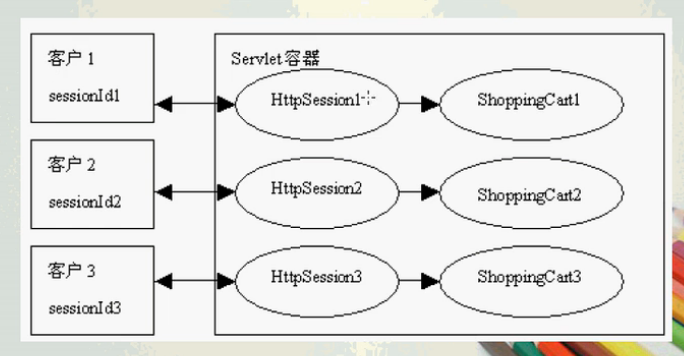
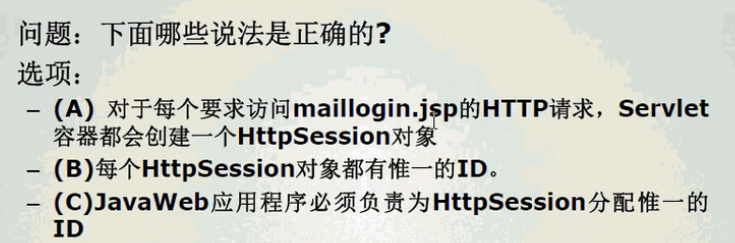
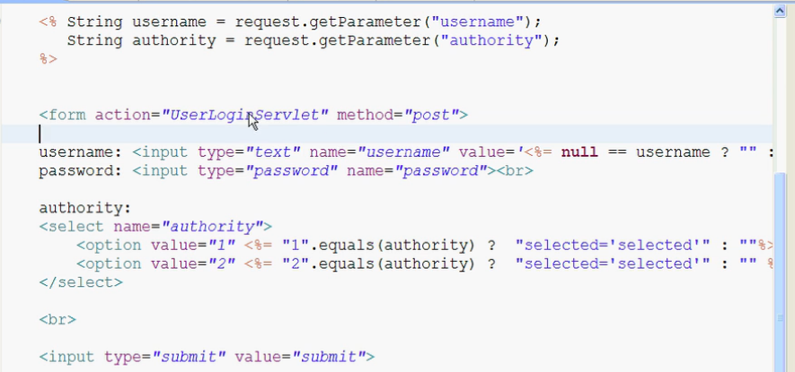
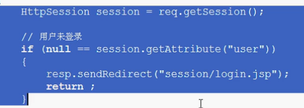

# Session

> 理解Session概念
>
> 掌握HttpSession API
>
> 理解Session声明周期
>
> 在JSP文件中控制Session
>
> 在JSP文件中设置Session范围内的共享数据


## 跟踪客户状态

Web服务器跟踪客户状态通常有四种方法

- 建立含有跟踪数据的隐藏字段
- 重写包含额外参数的URL
- 使用持续的Cookie
- <span style="color:red">使用Servlet API中的Session（会话）机制</span>（重点）


## Session(会话) 概念

Session用于跟踪客户的状态。指的是在一段时间内，<span style="color:red">单个客户</span>与Web服务器的<span style="color:red">一连串相关的交互过程</span>。在一个Session中，客户可能会多次请求访问同一个网页，也有可能请求访问各种不同的服务器资源


### 举例

1、在电子邮件应用中，从一个客户登录到电子邮件系统开始，经过收信、写信和发信等一系列操作，直至最后退出邮件系统，整个过程为一个Session

2、在购物网站应用中，从一个客户开始购物到最后结账，整个过程为一个Session


## **Session运行机制

- 当一个Session开始时，Servlet容器将创建一个`HttpSession`对象，在该对象中可以存放客户状态的信息。
- Servlet容器创建`HttpSession`时，会为它分配一个唯一的标志符，称为`Session ID`。Servlet容器将`Session ID`作为Cookie的`name-value`对 保存在客户的浏览器中。
- 每次客户发出HTTP请求时，Servlet容器可以从`HttpServletRequest`对象中读取`Session ID`，然后根据`Session ID `找到对应的HttpSession对象，从而获取客户的状态信息。




## HttpSession接口

- `getID()`

  - 返回`Session ID`，该ID由Servlet容器进行分配，特定于实现产生

- `invalidate()`

  - 使当前的Session失效，Servlet容器会释放HttpSession对象所占用的资源

- `isNew()`

  - 判断是否是新创建的Session。如果是新创建的Session，返回true

- `setMaxInactiveInterval()`

  - 设定一个Session可以处于不活动状态的最大时间间隔，以秒为单位。如果超过了这个时间，Session自动失效。如果设置为负数，表示不限制Session处于不活动状态的时间。

  - 在web.xml中设置失效时间

    - ```xml
      <session-config>
      	<session-timeout> 30 </session-timeout>
      </session-config>
      ```

      也可以在Servlet中使用以上方法设置失效时间，优先级更高

    

## Session生命周期

**Session 生效**：

- 当客户第一次访问Web应用中支持Session的某个网页时，就会开始一个新的Session。

  - 需要注意只有访问JSP、Servlet等程序时才会创建Session，只访问HTML、IMAGE等静态资源并不会创建Session,可调用request.getSession(true)强制生成Session

- 接下来当客户浏览这个Web应用的不同网页时，始终处于同一个Session中。

- 默认情况下，JSP网页都是支持Session的，也可以通过以下语句显示声明支持Session

  - ```JSP
    <%@ page session="true" %>
    ```

**Session 失效**

- 服务器会把长时间没有活动的Session从服务器内存中清除，此时Session便失效。Tomcat中Session的默认失效时间为20分钟。

  - session的过期时间是从session不活动的时候开始计算，如果session一直活动，session就总不会过期

- 服务器主动调用Session的`invalidate()`方法使Session失效

  ```java
  HttpSession session = request.getSession();
  session.invalidate();//注销该request的所有session
  ```

- 设置Session失效时间

  - web.xml中

    ```xml
    <session-config>
        <session-timeout>30</session-timeout>
    </session-config>
    ```

  - Servlet中

    ```java
    request.getSession().setMaxInactiveInterval(-1);//永不过期
    ```

  - Servlet 容器（以Tomcat为例）的server.xml文件中

    ```xml
    <Context path="/livsorder" 
    docBase="/home/httpd/html/livsorder" 　　defaultSessionTimeOut="3600" 
    isWARExpanded="true" 　　
    isWARValidated="false" isInvokerEnabled="true" 　　isWorkDirPersistent="false"/>
    ```

    


## 练习题



B   A-页面需要支持Session。首次访问，或者session失效后的再次访问创建session  C-Session ID由Servlet容器分配


mailexdir

identifierexdir

通过请求转发或者重定向（直接在连接后面加上?username=...&authority=...）将错误的登录信息依旧回显到登录页面




以下部分代码可以防止用户直接查看源代码，不登录就访问相应的文件带来的漏洞



但是每一个需要权限的页面或者Servlet都需要这么写的话非常麻烦

sun公司就设计了过滤器（filter）来集合这些过滤信息