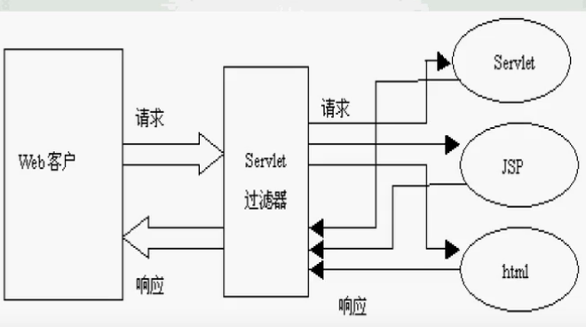
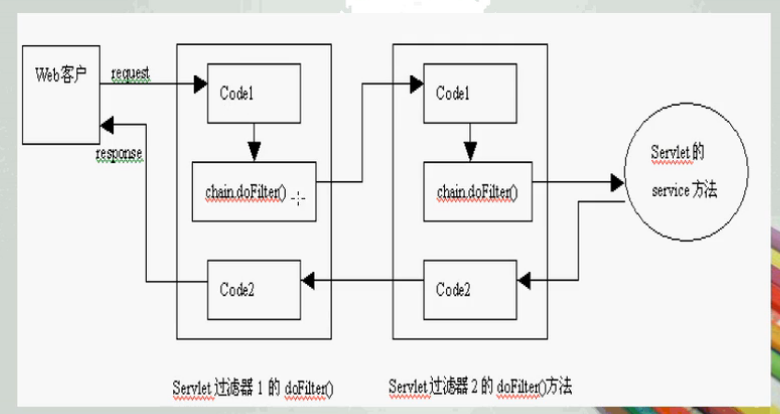

#  Filter 过滤器

- 了解Servlet过滤器的概念
- 了解Servlet过滤器的工作过程
- 掌握创建Servlet过滤器的方法
- 掌握发布Servlet过滤器的方法

> 是对数据等的过滤，预处理过程。为什么要引入过滤器呢？在平常访问网站的时候，有时候发一些敏感的信息，发出后显示时 就会将敏感信息用\*等字符替代，这就是用过滤器对信息进行了处理。这只是一个简单的例子，当然，过滤器那么强大，它的功能也不可能局限于此，它不仅能预处 理数据，只要是发送过来的请求它都是可以预处理的，同时，它还可以对服务器返回的响应进行预处理，这样，大大减轻了服务器的压力。例如，实现URL级别的 权限访问控制、过滤敏感词汇、压缩响应信息等一些高级功能。下面来详细介绍一下过滤器。

Filter 就像一个特殊的Servlet。与Servlet文件一样，Filter也需要在web.xml文件中进行配置


## Filter概念

> 

- Filter是在Java Servlet规范2.3中定义的，能够对Servlet容器的请求和响应对象当进行检查和修改
- Servlet Filter本身并不能生成请求和响应对象，它只提供过滤作用
- Servlet Filter能够在Servlet被调用之前检查Request对象，修改Request Header和Request内容
- Servlet Filter能够在Servlet被调用之后检查Response对象，修改Response Header和Response内容
- Servlet过滤器负责过滤的Web组件可以是Servlet、JSP或HTML文件


## Servlet Filter的工作过程




## Filter 接口

所有的Servlet过滤器都必须实现`javax.servlet.Filter`接口。该接口包含3个过滤器必须实现的方法

- `inite(FIlterConfig)`
  - 这是Servlet过滤器的初始化方法，Servlet容器创建Servlet过滤器实例后将调用该方法。该方法中可以读取web.xml中Servlet过滤器的初始化参数。
- **`doFilter(ServletRequest, ServletResponse, FilterChain)`**
  - 该方法完成实际的过滤操作。当客户请求访问与过滤器相关联的 URL 时，Servlet容器将先调用过滤器的`doFilter`方法。FilterChain参数将用于访问后续过滤器。
- `destroy()`
  - Servlet容器在销毁过滤器实例前调用该方法，在这个方法中可以释放Servlet过滤器占用的资源。


## Filter的生命周期

**（1）Filter接口中有三个重要的方法。**

- `init()`方法：初始化参数，在创建Filter时自动调用。当我们需要设置初始化参数的时候，可以写到该方法中。
- `doFilter()`方法：拦截到要执行的请求时，doFilter就会执行。这里面写我们对请求和响应的预处理。
- `destroy()`方法：在销毁Filter时自动调用。

 

**（2）Filter的生命周期**

　　  Filter的创建和销毁由<span style="color:red">web服务器</span>控制。

- <span style="color:red">服务器启动的时候</span>，web服务器创建Filter的实例对象，并调用其init方法，完成对象的初始化功能。filter对象只会创建一次，init方法也只会执行一次。
- 拦截到请求时，执行doFilter方法。可以执行多次。
- 服务器关闭时，web服务器销毁Filter的实例对象。


## Filter的实现

**特别需要注意三个问题**

1、注册

2、排除不需要重定向的文件

3、重定向路径


看IDEA代码。Filter需要重写三个方法，然后在web.xml中进行相应的配置。和servlet的配置大致相同

```xml
<filter>
    <filter-name>AuthorityFilter</filter-name>
    <filter-class>org.hzf.firstservlet.filters.AuthorityFilter</filter-class>
</filter>
<!-- 这里的url-pattern是用户访问该pattern时会调用该过滤器 -->
<!-- 注意映射中的 【/*】 是指所有的请求都会调用该过滤器进行过滤 -->
<filter-mapping>
    <filter-name>AuthorityFilter</filter-name>
    <url-pattern>/*</url-pattern>
</filter-mapping>
```

需要注意的是，何时需要通过该Filter，用`/*`表示对所有的资源都需要进行该Filter过滤操作，如果要排除某些资源的过滤操作，需要在`SelfDefinedFilter`中的`doFilter`方法中排除。

```java
@Override
public void doFilter(ServletRequest request, 
                     ServletResponse response, 
                     FilterChain chain) 
    throws IOException, ServletException {
    
    System.out.println("do fliter");

    HttpServletRequest req = (HttpServletRequest) request;
    String requestURI = req.getRequestURI();
    System.out.println(requestURI);
    if(!requestURI.endsWith("login.jsp") && 
       !requestURI.endsWith("IdentifierExServlet")){
        AuthorityBean user = (AuthorityBean)req.getSession().getAttribute("bean");
        if(null == user){
            //2、这里需要注意重定向的资源URI问题，最好是在访问资源的同一个包下面，或者这里写明绝对路径
            //否则，每一个JSP都需要进行重定向时，要么会找不到相应的资源（不再同一个包下的情况）要么会循环重定向（写了相对路径）
            ((HttpServletResponse)response).sendRedirect("login.jsp");
        } else
         	//如果不进行后续的资源调用，那么调用完doFilter之后就会停止资源请求，就没有后续的内容了
        	chain.doFilter(request, response);
    }else{
        chain.doFilter(request, response);
    }
}
```


另外也可以在注册时定义好初始化参数

```xml
<filter>
    <filter-name>AuthorityFilter</filter-name>
    <filter-class>org.hzf.firstservlet.filters.AuthorityFilter</filter-class>
    <init-param>
    	<param-name>hello</param-name>
        <param-value>world</param-value>
    </init-param>
    <init-param>
    	<param-name>zhangsan</param-name>
        <param-value>lisi</param-value>
    </init-param>
</filter>
```


## 串联过滤器



串联过滤器在产生效果时，是根据web.xml中的注册顺序（\<filter>标签）来决定顺序的

