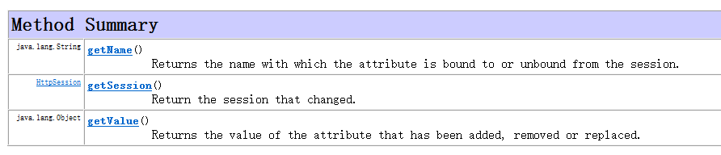

# Listener


> 所有的监听器，基本都是观察者模式的实现、应用


- Listener是Servlet的监听器，它可以通过监听客户端的请求、服务器端的操作等。通过监听器，可以自动触发一些操作（调用回调函数）。比如监听在线的用户的数量
- 当增加一个HttpSession时，就激发sessionCreated（HttpSessionEvent se）方法，这样既可以给在线人数加1


## Listener常用API

### ServletContextListener

- 监听ServletContext。
  - 当**创建**`ServletContext`时，激发`contextInitialized(ServletContextEvent sce)`方法。
  - 当**销毁**`ServletContext`时，激发`contextDestroy(ServletContextEvent sce)`方法
- 根据文档，该Listener必须被注册到web.xml中或者通过`addListener`方法注册
- 服务器启动的时候就会创建ServletContext，这是整个WebApp的上下文环境，在Filter和Servlet之前创建，在其之后销毁。具体说明与实验如下图所示
- 
  - 
  - 


### ServletContextAttributeListener

- 监听对ServletContext属性的操作，比如增加、删除、修改属性。当发生这些事件时，广播，Listener被唤醒，传入事件（ServletContextAttributeEvent），调用相应的方法

  - 

- ServletContextAttributeEvent

  - 

  - ```java
    /**
     * ServletContextAttributeListener文件
     **/
    
    public class MyServletContextAttributeListener implements ServletContextAttributeListener {
        @Override
        public void attributeAdded(ServletContextAttributeEvent event) {
            System.out.println("add:");
            System.out.println(event.getName());
            System.out.println(event.getValue() + "\n");
        }
    
        @Override
        public void attributeRemoved(ServletContextAttributeEvent event) {
            System.out.println("removed:");
            System.out.println(event.getName());
            System.out.println(event.getValue() + "\n");
        }
    
        @Override
        public void attributeReplaced(ServletContextAttributeEvent event) {
            System.out.println("replaced:");
            System.out.println(event.getName());
            System.out.println(event.getValue() + "\n");
        }
    }
    
    ```

   - ```xml
      <!-- 将Listener注册 -->
      <listener>
          <listener-class>
              org.hzf.firstservlet.listeners.MyServletContextAttributeListener
          </listener-class>
      </listener>
      ```
  
  
  - 
  
  


### HttpSessionListener

- 监听HttpSession的操作。

  - 当创建一个`Session`时，激发`sessionCreated(HttpSessionEvent)`方法

  - 当销毁一个`Session`时，激发`sessionDestroy(HttpSessionEvent)`方法

  - 首次访问网站时自动创建一个session，在失效前，再次访问还是同一个session

    - ```java
      public class MyHttpSessionListener implements HttpSessionListener {
          @Override
          public void sessionCreated(HttpSessionEvent se) {
              System.out.println("session has been created: " + se.getSession());
          }
      
          @Override
          public void sessionDestroyed(HttpSessionEvent se) {
              System.out.println("session has been created: " + se.getSession());
          }
      }
      ```

    - ```xml
      <listener>
          <listener-class>
              org.hzf.firstservlet.listeners.MyHttpSessionListener
          </listener-class>
      </listener>
      ```

    - 


### HttpSessionAttributeListener

- 监听HttpSession中的Attribute的操作，当在Session中增加，删除或重置Attribute等事件(Event)发生时，广播，Listener被唤醒，传入事件（HttpSessionBindingEvent），调用相应的方法
- 用法用量和之前的ServletContextAttributeListener一模一样，。
  - HttpSessionBindingEvent
    - 比之前的ServletContextAttributeEvent多了一个`getSession`方法
    - 