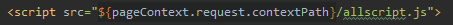

# Expression Language

表达式语言，应用于JSP中

## 作用

减少JSP中的脚本化内容(Java代码)


## 表达式有两种使用方式

1、自定义或者标准的行为中的属性值

2、插入到模板数据中


## 基本语法：

```jsp
${expr}
\${expr}<!-- 在HTML页面中输出 -->
```

支持表达式，条件运算符，逻辑运算符

### < . > VS. < [] >        运算符

#### EL提供.和[]两种运算符来**存取数据**。

- ${sessionScope.user.sex}  ==  ${sessionScope.user["sex"]}

#### 当存取的属性名称中包含一些特殊字符时，就一定要使用<[]>运算符，因为它有引号

- ${sessionScope.user.my-name} 是错的，应该使用 ${sessionScope.user["my-name"]}

#### 当需要动态取值时，需要用<[]>运算符

- 若data是一个变量，可能为sex，也可能为name，当需要取得user的data属性值时，需要用${sessionScope.user["data"]}

### 自动转变类型

EL可以自动转换类型。如${param.count + 20} 会将传来的count自动转化为数值


## EL 变量

EL存取变量数据的方法很简单，例如${userrname}。意思就是取出某一范围中，名称为username的变量值。因为我们并没有指定那一个范围的username，所以<span style="color:red">默认值会先从Page范围内查找</span>，如果找不到，依次到Request，Session，Application中找。全部找不到就是null，一旦找到就直接回传


## EL 内置（默认）对象

- pageContext
  - the PageContext object
- pageScope
  - <span style="color:red">**A MAP**</span> containing page-scoped attributes and their values
- requestScope
  - <span style="color:red">**A MAP**</span> containing request-scoped attributes and their values
- sessionScope
  - <span style="color:red">**A MAP**</span> containing session-scoped attributes and their values
- applicationScope
  - <span style="color:red">**A MAP**</span> containing application-scoped attributes and their values
- param
  - <span style="color:red">**A MAP**</span> containing request parameters and single string value
  - 相当于request.getParameter(“name”)
- paramValues
  - <span style="color:red">**A MAP**</span> containing request parameters and their corresponding string arrays
  - 相当于request.getParameterValues(“name”)
- header
  - <span style="color:red">**A MAP**</span> containing header names and single string values
- headerValues
  - <span style="color:red">**A MAP**</span> containing header names and their corresponding string arrays
- cookie
  - <span style="color:red">**A MAP**</span> containing cookie names and their values

```jsp
${param.attributeName}
${param .attributeName[3]}
```


## 对Bean的访问

JSP对应的<span style="color:red">**命名空间**</span>中的`Bean`可以通过`EL`调用

- 通过dot(.)直接调用

  ```jsp
  ${beanName.attributeName} <!-- 获得beanName中，attributeName的属性值 -->
  ```

- JSP可以通过搜索作用域(scope)（page，request，session，application）来定位Bean

- Bean的作用域(scope)可以通过前置属性来限定bean

  ```jsp
  ${scopeName.beanName.attiributeName}
  ```

  

