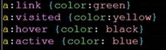

# CSS

### 介绍

CSS（Cascading Style Sheets）即层叠样式表，是一种用来表现[HTML](https://baike.baidu.com/item/HTML)（[标准通用标记语言](https://baike.baidu.com/item/标准通用标记语言/6805073)的一个应用）或[XML](https://baike.baidu.com/item/XML)（标准通用标记语言的一个子集）等文件样式的计算机语言。CSS不仅可以静态地修饰网页，还可以配合各种脚本语言动态地对网页各元素进行格式化

通俗介绍

样式（Style）定义了HTML元素如何去显示，一般存储在样式表（Style Sheet）中。利用外部样式表可以提高工作效率，外部样式表存储在CSS文件中。使用CSS，HTML文档可以用不同的样式输出来展示。

一开始HTML通过一些标签去设置字体，表格等，后来为了方便增加了样式。一个CSS文档可以被多个HTML所使用，当改变该CSS文档中的内容，关联的HTML都会发生改变（一动多变）。就像是内容和显示解耦一样

同样一个HTML元素也可以有关联多个样式，但是当出现这种情况时，应用哪种样式去显示呢，根据如下规则由上到下优先级递增：

- 浏览器默认（Browser Default）
- 外部样式表（External Style Sheet）
- 内嵌样式表，在`<head>`标签内（Internal Style Sheet，inside the `<head>` tag

- 行内样式在一个HTML元素内（Inline Style，insaide an HTML element)


### 语法

CSS的语法有三部分组成

- 选择器
- 属性
- 值

```CSS
selector{property:value}
```

#### 选择器

选择器是希望去定义的目标HTML元素/标签，也就是已经存在的标签/元素名，每个属性可以有一个值，属性和值由冒号连区分，并用大括号包括

```css
/* 表示body中每个文本用黑色去创建 */
body{color:black}
```

如果值为多个单词，则用引号括起来

```css
p{font-family:"sans serif"}
```

如果想指定多个属性，就要必须将每个属性用分号隔开。例如定义 居中 的 红色 文字段落

```css
p{text-align:center;color:red}
```

如果想指定多个同样的标签（选择器），可以用逗号分隔每个选择器

```css
h1,h2,h3,h4{color:green}
```


#### 选择器类

用选择器类可以将同一类型的HTMl元素定义出不同的样式，比如你想在你的文档中有两种不同格式的段落：

一种居中红色

一种右对齐绿色

如果定义选择器类时，省略标签名（但是不能省略 '.' ），这样就可以在所有的HTML元素中使用了

.css:

```css
p.right{text-align:right;color:green}/*右对齐*/
p.center{text-align:center;color:red}/*居中*/
/*下面的可以在所有的标签中使用*/
.left{text-align:left;color:yellow}/*左对齐*/
```

同时需要在HTML中指定相应标签的类属性（class）才能达到想要的效果。但是只能有一个类属性，如果有多个不会报错，但是情况根据浏览器不同就不一样了

.html:

```html
<body>
    <p class="right">
        right and green	
    </p>
    <br>
    <p class="center">
        center and red
    </p>
    
    <!-- 所有标签都能用左对齐的样式 -->
    <a class="left" href="https://www.baidu.com">
        this is a hyper ref
    </a>
</body>

```


#### id选择器

使用id选择器可以为不同的HTML元素定义相同的样式

1、下面的样式规则将匹配任何一个带有id属性值为green的对应标签

```css
p#green{color:green}
h1#green{color:green}
```


2、下面的样式规则对任何一个带有id属性值为green的元素都是匹配的

.css:

```css
#green{color:green}
```

.html

```html
<p id="green">
    this is a p in green
</p>
< h1 id="green">
    this is a title in green
</h1>
```

但是一般来说id标识了元素，一般不重复。

且需要注意区别选择器类和id选择器


### 具体使用

在head中通过`<link>`标签添加一个CSS连接来指定样式表(内嵌样式)

```html
<html>
	<head>
		<!-- 连接一个css -->
		<link rel="stylesheet" type="text/css" href="cssbase.css">
        
        <h1>
        	this is a head
        </h1>
        <h2>
        	this is a head-2
        </h3>
        
	</head>
	<body>
		<p>
			helloworld
		</p>
	</body>
</html>
```


cssbase.css：

```css
p{
    text-align:right;
    color:blue
}
h1,h2,h3,h4{
    color:orange
}
```


#### 怎样插入样式表

当浏览器阅读样式表时，会根据样式表来格式化文档，有三种方法可以插入样式表

- 外部样式表 （需要通过`<link>`标签引用）

  外部样式表可以使用任何文字编辑器书写，保存为一个后缀名为.css的文件就好

  使用外部样式表是使样式应用于多张网页的理想方法，通过这个方法你只需要改动一个文件就能改变整个网站的外观，使用`<link>`标签让每个页面都连接到样式表，`<link>`标签只能在head区域内使用

  ```html
  <head>
  	<link rel="stylesheet" type="text/css" href="cssfilename.css">
  </head>
  ```

  

- 内嵌样式（定义在`<head> </head>`标签中的）

  内嵌样式表应该在当有单独文档有特殊样式的时候使用。使用`<style>`标签在head区域中定义样式

  ```html
  <head>
      <style type="text/css">
          hr{color:red}
          p.right{margin-right:20px}
          .left{margin-left:20px}
          body{background-image:url("url")}
      </style>
  </head>
  ```

  

- 行内样式

  使用行内样式就是去了样式表的优势，而将内容和形式耦合了，一般这个房发在个别元素需要改变样式的时候使用

  在相关的标签上用style属性来加入行内样式。行内样式属性可以包含任何CSS属性。

  ```html
  <p style="color:red;margin-left:20px">
      this is a para
  </p>
  ```


上面的例子是引入了外部样式表


#### 多重样式表

如果一些属性被相同的选择器设置成不同的样式，值就会向更具体的样式所继承（具体化）

举例：一个外部样式有如下的选择器属性

```css
h3{color:red;text-align:right;font-size:8pt}
```

同时一个内嵌样式表有这样的h3选择器

``` css
h3{text-align:center;font-size:20pt}
```

那么最终该标签还是使用如下的样式（将所有的属性都继承，如果有重复的使用优先级更高的）

```css
h3{color:red;text-align:center;font-size:20pt}
```

 


附：

一些链接的样式：

