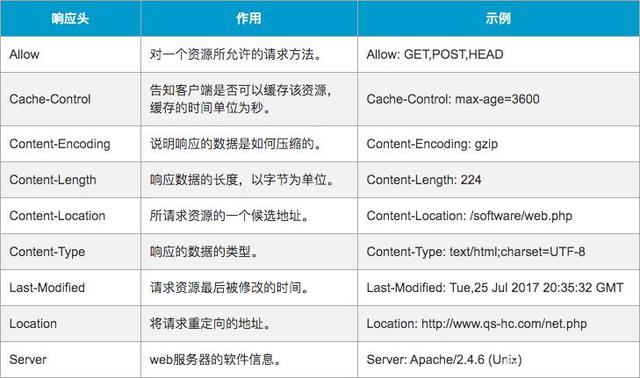

# HTTP协议

## HTTP协议的相关内容

HTTP（Hyper Text Transfer Protocol）即超文本传输协议

在浏览器搜索框内输入URL并连接后，有许多步骤，但是总体上来看就是发出请求/接收响应


HTTP 是应用层协议

==HTTP是一个基于响应/请求模式的，面向文本的无状态协议==

基于请求和响应是指，只有浏览器端发送请求，服务器端才会有返回响应（一个超文本，其中的资源在解析的时候再次请求）；

面向文本是指报文中的所有字段都是ASCII码串	

无状态是指服务器端无法通过该协议判断多次请求是否来自于同一个客户端，可以通过Cookie，Session克服该情况

### 工作原理

HTTP是基于客户/服务器模式，且面向连接的。典型的HTTP事务处理有如下的过程： [8] 

（1）客户与服务器建立连接；

（2）客户向服务器提出请求；

（3）服务器接受请求，并根据请求返回相应的文件作为应答（响应请求）；

（4）客户与服务器关闭连接。

### HTTP1.0

在HTTP1.0时期，每一次请求会建立一个链接，当请求获得响应之后就会关闭连接。一个页面不但包括了静态的信息，还包括了一些css，图片，音视频等信息，这些资源都是需要解析的时候建立连接，通过请求/响应的方式向服务器端获取的。每一次获取资源都需要创建一次连接，这就会导致开销巨大，造成了网络信息堵塞

### HTTP1.1 持续连接

因为HTTP1.0版本的问题，所以在HTTP1.1版本中，给出了一个持续连接（persistent connections）机制，将该机制作为HTTP建立连接的默认行文。浏览器建立连接后，可以在该连接上发送多次请求，并多次接受响应。另外客户端还可以发送流水线请求，也就是说，客户端可以连续发送多个请求，而不用等待每一个响应的到来。

注意，通过这种持续连接，原本需要的请求次数不会改变，减少的只是连接建立的次数 

自动关闭连接的机制：服务器端的限时无响应关闭机制

## 客户端访问一个网站的大致过程（计算机网络相关）

在服务器端，定义一个服务器套接字

并让该套接字监听80端口

```java
ServerSocket serverSocket = new ServerSocket();
serverSocket.accept(80);
```


当在客户端输入网址（例如www.baidu.com） 通过DNS 转换成（协议://主机号:端口号/)。（如果没有端口号，浏览器自动添加默认的80端口号）

```java
Socket socket = new Socket("221.179.180.20", 80);//客户端（浏览器）将定义一个目标套接字，传入IP和端口号

```


## HTTP URL

#### URL(Uniform Resource Location)

统一资源定位符

#### 格式

- http://host\[:port]/[abs_path]
- 其中http表示通过HTTP协议定位网络资源
- host表示合法的网络主机域名或者IP地址(32位,以点分十进制格式表示,0.0.0.0-255.255.255.255)
- port用于制定一个端口号,拥有被请求资源的服务器主机监听该端口的TCP连接,如果Port是空,则使用默认的80端口
- abs_path是指定请求资源的URI(Uniform Resource Identifier,统一资源标识符),如果URL中没有给出abs_path,那么当它作为请求URI时,必须以"/"的形式给出,通常,浏览器完成这个工作

#### URL VS. URI

URI纯粹是一个符号结构，用于指定构成Web资源的字符串的各个不同部分

URL是一种特殊类型的RUI，它包含了用于查找某个资源的足够信息

## HTTP请求和响应

## HTTP的请求

客户端通过发送HTTP请求向服务器请求对资源的访问

HTTP请求由三部分组成，分别是请求行，消息报头，请求正文


#### 请求行

请求行以一个方法符号开头，后面跟着请求URI和协议版本，以CRLF结尾。请求行以空格分隔，除了作为结尾的CELF外，不允许出现单独的CR或LF字符，格式如下：

```
Method Request-URI HTTP-Version CRLF
```


其中

- Method表示请求的方法（通常有GET，POST，PUT，DELETE等等，浏览器仅仅实现了前面两个方法）

  

  - GET方法用于获取由Request-URI锁表示的资源的信息

  - POST方法用于向服务器发送请求（和GET一样）要求服务器接收附在请求后的数据。POST方法在表单提交的时候用的最多。例如如下的一个HTTP请求：

    ```
    POST /login.jsp HTTP/1.1 (CRLF)        ----请求行
    Accept:image/git (CRLF) (...)          ----消息报头
    Host: www.sample.com (CRLF) (...)
    ...
    Cache-Control:no=cache (CRLF)
    Connection:Keep-Alive(CRLF)
    (CRLF)
    username=hello&password=12346			----附加内容
    ```

  - HEAD方法跟GET方法相同，只不过服务器响应时**不会返回消息体**。一个HEAD请求的响应中，**HTTP头中包含的元信息应该和一个GET请求的响应消息相同**。这种方法可以用来获取请求中隐含的元信息，而不用传输实体本身。也经常用来测试超链接的有效性、可用性和最近的修改。

    一个HEAD请求的响应可被缓存，也就是说，响应中的信息可能用来更新之前缓存的实体。如果当前实体跟缓存实体的阈值不同（可通过Content-Length、Content-MD5、ETag或Last-Modified的变化来表明），那么这个缓存就被视为过期了。**该方法通常用于测试超链接的有效性，是否可以访问，以及最近是否更新等**

- Request-URI是一个统一资源标识符，表示了要请求的资源
- HTTP-Version表示请求的HTTP协议版本
- CRLF表示回车换行

例如

```
GET /test.html HTTP/1.1 (CRLF)
```

#### 消息报头

包括了一系列属性


#### 请求正文

也就是附加内容，只有POST方法时，附加内容才会被接收


## HTTP响应

在接收和解释请求消息后，服务器会返回一个HTTP响应消息

与HTTP请求类似，HTTP响应也是由三个部分组成，分别是：状态行，消息报头，响应正文

#### 状态行

状态行由协议版本，数字形式的状态代码，相应的状态描述组成，各元素之间以空格分隔，除了结尾的CRLF序列外，不允许出现CR或LF字符

```
HTTP-Version Status-Code Reason-Phrase (CRLF)
```

- HTTP-Version表示 *服务器* HTTP协议的版本

- Status-Code表示服务器发回的响应代码（常见的404等）

  - 状态代码由三维数字组成，表示请求是否被理解或被满足，状态描述给出了关于状态代码段 简短文本描述
  - 状态代码的第一个数字定义了响应的类别，后面两个数字没有具体的分类，第一个数字有五种可能的取值
    - 1XX：只是信息-表示请求已接收，继续处理
    - 2XX：成功-表示请求已经被成功接收，理解，接受
    - 3XX：重定向-要完成请求必须进行更进一步的操作
    - 4XX：客户端错误-请求有语法错误或请求无法实现
    - 5XX：服务器端错误-服务器未能实现合法的请求

- Reason-Phrase表示状态代码的文本描述

- CRLF表示回车换行

  举例：

  ```
  HTTP/1.1 200 OK (CRLF)
  ```

  

#### 消息报头



#### 消息正文

## HTTP消息

HTTP消息由客户端到服务器的请求和服务器到客户端的响应组成。请求消息和响应消息都是由开始行（请求行/响应行），消息报头，空行和消息正文（请求正文/响应正文）组成


# Telnet实验

开启Telnet服务

在命令行中输入

```
telnet www.baidu.com 80
```

因为默认是23端口，所以要手动设置为80端口（百度主机的默认访问端口）

将一下内容粘贴进全黑的命令行窗口，连击回车

```
GET /index.html HTTP/1.1
Host: www.souhu.com.cn
```

就可以获得index.html的文件内容


