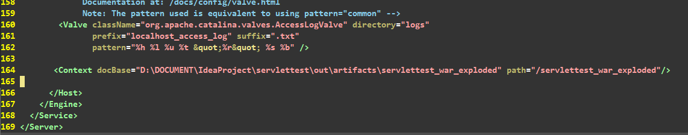

# Tomcat

## Tomcat 安装

1、下载Tomcat免安装版本（.zip）

2、解压

## Tomcat 环境变量配置

1、首先要确保已经有JAVA环境的配置

2、配置Tomcat环境变量，添加系统环境变量“CATALINA_HOME"，值为解压的根目录（不是bin目录）

## Tomcat启动与测试

使用bin目录下的startup.bat批处理文件启动tomcat服务，注意不要关闭命令行页面

在浏览器中输入 http://localhost:8080/

如果显示Tomcat主页，则表示成功，否则失败

运行bin目录下的shutdown.bat批处理程序就可以关闭tomcat服务

## Tomcat安装时的一些问题

#### 闪退，无法启动

1、查看环境变量是否配置正确

2、在startup.bat和shutdown.bat文件的头两行加入

```
SET JAVA_HOME=...
SET CATALINA_HOME=...
```


#### 无法打开网页

不要关闭启动的命令行

查看端口是否已经被占用（netstat -ano|findstr "8080"）（tasklist|findstr “PID”）

#### 启动关闭命令行乱码

设置confi文件夹下 logging.properties中的ConsoleHandler.encoding为GBK


# 使用IDEA intellij 创建一个mvn项目并将其转换为webapp

首先创建一个mvn项目，在项目根目录右键，**添加固件支持**


在弹出的窗口中勾选Web固件，确定，就可以看到项目的目录发生变化。一般来说web文件夹下放置页面（前端代码），src文件夹下放置逻辑代码


多了web文件夹，同时也可以创建servlet


创建的Servlet无法继承父类，是因为没有引入父类的jar包

在**mvn依赖项中添加**

```xml
<dependencies>
    <dependency>
        <groupId>javax.servlet</groupId>
        <artifactId>javax.servlet-api</artifactId>
        <version>3.0.1</version>
        <scope>provided</scope>
    </dependency>
    <dependency>
        <groupId>javax.servlet.jsp</groupId>
        <artifactId>jsp-api</artifactId>
        <version>2.2</version>
        <scope>provided</scope>
    </dependency>
</dependencies>
```

然后就能成功创建Servlet了，重写doGet和doPost方法

```java
package org.hzf.firstservlet;

import java.io.IOException;

public class HelloServlet extends javax.servlet.http.HttpServlet {
    protected void doPost(javax.servlet.http.HttpServletRequest request, javax.servlet.http.HttpServletResponse response)
            throws javax.servlet.ServletException, IOException {

    }

    protected void doGet(javax.servlet.http.HttpServletRequest request, javax.servlet.http.HttpServletResponse response)
            throws javax.servlet.ServletException, IOException {

    }
}
```


然后需要**配置WEB-INF/Web.xml**

将请求通过xml文件映射到Servlet

```xml
<servlet>
        <servlet-name>HelloServlet</servlet-name>
        <servlet-class>org.hzf.firstservlet.HelloServlet</servlet-class>
    </servlet>
	
	<!-- 以下是添加的映射 -->
    <servlet-mapping>
        <servlet-name>HelloServlet</servlet-name>
        <url-pattern>/hello</url-pattern>
    </servlet-mapping>
```

接下来需要进行**Tomcat设置**

在模板中进行如下设置


然后添加一个Tomcat，进行**工程内的设置**


#### ATTENTION 下面开始是部署的内容，有两种部署方式，1、IDE自动部署；2、手动部署

##### 1、手动部署

手动部署的话需要首先生成Artifect，Build—>Build Artifect，设置相应的生成路径和文件名


设置完成后，需要重新Build一下，然后就能够看到out文件夹了，文件夹中的内容就是Tomcat最终需要的内容


然后将WebApp的根目录（就是上图中的firstservlet目录）的路径填入到Tomcat中，如下图


其中path是逻辑地址，就相当于JAVA_HOME

然后就能够跳过ide直接启动Tomcat就能够访问网站了

##### 2、IDE自动部署

如果要在IDE中启动Tomcat并进行网站访问，那么最好直接使用自动部署

设置访问网址，热部署等一些无足轻重的之后，将Servlet文件**部署**到Tomcat


然后就好了


最好是手动生成artifect，然后自动部署时，添加外部文件设置物理路径和逻辑路径（上图）


其实idea会通知tomcat读取项目目录下的out里面编译的字节码文件，不会在他自身目录的webapp中存放

详细内容https://blog.csdn.net/z69183787/article/details/78030857

IDEA自动部署之后，只能从IDEA启动，如果是直接启动Tomcat，不经过IDEA，访问失败。


==解决，其实就是第二种部署方式：==

在C:\Users\Snidelo\.IntelliJIdea2019.2\system\tomcat路径下，有相关的webApp独立的包，这个包里有一个配置文件C:\Users\Snidelo\.IntelliJIdea2019.2\system\tomcat\Tomcat_9_0_30_servlettest_3\conf\Catalina\localhost\servlettest_war_exploded.xml

该配置文件就是Tomcat启动，部署webapp时需要读取的文件，只有一行内容

```xml
<!-- 
其中docBase是源文件地址，path是URL的URI，修改这个就可以修改搜索网站时的URI，但是要注意重启Tomcat 
-->
<Context docBase="D:\DOCUMENT\IdeaProject\servlettest\out\artifacts\servlettest_war_exploded" path="/servlettest_war_exploded"/>

<!-- 网站地址 -->
<!-- http://localhost:8080/servlettest_war_exploded/ -->
```

IDEA就是通过这个文件来通知Tomcat如何找到WebApp的，如果将该文件复制到D:\SOFTWARE\TOMCAT\apache-tomcat-9.0.30\conf\Catalina\localhost路径下，或者将其内容复制到D:\SOFTWARE\TOMCAT\apache-tomcat-9.0.30\conf\server.xml中的\<Host>标签前，如下图，那么就能够跳过IDEA，直接启动Tomcat就能访问该网站了



推荐使用该方式（将目录写到server.xml中）来进行部署


# Servlet

Servlet（Server Applet）是JAVA服务器端编程，不同于我们之前写的一般的JAVA应用程序。具有独立于平台和[协议](https://baike.baidu.com/item/协议/13020269)的特性，主要功能在于交互式地浏览和生成数据，生成动态[Web](https://baike.baidu.com/item/Web/150564)内容。

狭义的Servlet是指Java语言实现的一个接口，广义的Servlet是指任何实现了这个Servlet接口的类，一般情况下，人们将Servlet理解为后者。Servlet运行于支持Java的应用服务器中。从原理上讲，Servlet可以响应任何类型的请求，但绝大多数情况下Servlet只用来扩展基于HTTP协议的Web服务器


## Servlet类

Servlet和普通的应用程序区别在于，Servlet应用程序没有main方法。虽然Servlet是一个应用，但它也只是服务器中的一个组件，所以没有main方法。

Servlet继承自`javax.servlet.http.HttpServlet`类

```java
public class HelloServlet extends HttpServlet {
    protected void doPost(HttpServletRequest request, HttpServletResponse response)
            throws javax.servlet.ServletException, IOException {

    }

    protected void doGet(HttpServletRequest request, HttpServletResponse response)
            throws javax.servlet.ServletException, IOException {
        response.setContentType("text/html");
        //Servlet通过字符流的方式向Http输出
        PrintWriter out = response.getWriter();
        out.println("<html><head><title>hello servlet</title></head>");
        out.println("<body><h1>hello servlet</h1></body></html>");

        out.flush();
    }
}
```


## Servlet映射

```xml
<!-- web.xml文件 -->
<!-- servlet -->
<servlet>
    <servlet-name>HelloServlet</servlet-name><!-- 1 -->
    <servlet-class>org.hzf.firstservlet.servlets.HelloServlet</servlet-class>
</servlet>
<!-- 映射 -->
<servlet-mapping>
    <servlet-name>HelloServlet</servlet-name><!-- 2 -->
    <url-pattern>/hello</url-pattern><!-- 3 -->
</servlet-mapping>

<!-- 注意：
 1,2的内容需要一致，但不需要和Servlet类名一致
 3前面有个横线-->
```


## 访问

写完类和映射之后，访问，注意，URI需要是映射中的url-pattern

```
http://localhost:8080/servletdemo/hello
```

注意，`/servlet`是之前设置的path，`/hello`是Servlet资源标识符，服务器通过映射，找到资源

所以就相当于servlet也是一个资源，通过URI标识。

所以整个逻辑就是，到主机端口8080，访问逻辑地址`/servletdemo`，然后通过server.xml映射到物理地址……

然后在物理地址中搜索`/hello`资源，发现没有直接的资源，转到`web.xml`中去匹配`url-pattern`

找到匹配的`url-pattern`后，通过映射找到`servlet-class`。如果没有对象，那么创建对象，并自动调用`doGet`方法，如果有对象，就直接调用。（因为通过浏览器搜索框输入的资源都会默认执行`doGET`方法。）


## JSP VS Servlet

用JSP也可以实现Servlet的hello world功能，便利之处在于无需配置映射。如果要用jsp显示时间服务器系统时间

```jsp
<h1>
    Hello JSP: <%= new java.util.Date().toLocalString() %>
</h1>
```


==可以将Servlet看做是嵌套了HTML代码的java类，可以将JSP看作是嵌套了Java代码的HTML页面==


JSP首先执行一个定义了page的标签，之中有一个contentType，需要设置为"text/html"等属性

Servlet的PrintWriter也需要设置`response.PrintWriter.setContentType("text/html")`


