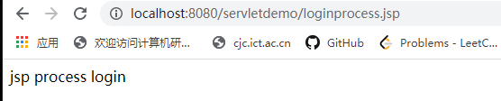
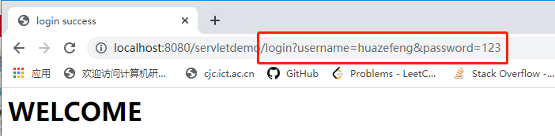
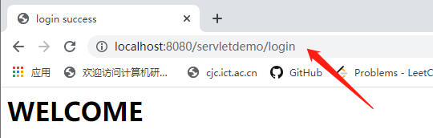

# 用JSP实现表单的提交

首先像之前HTML中一样，写一个HTML，里面有一个表单。如下代码login.jsp：

```jsp
<%--
  Created by IntelliJ IDEA.
  User: Snidelo
  Date: 2020/3/29
  Time: 22:48
  To change this template use File | Settings | File Templates.
--%>
<%@ page contentType="text/html;charset=UTF-8" language="java" %>
<html>
<head>
    <title>用户登录</title>
</head>
<body>
<form action="LoginServlet"><!-- 1  action="URL-pattern"-->
    用户名：<input type="text" name="username"><br><br><!-- 2 -->
    密码：<input type="password" name="password"><br><br><!-- 3 -->

    <input type="submit" value="登录">
</form>

</body>
</html>

<!-- 注意，2和3 的位置处必须要注明name，这样表单上传之后才有查找内容的依据 -->
<!-- 注意，第二个问题，这个表单提交上来，由那个Servlet处理，需要设置。在2的位置处，添加action属性，注意格式是path/URL-pattern。但是这样子是绝对路径，如果path被修改，就要都改变，所以还是直接“URL-pattern”好一点-->
```


# JSP处理表单

首先新建一个表单处理逻辑的JSP文件

loginprocess.jsp：

```jsp
<body>
<%
    String name = request.getParameter("username");
    String password = request.getParameter("password");

    out.println("jsp process login");
%>
</body>
```


然后需要修改处理表单的对象

```jsp
<form action="loginprocess.jsp" method="post"><!-- action="path/URL-pattern" or action="path/URL-pattern" --><!-- post->POST->doPost-->
    用户名：<input type="text" name="username"><br><br>
    密码：<input type="password" name="password"><br><br>

    <input type="submit" value="登录">
</form>
```

结果：




# Servlet处理表单

然后通过Servlet处理登录逻辑。


```java
@WebServlet(name = "LoginServlet")
public class LoginServlet extends HttpServlet {
    protected void doPost(HttpServletRequest request, HttpServletResponse response)
            throws ServletException, IOException {

    }

    protected void doGet(HttpServletRequest request, HttpServletResponse response)
            throws ServletException, IOException {
        //##在提交的表单中找到属性name的值
        String username = request.getParameter("username");
        String password = request.getParameter("password");

        if("huazefeng".equals(username) && "123".equals(password)){
            response.setContentType("text/html");
            PrintWriter out = response.getWriter();
            out.println("<html><head><title>login success</title></head>");
            out.println("<body><h1>WELCOME</h1></body></html>");
            out.flush();
            out.close();
        }
    }
}
```

注意，request是客户端发送的请求（可能附带表单），response是服务器端的响应。

用户在客户端输入的内容都以表单的形式向服务器发送请求，所以需要获得request中的内容

`getParameter`的参数就是`String`返回一个`String`。即参数是HTML标签的`name`属性，返回的是`name`的值。


# 存在的问题

可以看到，如果直接提交表单，在浏览器的搜索框中会出现表单中的内容，一些不想显示的比如账号密码也会出现




在以上这个URL中，请求资源后跟着一个\<?>，之后的部分就是`请求参数`，参数之间用\<&>连接

即

```
URL ? name=value&name2=value2
```


## 解决的方法

如何解决这个问题，实际上需要用POST方法。

==直接通过浏览器搜索框请求资源一般都是GET指令==

==其实表单中存在一个属性method，值默认为`get`，该属性指的就是以什么方法向服务器提交请求==

```html
<body>
    <!-- 注意表单的method属性，get是属性method的默认值，指的就是以什么方法来向服务器 提交请求 -->
    <form action="URL-pattren" method="post"><!-- post->POST->doPost-->
        <!-- 表单内容 -->
    </form>
</body>
```


如果将登录JSP的表单中的method方法指定为post的话，就会出现405异常，主要是因为Servlet中没有实现`doPost`方法。修改表单提交方法并重写doPost方法之后，再看结果，就不会出现之前的情况。



## 原理----GET VS. POST


如果使用GET方法发送请求，根据之前笔记“3-” ，其实际的请求如下

```
GET /servletdemo/login?username=huazefeng&password=123 HTTP/1.1
```

也就是说用GET方法发送请求时，表单是URL的一部分


如果使用POST方法发送请求，根据之前笔记“3-”。实际请求如下

```
POST /login.jsp HTTP/1.1 (CRLF)        ----请求行
Accept:image/git (CRLF) (...)          ----消息报头
Host: www.sample.com (CRLF) (...)
...
Cache-Control:no=cache (CRLF)
Connection:Keep-Alive(CRLF)(CRLF)                 ----在同一个连接上发送请求
(CRLF)
username=hello&password=12346			----附加内容
```

也就是说，提交的表单（附加的内容）不是通过URL发送的，是作为请求的请求体发送的


所以归根结底，是其发送请求的形式不同，才有的浏览器搜索框的展现的内容不同。


另外请求是有长度限制的，所以在浏览器中进行文件上传时，一定要使用post方式而绝不能使用get方式