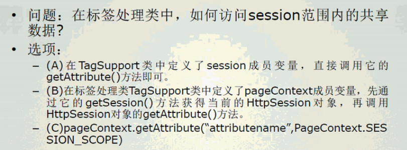

# JSP 基础

## 概念与简介

**JSP**（全称**J**ava**S**erver **P**ages，java服务器页面）是由[Sun Microsystems](https://baike.baidu.com/item/Sun Microsystems)公司主导创建的一种动态网页技术标准。JSP部署于网络服务器上，可以响应客户端发送的请求，并根据==请求内容动态地生成==[HTML](https://baike.baidu.com/item/HTML)、[XML](https://baike.baidu.com/item/XML)或其他格式文档的[Web](https://baike.baidu.com/item/Web)网页，然后返回给请求者。JSP技术以[Java](https://baike.baidu.com/item/Java)语言作为[脚本语言](https://baike.baidu.com/item/脚本语言)，为用户的[HTTP](https://baike.baidu.com/item/HTTP)请求提供服务，并能与服务器上的其它Java程序共同处理复杂的业务需求。


- 之前说过，Servlet看做是嵌套了HTML代码的java类，可以将JSP看作是嵌套了Java代码的HTML页面。所以HTML文件中以==`<%  //java code  %>`==的形式嵌入了java代码，那么这就是一个JSP文件。所以在语法上就是HTML语法的java扩展，加入了新标签`<% %>`

- 这里的java程序片段可以操作数据库、重定向网页以及发送e-mail等，实现建立动态网站所需要的功能

- 所有的程序操作都在服务器端执行，网络上传送给客户端的仅仅是得到的结果。（如果在浏览器端使用开发者工具查看页面源代码的话，是没有java语言部分的，全是静态HTML，但是实际上才服务器端执行的是JSP中的java代码）

- 支持JavaBean


### 起源

一开始有Servlet，但是后来发现用Servlet去写HTML会有很多out.println()内容，所以sun公司就推出了JSP技术，但是之前的Servlet技术已经很成熟了，就直接将JSP转换成Servlet来执行

## 语法概述

- JSP源代码中包含了JSP元素和Template data两类

- Template data指的是JSP引擎不处理的部分，也就是<% %>以外的部分，例如代码中的HTML内容，这些数据会直接传输到客户端

- JSP元素则是值将由JSP引擎直接处理的部分，这部分必须符合java语法，否则会导致编译错误

  ```jsp
  <%@ page contentType="text/html;charset=UTF-8" language="java" %>
  <html>
    <head>
    </head>
    <body>
      <% java语句 %>
    </body>
  </html>
  ```

  ```jsp
  <%@ page contentType="text/html;charset=UTF-8" language="java" %>
  <html>
    <head>
    </head>
    <body>
      <% for(int i = 0; i < 2; i++){ %>
        你好<br>
      <% } %>
    </body>
  </html>
  ```


### JSP语法

> - 编译器指令（Directive）**包含在\<%@ %>卷标里**
>   - 就是JSP文件开头的配置指令
>   - 编译器指令包括了“包含指令”，“页指令”，“taglib指令”
>     - 包含指令 include
>       - 向当前页中插入一个静态文件的内容。
>       - <%@ include file="文件路径（相对或者绝对的）"%>  
>       - 用处在于例如每个页面页眉页脚的部分，都可以用包含指令，来包含相同的页面 
>       
>     - 页指令 page
>
>       - 用于定义JSP文件中的全局属性
>
>       - <%@ ==page== 
>
>         ​		==contentType=="text/html;charset=UTF-8" 
>
>         ​		==language==="java" 
>
>         ​	 	==import==="java.io.*，java.sql.\*" 
>
>         ​			（java.lang.* javax.servlet.* javax.servlet.jsp.* javax.servlet.* 是默认导入的，无需写明 ）
>
>         ​		==session==="true | false"
>
>         ​		etc. 
>     
>         ​		%>
>
>     - tahlib指令 taglib
>   
>       - 用于引入定制标签库
>   
> - 脚本语法（Script）
>   - **注释 **<!---->
>     - （HTML注释，会在客户端源代码中出现，==但是如果其中加入了<%%>内容，那么其中的内容还是会被编译执行==） 
>   - **隐藏注释** <%-- --%>
>     - （JSP注释，不会在客户端源代码中出现）
>   - **声明 **：**包含在<%! %>卷标中** 
>     - 就是将java代码的声明和逻辑语句分开了
>     - **==##ATTENTION==**声明在该卷标中和声明在脚本段中的区别在于，前者是成员变量，后者是局部变量。因为Servlet是单例的，所以所有用户访问的都是相同的成员变量，这在并发时就会产生问题。而局部变量及不同了
>   - **表达式（单值显示）**：**包含在\<%=  %>卷标中**
>   - **脚本段**： 就是普通的java代码部分
>   
> - 动作语法（Action） 例如：\<jsp:forwrad>,\<jsp:getProperty>,\<jsp:include>
>
>   
>
>   - \<jsp:forwrad page="relativURL | <%= expression %>"> (标签段内部可以加\<jsp:param>标签)
>
>     - 转向目标页面（通过标签段内部添加\<jsp:param>标签可以传递信息）。目标页面中就像处理提交表单一样，通过getParameter处理传递的信息。转向之后，标签之后的代码就不执行了
>
>     
>
>     
>
>   - \<jsp:include page="relativeURL | <%=expression%>" flush="true"> (标签段内部可以加\<jsp:param>标签)
>
>     - 包含一个静态或动态文件（通过标签段内部添加\<jsp:param>标签可以传递信息）。包括了include指令的功能，还可以像jsp:forward一样传递信息


### JSP内置对象

以下几个是永远可用的内置脚本变量，高亮是常用的几个

> - ==request==：HTTP request（请求）对象
>   - 代表客户端的请求，录入在表单中填写的信息等。
> - response：HTTP response（响应）对象
>   - 代表服务器对客户端的响应内容，也就是发送到客户端的内容（例如下载内容）。但是由于组织方式比较底层，所以一般不建议普通读者使用，需要向客户端发送文字直接用out就好
> - page：页面对象，servlet自身
>   - 代表正在运行的，由JSP文件产生的类对象（jsp会转换成servlet运行）
> - pageContext：页面上下文对象。一个PageContext实例包括和整个页面相联系的数据，一个给定的HTML页面可以在多个JSP之间传递。
>   - 代表当前页面运行的一些属性。一般Servlet容器会用到该对象
> - ==out==：输出对象，JSPWriter，用来写入响应流的数据
>   - 代表向客户端发送数据的对象。与response对象不同，通过out对象发送的内容将是浏览器需要显示的内容，是文本级的，out对象内部包含了一个缓冲区。
> - ==session==：HTTP session（服务端会话）对象
>   - 代表服务器与客户端所建立的会话（因为HTTP是无状态协议，所以需要用Session来保存信息），当需要在不同的JSP页面中保留客户信息的情况下使用。Session用来保存客户端状态信息
> - ==application==：应用程序对象
>   - 负责提供应用程序在服务器中运行时的一些全局信息。
> - exception：异常对象
>   - 代表了JSP文件运行时锁产生的异常对象，只能在添加了\<%@ page isErrorPage="true"%>时使用
> - config：配置对象
>   - 提供一些配置信息。同在在Servlet中使用


| 对象名      | 类型                                | 作用域      |
| :---------- | :---------------------------------- | :---------- |
| request     | javax.servlet.ServletRequest的子类  | Request     |
| response    | javax.servlet.ServletResponse的子类 | Page        |
| pageContext | javax.servlet.jsp.PageContext       | page        |
| session     | javax.servlet.http.HttpSession      | Session     |
| application | javax.servlet.ServletContext        | Application |
| out         | javax.servlet.jsp.JSPWriter         | Page        |
| config      | javax.servlet.ServletConfig         | Page        |
| Page        | java.lang.Object                    | Page        |
| exception   | java.lang.Throwable                 | Page        |


## JSP执行过程


实际上，jsp文件在服务器端执行的时候，==服务器首先会将其转换成一个Servlet（java文件）==，然后用Servlet分析器将其编译，然后执行，并将==执行结果（静态HTML文本）==返回


在如下目录中（手动打开Tomcat访问网页），可以找到转换成的Servlet（java文件）

```
D:\SOFTWARE\TOMCAT\apache-tomcat-9.0.30\work\Catalina\localhost\servletdemo\org\apache\jsp
```

如果是由IDEA自动打开的Tomcat，就会在以下目录：

```
C:\Users\Snidelo\.IntelliJIdea2019.2\system\tomcat\Unnamed_firstservlet\work\Catalina\localhost\servletdemo\org\apache\jspc
```


转换成Servlet的jsp：


内容：


# 定制JSP标签

理解定制JSP标签的作用

了解JSP Tag API

掌握创建并运用定制JSP标签的步骤

掌握在定制JSP标签中访问application、session、request和page范围内的共享数据的方法


## 作用

定制JSP标签技术是在JSP1.1版本中才出现的，支持用户在JSP文件中自定义标签，这样可以使JSP代码更加简洁。

这些可重用的标签能处理复杂的逻辑和事务，或者定义JSP网页的输出内容和格式


## JSP Tag API

- Servlet容器编译JSP网页时，如果遇到自定义标签，就会调用这个标签的处理类

- 标签处理类必须扩展以下两个类之一

  - javax.servlet.jsp.target.TagSupport

    - 

    - **`doStartTag`

      - Servlet容器遇到定制标签的起始标志时就会调用该方法
      - 根据改标签的返回值，定制标签决定**跳过标签体内容**（返回`Tag.SKIP_BODY`）还是**执行标签体内容**（返回`Tag.EVAL_BODY_INCLUDE`）

    - **``doEndTag`

      - Servlet容器遇到定制标签的结束标志时就会调用该方法
      - 根据标签的返回值，定制标签决定**跳过标签之后的内容，将之前的内容直接返回客户浏览器上**（返回`Tag.SKIP_PAGE`）还是**继续执行标签之后的静态内容和JSP程序**（返回`Tag.EVAL_PAGE`）

    - 必须要重写以上两个方法中至少一个方法

    - `setValue(String k, Object o)`

      - 在标签处理类中设置key/value

    - `getValue(String k)`

      - 在标签处理类中根据参数key返回匹配的value

    - `removeValue(String k)`

      - 在标签处理类中删除key/value

    - 

    - 在标签中设置属性

      - ```jsp
        <tagName attributeName="value"></tagName>
        ```

        这样写的话就需要在标签处理类中，将该属性作为成员变量，并且提供`getter`和`setter`。这是因为，最终JSP会转化成Servlet去执行，属性的获取值、设置值，都是靠`getter`,``setter`等API完成的

        
      
  
  - javax.servlet.jsp.tagext.BodyTagSupport,继承自TagSupport


## 创建定制JSP标签的步骤

### 创建标签的处理类

必须要重写`doStartTag `,`doEndTag`中的至少一个方法

```java
public class TagHello extends TagSupport {
    @Override
    public int doStartTag() throws JspException {
        try {
            this.pageContext.getOut().println("hello world");//向页面输出文本“helloworld” 这个out就是一个Writer
        } catch (IOException e) {
            e.printStackTrace();
        }

        return Tag.EVAL_BODY_INCLUDE;
    }

    @Override
    public int doEndTag() throws JspException {

        return Tag.EVAL_PAGE;
    }
}
```


### <span style="color:red">创建标签库描述文件</span>

#### 文件名

标签库描述文件的后缀名： .tld   即TagLibDesription，是一个标准的XML文件

#### 文件路径

标签库描述文件必须和WebApp描述文件（web.xml）放在同一个目录下，即WEB-INF文件夹下

#### 文件内容

```xml
<?xml version="1.0" encoding="UTF-8"?>
<!DOCTYPE taglib PUBLIC "-//Sun Microsystems, Inc.//DTD JSP Tag Library 1.2//EN" "http://java.sun.com/dtd/web-jsptaglibrary_1_2.dtd">

<taglib>
    <!-- 标签库信息 -->
    <tlib-version>1.0</tlib-version>
    <jsp-version>2.2</jsp-version>
    <short-name>mytaglib</short-name><!--  -->
    <uri>/mytaglib</uri>
    
    
    <!-- 注册标签 -->
    <tag>
        <name>toHello</name><!-- 标签名 -->
        <tag-class>org.hzf.firstservlet.mytaglib.TagHello</tag-class><!-- 标签处理类 -->
    </tag>
</taglib>
```


### 在JSP文件中引入标签库，然后插入标签

```jsp
<!-- jsp文件 --> 

<!-- 这里的uri就是之前tld文件中的uri prefix就是用来指代该标签库的，就像指定一个命名空间，在使用定制标签的时候要作为前缀-->
<%@ taglib prefix="hello" uri="/mytaglib" %>


<html>
    <head>
        
    </head>
    <body>
        <!--标签的具体使用 -->
        <hello:toHello></hello:toHello>
    </body>
</html>

<!-- 也即，格式如下，tagName是tld文件中的tag的name标签，prefix是jsp文件头定义的prefix -->
<prefix:tagName></prefix:tagName>
```


## 范例

### 范例1

**定义一个名为mytaglib的标签库，包含一个简单的hello标签，这个标签能够将JSP页面中的所有\<mm:hello/>解析为字符串hello**

常规的创建使用自定义标签

### 范例2

**创建一个能替换test应用中JSP网页的静态文本的标签，这个标签名为message，放在mytaglib中**

- 创建message.properties文件
  - 在WEB_INF文件夹下创建一个message.properties文件(java标准的属性文件的命名方式，里面的内容就以键值对的形式`key=value`出现，就可以用Property类解析之) 

  - 

    


- 然后可以在WebApp启动时加载一个`Servlet`，让该`Servlet`完成将`.properties文件`读取到内存的工作

  ```java
  
  @WebServlet(name = "TagMessageServlet")
  public class TagMessageServlet extends HttpServlet {
  
      //这个Servlet的作用是设置了一个属于ServletContext的属性，会在启动时自动加载。
      //该属性在WebApp开启期间会一直存在，对其的修改会持久化到.properties文件中
      @Override
      public void init(ServletConfig config) throws ServletException {
  
          Properties ps = new Properties();
          ServletContext sc = config.getServletContext();
  
          try {
              //ps.load(new FileInputStream(new File("...")));
              //这里不这样写，因为这样写需要绝对路径，在windows上开发，移植到unix上就行不通（两者文件系统不一样）
              InputStream resourceAsStream = sc.getResourceAsStream("WEB-INF/message.properties");
              ps.load(resourceAsStream);
              resourceAsStream.close();//不要忘记关闭流
              System.out.println(ps);
              //将Property对象放置到application的属性中
              sc.setAttribute("ps", ps);
          } catch (IOException e) {
              System.out.println("出错啦");
              e.printStackTrace();
          }
  
      }
  }
  ```

  该Servlet在注册的时候不需要映射，而是将其指定为启动加载项

  ```xml
  <servlet>
      <servlet-name>TagMessageServlet</servlet-name>
      <servlet-class>org.hzf.firstservlet.servlets.TagMessageServlet</servlet-class>
      <load-on-startup>10</load-on-startup>
  </servlet>
  <!-- itellij中没办法，只能添加映射，不然报错 -->
  <servlet-mapping>
      <servlet-name>TagMessageServlet</servlet-name>
      <url-pattern>/dontfetch</url-pattern>
  </servlet-mapping>
  
  ```

  - 然后就是正常的创建自定义标签的工作、

      - 在.tld文件中创建自定义标签

      - ```xml
        <tag>
            <name>message</name>
            <tag-class>org.hzf.firstservlet.mytaglib.TagMessage</tag-class>
            <body-content>empty</body-content>
            <!--
            	标签具有的属性，包括名字和required
                如果标签需要有属性，那么就要在TagSupport子类中声明成员变量并定义getter和setter
                -->
            <!-- requeired为真表示这些属性必须要有，为假表示可有可无 -->
            <!-- 具体的值在是页面上获取的上 -->
            <!-- 用例如下，如果required为假，则key可有可无：
                    <message attriName="asd"> 具体的使用 </message>
        
                    以上，使用之后，jsp会将其转换成Servlet，用setter将"asd"作为key的值
                 -->
            <attribute>
                <name>attriName</name>
                <required>true</required>
            </attribute>
        </tag>
        ```

    

      - 继承`TagSupport`，实现`doStartTag`和`doEndTag`方法
    
      - ```java
        public class TagMessage extends TagSupport {
        
            //在tld文件中的message标签中用<attribute>标签定义了一个属性，需要在这边也定义，并实现setter和getter
            private String attriName;
        
            public String getAtriName() {
                return attriName;
            }
        
            public void setAttriName(String attriName) {
                this.attriName = attriName;
            }
            @Override
            public int doStartTag() throws JspException {
        
                Properties ps = (Properties)this.pageContext.getAttribute("ps", PageContext.APPLICATION_SCOPE);
                //这边的逻辑是，将JSP中的 自定义标签的属性的值 作为 key 来获取 property中的值
                if(ps == null){
                    System.out.println("null ps");
                    return EVAL_BODY_INCLUDE;
                }
                String message = ps.getProperty(attriName);
                try {
                    this.pageContext.getOut().println(message);
                } catch (IOException e) {
                    e.printStackTrace();
                }
        
                return EVAL_BODY_INCLUDE;
            }
        
            @Override
            public int doEndTag() throws JspException {
        
                return EVAL_PAGE;
            }
        }
        ```

- 正常的自定义标签使用

  - ```jsp
    <hello:message attriName="title"></hello:message><br>
    <hello:message attriName="body"></hello:message>
    ```


# 练习题



b	正确：B和C


