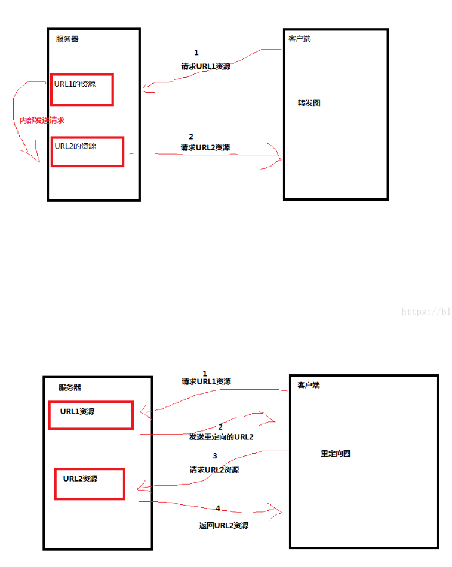

# 请求转发


包括**\<jsp:forward>**脚本方法

该方法也可以通过Servlet实现

```java
//请求转发(jsp将请求交给Servlet处理，Servlet转发给另一个jsp进行处理)
RequestDispatcher rd = request.getRequestDispatcher("URI");
rd.forward(request, response);
```

实现的是请求转发。即将当前请求转发给其他的资源（.jsp文件）进行处理


在JSP中直接转发和通过Servlet转发最大的区别就是，

前者是两个不同的请求(request对象)，而且浏览器中的地址栏信息会显示出具体处理的jsp

后者是同一个请求（request），而且浏览器的地址栏还是提交请求时的地址信息，而非处理的jsp


# 重定向

HTTPServletResponse对象的sendRedirect(String location) 方法称作重定向。如果location地址前面加上“/“，则表示相对于Servlet容器的根目录来请求。也即http://localhost:8080；如果没有，则表示相对于当前的URI来寻找地址。

实现的是重定向，即让客户端重新发送请求，请求重定向之后的资源

```java
response.sendRedirect("uri");
```


# 重定向 VS. 消息转发

- ==重定向是基于response的，消息转发是基于request的==

- 转发是服务器行为，重定向是客户端行为。转发耗时比重定向少。
- 转发——>客户浏览器发送HTTP请求——>web服务器接受请求——>调用内部一个方法在容器内部完成请求处理和转发动作——>再将转发跳转到的那个网页资源返回给客户；  转发只能在同一个容器内完成 转发的时候浏览器地址是不会变的，在客户浏览器里只会显示第一次进入的那个网址或者路径，客户看不到这个过程，只是得到了想要的目标资源。转发行为浏览器只做了一次请求。（转发只能跳转一次）
- 重定向——>客户浏览器发送HTTP请求——>web服务器接受请求后发送302状态码以及新的位置给客户浏览器——>客户浏览器发现是302响应，则自动再发送一个新的HTTP请求，请求指向新的地址（302：Found  临时移动，但资源只是临时被移动。即你访问网址A，但是网址A因为服务器端的拦截器或者其他后端代码处理的原因，会被重定向到网址B。）——>服务器根据此请求寻找资源发个客户；再客户浏览器中显示的是重定向之后的路径，客户可以看到地址的变化。重定向行为浏览器做了至少两次请求。（重定向可以跳转多次）

  

