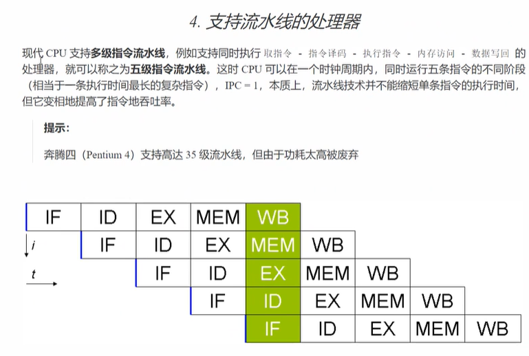
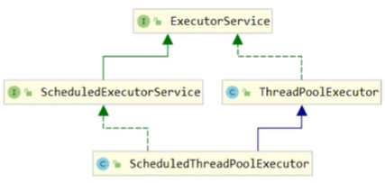
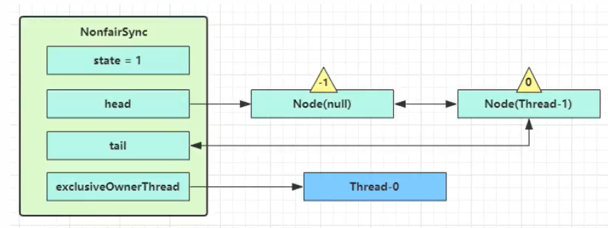
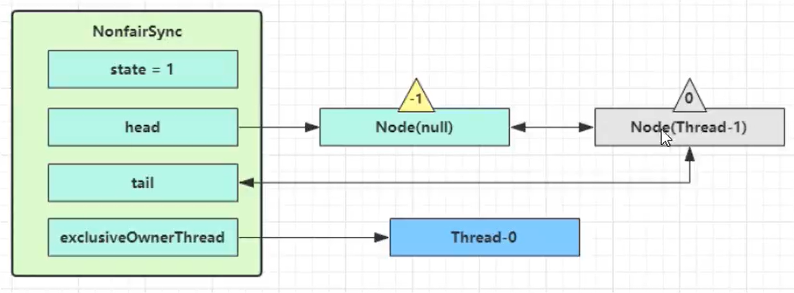
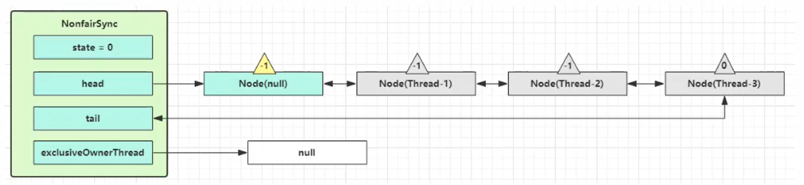

线程主要大纲(具体代码看IDEA工程)


## 1、进程/线程介绍

进程的定义：
     进程是一个具有一定独立功能的程序在一个数据集上的一次动态执行的过程，是操作系统进行资源分配和调度的一个独立单位，是应用程序的载体。程序用于描述进程要完成的功能，是控制进程执行的指令集；数据集合是程序在执行时所需要的数据和工作区；程序控制块包含进程的描述信息和控制信息，是进程存在的唯一标志
   进程的特性：
    `动态性`：进程是程序的一次执行过程，是临时的有生命周期的，是动态产生，动态消亡的
    `并发性`：任何进程都可以同其他进程一起并发执行
    ` 独立性`：进程是操作系统进行资源分配和调度的一个独立单位
    `结构性`：进程有程序，数据和进程控制块三部分组成
   早期的计算机，进程是程序执行的最小单位，任务调度采用事件片轮转的抢占式调度方式，后来随着计算机发展，进程切换的开销较大，就催生了线程。

   线程定义：
     线程是程序执行中一个单一的按顺序控制流程，是程序执行流的最小单元，是处理器调度和分派的基本单位。一个进程可以有一个或者多个线程，各个线程之间共享程序的内存空间（也就是该进程的内存空间）一个标准的线程由线程ID（PID），当前指令指针PC，寄存器和堆栈组成。而进程由内存空间（代码、数据、进程空间、打开的文件）和一个或者多个线程组成

   **`进程 `** VS **`线程`**
     1、线程是程序执行的最小单位，而进程是操作系统分配资源的最小单位.
     2、一个进程有一个或者多个线程组成，线程是一个进程中代码的不同执行路线
     3、进程之间相互独立，但同一进程下的各个线程之间共享程序的内存空间（包括代码段，数据集，堆等）及一些进程级的资源（如打开的文件和信号等），某进程内的线程对其他进程不可见
     4、调度和切换：线程上下文（context）切换比进程上下文切换快的多
     5、进程间通信较为复杂，同一台计算机的进程通信称为IPC（Inter-Process-Communication），不同计算机之间的进程通信需要通过网络，并遵守共同的协议。线程通信相对简单，因为他们共享进程的内存
   简而言之，线程就是进程的细粒度划分。是为了适应流水线式**的处理方式，将程序执行任务细分，达到并行处理（实际是并发）的效果（假象）

#### ==线程的状态转换和生命周期==

从操作系统层面讲，线程有五种状态：

初始状态，可运行状态，运行状态，终止状态，阻塞状态

从JVM角度讲，可以通过线程状态的枚举类型看到总共有六种状态：

new，runnable，waiting，timed-waiting，blocked，terminated。

其中runnable状态包括了操作系统层面中的可运行状态，阻塞状态和运行状态，举例来说就是当一个线程在访问阻塞API时，比如进行io操作时，就进入了操作系统层面的block状态，但是在JVM层面，仍然是runnable

==原因在于JVM 并不关心操作系统线程实际状态。从 JVM 看来等待 CPU 使用权（操作系统线程状态为可运行状态）与等待 I/O （操作系统线程状态处于休眠状态）没有区别，都是在等待某种资源，所以都归入 RUNNABLE 状态==


 ## 2、同步、异步介绍

以调用方的角度来讲，如果需要等待调用结果，才能继续进行，就称为同步；如果不需要马上获取结果，可以继续运行指令，就称为异步

## 3、创建、启动和使用线程

#### 线程创建的几种方式：

​     1、继承Thread类
​     2、实现Runnable接口
​     3、匿名内部类的方式
​     4、带返回值的线程（`FutureTask`包装Callable）
​     5、定时器
​     6、线程池的实现（降低线程的创建和销毁所带来的的性能下降，控制线程数量规模，减少资源浪费）
​     7、lambda表达式
​       （一个接口被`FunctionInterface`注解标记，可以被lambda表达式简化）

#### 线程的启动

**`run()`** VS **`start()`**

run没有起新线程，start新起一个线程

​	通过对线程的分析可以知道，当主线程调用子线程的run()方法时,显示的是主线程在调用,并不能实现异步处理的效果，而是简单的方法调用。所以说，启动一个线程必须使用start()方法.

```java
public static void main(String[] args) {
    Thread t1 = new Thread(() -> {
        System.out.println("inner sub thread" + Thread.currentThread().getName());
        int i = 0;
        while (i < 100){
            try {

                Thread.sleep(100);
            }catch (Exception e){
                e.printStackTrace();
            }

            i++;
        }
    }, "t1");
    t1.run();

    System.out.println(Thread.currentThread().getName());
}
实际显示的效果就像 t1.start();t1.join();
```

#### 线程的使用

##### **Thread** VS **Runnable**

- Runnable是具体的线程任务，而Thread包含了Runnable或者一个具体的线程任务（Thread的run方法）。前者将任务与线程分离，后者合并在一起

- 用Runnable让任务脱离了Thread的继承体系，更加灵活

  

   `Windows`下查看，杀死进程 `tasklist`、 `taskkill /F /PID <PID>`.查看java进程 `jps`
   `linux`下使用top命令可以查看进程的详细信息.如果要看某一个进程的线程信息,可以用`top -H -p <PID>`来查看.另外可以用`jstack`查看java进程中的所有线程信息
   java中可以用jconsole查看(也可以远程)java进程运行的一些状态


##### **Thread**Local

**我自己先捋一捋**：首先，每个线程都维护了一个`ThreadLocalMap`（从Thread包含`ThreadLocalMap`可见）。但是这个Map不归`Thread`管（Thread类中没有对该Map的操作），而是由`ThreadLocal`管理（因为是它的内部类）。一个`Thread`只能有一个Map，Map中存储的是以`ThreadLocal`实例为键，`ThreadLocal<T>`中的泛型实例为值的键值对。每次通过`ThreadLocal实例`获取每个**线程各自对应的那个实例**。不同的`ThreadLocal<T>`实例在Map中作为不同的键。根据下图比较清晰。然后简述一下工作流程。

程序开发员只能拥有`threadLocal<E>`等键，然后通过键设置（`tl.set()`）对应的值。如果其他线程想拿来就用（`tl.get()`），那么首先会通过线程获取当前的Map，如果Map中没有找到对应的值，或者说Map未初始化，那么就初始化值（`tl.setInitialValue()`），**在初始化值的时候先获取值（`tl.initialValue()`）**，如果Map没初始化的话，就在该方法中初始化Map（`tl.createMap()`），然后添加新的键值对（`tl.set()`）

如果要在一个线程中多个方法都调用到了**同一个实例**，或者多个线程中用到**同一种实例**，但是又要求线程隔离，就可以用ThreadLocal，同时可以重写`initialValue`方法，这样就不用每次都set了。


另外还要注意的一点是ThreadLocal有可能造成内存溢出的问题。如下图，因为ThreadLocalMap中的Entry是继承自WeakReference的，所以在GC的时候会被回收掉，那么此时无法通过key获取到对应的value，也就是说value是没用的信息，但是这个value因为有一条强引用一直引用着（为什么获取不到，因为引用到Entry之后变成私有访问的了），所以也无法被回收，造成内存溢出


https://www.cnblogs.com/fsmly/p/11020641.html

下面都是网上参考

**ThreadLocal 并不是为了解决线程安全问题，而是提供了一种将实例绑定到当前线程的机制，类似于隔离的效果，实际上自己在方法中 new 出来变量也能达到类似的效果。ThreadLocal 跟线程安全基本不搭边，绑定上去的实例也不是多线程公用的，<span style="color:red">而是每个线程 new 一份，这个实例肯定不是共用的</span>，如果共用了，那就会引发线程安全问题。ThreadLocal 最大的用处就是用来把实例变量共享成全局变量，在程序的任何方法中都可以访问到该实例变量而已。网上很多人说 ThreadLocal 是解决了线程安全问题，其实是望文生义，两者不是同类问题**。

对**同一个线程调用的多个方法**中，**共享了某一个变量，这个变量需要传递到多个方法**中，这样传来传去太麻烦了，这时就可以采用 ThreadLocal 了。

- ThreadLocal，连接ThreadLocalMap和Thread。来处理Thread的TheadLocalMap属性，包括init初始化属性赋值、get对应的变量，set设置变量等。通过当前线程，获取线程上的ThreadLocalMap属性，对数据进行get、set等操作。

- ThreadLocalMap，用来存储数据，采用类似hashmap机制，存储了以threadLocal为key，需要隔离的数据为value的Entry键值对数组结构。

ThreadLocal，有个ThreadLocalMap类型的属性，存储的数据就放在这儿。

- `ThreadLocal`、`ThreadLocal`、`Thread`之间的关系：
  - **`ThreadLocalMap`是`ThreadLocal`内部类**，由`ThreadLocal`创建，`Thread`有`ThreadLocal.ThreadLocalMap`类型的属性。
  - ThreadLocalMap是类似hashmap实现的键值对表，由ThreadLocal对其进行操作，且以线程为键，以用户设置的值为值

　　ThreadLocalMap是ThreadLocal内部类，由ThreadLocal创建，Thread有ThreadLocal.ThreadLocalMap类型的属性。


具体的形式是一个ThreadLocal可以存放一个任意类型的变量（实现了泛型），且该ThreadLocal归属于整个线程。但是可以在线程之间传递，且保证了线程安全（因为它维护的Map是私有的）


##### sleep() VS yield()

都是Thread中的静态类

 `sleep()`

sleep 过程中线程**不会释放锁**，只会***\*阻塞线程\****，让出cpu给其他线程，但是他的监控状态依然保持着，当指定的时间到了又会自动恢复运行状态，***\*可中断\****

1、调用sleep会让 `当前线程` 从Running进入`TimedWaiting`(阻塞)状态，也就是说，即使超时也会先进入`Runnable`（就绪）状态，再争夺CPU

2、其他先后才能可以使用interrupt()方法打断正在睡眠的线程，这时sleep方法会抛出InterruptException异常

3、睡眠结束后的线程未必会立刻得到执行(进入`Runnable`(就绪)状态)

4、建议用TimeUnit(JUC并发包中的组件)的sleep代替Thread的sleep来获得更好的可读性

5、如果当前线程持有锁，sleep不会释放锁（后面wait，notify会讲到）

 `yield()`

暂停当前正在执行的线程对象，***不会释放资源锁**，和 sleep 不同的是 yield方法并***\*不会让线程进入阻塞状态\****，而是让***\*线程重回就绪状态\****，它只需要等待重新获取CPU执行时间，所以**执行yield()的线程有可能在进入到可执行状态后马上又被执行**。还有一点和 sleep 不同的是 ***\*yield 方法只能使同优先级或更高优先级的线程有执行的机会\***

具体都会由线程调度器决定

##### `join()`——多线程同步

```java
public class MethodJoin {
    static int r = 0;

    public static void main(String[] args) {
        test1();
    }
    private static void test1(){
        System.out.println("main start");
        Thread t1 = new Thread(()->{
            System.out.println("t1 start");
            try {
                Thread.sleep(1);
            } catch (InterruptedException e) {
                e.printStackTrace();
            }
            System.out.println("t1 stop");
            r = 10;
        });
        t1.start();
        System.out.println("结果为: " + r);
        System.out.println("main stop");

    }
}

->main start
->结果为: 0
->main stop
->t1 start
->t1 stop

```

显然代码块希望顺序执行，但是，线程执行与否和先后顺序的控制权在操作系统，无法通过编码指定。如果要阻塞一个线程直到相应的线程执行结束，可以用**`join()`**方法。**`join（）`**方法实际解决了线程之间的异步同步的问题，其底层原理是Object类中的**`wait()`**方法


##### `join(long)`——多线程超时同步

传入一个参数代表了调用者被该线程阻塞的毫秒数。如果从调用开始超过这个时间，被join的方法还没有执行完毕，那么调用方将不再被阻塞，继续执行后续代码

##### `interrupt() / interrupted() / isInterrupted() / isInterrupted(boolean ClearInterrupted)`

这四个方法第一个和最后一个是区分度比较大的，中间两个区分度很小。

先看中间两个，用于**测试线程是否被设置了中断标志位**，看名字就可以看出来，被打断。

`interrupted()`是被**当前线程测试**的，看其源码就可以看出来`return currentThread().isInterrupted(true);`,也就是只能自己判断自己

`isInterrupted()`是**可以被其他线程测试是否被设置中断标志位**。

这两个都会调用一个最终的方法，那就是第四个方法，第四个方法意味着**返回是否被设置中断标志味，并根据输入决定是否要清除中断标志位**。那么思考一下，当前线程知道自己要被打断了，中不中断先不管，反正**自己知道了，那么肯定可以清除中断标志位**。其他线程测试该线程是否已经被设置中断标志位了，肯定不能清除，不然如果线程不知道，那就无法被中断了

**那么第一个方法就是用于设置中断标志位的了**。

##### **`isInterrupted()`——打断线程**

首先，==除了阻塞状态（无法获得锁或者其他资源）的线程无法被打断外==其他状态的线程均能够被打断。

`sleep(), wait(), join()`等待状态的线程

当线程中这三个方法被打断时会将打断标志置为真，然后抛出异常，终止线程，最后将打断标志复位（置为假）

`block`状态的线程

该状态下，线程无法被打断

`running`状态的线程

 该状态下，线程被打断时，会将打断标志置为真，但不会终止线程的运行，如果线程退出运行，会将打断标志复位（置为假）。

`interrrupted()`方法区别于`isInterrupted()`方法,前者是Thread类的静态方法会在调用后清除标记(将打断标志置为假)后者是实例方法不会(继续保留真)

不推荐使用`stop()`,`suspend()`,`resume()`方法.因为这些方法容易破坏同步代码块造成线程死锁

##### **`setDaemon()`**

设置于守护线程，如果一个线程被设置为守护线程，那么其他非守护线程结束时，不管该守护线程是否结束完，都会被强制停止。设置守护线程需要在该线程start之前。典型应用就是垃圾回收线程


#### 线程优先级

根据不同操作系统上的JVM和JDK，最大、最小、默认优先级都不相同。在Windows上，通过threadName

.setPriority()方法设置的优先级最大为10，最小为1 ，不设置的话，默认为5。

优先级会提示线程调度器优先调度该线程，但也仅仅是提示，调度器可以忽略它


## 4、线程带来的风险（各种解决方式，同步，锁等的引入）

### 线程安全问题

多个线程对同一资源进行访问时,可能会读取另一个线程已经修改,但是还没有写到内存中的值,这时就发生了脏读,导致线程不安全

### 活跃性问题

- 死锁:哲学家就餐问题,都不肯让出自己的锁

- 饥饿：优先级低的始终无法获得锁
       饥饿与公平: 高优先级吞噬所有低优先级的CPU时间片
            线程被永久堵塞在有一个等待进入同步块的状态
            等待的线程永远不被唤醒
       如何避免饥饿问题:设置合理优先级
              利用锁来代替synchronized关键字

- 活锁：两个线程在发生抢占时都优先等待，而非优先抢占，导致都无法获得资源 

###  性能问题

上下文切换导致的性能下降，资源浪费

## 5、线程运行原理


JVM由堆,栈,方法区组成,栈就是给线程使用的内存.每个县城启动后,虚拟就就会为其分配一块占内存
每个栈由多个栈帧(Frame)组成,对应每次调用方法时所占用的内存(调用一个方法,产生一个栈帧,保存操作数栈，局部变量表,执行代码等等信息)
每个线程只能有一个活动栈帧,对应当前正在执行的方法。

线程上下文切换,如下原因会导致CPU不再执行当前线程,转而执行其他线程

- 线程CPU时间片用完

- 垃圾回收

- 有更高优先级的线程需要运行

- 线程自己调用了阻塞、等待、结束方法（sleep,yield,wait,join,park,synchronized,lock等)

## 6、并发之共享模型

### 管程-悲观锁(阻塞)

#### 共享带来的问题

 如果两个线程对同一个变量分别进行五千次自增和五千次自减运算,结果会是怎么样

```java
public class SharedVar {
    static int a = 0;

    public static void main(String[] args) {
        Thread t1 = new Thread(()->{
            for(int i = 0; i < 50000; i++){
                a = a + 1;
            }
        });
        Thread t2 = new Thread(()->{
            for(int i = 0; i < 50000; i++){
                a = a - 1;
            }
        });

        t1.start();
        t2.start();
        try {
            t1.join();
            t2.join();
        } catch (InterruptedException e) {
            e.printStackTrace();
        }
        System.out.println(a);
    }
}

-><反正不是0>
```

结果不是0,主要原因是因为 a = a + 1,这个代码在字节码中对应了多条独立的指令.当这些指令在执行时,有可能发生线程上下文切换,导致结果还没有被写入内存时,就发生了另一个对该资源的修改操作.

##### 临界区 Critical Section

一个程序运行多个线程本身没什么问题.

问题在于多个线程对于访问共享资源.

​		多个线程共享资源其实也没有问题

​		多个线程对共享资源进行更新操作时发生上下文切换,导致指令交错,就会出现问题

一段代码块内,如果存在对共享资源的多线程的==读写==操作,则称改代码块为临界区

#### synchronized关键字

synchronized是一种**非公平锁**（重量级锁，轻量级锁，偏向锁等），**可重入，不可打断**

##### synchronized解决方案(1)  --同步代码块

为了避免临界区的竞态条件发生，有多重手段可以达到目的

- 阻塞式的解决方案：`synchronized`，`Lock`

- 非阻塞式的解决方案：原子变量 

`synchronized`，俗称`对象锁`，也就是说使用这个锁需要一个对象，采用互斥的方式让同一时刻之多只有一个线程能够持有对象锁，其他线程想要获取该对象锁就会被阻塞，这样就能保证用有所的线程可以安全的执行临界区内的代码，不用担心上下文切换，导致指令交错。

语使用语法：

```java
synchronized（对象）{
	//临界区	
}
```

所以针对之前的同一变量的加减问题，可以由如下解决：

```java
/**
 * 需要注意的是加锁需要配合对象
 */
public class SharedVar {
    static int a = 0;
    static final Object door = new Object();

    public static void main(String[] args) {
        Thread t1 = new Thread(()->{
            for(int i = 0; i < 50000; i++){
                synchronized(door){
                    a = a + 1;
                }
            }
        });
        Thread t2 = new Thread(()->{
            for(int i = 0; i < 50000; i++){
                synchronized(door){
                    a = a - 1;
                }
            }
        });

        t1.start();
        t2.start();
        try {
            t1.join();
            t2.join();
        } catch (InterruptedException e) {
            e.printStackTrace();
        }
        System.out.println(a);
    }
}
```

```
注意：虽然java中互斥和同步都可以采用synchronized关键字来完成，但是还是有区别的：
1、互斥是保证临界区的竞态条件发生，同一时刻只能有一个线程执行临界区代码
2、同步是由于线程执行的先后、顺序不同，需要一个线程等待其他线程运行到某个点
```


synchronized实际上使用对象锁保证了临界区内代码的原子性，临界区内的代码对外是不可分割的，不会被另一个需要同一把锁的临界区代码所打断

###### 三点思考

上例中，如果把synchronized放在for循环外面，该如何理解

上例中，如果两者的锁加在不同的对象上，线程会如何运转

上例中，如果其中一个临界区未加锁，会怎么样

###### 面向对象的代码优化

```java
class Room{

    public static void main(String[] args) {
        Room room = new Room();
        Thread t1 = new Thread(room::increment);
        Thread t2 = new Thread(()-> room.decrement());

        System.out.println(room.getCount());
    }

    private int count = 0;
    void increment(){
        synchronized (this){
            for(int i = 0; i < 50000; i++){
                count++;
            }
        }
    }

    void decrement(){
        synchronized (this){
            for(int i = 0; i < 50000; i++){
                count++;
            }
        }
    }
    int getCount(){
        synchronized (this){
            return count;
        }
    }
}
```

##### synchronized解决方案(1)  --同步实例方法

```java
public synchronized void fun(){}
```

等价于

```java
public void fun(){
	synchronized (this){
	
	}
}
```

##### synchronized解决方案(1)  --同步静态方法

```java
class Test{
	public synchronized static void fun(){}    
}
```

等价于

```java
class Test(){
    public static void fun(){
    	synchronized(currentClassName.class){//注意锁住的是类对象 
        
    	}
	}
}
```


#### 线程安全分析

##### 成员变量和静态变量是否线程安全

- 如果他们没有共享，则线程安全

- 如果他们被想成共享，根据他们的状态是否能够改变分为两种情况

  ​		如果只有读操作，则线程安全

  ​		如果有读写操作，则这段代码时临界区，需要考虑线程安全

##### 局部变量是否线程安全

- 局部变量是线程安全的

- 但是局部变量引用的对象则未必

  ​		如果该对象没有逃离方法的作用域，则是线程安全的（局部变量仅在线程内使用，未暴露给外部）

  ​		如果该对象逃离方法的作用域，则需要考虑线 程安全

##### 局部变量线程安全分析

 如上所述，如果将局部变量暴露给其他线程（例如子类的覆盖方法中创建了一个新线程去使用传入的一个局部变量的对象的引用），那么此时就是线程不安全的，这时可以通过私有化或者添加final关键字来阻止子类对父类方法的重写，避免将局部变量暴露给其他线程。这也符合了面向对象的开闭原则。

##### 常见的线程安全的类

·String

·Integer

·StringBuffer（StringBuilder不是线程安全的）

·Random

·Vector

·Hashtable（新的叫HashMap，不是线程安全的）

·JUC下的所有类

这里说的线程安全是指：多个线程调用他们同一个实例的某个方法时，是线程安全的。也可以认为——他们的每个方法都是原子的。但是需要注意多个方法之间的组合不是原子的

##### 不可变类的线程安全性

String和Integer均为不可变类，不可变类也就是对象无法被改变，但是引用可以改变。也就是说起内部状态无法更新,只能读取,所以是线程安全的.


#### Monitor

##### 对象头

要了解Monitor首先介绍一下`java对象头`的概念

java对象在内存中由三部分组成，分别是

- 对象头
  - MarkWord
  - 指向类类型的指针
  - 数组长度
- 实例数据
- 对齐填充字节

其中实例数据就是成员变量，对齐填充字节是因为JVM要求java对象占用的内存大小是8bit的整数倍，所以后面有几个字节用于把对象的大小补齐至8bit的整数倍，没有特别的功能。对象头又由三部分组成，分别是

- MarkWord
- 指向类类型的指针
- 数组长度

1、MarkWord

Mark Word记录了对象和锁有关的信息，当这个对象被synchronized关键字当成同步锁时，围绕这个锁的一系列操作都和Mark Word有关。

Mark Word在32位JVM中的长度是32bit，在64位JVM中长度是64bit。


这里的cms_free应该是unused，具体使用有待考证

- unused：未使用的
- hashcode：上文提到的**identity** hash code，本文出现的hashcode都是指identity hash code
- thread: 偏向锁记录的线程标识
- epoch: 验证偏向锁有效性的时间戳
- age：分代年龄
- biased_lock 偏向锁标志
- lock 锁标志
- pointer_to_lock_record 轻量锁lock record指针

age只有4位，所以垃圾回收中晋升到老年代的年龄设置不能超过15

如果没有出现偏向锁优化，可能是先计算了hashcode，占了位，所以直接就轻量级锁了；也或者没有设置-XX:BiasedLockingStartupDelay=0对偏向锁的影响

JDK1.6以后的版本在处理同步锁时存在锁升级的概念，JVM对于同步锁的处理是从偏向锁开始的，随着竞争越来越激烈，处理方式从偏向锁升级到轻量级锁，最终升级到重量级锁。

2、指向类的指针

该指针在32位JVM中长度为32bit，64位JVM中长度为64bit

3、数组长度

只有数组对象保存了这部分数据，长度为32bit

##### Monitor 监视器

Monitor被翻译为**监视器**或者**管程，**JVM底层提供的对象，在java层面不可见

每个java对象都可以关联一个Monitor对象（**加重量级锁时关联，设置对象头，改变Monitor中的Owner属性**）

·刚开始时，Monitor中Owner为null

·当Thread2执行了synchronizd(obj)时,它就会关联上一个Monitor,并将其Owner置为Thread2(如果本来就没人拥有锁).Monitor中只能有一个Owner

·在Thread2上锁的过程中,如果Thread3,Thread4等其他线程也执行synchronized(obj),也就是抢占锁时,就会进入Monitor的EntryList阻塞队列,等待锁被释放.

·当Tread2执行完同步代码块的内容然后唤醒EntryList中被阻塞的线程来竞争锁,该竞争是非公平的,**由JVM实现调度**

图中的WaitSet中的Thread0和Tread1是之前获得过锁,但是条件不满足（注意，进入IO状态还是runnable）而进入WAITING状态的线程,后面讲wait-notify时会分析

```
注意：
1、synchronized必须是进入同一对象的Monitor才有上述的效果（也就说一个对象关联一个Monitor）
2、不加synchronized的对象不会关联监视器
```

在圣思园JVM视频中也有讲过synchronized关键字字节码层面的原理，详见印象笔记

添加Synchronized关键字之后，相应的代码块字节码会被Monitorenter和monitorexit包围，这两个字节码就对应着，加锁和解锁

##### synchronized优化

###### 1、轻量级锁

**轻量级锁的应用场景**：如果一个对象有多个线程加锁访问，但是多个线程访问的时间是错开的，也就是没有竞争，那么可以用轻量级锁来优化

轻量级锁对编程人员来说是**透明的**，也就是说编程人员在编码时无需刻意区分，**语法仍然是synchronized**，只是JVM会进行区分

情况一：有两个同步代码块对一个对象进行加锁：

```java
public class LightLock {
    static final Object obj = new Object();
    public static void method1(){
        synchronized (obj){
            //同步代码块A
            method2();
        }
    }
    public static void method2(){
        synchronized (obj){
            //同步代码块B
        }
    }
}
```

由编码逻辑可以知道两个代码块必然在同一线程内.下面图解轻量级锁的具体加锁流程：


-当代码执行到synchronize关键字时：首先在method1的栈帧，创建新的锁记录（Lock Record）对象。每个**栈帧**都会包含一个锁记录的结构，内部可以存储锁定对象的Mark Word（详见对象头）。


-当method1栈帧在获取obj对象的锁的时候，判定是可以获取轻量级锁（00）的状态，此时锁记录中的锁地址（对应了该栈帧的锁记录）和obj对象的对象头中信息（Mark Word）尝试进行`cas`(其中，cas是原子的)交换，将**Mark Word记录在锁记录中**，将**锁地址和轻量级锁上锁状态记录在对象头**中


如果cas替换成功后如上图所示。obj对象头中存储了锁记录地址和状态00；栈帧的锁记录中记录了obj的Mark Word

如果cas替换失败，有两种情况：

​	·锁已被另一个线程获取（既然已经加上了轻量级锁，那么就可以通过锁记录地址判定是否相同线程），那么此时发生==锁膨胀==，升级为重量级锁（一般的synchronized同步锁）

​	·锁已被同一线程获取，那么此时发生==锁重入==，就会在该栈帧中创建一个新的锁记录对象，锁地址为null，该锁记录对象仅仅用作锁重入计数


-举例所示，method2和method1在同一线程执行同步代码块时，method2栈帧创建了一条锁记录，锁地址为空，锁对象指向了obj对象


-当执行完同步代码块，退出synchronized时，就会进行锁的释放，

如果线程栈顶栈帧的锁记录为null，也就是表明有重入锁，就依次释放重入锁，重入计数减1

如果锁记录为非空， 此时用cas将Mark Word值恢复给对象头。这里也有两种情况

​	成功，说明解锁成功

​	失败，说明之前发生了锁膨胀，进入重量级锁的解锁流程（Monitor）

**轻量级锁总结**：关键数据结构在与**栈帧中的LockRecord**。线程首次获取轻量级锁是**通过CAS交换锁地址（栈帧地址，包括线程的信息）和对象头信息**同时**锁记录还要指向加锁对象**。如果发生**锁重入，那么就创建一个空的锁记录**并进行重入计数，如果发生**锁竞争，那么就锁膨胀为重量级锁，进行重量级锁的加锁过程**。在解锁过程中，先解锁重入的方法，当解锁非空锁记录时（即第一次的轻量级锁），也是采用**CAS交换信息**，如果**失败，表示进行过锁膨胀，进入重量级锁的解锁流程**。

###### 2、锁膨胀

底层细节https://www.jianshu.com/p/09de11d71ef8

通过锁膨胀的底层细节可以知道，锁膨胀过程中，需要在锁记录中设置一个特殊的值，标识该对象正在使用一个Monitor。进入到膨胀方法后，锁膨胀过程就可以分成**膨胀完成，正在膨胀，未膨胀**三个状态。完成的话直接返回Monitor对象；正在膨胀的话就自旋等待膨胀完成并获得Monitor，进入阻塞队列；未膨胀的话就进行膨胀，**通过CAS为对象头赋值，标识其正在膨胀的状态**，然后初始化一个Monitor，具体过程和下面说的一样：


-如果在尝试加轻量级锁的过程中，两次CAS（加锁，释放锁）中有没有成功的，这时，一种情况就是有其他的线程已经为此对象加上了轻量级锁，需要进行锁膨胀


-如果一个线程0已经给obj对象添加了轻量级锁，当另一个线程1对该对象进行加锁操作时，就会发生CAS失败的情况，进入锁膨胀流程：

​	**也就是为obj对象申请Monitor锁（关联一个Monitor），让obj对象指向Monitor（对象头中设置），设置对象头锁标志为10（同时将Monitor的owner设置为obj对象头中记录的锁地址所在的线程），然后自己进入Monitor的EntryList阻塞。**

-当释放锁时，一开始加的轻量级锁的线程此时需要进行cas操作将Mark Word的值替换给对象头，但是失败。判定发生了锁膨胀，进入重量级锁的解锁流程。详见synchronized关键字的解析

###### 3、自旋优化

**自旋优化发生在重量级锁竞争的时候**。具体来说就是在获得锁失败时，暂不进入阻塞状态，重复竞争锁。如果此时锁刚好被持锁线程释放，则获得锁，自旋成功；如果规定次数内，仍然不成功，那么进入阻塞状态，自旋失败。

**因为阻塞等会发生上下文切换，用自旋优化可以一定程度上避免上下文切换的情况发生**。

自旋锁在JDK 1.4.2中引入，默认关闭，但是可以使用-XX:+UseSpinning开启，在JDK1.6中默认开启。同时自旋的默认次数为10次，可以通过参数-XX:PreBlockSpin来调整；JDK1.6以后引入自适应自旋锁，变得智能化，可以根据运行状况自行进行判断；

另外自旋优化仅在多核CPU上有效

###### 4、偏向锁

偏向锁对轻量级锁的优化在于，对象的使用权一段时间内不会发生改变（不仅不竞争，而且使用对象都很少），加锁对**象的对象头信息记录的是线程的PID（**锁的所有权是线程的），而不是像轻量级锁一样记录的是锁地址。也就是说，**偏向锁的优化点针对当前线程轻量级锁重入情况**

这样优化的目的在于，当发生锁重入时，需要尝试进行cas替换，无论成功与否，都会产生一定开销（进入到内核态cas）。而使用偏向锁只需要确定加锁对象中的线程ID是否是当前线程的就可以了。注意，对象一旦被一个线程添加了偏向锁，它对象头中的Tread字段就会变成该线程的ID，直到该对象被其他线程请求锁（此时也会升级为轻量级锁）。

对于如下代码

```java
public class LightLock {
    static final Object obj = new Object();
    public static void method1(){
        synchronized (obj){
            //同步代码块A
            method2();
        }
    }
    public static void method2(){
        synchronized (obj){
            //同步代码块B
            method3();
        }
    }
    public static void method3(){
        synchronized (obj){
            //同步代码块C
        }
    }
}
```

其轻量级锁和偏向锁的区别如下所示


###### 5、偏向状态

一个对象创建时：

​	·如果开启了偏向锁（默认开启），那么创建对象后，Mark Word的值为0x05，也就是最后三位为101，此时他的thread（线程pid），epoch（批量偏向相关），age都为0；

​	·偏向锁默认都是延迟添加的，不会在程序启动时自动生效，如果想避免延迟，可以添加VM参数 -XX:BiasedLockingStartupDelay=0；来设置禁用延迟

​	·如果没有开启偏向锁，那么对象创建后，Mark Word的值为0x01，即最后三位为001，hashcode和age都为0，要第一次用到hashcode时才会赋值

​	·偏向锁适用于很少发生多个线程竞争的情况，如果有经常发生竞争现象，最好不用偏性锁，可以通过`-XX:-UseBiasedLocking`关闭

###### 6、偏向锁撤销

**撤销 - 调用对象hashCode**

调用了对象的hashCode，但是偏向锁的对象的Mark Word中存储的是线程的id，如果在调用hashCode会导致偏向锁被撤销

​	·轻量级锁会在锁记录中记录hashCode

​	·重量级锁会在Monitor中记录hashCode

在调用hashCode后使用偏向锁，需要去掉-XX:UseBiasedLocking

**撤销 - 其他线程向对象请求锁**

当有其他线程使用偏向锁对象时，会将偏向锁升级为轻量级锁。

```java
public class BiasedLock {
    static final Object obj  = new Object();
    public static void main(String[] args) {

        new Thread(()->{
            //打印obj的对象头。此时对象头中开启了偏向锁，且未被加锁，所以线程ID为0
            synchronized (obj){
                //第二次打印obj对象头。此时对象头中开启了偏向锁，被当前线程加锁，所以线程ID为当前线程
            }
            //第三次打印obj对象头。此时开启了偏向锁，由于之前被当前线程加锁，所以对象头中的线程号仍然
            //为当前线程的线程ID

            //唤醒线程2
            synchronized (BiasedLock.class){
                BiasedLock.class.notify();
            }
        },"t1").start();

        new Thread(()->{
            //等待被唤醒
            synchronized (BiasedLock.class){
                try {
                    BiasedLock.class.wait();
                } catch (InterruptedException e) {
                    e.printStackTrace();
                }
            }
            //打印obj的对象头。由于目前为止对象未被其他线程加锁，所以依旧是开启偏向锁的状态且线程号为
            //t1的线程ID
            synchronized (obj){
                //第二次打印obj对象头。由于被另一个线程t2加锁，所以此时关闭偏向锁，升级为轻量级锁，存
                //储了锁地址
            }
            //第三次打印obj对象头。因为已经升级为轻量级锁了所以关闭了偏向锁，但是还没有使用hashCode
            //所以前面部分还是0
        },"t2").start();
    }
}
```


**撤销 - 调用wait/notify**

wait/notify是重量级锁才有的线程状态改变方法，在偏向锁开启或者轻量级锁的状态下取消这两种锁，直接升级成重量级锁。

###### 7、批量重偏向（重偏向的是类的所有实例）

在偏向锁的撤销中，有一种情况是对象被多个线程请求锁，但是并没有发生竞争。在该情况下，JVM可以考虑将锁偏向另一个线程，而不是直接取消偏向锁，升级为轻量级锁。

此时底层的逻辑如下：


线程1对多个对象添加偏向锁，并执行完代码块后，由线程2对这些对象进行同步操作。**最开始的几个对象升级为轻量级锁， 当重复的撤销操作计数到一定阈值之后**，将对==接下来==需要同步的对象重新开启偏向锁，此时偏向线程2

###### 8、批量撤销（撤销的是类的所有实例）

当批量重偏向计数到阈值后，JVM就会认为重偏向太多了，原本的对象们不应该进行偏向，于是记录下这个问题，只是记录下，第二次偏向的时候不会撤销，而是<span style="color:red">当需要进行**第三次**偏向时</span>==整个类的所有对象==都会被设置为不可偏向的，==新建的对象==也是不可偏向的

###### 批量重偏向和批量撤销

1、批量重偏向和批量撤销是针对类的优化，和对象无关。

2、偏向锁重偏向一次之后不可再次重偏向。

3、当某个类已经触发批量撤销机制后，JVM会默认当前类产生了严重的问题，剥夺了该类的新实例对象使用偏向锁的权利

###### 9、锁消除（属于编译器优化，基于逃逸分析）

在教程中，它编写了两个方法，分别对同一个静态变量进行相同的自加操作，不同之处在于，一个方法没有用synchronized加锁，另一个用synchronized关键字对方法内创建的对象（一个局部变量）加锁了。执行之后发现，两个方法的执行时间相差不多，几乎没有差别，但是照之前所说，加锁是有性能开销的，应该执行时间更长。

 java实际上是java代码编译成字节码，JVM解释执行字节码的一个语言。上述现象出现的原因是JVM中还有一个JIT（即时编译器）存在，即时编译器会将对局部变量加锁的行为优化掉，真正在执行的时候就相当于没有加锁。

通过-XX:-EliminateLocks虚拟机指令可以取消==锁消除==

#### wait/notify

wait/notify是Object类的两个API，主要作用是当线程执行条件不满足时，使其进入等待状态和当其条件满足时，唤醒它。**而且这两个方法使用时，必然是重量级锁**。具体执行逻辑如下：

- 当前线程占有Monitor，是该Monitor的owner，当它发现条件不满足，无法继续执行时，**主动调用wait方法**，当前线程进入Monitor的WaitSet，==释放锁==，不再占有Monitor，同时状态转换成WAITING，此时自动唤醒EntryList中阻塞的线程，让其抢占Monitor

- BLOCKED和WAITING的线程都处于阻塞状态，不占用CPU时间片

- BLOCKED线程会在owner线程释放锁时，自动唤醒

- WAINTG线程会在owner线程调用notify或notifyAll时被唤醒，但唤醒后并不意味着立刻获得锁，仍需要重新竞争。

###### API介绍：

**·**obj.wait()让进入object监视器的线程到WaitSet等待

**·**obj.notify()在object上正在WaitSet等待的线程中随机挑一个唤醒

**·**obj.notify()在object上正在WaitSet等待的线程中全部唤醒

他们都是线程之间通信协作的手段,都属于Object对象的方法,==必须获得此对象的锁,才能够调用该方法==

###### wait(long n) VS sleep(long n)

- sleep是Thread的静态方法，而wait是Object的实例方法

- sleep在睡眠的同时，不会释放对象锁的，但是wait在等待的时候会释放对象锁

- 但是两者的状态都是TIMEDWAITING 

###### wait/notify正确使用 step1

用sleep来实现执行条件为满足时的等待情况，这样的话，锁无法被释放，并发差

###### wait/notify正确使用 step2

改进，用wait方法和notify相互配合来进行线程的等待和唤醒

###### wait/notify正确使用 step3

step2中，如果有多个线程在wait，那么notify会随机选择一个叫醒，这时就会出现问题，唤醒的不是对应条件的线程，被唤醒线程的会错误执行，对应条件的线程也无法执行

###### wait/notify正确使用 step4

选择使用notifyAll来唤醒所有线程

###### wait/notify正确使用 step5

step4中，由于唤醒了所有的等待线程，那么条件未满足的线程仍旧无法执行，此时可以用while循环来判断条件是否满足，如果不满足，重新进入等待。所以可以总结一个wait/notify的经验公式：

```java
synchronized (lock){
    while(条件不成立){
        lock.wait();
    }
    //干活
}

//另一个线程
synchronized (lock){
    lock.notifyAll();
}
```


`join` VS `notify`

join需要等待线程执行结束，notify不需要，唤醒之后，线程可以继续执行代码


#### park & unpark

##### 基本使用

这两个是工具类LockSupport类的静态方法

```java
//暂停当前线程，进入WAITING状态
LockSupport.park();
//恢复某个线程运行
LockSupport.unpark(暂停的线程对象);
```


这个等待的方法与wait/notify最大的区别就是，如果先对某个线程进行了unpark操作，那么，之后该线程的首次park会被跳过，相当于unpark延后执行了。

##### 特点

- wait/notify/notifyAll必须配合Object Monitor一起使用，而**park/unpark不需要**。前者**需要重量级锁**，后者不需要，后者是通过直接调用操作系统原语来完成的线程挂起，唤醒操作的
- park和unpark是以线程为单位来==阻塞==和==唤醒==线程的（阻塞，唤醒指定线程），而notify和notifyAll要么随机唤醒一个，要么全部唤醒等待线程，不够精确
- park/unpark可以先unpark，对之后的首次park依旧有效，而wait/notify无法先notify
- **park不会释放锁，wait会**

##### 原理

**每个==线程==都有自己的一个Parker对象**（底层的C代码，对java透明），区别于Monitor，是每个对象都会关联一个；

**Parker对象由三部分组成：_counter, _cond(condition), _mutex**

Paker底层实现是一个互斥信号量，根据_counter的值来选择等待还是继续运行

**\_mutext**: 

- park和unpark方法都是其父类实现的（PlatformParker）_mutex是为了保护\_counter的，因为虽然park只能被当前线程调用，但是unpark可以被其他线程调用，所以\_counter是一个共享变量

- 另外\_cond也是绑定在\_mutex上的

也**就是说park，unpark是直接对内核中的线程进行状态转换**，

Java Monitor中的锁是基于PlatFormEvent实现的，Monitor只是额外实现了一个阻塞队列等待队列的逻辑

Java Parker中的锁是基于PlatFormParker实现的，队列等是JDK实现（AQS）

但是其实两个PlatForm中，park，unpark的实现差不多

两个参考链接

[http://ifeve.com/java%E4%BA%92%E6%96%A5%E9%94%81synchronizedlock%EF%BC%9A%E8%A1%8C%E4%B8%BA%E5%88%86%E6%9E%90%E5%8F%8A%E6%BA%90%E7%A0%81/](http://ifeve.com/java互斥锁synchronizedlock：行为分析及源码/)

https://pqpo.me/2019/01/30/learn-java-lock-block/

**另外说一下sleep底层也是ParkEvent，和Synchronized的锁一样的。但是对于中断问题来说主要是阻塞队列中的不可中断，sleep是可中断的**

**唤醒问题：**

如何判断wait，sleep，park等方法和一些锁是否可以被中断，一个原则，**处于JVM层面阻塞状态的线程是不可被中断的**。

如何判断是否释放锁：park，sleep不会释放锁，其他的会释放锁（yield，wait）


情况1：先调用park，再调用unpark


1、调用park方法，

2、首先检查  _ counter 是否为0, 在本情况中为0，那么park成功，无法继续执行，获得 _mutex(也是一个对象)互斥锁

3、获得互斥锁后, 调用park的线程进入_cond 条件变量等待(WAITING)

4、将_counter置为0


1、调用unpark(Thread0)方法，将Thread0线程的Parker对象的 _counter置为1

2、唤醒 _cond条件变量中的Thread0

3、Thread0恢复运行,设置 _counter为0


情况2：先调用unpark，再调用park


1、像调用unpark一样，首先将Thread0线程的Parker对象的  _ counter置为1，由于_cond中等待，当前线程并未等待，所以无需唤醒，从而无需再次置0

2、当前线程调用park方法

3、 首先检查  _ counter 是否为0, 在本情况中为1，那么park失败，此时线程无需阻塞，继续执行

4、设置_counter为0；

#### 线程状态转换

在讲过java的一些线程API之后，重新审视==java层面==的线程状态转换：


NEW：仅在java中创建了Thread对象，并未与操作系统中的线程关联起来

RUNNABLE：当前线程处于可运行状态，涵盖了操作系统层面的运行状态，阻塞状态（IO阻塞等操作系统阻塞API），可运行状态

BLOCKED：无法获得同步锁，阻塞

WAITING：由于条件（需要从其他线程获得执行结果等）不满足，或者主动调用等待（sleep，join，wait等）API，进入等待状态

TIMED_WAITING：限时等待，主动调用wait(long timeout),join(long timeout),sleep(long timeout)

TERMINATE：线程执行完毕或者错误退出

###### 情况1 - NEW ----> RUNNABLE

1 :

调用threadInstance.start();

###### 情况2 - RUNNABLE <----> WAITING

2 :

线程用synchronized(obj)获得对象锁之后:

- 调用obj.wait()方法时,线程从RUNNABLE -> WAITING
- 调用obj.notify(),obj.notifyAll(),threadInstance.interrupt()时,线程被唤醒
  - 竞争锁成功,线程从 WAITING -> RUNNABLE
  - 竞争锁失败,线程从 WAITING -> BLOCKED

3 :

- 线程t1调用另一个线程t2的join方法,线程从RUNNABLE -> WAITING
  -  需要注意的是,由于底层原理,是当前线程t1在线程t2的Monitor上等待

- t2线程运行结束,或者调用了t1线程的interrupt()方法时，t1线程从WAITING -> RUNNABLE

4 :

- 当前线程调用LockSupport.park()方法时会让当前线程从RUNNBALE -> WAITING
- 调用LockSupport.unpark(目标线程),或者调用了目标线程的interrupt()方法,会让目标现成从 WAITING -> RUNNABLE

###### 情况3 - RUNNABLE <----> TIMED_WAITING

这个其实就是情况2 增加了时限而已,多出来的一种情况是sleep。

5:

线程用synchronized(obj)获得对象锁之后:

- 调用obj.wait(long n)方法时,线程从RUNNABLE -> TIMED_WAITING
- 线程超时等待或者调用obj.notify(),obj.notifyAll(),threadInstance.interrupt()时,线程被唤醒
  - 竞争锁成功,线程从 TIMED_WAITING-> RUNNABLE
  - 竞争锁失败,线程从 TIMED_WAITING-> BLOCKED

6:

- 线程t1调用另一个线程t2的join(long n)方法, t1线程从RUNNABLE -> TIMED_WAITING
  -  需要注意的是,由于底层原理,是当前线程t1在线程t2的Monitor上等待

- t2线程运行结束,或者调用了t1线程的interrupt()方法或者超时等待，t1线程从TIMED_WAITING-> RUNNABLE

7:

- 当线程调用Thread.sleep(long n)方法, 当前线程从RUNNABLE -> TIMED_WAITING
- 当线程等待时间超过n毫秒，当前线程从TIMED_WAITING-> RUNNABLE

8:

- 当前线程调用LockSupport.parkNanos(long nanos)或者LockSupport.parkUntil(long millis)方法时会让当前线程从RUNNBALE -> TIMED_WAITING
- 调用LockSupport.unpark(目标线程),或者调用了目标线程的interrupt()方法,或者超时等待,会让目标现成从 TIMED_WAITING -> RUNNABLE

###### 情况4 - RUNNABLE <----> BLOCKED

- 线程t1用synchronized(obj)获取对象锁时,如果竞争失败,则t1从RUNNABLE -> BLOCKED
- 持obj对象锁的线程的同步代码块执行完毕,会唤醒该对象上所有BLOCKED的线程重新竞争,如果其中t1线程竞争成功,从BLOCKED -> RUNNABLE,其他失败的线程仍旧BLOCKED

###### 情况5 - RUNNABLE ----> TERMINATED

线程代码执行完毕

#### 多把锁(细粒度锁)

现在对于同一个对象,由于他具有不同的属性,多个线程可以同时针对不同的属性进行读写操作,相互之间不会互相干扰,此时如果还是用一把锁将对象锁住,并发程度变差.解决方法是准备多个对象锁(类似于数据库的表锁,行锁)

- 将锁粒度细分

  优点:可以增强并发

  缺点:如果一个线程同时需要获得多把锁,就容易发生死锁或者活锁

#### 活跃性

活跃性是指:线程的代码本来是有限的,但是由于某种原因,代码一直执行不完

##### 死锁

哲学家就餐问题,两个个线程都需要两个锁才能完成任务,但双方各持一把锁,,导致死锁

t1线程获得A对象锁,接下来想获取B对象锁

t2线程获得B对象锁,接下来想获取A对象锁

可以通过顺序加锁的方法解决。但是容易导致饥饿。详见饥饿

##### 死锁定位

检测死锁可以用jconsole工具,或者使用jps定位进程id,再用jstack定位死锁 

##### 活锁

活锁指的是任务或者执行者==没有被阻塞==,但是由于某些条件不满足(两个线程之间相互改变对方的结束条件),导致线程一直重复尝试-失败,无法退出。但是处于活锁的实体是在不断的改变状态的，所以活锁有可能自行解开。解决方法是增加线程中的随机性

##### 饥饿

饥饿一般定义为：一个线程由于优先级太低，始终得不到CPU的调度执行，也不能够结束。

当试图用顺序加锁的方法解决死锁问题时，可能会导致饥饿问题，优先级低的可能一直无法获取锁


#### ReentrantLock（可重入锁）

是JUC下Lock接口的一个实现

与synchronized的一样，ReentrantLock也是支持==可重入的==

与synchronized不同，ReentrantLock是在对象级别保护临界区，需要创建一个ReentrantLock对象，synchronized是在关键字级别保护临界区

相对于synchronized，ReentrantLock还具备如下特点：（具体代码请见IDEA）

- 可外部中断（lockInterruptibly()，tryLock()）

  正常来说，一个被BLOCKED的线程是无法打断的（见isInterrupted()），例如synchronized，ReentrantLock的lock方法，但是后者的lockInterruptibly()是可以在阻塞的时候被打断的。

- 可设置超时时间（如果一定时间内无法获取锁，可以执行别的逻辑）

  tryLock()   tryLock(long, TimeUnit)。需要注意的是，使用这两个方法也可以被打断，所以需要在可能被打断的时候直接返回，防止继续向下执行

- 可设置为公平锁（防止因为优先级导致的饥饿问题，先到先得）

  ReentrantLock默认是非公平锁，但是可以通过构造器设置为公平锁，公平锁意味着FIFO，先进入阻塞队列的先获得锁。但是公平锁会降低并发度。

  ```
  public ReentrantLock(boolean fair) {
      sync = fair ? new FairSync() : new NonfairSync();
  }
  ```

- 支持多个==条件变量==（WaitSet，_cond等都是条件变量，支持多个条件变量，就意味着，不满足某个条件可以进入对应的WaitSet等待）

  相比于synchronized的条件变量WaitSet，ReentrantLock的支持多个条件变量。参考之前的多把锁，每一个加锁对象都需要synchronized关键字。

  使用lock.newCondition()方法创建一个条件变量，用condition.await()方法让线程进入对应的条件变量等待，用condition.signal()方法，在条件变量中随机挑选一个线程唤醒,用condition.signaAlll()方法，唤醒条件变量中的所有等待线程。就像wait和notify的使用一样。在使用条件变量时需要注意：

  - await之前需要获得锁（和wait一样）
  - await执行后会==释放锁==，进入conditionObject等待
  - await的线程被唤醒（打断或者超时）后会重新竞争锁
  - 竞争lock锁成功后，从await后继续执行


##### 基本语法

情况1：普通的ReentrantLock，支持可重入

```java

//首先创建一个ReentrantLock类的实例
ReentrantLock reentrantLock = new ReentrantLock();
//获取锁
reentrantLock.lock();
try{
    //临界区
}catch(){
    
}finally{
    //必须要在finally中释放 锁
    reentrantLock.unlock();
}
```


情况2：可外部中断的ReentrantLock

```java
//1、可打断
Thread t1 = new Thread(()->{
    try {
        //如果没有竞争那么此方法就会获得lock对象的锁
        //如果有竞争就进入阻塞队列，可以被其他线程用interrupt方法打断
        System.out.println("t1 blocked");
        reentrantLock.lockInterruptibly();
        System.out.println("t1 get the lock");

    } catch (InterruptedException e) {
        System.out.println("interrupted");
        e.printStackTrace();
        return;//注意，被打断抛出异常后应该返回，否则会继续往下执行
    }
    try {
        System.out.println("in lock section");
        Thread.sleep(1000);
    } catch (Exception e) {
        e.printStackTrace();
    } finally {
        System.out.println("t1 release lock");
        reentrantLock.unlock();
    }
});
```


情况3：超时放弃的ReentrantLock

```java
//2、超时放弃
Thread t2 = new Thread(()->{
    try {
        if(!reentrantLock.tryLock(1000L, TimeUnit.MILLISECONDS)){//尝试获取锁失败,修改等待
            													 //值就可以观察两种情况
            System.out.println("out of time");
            return;
        }
    } catch (InterruptedException e) {
        System.out.println("t2 interrupted");//因为trylock也支持可打断，所以要在可能被打断的
        									 //时候直接返回，防止继续向下执行
        e.printStackTrace();
        return;
    }
    try {
        System.out.println("t2 own the lock");
    } catch (Exception e) {
        e.printStackTrace();
    } finally {
        reentrantLock.unlock();
    }
});
```


情况4：公平的ReentrantLock

```java
//通过构造器设置公平锁
ReentrantLock reentrantLock = new ReentrantLock(true);
//获取锁
reentrantLock.lock();
try{
    //临界区
}catch(){
    
}finally{
    //必须要在finally中释放 锁
    reentrantLock.unlock();
}
```


情况5：支持多个条件变量ReentrantLock

总的代码如下

```java
package com.huazefeng.concurrent.testthread;

import java.util.concurrent.TimeUnit;
import java.util.concurrent.locks.ReentrantLock;

public class ReentrantLockFirstTest {
    private static  ReentrantLock reentrantLock = new ReentrantLock();
    public static void main(String[] args) {
        //1、可打断
        Thread t1 = new Thread(()->{
            try {
                //如果没有竞争那么此方法就会获得lock对象的锁
                //如果有竞争就进入阻塞队列，可以被其他线程用interrupt方法打断
                System.out.println("t1 blocked");
                reentrantLock.lockInterruptibly();
                System.out.println("t1 get the lock too");

            } catch (InterruptedException e) {
                System.out.println("interrupted by main");
                e.printStackTrace();
                return;
            }
            try {
                System.out.println("in lock section and start sleep");
                Thread.sleep(1000);
            } catch (Exception e) {
                e.printStackTrace();
            } finally {
                System.out.println("t1 release lock");
                reentrantLock.unlock();
            }
        });
        //2、超时放弃
        Thread t2 = new Thread(()->{
            try {
                if(!reentrantLock.tryLock(1000L, TimeUnit.MILLISECONDS)){//尝试获取锁失败,修改等待值就可以观察两种情况
                    System.out.println("out of time");
                    return;
                }
            } catch (InterruptedException e) {
                System.out.println("t2 interrupted");//因为trylock也支持可打断，所以要在可能被打断的时候直接返回，防止继续向下执行
                e.printStackTrace();
                return;
            }

            try {
                System.out.println("t2 own the lock");
            } catch (Exception e) {
                e.printStackTrace();
            } finally {
                reentrantLock.unlock();
            }
        });
        //main own the lock
        System.out.println("main own the lock");
        reentrantLock.lock();
        System.out.println("start t1 and t2");
        t1.start();
        t2.start();
        System.out.println("sleep to wait t1 getting the lock");
        try {
            Thread.sleep(1000);
        } catch (InterruptedException e) {
            e.printStackTrace();
        }
        System.out.println("interrupt t1");
        t1.interrupt();
        try {
            System.out.println("main");
            method1();
            System.out.println("sleep for method1");
            Thread.sleep(1000);
        } catch (Exception e) {
            e.printStackTrace();
        } finally {

            reentrantLock.unlock();
        }

    }

    public static void method1(){
        try {
            reentrantLock.lockInterruptibly();
        } catch (InterruptedException e) {
            e.printStackTrace();
        }

        try {
            System.out.println("method1");
            method2();
            System.out.println("sleep for method2");
            Thread.sleep(1000);
        } catch (Exception e) {
            e.printStackTrace();
        } finally {
            reentrantLock.unlock();
        }
    }

    public static void method2(){
        try {
            reentrantLock.lockInterruptibly();
        } catch (InterruptedException e) {
            e.printStackTrace();
        }

        try {
            System.out.println("method2");
        } catch (Exception e) {
            e.printStackTrace();
        } finally {
            reentrantLock.unlock();

        }
    }
}
```


### JMM

上一章讲解的管程Monitor主要关注的是访问共享变量时，保证临界区代码的原子性 

Java并发模型中需要解决三个问题就是，原子性、可见性、有序性。本章就介绍可见性和有序性

#### JMM（java-memory-model）

JMM即Java-Memory-Model，定义了主存、工作内存的抽象概念，底层对应着CPU寄存器、缓存、硬件内存、CPU指令集优化等

JMM体现在以下几个方面：

- 原子性：保证指令不会受到线程上下文切换的影响

- 可见性：保证指令不会受到CPU缓存的影响

- 有序性：保证指令不会手CPU指令并行优化的影响


#### 可见性

##### 一个案例：

```java
public class Visible{
    static boolean run = true;

    public static void main(String[] args) {
        new Thread(()->{
            while (run){
                //running
            }
        }).start();

        try {
            Thread.sleep(1000);
        } catch (InterruptedException e) {
            e.printStackTrace();
        }
        run = false;
    }
}
```


##### 结果以及原因分析：

按照编码的目的，希望主线程在将run置假时，线程t就应该停止运行

java将内存划分成主存和工作内存，前者是所有共享信息的存储位置，后者是每个线程私有的信息存储位置

原因：

1、初始状态时，t线程刚开始从主内存中读取了run的值到工作内存


2、因为t线程要频繁从主存中读取run的值，JIT编译器会将run的值缓存至自己工作内存中的高速缓存中，减少对主存中run的访问，提高效率


3、之后主线程修改了run的值，并同步至主存，而t是从自己工作内存中的高速缓存中读取这个变量的值，结果永远是旧值


以上就是可见性被破坏导致的程序执行出错

##### 解决方法

```
public class Visible{
    static boolean run = true;//或者是volatile static boolean run = true；
    final static Object object = new Object();

    public static void main(String[] args) {
        new Thread(()->{
            int i = 0;
            while (run){
                synchronized (object){//或者使用synchronized关键字保证可见性

                }
            }
        }).start();

        try {
            Thread.sleep(1000);
        } catch (InterruptedException e) {
            e.printStackTrace();
        }
        run = false;
        System.out.println("main done");
    }
}
```

解决可见性问题的方法就是防止JIT编译器对相关变量进行优化

采用关键字volatile，一个用volatile关键字修饰的变量需要从主存中读取

另外，可以用synchronized（加锁操作）也可以保证变量的可见性

###### `volatile`易变关键字

`volatile`关键字可以用来修饰成员变量和静态成员变量，可以避免线程从自己的工作缓存中查找变量的值，必须到主存中获取值，线程操作volatile变量都是直接操作主存

###### `synchronized`关键字

另外，也可以用`synchronized`关键字来保证变量的可见性，实际就是加锁操作。

但是`volatile`更加轻量级，不需要加锁

#### 可见性 VS原子性

使用`volatile`关键字可以保证变量的可见性和指令的有序性，但是这并不能保证变量的原子性。

使用`synchronized`关键字可以保证代码的原子性，同时也能保证代码块内的变量的可见性。但是无法保证指令的有序性，而且是重量级操作，性能较差

#### 有序性

JVM会在不影响正确条件的前提下，可以调整语句的执行顺序，思考下面一段代码

```java
static int i;
static int j;

//在某个线程内执行如下的复赋值操作
i = ...;
j = ...;
```

可以看到无论先执行哪一个赋值操作，最终的结果都一样，与两者的执行顺序无关。所以有时候JVM会采用自己的规则，给指令执行顺序重排序。

这种JVM特性称为==指令重排==。在多线程的情况下，指令重排会影响结果的正确性。

##### 指令重排的优化意义

指令重排的底层原理要从CPU的指令执行原理说起

由于现在的CPU架构是流水线架构，每一个大的指令可以有多个步骤，以提高吞吐量。





##### 指令重排的问题

```java
int num = 0;
boolean ready = false;

//线程1 执行此方法
public void actor1(Result r){
    if(ready){
        r.r1 = num + num;
    }else{
        r.r1 = 1;
    }
}
//线程2 执行此方法
public void actor2(){
    num = 0;
    ready = true;//光从线程2 的角度来看，执行该方法的时候，将这两行赋值指令重排序对结果并没有影响，但是多线程情况下，actor1方法就可能会出现第三种不应该出现的结果，0.也就是先执行了true，然后执行了加，然后执行了赋值为0的操作
    
}
```


##### 解决方法

利用volatile关键字修饰变量可以禁用指令重排

#### `volatile`原理

`volatile`底层实现原理是一种内存屏障的技术,Memory Barrier(Memory Fence)

底层原理是MESI缓存一致性协议：多个CPU从主存读取同一个数据到各自的高速缓存，当其中个某个CPU修改了缓存中的数据，该数据会马上同步回主存，其他CPU通过**总线嗅探**机制可以感知到数据的变化从而将自己缓存中的数据失效


- 对volatile变量的==写指令后==会加入写屏障
- 对volatile变量的==读指令前==会加入读屏障

##### 1、保证可见性

  - 写屏障（sfence）保证在该屏障之前的，对共享变量的改动，都同步到主存当中
  - 读屏障（lfence）保证在该屏障之后，对共享变量的读取，加载的是主存中最新的数据

##### 2、保证有序性
  - 写屏障（sfence）会确保指令重排序时，不会将写屏障之前的代码排在写屏障之后
  - 读屏障（lfence）会确保指令重排序时，不会将读屏障之后的代码排在读屏障之前 

单例模式中有一种双重检查（double check）的写法。一开始学的时候没有弄懂为什么需要双重检查，直接在外层套一个加锁关键字不就好了，但是实际上，如果直接加锁，那么每次请求实例的时候，都会进行加锁操作，性能很差，所以要将加锁部分尽量减小，在里面加锁再判断，可以有效的缩小加锁范围，又可以防止在第一次创建时候的并发问题。另外还要对实例添加volatile关键字防止指令重排序

#### happens-before规则

该规则规定了对共享变量的写操作对其他线程的读操作可见，它是可见性与有序性的一套规则总结，抛开以下happens-before规则，JVM并不能保证一个线程对共享变量的写，对于其他线程对该共享变量的读可见。

### 无锁-乐观锁(无阻塞)

主要内容：

- CAS与volatile
- 原子整数
- 原子引用
- 原子累加器
- Unsafe

对于如下的一个账户接口：

```java
package com.huazefeng.concurrent.testthread.caslock;

import java.util.ArrayList;
import java.util.List;

interface Account{
    Integer getBalance();
    void withdraw(Integer amount);
    static void demo(Account account){
        List<Thread> ts = new ArrayList<>();
        for (int i = 0; i < 1000; i++) {
            ts.add(new Thread(()->{
                account.withdraw(10);
            }));
        }
        ts.forEach(Thread::start);
        ts.forEach(t->{
            try {
                t.join();
            } catch (InterruptedException e) {
                e.printStackTrace();
            }
        });
        System.out.println(account.getBalance());
    }
}
```


首先来看一个synchronized加锁实现的多线程同步操作：

```java
package com.huazefeng.concurrent.testthread.caslock;

public class SynchronizedLock {
    public static void main(String[] args) {
        Account account = new SynchronizedAccount(10000);
        Account.demo(account);
    }
}

class SynchronizedAccount implements Account{

    private Integer totalAmount = 0;

    public SynchronizedAccount(Integer total){
        totalAmount = total;
    }

    @Override
    public Integer getBalance() {
        synchronized (this){
            return totalAmount;
        }
    }

    @Override
    public void withdraw(Integer amount) {
        synchronized (this){
            totalAmount -= amount;
        }
    }
}
```

显然如果不适用synchronized关键字会产生线程安全问题。


接下来用无锁技术保证线程安全

```java
package com.huazefeng.concurrent.testthread.caslock;

import java.util.concurrent.atomic.AtomicInteger;

public class CASLock {
    public static void main(String[] args) {
        Account account = new CASAccount(10000);
        Account.demo(account);
    }
}

class CASAccount implements Account{

    private AtomicInteger totalAmount;

    public CASAccount(Integer total){
        totalAmount = new AtomicInteger(total);
    }

    @Override
    public Integer getBalance() {
        //synchronized (this){
            return totalAmount.get();//需要一个特殊的方法
        //}
    }

    @Override
    public void withdraw(Integer amount) {
        //synchronized (this){     //无锁实现
            while (true){
                //获取余额的最新值
                int pre = totalAmount.get();
                //在线程栈帧内修改余额
                int cur = totalAmount.get() - amount;
                //同步到主存
                if(totalAmount.compareAndSet(pre, cur))//修改前主存中期望的值，修改后的值
                                                       //如果比较的时候发现主存中的值和修改前的不一样，那么不写入
                    break;
            }
        //}
    }
}
```

上述代码通过将账户中的共享变量设置为AtomicInteger类型，并在临界区中采用CAS的技术来保证线程的安全性。

#### CAS与volatile

前面看到的用AtomicInteger解决方法，内部并没有使用锁来保护共享变量的线程安全。最关键的在于使用AtomicInteger中的compareAndSet方法，简称为CAS，虽然该方法没有用锁实现，但是这个操作底层必然是原子操作。

```java
@Override
public void withdraw(Integer amount) {
    //synchronized (this){     //无锁实现
    while (true){
        //获取余额的最新值
        int pre = totalAmount.get();
        //在线程栈帧内修改余额
        int cur = totalAmount.get() - amount;
        //同步到主存
        if(totalAmount.compareAndSet(pre, cur))//修改前主存中期望的值，修改后的值
            								   //如果比较的时候发现主存中的值和修改前的不一样，那么不写入
            break;
    }
    //}
}
```


可能会觉得，先比较再写入，也有可能判断为真后发生上下文切换，但是其实他是native方法，底层是lock cmpxchg指令（X86架构下），在单核CPU和多核CPU下都能够保证【比较-写入】的原子性。

需要注意的是，多核状态下，某个核执行到带lock的指令时，CPU总会让总线锁住，当这个核把指令执行完毕再开启总线。这个过程中不会被线程的调度机制所打断，保证了多个线程对内存操作的准确性，是原子的。


CAS必须借助volatile才能读取到共享变量的最新值来实现【比较并交换】的结果。因为需要主存中最新的结果

```java
private volatile int value;//AtomicInteger 源码中的变量
```


##### 为什么无锁的效率比较高

- 无锁情况下，即使充实失败，线程始终在告诉运行，没有停歇（注意，必须是多核情况下），而synchronized会让线程在没有获得锁的时候发生上下文切换，进入阻塞状态。
- 但是无锁的情况下，因为线程要保持运行，需要额外CPU的支持，如果没有额外的CPU，虽然线程不会进入阻塞状态，但是由于没有分到时间片，仍然会进入可运行状态，导致上下文切换

#### CAS的特点

结合CAS和volatile可以实现无锁并发，适用于线程数较少，多核CPU的场景。

CAS是乐观锁，synchronized是悲观锁，两者的区别有点像单利模式中的懒汉和饿汉

- CAS是基于乐观锁的思想：最乐观的估计，不怕别的线程来修改共享变量，就算改了，我再重试一下
- synchronized是基于悲观锁的思想：最悲观的估计，需要防止其他线程来修改共享变量

#### CAS实现的工具类

JUC并发包下的Atomic包下提供了多个通过CAS实现的工具类，下面分类整理一下

JUC并发包下的Atomic包下提供了多个原子包


#### 原子整数

- AtomicBoolean
- AtomicInteger
- AtomicLong

通过AtomicInteger举例

```java
AtomicInteger中有一个方法为incrementAndGet，意为先自增，再获取值，其底层的实现如下：
    是像之前自己写的一样通过循环来实现线程安全的


public final int getAndAddInt(Object var1, long var2, int var4) {
    int var5;
    do {
        var5 = this.getIntVolatile(var1, var2);
    } while(!this.compareAndSwapInt(var1, var2, var5, var5 + var4));

    return var5;
}
```

通过这一类原子操作可以将之前例子中的代码改为

```java
@Override
public void withdraw(Integer amount) {
    //synchronized (this){     //无锁实现
    totalAmount.getAndAdd(amount);
    //}
}
```


#### 原子引用

##### AtomicReference<T>和ABA问题

利用AtomicReference<T> 可以保护一个引用类型的变量，通过各种方法使得该对象的操作都是原子的。

但是这样存在一个问题，就是线程A对该对象的修改只能通过结果暴露给别的线程。换言之，线程无法知晓是否有其他线程对该线程进行过修改，如果结果变化，那么修改过，但是结果不变并不意味着没有修改过。这就是ABA问题。

##### AtomicStampedReference和ABA问题的解决

如果只要有其他的线程在当前线程读取值到写入值这段时间内修改过共享变量，那么当前线程的CAS就算失败，这时，仅比较值是不够的，需要再加一个版本号

```java
//创建对象时，需要显示版本号
AtomicStampedReference<String> atomicStampedReference = new AtomicStampedReference<>("123", 0);
//不同的方法获取引用
String reference = atomicStampedReference.getReference();
//获取版本号
int stamp = atomicStampedReference.getStamp();
//写入时，需要传入修改前的内容，修改后的内容，修改前的版本号，修改后的版本号
atomicStampedReference.compareAndSet(reference, new String("dd"),stamp, stamp + 1);
```


AtomicStampedReference包含了是否被修改和修改了多少次等信息。另外还有一个AtomicMarkableReference可用于仅仅判断是否被修改过，

#### 原子数组

- AtomicIntegerArray
- AtomicLongArray
- AtomicReferenceArray

  利用原子数组可以对数组内的元素进行修改，考虑一下一段线程不安全的代码，利用原子数组可以将其改进为线程安全：

```java
package com.huazefeng.concurrent.testthread.caslock;

import java.util.ArrayList;
import java.util.Arrays;
import java.util.List;
import java.util.function.BiConsumer;
import java.util.function.Consumer;
import java.util.function.Function;
import java.util.function.Supplier;

public class AtomicArrayDemo {

    public static void main(String[] args) {
        demo(
                ()->new int[10],
                (array)->array.length,
                (array, index)->array[index]++,
                (array)-> System.out.println(Arrays.toString(array))
                );
    }

    static <T> void demo(
            Supplier<T> arraySupplier,
            Function<T, Integer> lengthFunction,
            BiConsumer<T, Integer> putConsumer,
            Consumer<T> printCosumer
    ){
        List<Thread> ts = new ArrayList<>();
        T array = arraySupplier.get();
        int length = lengthFunction.apply(array);
        for (int i = 0; i < length; i++) {
            //每个线程对数组中元素进行10000次操作，进行到第几次，就对第几个元素累加
            ts.add(new Thread(()->{
                for (int j = 0; j < 10000; j++) {
                    putConsumer.accept(array, j%length);
                }
            }));
        }
        ts.forEach(Thread::start);
        try {
            for (Thread t : ts) {
                t.join();
            }
        }catch (Exception e){
            e.printStackTrace();
        }
        printCosumer.accept(array);
    }
}
```


利用原子数组进行改进

```java
package com.huazefeng.concurrent.testthread.caslock;

import java.util.ArrayList;
import java.util.List;
import java.util.concurrent.atomic.AtomicIntegerArray;
import java.util.function.BiConsumer;
import java.util.function.Consumer;
import java.util.function.Function;
import java.util.function.Supplier;

public class AtomicArrayDemo {

    public static void main(String[] args) {
        demo(
                ()->new AtomicIntegerArray(10),
                AtomicIntegerArray::length,
                AtomicIntegerArray::getAndIncrement,
                System.out::println
                );
    }

    static <T> void demo(
        //利用函数式编程实现
            Supplier<T> arraySupplier,
            Function<T, Integer> lengthFunction,
            BiConsumer<T, Integer> putConsumer,
            Consumer<T> printCosumer
    ){
        List<Thread> ts = new ArrayList<>();
        T array = arraySupplier.get();
        int length = lengthFunction.apply(array);
        for (int i = 0; i < length; i++) {
            //每个线程对数组中的对应索引的元素进行10000次操作
            ts.add(new Thread(()->{
                for (int j = 0; j < 10000; j++) {
                    putConsumer.accept(array, j%length);
                }
            }));
        }
        ts.forEach(Thread::start);
        try {
            for (Thread t : ts) {
                t.join();
            }
        }catch (Exception e){
            e.printStackTrace();
        }
        printCosumer.accept(array);
    }
}
```


#### 字段更新器

- AtomicReferenceFieldUpdater//域\字段更新器
- AtomicIntegerFieldUpdater
- AtomicLongFieldUpdater

利用字段更新器，可以针对对象的某个域（Filed）进行原子操作，**==只能配和volatile修饰的字段使用==**，否则会出现异常. 

```java
import java.util.concurrent.atomic.AtomicReferenceFieldUpdater;

public class AtomicFiledDemo {
    public static void main(String[] args) {
        student stu = new student();
        AtomicReferenceFieldUpdater nameUpdater = AtomicReferenceFieldUpdater.newUpdater(
                student.class,
                String.class,
                "name"
        );
        AtomicReferenceFieldUpdater<student, Integer> idUpdater = AtomicReferenceFieldUpdater.newUpdater(
                student.class,
                Integer.class,
                "id"
        );
        nameUpdater.compareAndSet(stu, null, "zhangsan");
        idUpdater.compareAndSet(stu, null, 2);
        System.out.println(stu);
    }
}


class student{
    int id;
    String name;

    public student() {
    }

    public student(int id, String name) {
        this.id = id;
        this.name = name;
    }

    @Override
    public String toString() {
        return "name:" + name + ", id:" + id;
    }
}
->Exception in thread "main" java.lang.IllegalArgumentException: Must be volatile type
	at java.util.concurrent.atomic.AtomicReferenceFieldUpdater$AtomicReferenceFieldUpdaterImpl.<init>(AtomicReferenceFieldUpdater.java:348)
	at java.util.concurrent.atomic.AtomicReferenceFieldUpdater.newUpdater(AtomicReferenceFieldUpdater.java:110)
	at com.huazefeng.concurrent.testthread.caslock.AtomicFiledDemo.main(AtomicFiledDemo.java:10)

Process finished with exit code 1
```


用volatile关键字之后就不报异常了

```java
package com.huazefeng.concurrent.testthread.caslock;

import jdk.nashorn.internal.ir.CallNode;

import java.util.concurrent.atomic.AtomicReferenceFieldUpdater;

public class AtomicFiledDemo {
    public static void main(String[] args) {
        student stu = new student();
        AtomicReferenceFieldUpdater nameUpdater = AtomicReferenceFieldUpdater.newUpdater(
                student.class,
                String.class,
                "name"
        );
        AtomicReferenceFieldUpdater<student, Integer> idUpdater = AtomicReferenceFieldUpdater.newUpdater(
                student.class,
                Integer.class,
                "id"
        );
        nameUpdater.compareAndSet(stu, null, "zhangsan");
        idUpdater.compareAndSet(stu, null, 2);
        System.out.println(stu);
    }
}


class student{
    volatile Integer id;
    volatile String name;

    public student() {
    }

    public student(int id, String name) {
        this.id = id;
        this.name = name;
    }

    @Override
    public String toString() {
        return "name:" + name + ", id:" + id;
    }
}

->name:zhangsan, id:2

Process finished with exit code 0
```


#### 原子累加器

jdk1.8以后有一些专门做累加的线程安全的累加器，性能比AtomicInteger中的自加要好

- JUCA下的LongAdder
- JUCA下的LongAccumulator
- JUCA下的DoubleAdder
- JUCA下的DoubleAccumulator

实验可以知道利用以上这些类的原子累加器比AtomicInteger等类的累加器性能快不少。性能提升的原因就是在有竞争时，设置多个累加单元，Thread0累加Cell[0]，Thread1累加Cell[1]...最后将结果汇总，这样他们在累加时操作不同的Cell变量，因此减少了CAS重试失败，从而提高性能

#### 原子累加器底层原理——基于CAS的锁的实现

```java
package com.huazefeng.concurrent.testthread.caslock;

import java.util.concurrent.atomic.AtomicInteger;

public class LockCASImp {
    //如何使用CAS技术来给一个对象上锁,需要增加一个标志位

    static AtomicInteger lock = new AtomicInteger(0);//lock值为1时，表示有线程在使用它，相当于被加锁

    public static void main(String[] args) {
        Thread t1 = new Thread(() -> {
            System.out.println("t1 start");
            setLock();
            System.out.println("t1 doing something");
            setUnlock();
        });
        Thread t2 = new Thread(() -> {
            System.out.println("t2 start");

            setLock();
            System.out.println("t2 doing something");
            try {
                Thread.sleep(2000);
            } catch (InterruptedException e) {
                e.printStackTrace();
            }
            setUnlock();
        });

        t2.start();
        try {
            Thread.sleep(500);
        } catch (InterruptedException e) {
            e.printStackTrace();
        }
        t1.start();

        try {
            t1.join();
            t2.join();
        } catch (InterruptedException e) {
            e.printStackTrace();
        }
        System.out.println("main done");

    }

    public static void setLock(){
        while(true){
            if (lock.compareAndSet(0, 1))
                break;
        }
    }
    public static void setUnlock(){
        lock.set(0);
    }
}
```

通过基于CAS锁的实现可以来理解LongAdder等累加器的底层实现，但是不要用于生产实践

可以通过源码看到LongAdder底层有几个基础变量

```java
/** Number of CPUS, to place bound on table size */
static final int NCPU = Runtime.getRuntime().availableProcessors();

/**
 * Table of cells. When non-null, size is a power of 2.
 */
transient volatile Cell[] cells;

/**
 * Base value, used mainly when there is no contention, but also as
 * a fallback during table initialization races. Updated via CAS.
 */
transient volatile long base;

/**
 * Spinlock (locked via CAS) used when resizing and/or creating Cells.
 */
transient volatile int cellsBusy;
```

其中的cellsBusy就相当于CAS锁的标志位。transient保证不会被序列化

#### 原子累加器底层原理——伪共享

https://www.iteye.com/blog/coderplay-1486649

在类Cell上有一个`@sun.misc.Contented`注解，该注解是为了解决伪共享带来的并发编程的问题。结合Cell类来理解==**伪共享**==的原理。伪共享要从计算机的三级缓存架构说起


计算机设计这样的三级缓存是为了能够提高CPU读取数据的速度。

因为CPU与内存的速度差异很大，需要预读数据至缓存在提高效率。

而缓存以==缓存行==为单位，每一个缓存行对应着一块内存，一般是64Byte（8个long型）

缓存的加入会造成数据副本的产生，即同一份数据会缓存在不同核心的缓存行中

CPU要保证数据的一致性，如果每个CPU核心更改了数据，其他的CPU核心对应的整个缓存行必须失效（如果缓存的是同一部分内容） 


下面考虑累加器的Cell实现。因为Cell是一个数组，数组在内存中是连续存储的，所以在读取的时候也会连续读取到CPU的缓存行（缓存以缓存行为单位）。一个Cell实例包括了对象头，实例数据，和对其填充字节，大小为8（MarkWord）+8（指向类的指针）+8（Cell中保存一个long型数据）。因此一个缓存行就可以缓存整个Cell数组，这就带来了同步的问题。如果线程0在核心0运行，需要修改Cell[0]，线程1在核心1运行，需要修改Cell[1]，那么它们同时运行的时候就会将内存中的Cell数组同时加载两份至三级缓存。那么无论哪一个线程修改成功，都会导致对方的缓存行失效（因为对方的缓存行中没有成功线程所修改的数据，如果要写回内存的话就会覆盖修改后的数据，所以失效）。

解决的方法就是让Cell的两个元素读取后处在不同的缓存行中


`@sun.misc.Contented`就可以是这个思路。原理就是在使用此注解的对象或字段的前后各增加128字节大小的padding，从而让CPU将对象预读至缓存时占用不同的缓存行，这样就能够在各自的缓存行中仅保留各自需要处理的数据，不会使对方的数据失效。

```java
@sun.misc.Contended static final class Cell {//注解防止伪共享
    volatile long value;
    Cell(long x) { value = x; }
    final boolean cas(long cmp, long val) {
        return UNSAFE.compareAndSwapLong(this, valueOffset, cmp, val);
    }

    // Unsafe mechanics
    private static final sun.misc.Unsafe UNSAFE;
    private static final long valueOffset;
    static {
        try {
            UNSAFE = sun.misc.Unsafe.getUnsafe();
            Class<?> ak = Cell.class;
            valueOffset = UNSAFE.objectFieldOffset
                (ak.getDeclaredField("value"));
        } catch (Exception e) {
            throw new Error(e);
        }
    }
}
```

原子累加器源码分析详见视频 179-183

#### Unsafe

##### 概述

Unsafe独享提供了非常底层的，操作内存、线程的方法，Unsafe对象不能直接调用，只能通过反射获得。

##### 使用

通过Unsafe中的实例尝试ton过一些原子操作对一个类的成员变量进行修改。之前使用更顶层的Atomic...Filedupdater来进行修改的

```java
package com.huazefeng.concurrent.testthread.unsafeuse;

import sun.misc.Unsafe;
import java.lang.reflect.Field;

public class UnsafeDemo {
    public static void main(String[] args) throws NoSuchFieldException, IllegalAccessException {
        //由于unsafe的构造器是单例的，且它的实例时私有化的Unsafe静态变量，所以只能用反射来获取它
        Field unsafe = Unsafe.class.getDeclaredField("theUnsafe");
        unsafe.setAccessible(true);
        Unsafe unsafeInstance = (Unsafe)unsafe.get(Unsafe.class);
        System.out.println(unsafeInstance);

        Teacher teacher = new Teacher();
        //比较底层，需要通过内存偏移量来获得域
        long idoffset = unsafeInstance.objectFieldOffset(Teacher.class.getDeclaredField("id"));
        long nameoffset = unsafeInstance.objectFieldOffset(Teacher.class.getDeclaredField("name"));
        //CAS操作
        unsafeInstance.compareAndSwapObject(teacher, idoffset, 0, 1);
        unsafeInstance.compareAndSwapObject(teacher, nameoffset, null, "zhangsan");
        System.out.println(teacher);
    }
}
class Teacher{
    int id;
    String name;

    public Teacher() {}

    @Override
    public String toString() {
        return "Teacher{" +
                "id=" + id +
                ", name='" + name + '\'' +
                '}';
    }
}
```


通过Unsafe，自己实现一个AtomicInteger类，实现Account的并发扣款操作

### 不可变

#### 不可变的主要内容

- 不可变类的使用
- 不可变类的设计
- 无状态类的设计

#### 日期转换问题

如果用SimpleDateFormat类来创建一个格式对字符串进行日期转换的话，在多线程情况下会抛出异常。即为线程不安全的。

但是用DateTimeFormatter类就是线程安全的。

因为后者是不可变类。另一种熟悉的不可变类就是String类，以String类为例，考虑不可变类的设计

#### 不可变类的设计

```java
public final class String
    implements java.io.Serializable, Comparable<String>, CharSequence {
    /** The value is used for character storage. */
    private final char value[];

    /** Cache the hash code for the string */
    private int hash; // Default to 0
    
    ...
}
```


可以看到，在String类中，将核心的变量（保存String的具体数据）value设置为了私有且final的，所以无法改变内容。另外将hash也设置为了私有的，无法被外界代码访问。


#### final的设计

- 属性用final修饰保证了该属性是只读的，无法修改
- 类用final修饰保证了该类无法被继承，其中的方法不能被覆盖，防止子类无意间破坏不可变性

- 方法用final修饰保证了该方法无法被覆盖

#### 保护性拷贝

#### 无状态

将有状态（成员变量）的类设计成不可变的可以避免共享问题从而保证线程安全，另外，如果一个类没有状态，也即没有可以共享的变量，那么更进一步，也是线程安全的。设计Servlet时，为了保证其线程安全，都会有这样的建议，不要为Servlet设置成员变量，这种没有任何成员变量的类是无状态类，是线程安全的

- 因为成员变量保存的数据可以成为状态信息，因此没有成员变量就称之为【无状态】

### 并发工具

#### 1、线程池

##### 自定义线程池


一个符合生产者消费者设计模式的线程池架构。中间的阻塞队列（Blocking Queue）主要是为了缓冲生产者爆发式生产，平衡生产和消费的速度差异。

自定义线程池的实现。 见IDEA代码  

```java
package com.huazefeng.concurrent.testthread.threadpool;

import java.util.*;
import java.util.concurrent.TimeUnit;
import java.util.concurrent.locks.Condition;
import java.util.concurrent.locks.ReentrantLock;
import java.util.function.Consumer;

/**
 * 这是仿照视频，自己实现的一个线程安全的自定义线程池
 *
 * 首先用消费者设计模式来实现这个线程池，消费者是线程池中的线程，生产者是主线程。为了在应对生产者的生产速度大于消费者消费速度的情况，需要设置阻塞队列来缓冲
 * 生产者直接调用线程池中的线程完成任务，具体的任务完成还是放入阻塞队列，由消费者逻辑判断
 * 消费者在有新任务到来时会被创建，完成任务后，会从阻塞队列中提取任务完成，如果长时间没有任务，消费者将被销毁
 * 阻塞队列通过双向队列来实现，
 */
public class SelfDefineThreadPool {
    public static void main(String[] args) {
        ThreadPool pool = new ThreadPool(1, 2, 1000, TimeUnit.MILLISECONDS, (runnable)->{
            System.out.println(runnable + "无法被添加到队列");
        });
        for (int i = 0; i < 5; i++) {
            pool.execute(new Runnable() {
                @Override
                public void run() {
                    System.out.println("任务执行：" + this);
                    try {
                        Thread.sleep(1000);
                    } catch (InterruptedException e) {
                        e.printStackTrace();
                    }
                }
            });
        }
    }
}

//thread pool the comsumer
class ThreadPool{
    //1、在ThreadPool中需要维护一个阻塞队列
    private final BlockQueue<Runnable> tasks;
    private int blockQueueCapacity;
    //2、需要一个线程池的容量（最多创建多少线程）
    private int threadPoolCapacity;
    //3、需要创建线程池队列
    private HashSet<Work> threadPool;
    //private Map<Thread, Integer> threadPool;//为了给每个线程都打上一个标志，看是否在运行，需要用线程安全的键值对.用ConcurrentHashMap实现
    //4、因为有超时放弃获取，需要设置超时时间
    private long timeout;
    private TimeUnit timeUnit;
    //TODO：如果线程池和阻塞队列已满，那么还需要一个拒绝策略
    private Consumer<Runnable> rejectPolicy;

    public ThreadPool(int blockQueueCapacity, int threadPoolCapacity, long timeout, TimeUnit timeUnit) {
        this.blockQueueCapacity = blockQueueCapacity;
        this.threadPoolCapacity = threadPoolCapacity;
        this.timeout = timeout;
        this.timeUnit = timeUnit;
        tasks = new BlockQueue<>(blockQueueCapacity);
        threadPool = new HashSet<>(threadPoolCapacity);
    }

    public ThreadPool(int blockQueueCapacity, int threadPoolCapacity, long timeout, TimeUnit timeUnit, Consumer<Runnable> rejectPolicy) {
        this.blockQueueCapacity = blockQueueCapacity;
        this.threadPoolCapacity = threadPoolCapacity;
        this.rejectPolicy = rejectPolicy;
        this.timeout = timeout;
        this.timeUnit = timeUnit;
        tasks = new BlockQueue<>(blockQueueCapacity);
        threadPool = new HashSet<>(threadPoolCapacity);
    }

    /**
     * 这是暴露给外层的API，通过该方法可以为线程池分配任务。任务是否立刻执行，或是放到阻塞队列，也由该方法进行判断执行
     * @param task
     */
    public void execute(Runnable task){

        /* version1.0
        //如果有空线程或者线程数量不满，那么就直接创建线程执行.如何判断线程是否在运行，那么需要一个标志位。所以采用线程安全的hashmap来
        //如果线程数量已满且没有空线程，那么就放入阻塞队列
        */
        /* version1.1
        如果按照上面的来，那么就需要每次都遍历map找是否有空闲线程。
        不如不满就创建线程，满了就塞入阻塞队列。创建的如果为空的话会直接去阻塞队列中获取任务。
        */
        /* version 2.0
         那么一个线程无论是执行原生任务还是反复从阻塞队列中获取任务要如何实现。
         如果是主线程传入时规定的话，代码复杂；如果是线程池处理的话，也会很复杂，最好的办法就是让线程自己去处理，这显然是线程自己的任务
         所以需要重写线程的run方法，使其具备循环获取任务的功能，所以需要一个类来扩展Thread类的功能
         */


        //在执行时，可能会访问到阻塞队列，所以需要加锁
        synchronized (tasks){
            if(threadPool.size() < threadPoolCapacity){
                Work work = new Work(task);
                threadPool.add(work);
                System.out.println("线程" + work.hashCode() + "被创建且被添加到线程池,准备执行工作内容为" + task.hashCode());
                work.start();
            }else{
                System.out.println("线程池已满，需要等待,任务" + task +"将被添加到阻塞队列");
                tasks.put(task);
                /*
                另外一种适应阻塞添加超时的写法
                如果这边是直接调用put方法，那么就相当于写死了，所以需要在put方法内部去完成对无法添加队列时的多种处理操作
                 */
            }
        }
    }

    /**
     * execute方法中version2.0的想法的实现，需要一个Thread扩展类来实现线程循环获取任务
     */
    class Work extends Thread{
        private Runnable task;

        public Work(Runnable task) {
            this.task = task;
        }

        @Override
        public void run() {
            //1)有任务，就直接执行任务
            //2)没有任务，获取任务

            while (task != null || (task = tasks.poll()) != null){//可以用超时时间的那个poll方法
                try {
                    task.run();
                } catch (Exception e) {
                    e.printStackTrace();
                } finally {
                    task = null;
                }
            }
            /*
              如果设置了超时时间，可以结束循环后在这里将线程销毁
              synchronized (threadPool) {
                try {
                    threadPool.remove(this);
                } catch (Exception e) {
                    e.printStackTrace();
                }
            }
             */

        }
    }
}

//Blocking Queue
class BlockQueue<T>{
    private Deque<T> tasks = new ArrayDeque<>();

    private int capacity;//总容量

    //为了保证阻塞队列的线程安全，需要使用CAS技术来实现任务的入队和出队，同时要有条件变量来分别充当满队和空队时的等待队列
    private ReentrantLock lock;
    private Condition emptyWaitSet;
    private Condition fullWaitSet;

    public BlockQueue(int capacity) {
        lock = new ReentrantLock();
        emptyWaitSet = lock.newCondition();
        fullWaitSet = lock.newCondition();
        this.capacity = capacity;
    }

    /**
     * 添加任务 version1.0
     * 向阻塞队列中添加任务
     * @return 任务
     */
    public void put(T task){
        lock.lock();

        //注意这里线程在放任务的时候，如果阻塞队列已满，需要一直等，直到有空闲。所以需要一个while true循环。防止虚假唤醒
        try {
            while (tasks.size() == capacity){//如果队列已满，循环等待
                try {
                    fullWaitSet.await();
                } catch (InterruptedException e) {
                    e.printStackTrace();
                }
            }
            System.out.println("queue is not full");
            tasks.addLast(task);
            System.out.println("task {" + task.hashCode() + "} is put in queue");

            //添加任务后需要唤醒在空队列寻找任务而中等待的线程
            emptyWaitSet.signalAll();
        }finally {
            lock.unlock();
        }

    }
    /**
     * 添加任务 version2.0
     * 带超时时间的阻塞添加方法，返回boolean值以标志是否成功添加
     * @return true 成功添加； false 添加超时
     */
    public boolean put(T task, long timeout, TimeUnit timeUnit){
        lock.lock();

        //注意这里线程在放任务的时候，如果阻塞队列已满，需要一直等，直到有空闲。所以需要一个while true循环。防止虚假唤醒
        try {
            long nanos = timeUnit.toNanos(timeout);
            while (tasks.size() == capacity){//如果队列已满，循环等待
                if(nanos <= 0)
                    return false;
                try {
                    nanos = fullWaitSet.awaitNanos(nanos);
                } catch (InterruptedException e) {
                    e.printStackTrace();
                }
            }
            System.out.println("queue is not full");
            tasks.addLast(task);
            System.out.println("task {" + task.hashCode() + "} is put in queue");

            //添加任务后需要唤醒在空队列寻找任务而中等待的线程
            emptyWaitSet.signalAll();
            return true;
        }finally {
            lock.unlock();
        }
    }
    /**
     * 添加任务 version3.0
     * 带超时时间的阻塞添加方法，返回boolean值以标志是否成功添加
     * @return true 成功添加； false 添加超时
     */
    public void tryPut(Consumer<T> rejectPolicy, T task){
        lock.lock();

        try {
            if (tasks.size() == capacity){//如果队列已满，让不同的策略去处理这个task
                rejectPolicy.accept(task);
            }else {//队列不满，正常添加就行
                System.out.println("queue is not full");
                tasks.addLast(task);
                System.out.println("task {" + task.hashCode() + "} is put in queue");

                //添加任务后需要唤醒在空队列寻找任务而中等待的线程
                emptyWaitSet.signalAll();
            }
        }finally {
            lock.unlock();
        }
    }

    /**
     * 请求任务 version1.0
     * 向阻塞队列中请求任务
     * @return 任务
     */
    public T poll(){//如果队列非空，从队列中拿一个任务
        lock.lock();
        //注意这里线程在取任务的时候，如果阻塞队列没有任务，需要一直等，直到有任务为止。所以需要一个while true循环。防止虚假唤醒
        try{
            while(tasks.isEmpty()) {//如果队列为空。需要一直等待
                try {
                    emptyWaitSet.await();
                } catch (InterruptedException e) {
                    e.printStackTrace();
                }
            }
            System.out.println("tasks is not empty");
            T object = tasks.removeFirst();
            //在返回之前，需要将在满队列条件中等待的线程唤醒，让他们能够放入任务
            fullWaitSet.signalAll();
            return object;
        }finally {
            lock.unlock();
        }
    }

    /**
     * 请求任务 version2.0
     * 带等待时间的请求任务，如果在一定时间内没有获取到任务，那么就放弃等待
     * @return 任务
     */
    public T poll(long time, TimeUnit timeUnit){//如果队列非空，从队列中拿一个任务
        lock.lock();
        //注意这里线程在取任务的时候，如果阻塞队列没有任务，需要一直等，直到有任务为止。所以需要一个while true循环。防止虚假唤醒
        try{
            long waitTime = timeUnit.toNanos(time);
            while(tasks.isEmpty()) {//如果队列为空。需要一直等待
                if(waitTime > 0) {
                    try {
                        waitTime = emptyWaitSet.awaitNanos(waitTime);//因为等待可以被唤醒，所以防止虚假唤醒带来的额外的等待时间，awaitNanos会返回还需要等待的时间
                    } catch (InterruptedException e) {
                        e.printStackTrace();
                    }
                }else{
                    return null;
                }
            }
            System.out.println("tasks is not empty");
            T object = tasks.removeFirst();
            //在返回之前，需要将在满队列条件中等待的线程唤醒，让他们能够放入任务
            fullWaitSet.signalAll();
            return object;
        }finally {
            lock.unlock();
        }
    }
}
```

##### ThreadPoolExecutor



ES为基本的线程池接口，SES为扩展接口，在基础线程池的功能上，新增了任务调度的方法，定时执行任务。

TPE为基础的实现类，STPE为新增了定时执行任务的功能的扩展类

###### 1）线程池状态

ThreadPoolExecutor使用int的高3位（int为32位）来表示线程池状态，低29位表示线程数量。为什么采用这样的分配策略呢，为什么不用两个整数来表示两个状态呢（后面有讲）


这些状态从表示数字来看，TERMINATED>TIDYING>STOP>SHUTDOWN>RUNNING

那为什么不用两个整数来表示状态和线程数量呢

是为了保证状态，数量信息的原子性。

这些信息存储在一个原子变量ctl中，目的是将现场吃状态与线程个数合二为一，这样就可以用一次CAS原子操作进行赋值。

```java
 private void advanceRunState(int targetState) {
	for (;;) {
    	int c = ctl.get();
    	if (runStateAtLeast(c, targetState) ||
    			ctl.compareAndSet(c, ctlOf(targetState, workerCountOf(c))))
			break;
	}
}

private static int ctlOf(int rs, int wc) { return rs | wc; }
```

###### 2）构造方法

```java
public ThreadPoolExecutor(int corePoolSize,
                          int maximumPoolSize,
                          long keepAliveTime,
                          TimeUnit unit,
                          BlockingQueue<Runnable> workQueue,
                          ThreadFactory threadFactory,
                          RejectedExecutionHandler handler) {
    if (corePoolSize < 0 ||
        maximumPoolSize <= 0 ||
        maximumPoolSize < corePoolSize ||
        keepAliveTime < 0)
        throw new IllegalArgumentException();
    if (workQueue == null || threadFactory == null || handler == null)
        throw new NullPointerException();
    this.acc = System.getSecurityManager() == null ?
        null :
    AccessController.getContext();
    this.corePoolSize = corePoolSize;
    this.maximumPoolSize = maximumPoolSize;
    this.workQueue = workQueue;
    this.keepAliveTime = unit.toNanos(keepAliveTime);
    this.threadFactory = threadFactory;
    this.handler = handler;
}
```

构造其中需要提供的一些参数在之前的自定义线程池中都实现过了

- corePoolSize 核心线程数目（最多保留的线程个数）
- maximumPoolSize 最大线程数目
- keepAliveTime 生存时间 - 针对救急线程
- unit 时间单位 - 针对救急线程的时间
- workQueue 阻塞队列
- threadFactory 线程工厂 - 可以为线程创建时起名字
- handler 拒绝策略

###### 3）工作方式


JDK中的线程池有两种线程，一种是核心线程，一种是救急线程，其中的线程均为懒惰创建，即用到时再创建的策略。核心线程数在创建线程池作了规定，就是corePoolSize，而核心线程数与救急线程数之和为最大线程数，即maximumPoolSize。

核心线程是在线程池中正常工作的线程，当核心线程数满了之后，新增的线程任务就需要进入阻塞队列阻塞。如果阻塞队列满了但是还有新增的线程任务，那么如果maximumPoolSize>corePoolSize ，就会启用救急线程来执行新增的任务，直到总的线程数达到maximumPoolSize。此时如果再有新增线程任务，那么就会执行线程池的拒绝策略。

具体工作流程如下：

- 线程中刚开始没有线程，当一个任务提交给线程池之后，线程池会创建一个新线程来执行任务。
- 当线程数达到corePoolSize，并且没有空闲的线程时，如果再加入任务，新加的任务会被加入workQueue队列派对，直到有空闲的线程
- 如果队列选择了有界队列，那么任务超过了队列大小时，会创建maximumPoolSize - corePoolSize数目的线程来救急
- 如果线程到达maximumPoolSize仍然有新任务，这时会执行拒绝策略。拒绝策略JDK提供了4中实现。其他著名框架也提供了实现
  - AbortPolicy让调度这抛出RejectExecutionException异常，这是默认策略
  - CallerRunsPolicy让调用者运行任务
  - DiscardPolicy直接放弃本次任务
  - DiscardOldestPolicy放弃队列中最早的任务，由本任务取代
  - Dubbo的实现，在抛出RejectExecutionException异常之前会记录日志，并dump线程栈信息，方便定位问题
  - Netty实现是创建一个新线程来执行任务
  - ActiveMQ的实现，带超时等待（60s）尝试放入队列，类似我们之前自定义的超时等待策略
  - PinPoint的实现，使用了一个拒绝策略链，会逐一尝试策略链中每种拒绝策略
- 当高峰过去之后，超过corePoolSize的救急线程如果一段时间内没有任务，需要结束节省资源，这个时间由keepAliveTime和unit控制。但是核心线程是不会主动销毁自己的


救急线程与核心线程的区别在于：

前者会有一个生存时间keepAliveTime，如果完成任务后，一段时间没有任务，那么该救急线程就会被销毁；后者任务执行完了仍然会被保留在线程池中。

###### 4）一些定制的线程池创建方法

这些方法均为Executors类的静态方法，目的是创建一些常用的线程池，底层就是线程池那个复杂的构造参数

**（1）newFixedThreadPool**

```java
public static ExecutorService newFixedThreadPool(int nThreads) {
    return new ThreadPoolExecutor(nThreads, nThreads,
                                  0L, TimeUnit.MILLISECONDS,
                                  new LinkedBlockingQueue<Runnable>());
}
```

特点：

- 核心线程数 == 最大线程数；即无法创建救急线程，因此无需超时等待时间
- 阻塞队列是无界的可以放任意数量的任务

适用于任务量已知，相对耗时的任务

**（1）newCachedThreadPool**

```java
public static ExecutorService newCachedThreadPool() {
    return new ThreadPoolExecutor(0, Integer.MAX_VALUE,
                                  60L, TimeUnit.SECONDS,
                                  new SynchronousQueue<Runnable>());
}
```

带缓冲功能线程池特点

- 核心线程数为0，最大线程数（救急线程数）为整数最大值，也就意味着全部创建了救急线程来执行任务
- 如果救急线程空闲60s，那么就会该线程就会被回收
- 阻塞队列采用了SynchronousQueue，特点是没有容量，没有线程来取的时候，任务是放不进去的（一手交钱，一手交货，相当于容量是1）。更像是两个线程之间，交换任务的一个队列

总的来说，整个线程池表现为线程数会根据任务量不断增长，没有上线，当任务执行完毕，空闲1分钟后释放线程

适合任务数比较密集，但是每个任务执行时间较短的情况

以下代码实现了一个线程向SynchronousQueue队列中放东西，另外两个线程取东西，显然只有当有线程取的时候，才能被放入。所以按照之前的逻辑阻塞队列先被放满再创建救急线程在这里不适用，这个队列也特别适合带缓冲功能的线程池。

```java
package com.huazefeng.concurrent.testthread;
import java.util.concurrent.SynchronousQueue;
public class test {
    public static void main(String[] args) {
        SynchronousQueue<Integer> integers = new SynchronousQueue<>();
        new Thread(() -> {
            try {
                System.out.println("putting 1");
                integers.put(1);
                System.out.println("1 putted");
            } catch (InterruptedException e) {
                e.printStackTrace();
            }
            try {
                System.out.println("putting 2");
                integers.put(2);
                System.out.println("2 putted");
            } catch (InterruptedException e) {
                e.printStackTrace();
            }
        }).start();

        try {
            Thread.sleep(1000);
        } catch (InterruptedException e) {
            e.printStackTrace();
        }

        new Thread(()->{
            try {
                System.out.println("taking 1");
                integers.take();
                System.out.println("1 token");
            } catch (InterruptedException e) {
                e.printStackTrace();
            }

        }).start();

        try {
            Thread.sleep(1000);
        } catch (InterruptedException e) {
            e.printStackTrace();
        }

        new Thread(()->{
            try {
                System.out.println("taking 2");
                integers.take();
                System.out.println("2 token");
            } catch (InterruptedException e) {
                e.printStackTrace();
            }

        }).start();

    }
}

output>
putting 1
taking 1
1 token
1 putted
putting 2
taking 2
2 token
2 putted

Process finished with exit code 0
```


**（1）newSingleThreadPool**

```java
public static ExecutorService newSingleThreadExecutor() {
    return new FinalizableDelegatedExecutorService
        (new ThreadPoolExecutor(1, 1,
                                0L, TimeUnit.MILLISECONDS,
                                new LinkedBlockingQueue<Runnable>()));
}
```


使用场景：

希望多个任务排队执行，线程数固定为1，任务书多余1时，会放入无界队列。任务执行完毕，这唯一的线程也不会被释放。

区别：

- 自己创建一个单线程串行执行任务，如果多个任务执行失败而终止那么没有任何补救措施，线程直接结束了，而线程池还会新建一个线程保证线程池其他任务的正常工作
- Executors.newSingleThreadExecutor（）线程个数始终为1，无法修改
  - FinalizableDelegateExecutorService应用的是装饰模式，只对外暴露了ExecutorService接口，因此不能调用ThreadPoolExecutor中特有的办法
- Executors.newFixedThreadExecutor（）初始为1时还可以修改
  - 对外暴露的是ThreadPoolExecutor对象，可以墙砖后调用setCorePoolSize方法修改

###### 5）ThreadPoolExecutor提交任务API

- execute方法

```java
public void execute(Runnable command) {
    if (command == null)
        throw new NullPointerException();
    /*
     * Proceed in 3 steps:
     *
     * 1. If fewer than corePoolSize threads are running, try to
     * start a new thread with the given command as its first
     * task.  The call to addWorker atomically checks runState and
     * workerCount, and so prevents false alarms that would add
     * threads when it shouldn't, by returning false.
     *
     * 2. If a task can be successfully queued, then we still need
     * to double-check whether we should have added a thread
     * (because existing ones died since last checking) or that
     * the pool shut down since entry into this method. So we
     * recheck state and if necessary roll back the enqueuing if
     * stopped, or start a new thread if there are none.
     *
     * 3. If we cannot queue task, then we try to add a new
     * thread.  If it fails, we know we are shut down or saturated
     * and so reject the task.
     */
    int c = ctl.get();
    if (workerCountOf(c) < corePoolSize) {
        if (addWorker(command, true))
            return;
        c = ctl.get();
    }
    if (isRunning(c) && workQueue.offer(command)) {
        int recheck = ctl.get();
        if (! isRunning(recheck) && remove(command))
            reject(command);
        else if (workerCountOf(recheck) == 0)
            addWorker(null, false);
    }
    else if (!addWorker(command, false))
        reject(command);
}
```


- submit方法

submit方法与execute方法的作用相同，都是启动线程执行任务。

但是区别在于，前者传入一个Callable对象，是可以有执行返回值的；

```java
public <T> Future<T> submit(Callable<T> task) {
    if (task == null) throw new NullPointerException();
    RunnableFuture<T> ftask = newTaskFor(task);
    execute(ftask);
    return ftask;
}
```

上层方法可以通过 ftask.get()获得返回值。

invokeAll方法

该方法接收一个以Callable对象作为元素的集合，将集合中的所有Callable通过execute方法执行，并创建集合接收他们的返回值

```java
public <T> List<Future<T>> invokeAll(Collection<? extends Callable<T>> tasks)
    throws InterruptedException {
    if (tasks == null)
        throw new NullPointerException();
    ArrayList<Future<T>> futures = new ArrayList<Future<T>>(tasks.size());
    boolean done = false;
    try {
        for (Callable<T> t : tasks) {
            RunnableFuture<T> f = newTaskFor(t);
            futures.add(f);
            execute(f);
        }
        for (int i = 0, size = futures.size(); i < size; i++) {
            Future<T> f = futures.get(i);
            if (!f.isDone()) {
                try {
                    f.get();
                } catch (CancellationException ignore) {
                } catch (ExecutionException ignore) {
                }
            }
        }
        done = true;
        return futures;
    } finally {
        if (!done)
            for (int i = 0, size = futures.size(); i < size; i++)
                futures.get(i).cancel(true);
    }
}
```

另一个带超时时间的invokeAll方法

- invokeAny方法

将集合中的任务执行任意一个，一旦这个任务执行完毕，就返回其执行结果，然后将其他的任务都取消.

事实上，集合中的所有任务都会被创建线程执行，然后一旦有任务执行完毕，直接返回，其他任务都取消

```java
public <T> T invokeAny(Collection<? extends Callable<T>> tasks)
    throws InterruptedException, ExecutionException {
    try {
        return doInvokeAny(tasks, false, 0);
    } catch (TimeoutException cannotHappen) {
        assert false;
        return null;
    }
}
private <T> T doInvokeAny(Collection<? extends Callable<T>> tasks,
                          boolean timed, long nanos)
    throws InterruptedException, ExecutionException, TimeoutException {
    if (tasks == null)
        throw new NullPointerException();
    int ntasks = tasks.size();
    if (ntasks == 0)
        throw new IllegalArgumentException();
    ArrayList<Future<T>> futures = new ArrayList<Future<T>>(ntasks);
    ExecutorCompletionService<T> ecs =
        new ExecutorCompletionService<T>(this);

    // For efficiency, especially in executors with limited
    // parallelism, check to see if previously submitted tasks are
    // done before submitting more of them. This interleaving
    // plus the exception mechanics account for messiness of main
    // loop.

    try {
        // Record exceptions so that if we fail to obtain any
        // result, we can throw the last exception we got.
        ExecutionException ee = null;
        final long deadline = timed ? System.nanoTime() + nanos : 0L;
        Iterator<? extends Callable<T>> it = tasks.iterator();

        // Start one task for sure; the rest incrementally
        futures.add(ecs.submit(it.next()));
        --ntasks;
        int active = 1;

        for (;;) {
            Future<T> f = ecs.poll();
            if (f == null) {
                if (ntasks > 0) {
                    --ntasks;
                    futures.add(ecs.submit(it.next()));
                    ++active;
                }
                else if (active == 0)
                    break;
                else if (timed) {
                    f = ecs.poll(nanos, TimeUnit.NANOSECONDS);
                    if (f == null)
                        throw new TimeoutException();
                    nanos = deadline - System.nanoTime();
                }
                else
                    f = ecs.take();
            }
            if (f != null) {
                --active;
                try {
                    return f.get();
                } catch (ExecutionException eex) {
                    ee = eex;
                } catch (RuntimeException rex) {
                    ee = new ExecutionException(rex);
                }
            }
        }

        if (ee == null)
            ee = new ExecutionException();
        throw ee;

    } finally {
        for (int i = 0, size = futures.size(); i < size; i++)
            futures.get(i).cancel(true);
    }
}
```


###### 6）ThreadPoolExecutor关闭线程池API

- shutdown()

该方法将线程池状态转换成SHUNTDOWN，会关闭线程池，但是不会关闭线程，也就是说

· 线程池将不再接受新任务

· 已经提交的任务将继续执行

· 此方法不会阻塞调用该方法线程的执行

- shutdownNow()

该方法将线程池状态变为STOP，会关闭线程池和正在执行任务的线程，也就是说

· 线程池将不再接受新任务

· 会将队列中的任务返回

· 用interrupt的方法会中断正在执行任务的线程（问题：如果阻塞，无法中断怎么办）

· 另外 该方法能够返回任务列表的结果，所以，可以通过获取该方法的结果的方式来阻塞调用该方法的线程，直到shuntdownNow执行完毕


###### 7）任务调度线程池

在任务调度线程池功能加入之前可以用java.util.Timer来实现定时功能，Timer的有点在于简单易用，但由于所有任务都是由一个线程来调度的，因此所有任务都是穿行执行的，同一时间只能有一个任务在执行，前一个任务的==延迟==或者是==异常==都会影响到之后的任务。在createThread类中有多种方法创建线程，其中一种就是用Timer

```java
//方式五：通过定时器实现接口创建.创建定时器，并通过schedule方法设置定时任务timertask，同时可以指定延迟执行的时间或者首次执行的时间和循环执行的间隔时间（period）
//该方法不用手动执行
Timer timer = new Timer();
TimerTask timertask = new TimerTask() {
    @Override
    public void run() {
        System.out.println("timer task is running ...");
    }
};
TimerTask timertask2 = new TimerTask() {
    @Override
    public void run() {
        System.out.println("timer task is running ...");
    }
};

timer.schedule(timertask, 1000, 10000);
timer.schedule(timertask2, 1000);
```


可以使用ScheduleExecutorService，任务调度线程池来替代Timer定时器。 

可以解决Timer的几个主要执行问题，串行，异常退出。

ScheduleExecutorService线程池如何处理异常

1、通过try catch代码块让线程自己处理异常

2、用Callable替换Runnable来获取线程的返回值的方式能够将异常信息封装在Future对象中，然后可以打印记录等

###### 7）Fork/Join

**概念**

Fork/Join是JDK1.7加入的新的线程池实现	，它体现的是一种分治思想，适用于==能够进行任务拆分的CPU密集型==运算

所谓的任务拆分，是将一个大人物拆分为算法上相同的小任务，直至不能拆分。跟递归相关的一些算法，比如归并，斐波那契

Fork/Join在分支的基础上加入了多线程，可以把每个任务都拆解成小任务交给不同的线程来完成最后合并，哪一步提升了运算效率

Fork/Join默认会创建与CPU核心线程数大小相同的线程池

**使用**

提交给Fork/Join线程池的任务需要继承RecursiveTask（有返回值）或RecursiveAction（没有返回值）。

整个使用过程中，最关键的步骤就是任务的拆分，可以人工拆分，也可以通过API让JDK拆分

#### 2、JUC

##### 1、AQS原理

**AQS核心思想是，如果被请求的共享资源空闲，则将当前请求资源的线程设置为有效的工作线程，并且将共享资源设置为锁定状态。如果被请求的共享资源被占用，那么就需要一套线程阻塞等待以及被唤醒时锁分配的机制，这个机制AQS是用CLH队列锁实现的，即将暂时获取不到锁的线程加入到队列中。**

AQS有是一个基于FIFO的同步队列框架，主要针对的是队列的同步操作，不具体实现锁，另外它通过共享变量state来表示同步状态

<font color="red">**有关AQS队列更多细节请看JDK注释，下面的还有和Monitor中队列的对比**</font>		

维护两种队列


模仿Monitor逻辑


模仿Monitor逻辑的await方法实现逻辑


模仿Monitor逻辑的signal方法逻辑


**对比AQS队列逻辑和Monitor中实现的cxq，EntryList和WaitSet逻辑**：

[http://ifeve.com/java%E4%BA%92%E6%96%A5%E9%94%81synchronizedlock%EF%BC%9A%E8%A1%8C%E4%B8%BA%E5%88%86%E6%9E%90%E5%8F%8A%E6%BA%90%E7%A0%81/](http://ifeve.com/java互斥锁synchronizedlock：行为分析及源码/)

以下是视频内容：

###### 概述

全称是AbstractQueuedSynchronizer，是**阻塞式锁和相关的同步器工具的框架**。是**JAVA语言层面实现的锁**

特点：

- 用state属性来表示资源的状态（分独占模式和共享模式），子类需要定义如何维护这个状态，控制如何获取锁和释放锁
  - getState - 获取state状态
  - setState - 设置state状态
  - compareAndSetState - 乐观锁机制设置state状态
  - 独占模式是只有一个线程能够访问资源，而共享模式可以允许有多个线程访问资源
- 提供了基于FIFO的等待队列，类似于Monitor的EntryList
- 通过条件变量实现等待，唤醒机制，支持多个条件变量，类似于Monitor的WaitList 
- 其中，阻塞和恢复当前线程运行使用的是 park，unpark

子类需要实现的一些方法

- tryAcquire（独占锁 
- tryRelease（独占锁
- tryAcquireShared（共享锁
- tryReleaseShared（共享锁
- isHeldExclusively（是否持有独占锁

###### 利用AQS实现自定义不可重入锁

```java
package com.huazefeng.concurrent.testthread;

import java.util.concurrent.TimeUnit;
import java.util.concurrent.locks.AbstractQueuedSynchronizer;
import java.util.concurrent.locks.Condition;

/**
 * 基于AQS的不可重入锁（在一个线程多次上锁的时候会出现死锁）
 */
public class LockAQS {

    public static void main(String[] args) {

        Lock lock = new Lock();

        new Thread(() -> {
            lock.lock();
            lock.lock();//不可重入，在这边被阻塞
        });
    }
}
class Lock implements java.util.concurrent.locks.Lock{

    private final MySync mySync = new MySync();

    //实现一个不可重入的独占锁
    class MySync extends AbstractQueuedSynchronizer{//实现一个同步器

        @Override
        protected boolean tryAcquire(int arg) {
            if (compareAndSetState(0,1)) {//AQS主要通过State来表示锁的状态，所以获得锁就相当于是将state状态从0变为1
                //如果加锁成功，需要设置owner线程（像Monitor一样）
                setExclusiveOwnerThread(Thread.currentThread());
                return true;
            }
            return false;
        }

        @Override
        protected boolean tryRelease(int arg) {
            setExclusiveOwnerThread(null);//将owner线程设置为null，
            setState(0);//要解锁必须要先获得锁，所以不需要CAS，但是这两句话有顺序，因为State是一个volatile，对该变量之前的写操作会被同步到主存中
            return true;
        }

        @Override//是否持有锁
        protected boolean isHeldExclusively() {
            return getState() == 1;
        }

        public Condition newCondition(){
            return new ConditionObject();//这个是AQS的内部类
        }
    }

    //加锁
    @Override
    public void lock() {
        mySync.acquire(1);//acquire方法会在加锁失败时放到等待队列中，但是tryAcuire只尝试一次，失败就直接返回了
    }

    //可打断的加锁
    @Override
    public void lockInterruptibly() throws InterruptedException {
        mySync.acquireInterruptibly(1);
    }

    //尝试加锁(只尝试1次)
    @Override
    public boolean tryLock() {
        return mySync.tryAcquire(1);
    }

    //尝试加锁,只在限定时间内加锁
    @Override
    public boolean tryLock(long time, TimeUnit unit) throws InterruptedException {
        return mySync.tryAcquireNanos(1, unit.toNanos(time));
    }

    //解锁
    @Override
    public void unlock() {
        mySync.release(1);//tryRelease 只会改变锁的状态，不会去唤醒其他等待的线程
    }

    //创建一个条件变量
    @Override
    public Condition newCondition() {
        return mySync.new ConditionObject();
    }
}
```


##### 2、ReentrantLock原理


如上类图所示，ReentrantLock也是实现了Lock接口，聚合了一个AQS


***非公平锁实现原理和流程***：

ReentrantLock默认使用非公平锁，构造器：

```java
public ReentryLock(){
    sync = new NonfairSync（）；
}
```


NonfairSync继承自AQS

当非公平锁没有竞争时，就像自定义AQS锁一样，会将锁设置为上锁，将独占锁Owner设置为当前线程


当产生竞争的时候

```java
final void lock() {
    if (compareAndSetState(0, 1))
        setExclusiveOwnerThread(Thread.currentThread());
    else
        acquire(1);
}
```


如果失败，就会进入抢夺锁的操作，先进行一次获取锁的尝试，如果失败的话就加入到阻塞队列中。此时在非公平锁的实例中，就会进入到addWaiter的逻辑，构造一个Node队列

- 图中黄色的三角表示该Node的waitStatus状态，其中0为默认正常状态
- Node的创建是懒惰的
- 其中第一个Node称为Dummy（哑元）或者哨兵，用来占位，并不关联线程

```java
public final void acquire(int arg) {
    if (!tryAcquire(arg) &&
        acquireQueued(addWaiter(Node.EXCLUSIVE), arg))
        selfInterrupt();
}
```


继而线程进入acquireQueued逻辑。

- 该逻辑会在一个死循环中不断尝试获取锁，失败之后进入park阻塞
- 如果自己是紧邻head的，那么再次tryAcquire尝试获取锁
- 尝试获取锁失败，进入shouldParkAfterFailedAcquire逻辑，将前驱node，即head的waitStatus改为-1（-1的意思就是有责任唤醒后继结点），返回false 
- 然后再次尝试，此时，因为前驱结点的waitStatus已经为-1了，所以该逻辑会返回true，执行parkAndCheckInterrupt方法，进行park

```java
final boolean acquireQueued(final Node node, int arg) {
    boolean failed = true;
    try {
        boolean interrupted = false;
        for (;;) {
            final Node p = node.predecessor();
            if (p == head && tryAcquire(arg)) {
                setHead(node);
                p.next = null; // help GC
                failed = false;
                return interrupted;
            }
            if (shouldParkAfterFailedAcquire(p, node) &&
                parkAndCheckInterrupt())
                interrupted = true;
        }
    } finally {
        if (failed)
            cancelAcquire(node);
    }
}
```





经过多次尝试仍然竞争失败后的线程就在等待队列中等待了。




当多个线程发生竞争之后，不断执行以上逻辑，此时非公平锁实例就会变成下图这样


当占用锁的线程执行完毕之后，会释放锁，进入tryRelease流程，如果成功

- 设置独占锁Owner为null
- 设置state为0




如果当前的等待队列非空，且head的waitStatus == -1，就进入unparkSuccessor（唤醒）流程

找到head的后继结点（如果没有被取消），unpark恢复其运行。被唤醒的线程又进入那个不断获得锁的死循环。如果此时竞争成功，那么就设置Owner等操作，作重要的是要修复等待队列，使其能够正常运作，也就是：

- head会指向刚刚Thread-1所在的节点，该节点清空其Thread成员变量
- 原本的 哨兵因为从列表中断开，可以被垃圾回收。


如果此时有新线程（Thread - 4）和该刚唤醒的线程竞争==（非公平锁的体现）==，这个刚唤醒的又失败了（Thread - 4获得锁），Thread - 1就保持状态不变，等待唤醒（因为在那个死循环中是先获得锁，再修整等待队列的连接，所以如果获取锁失败，什么都不用变）


***可重入实现原理***

```java
final boolean nonfairTryAcquire(int acquires) {
    final Thread current = Thread.currentThread();
    int c = getState();
    if (c == 0) {
        if (compareAndSetState(0, acquires)) {
            setExclusiveOwnerThread(current);
            return true;
        }
    }
    else if (current == getExclusiveOwnerThread()) {//如果再次加锁发现Owner线程就是当前线程，就发生锁重入。计数
        int nextc = c + acquires;//从 就是 state，锁重入发生，就将state累加
        if (nextc < 0) // overflow
            throw new Error("Maximum lock count exceeded");
        setState(nextc);
        return true;
    }
    return false;
}


//可重入锁释放时
protected final boolean tryRelease(int releases) {
    int c = getState() - releases;
    if (Thread.currentThread() != getExclusiveOwnerThread())
        throw new IllegalMonitorStateException();
    boolean free = false;
    if (c == 0) {
        free = true;
        setExclusiveOwnerThread(null);
    }
    setState(c);
    return free;
}
```


***可打断实现原理***

ReentrantLock分为可打断模式和不可打断模式，默认是不可打断的

在不可打断模式下，阻塞状态时即使被打断，仍然会驻留在AQS队列中等待竞争（实际上，是从park时唤醒，但是争夺不到锁的情况下，仍旧会被重新park），等待获得锁之后方能继续运行，（继续运行，只是打断的标记被设置为true，也就是说在执行时候调用了isInterrupt才能知道自己被打断了 ）

在可打断模式下，如果一旦被打断，那么在park的时候就会直接抛出异常

对比一下可打断和不可打断的两部分代码

```java
//不可打断
public final void acquire(int arg) {
    if (!tryAcquire(arg) &&
        acquireQueued(addWaiter(Node.EXCLUSIVE), arg))
        selfInterrupt();//acquireQueued会返回打断标记，如果为真，就会被执行打断
}
final boolean acquireQueued(final Node node, int arg) {
    boolean failed = true;
    try {
        boolean interrupted = false;
        for (;;) {
            final Node p = node.predecessor();
            if (p == head && tryAcquire(arg)) {
                setHead(node);
                p.next = null; // help GC
                failed = false;
                //需要才获得锁之后，才能够返回打断标记
                return interrupted;
            }
            if (shouldParkAfterFailedAcquire(p, node) &&
                parkAndCheckInterrupt())
                interrupted = true;//如果是在等待竞争时被interrupt唤醒，将打断标志位置为真，
        }
    } finally {
        if (failed)
            cancelAcquire(node);
    }
}


//可打断
private void doAcquireInterruptibly(int arg)
    throws InterruptedException {
    final Node node = addWaiter(Node.EXCLUSIVE);
    boolean failed = true;
    try {
        for (;;) {
            final Node p = node.predecessor();
            if (p == head && tryAcquire(arg)) {
                setHead(node);
                p.next = null; // help GC
                failed = false;
                return;
            }
            if (shouldParkAfterFailedAcquire(p, node) &&
                parkAndCheckInterrupt())
                throw new InterruptedException();//这边直接抛出异常返回了
        }
    } finally {
        if (failed)
            cancelAcquire(node);
    }
}
```


***公平锁实现原理***

公平锁与非公平锁的区别就体现在，后者情况下，如果没有被加锁，新的线程会直接去竞争锁，不管AQS等待队列中是否有线程在等待。前者情况下，会先去检测AQS中是否有线程在等待竞争，如果没有才会去竞争锁。两者代码：

```java
//公平锁
protected final boolean tryAcquire(int acquires) {
    final Thread current = Thread.currentThread();
    int c = getState();
    if (c == 0) {
        if (!hasQueuedPredecessors() && //等待队列中没有前驱结点，才会竞争锁
            compareAndSetState(0, acquires)) {
            setExclusiveOwnerThread(current);
            return true;
        }
    }
    else if (current == getExclusiveOwnerThread()) {
        int nextc = c + acquires;
        if (nextc < 0)
            throw new Error("Maximum lock count exceeded");
        setState(nextc);
        return true;
    }
    return false;
}

//非公平锁
final boolean nonfairTryAcquire(int acquires) {
    final Thread current = Thread.currentThread();
    int c = getState();
    if (c == 0) {
        if (compareAndSetState(0, acquires)) {
            setExclusiveOwnerThread(current);
            return true;
        }
    }
    else if (current == getExclusiveOwnerThread()) {
        int nextc = c + acquires;
        if (nextc < 0) // overflow
            throw new Error("Maximum lock count exceeded");
        setState(nextc);
        return true;
    }
    return false;
}

```


***条件变量实现原理***


##### 3、读写锁

##### 4、Semaphore

##### 5、 CountDownLatch

##### 6、CycleBarrier

##### 7、ConcurrentHashMap

##### 8、ConcurrentLinkedQueue

##### 9、BlockingQueue


#### 3、disruptor

#### 4、guava

		##### Ratelimit


### 异步编程


6、Runnable接口介绍
7、Thread API详细介绍
8、线程同步，锁技术
10、线程间通讯
11、线程组详细介绍
12、线程池原理以及实现一个简单的线程池
13、线程异常捕获以及线程堆栈信息详细讲解
14、FIFO队列以及多线程环境下的运行
15、BoolenLock锁实现
16、常用设计模式在多线程环境下的使用
17、多线程API查漏补缺


# 附录

### 并发相关的设计模式

#### 1、两阶段终止模式

用于使用interrupted()方法时


#### 2、同步模式之保护性暂停模式

这个很重要，可以作为消息队列的模型。RPC框架中常用


join的底层实现原理就是基于该保护暂挂模式实现的；


#### 3、生产者消费者模式

该模式与前一个保护性暂挂模式最大的区别在于，之前的产生结果和使用结果的线程是通过中介一一对应的，而该模式的生产者和消费者是一对多的形式


#### 4、同步模式之顺序控制

固定运行顺序

1、wait/notify

2、ReentrantLock await/singal

3、park，unpark

#### 5、同步模式之Balking（犹豫模式）

#### 6、享元模式

不可变类的

#### 7、异步编程值工作线程

利用线程池进行多线程编程时，需要注意一点，不同的线程任务最好采用不同的线程池。这样不会导致饥饿现象。这里的饥饿现象并不是线程优先级不够无法执行线程，而是当线程执行任务时，又创建新的线程执行其他功能而需要等待其返回值时（相当于该线程陷入waiting状态了），没有足够的线程来继续别的线程任务。

解决这个饥饿现象的办法就是让不同的线程任务由不同的线程去执行

##### 创建多大的线程池合适

- 过小的线程池会导致程序不能充分的利用系统资源，容易导致饥饿
- 过大的线程池会导致更多的线程上下文切换，占用更多内存

##### 3.1 CPU密集型运算

通常采用CPU核数+1能够实现最优的CPU利用率，+1是保证当前线程由于页缺失故障（操作系统）或者其他的原因导致暂停时，额外的这个线程就能够顶上去，保证CPU始终周期不被浪费

##### 3.2I/O密集型运算

CPU不总是处于繁忙的状态度，例如，当执行业务计算时，会消耗CPU资源，但是执行I/O操作、远程RPC调用时，包括进行数据库操作时，CPU就闲下来了，可以利用多线程提高其利用率

经验公式如下：

`线程数 = 核数 * 期望CPU利用率 * 总时间(CPU计算时间 + 等待时间)/ CPU计算时间`


#### 8、

#### 9、

# AQS前置知识——Node

AQS为什么这么复杂，因为它的Node很复杂。AQS的核心是CLH队列，Doug Lea将其做了一点优化（添加next指针，非有效节点挂起而不自旋等）。

CLH锁是基于一个FIFO的队列实现的。每次阻塞线程接入都设置pre指向tail并通过CAS争夺tail（如果失败，那么前面的设置pre也会失败）。队列节点中设置了是否占有锁的标志位，`false`表示线程没有获取到锁或已经释放锁；`true`表示线程获取到了锁或者正在自旋等待。队列中的节点，通过前一个节点的锁标志位来决定自己是自旋等待还是抢占锁，所以头结点线程在使用锁时的锁标志位为`true`，当释放锁时，只需要将其置为`false`，如此后面的节点就会结束自旋并抢占锁。只有在释放锁时改变标志位。这个FIFO队列，也保证了锁的公平性。

AQS的Node用于阻塞队列时，也是这样设计的。

那么AQS对CLH队列做了什么改进，首先，不是每个节点都在自旋，而是有机会获取锁的节点在自旋（头结点的后继结点），所以在节点获取锁之后，需要**唤醒后继节点**的操作（本来挂起的，让其自旋）。由此也可以得出结论，也就是第二个修改就是**需要一个next连接。**

那么**既要建立pre连接，又要建立next连接**，但是又没有一种原子操作可以将两者完成，所以只能是保证pre连接务必有效，next连接单纯的赋值。在唤醒后继的时候，也是如果碰到后继结点被取消或者为空**（为什么会有空的情况）**，就从tail开始找有效节点。

另外，AQS中通过一个waitStatus表示当前节点的状态，后继节点通过判断该状态决定自己是阻塞还是自旋抢占

当一个新节点抢占失败，那么会进入队列，加入队列后如果是有效竞争节点（头部的后继），那么就会再一次进行抢占，如果不是后继或者抢占失败，才会开始判断是否需要挂起。在判断是否需要挂起的时候，首先将其前置节点状态置为signal，然后再进行一次抢占，确保在这个过程中没有释放锁，如果确实没有被修改（唤醒）那么就挂起，否则就这么循环下去，就像自旋一样。注意，这个时候节点自己的waitStatus是默认初始化为0的。也就是说，<font color="red">每一次新节点入队（或者节点被唤醒），都是**修改保存在前置节点中的自己的状态**</font>，并根据该状态选择挂起或者自旋。一个例外是取消（当前节点状态为取消的话，那么是当前节点取消，不是后继节点取消，待考证，没看源码）。<font color="red">每一次释放锁**节点清除状态**</font>。这样做的目的是防止不必要的自旋抢占


对于**条件队列**

AQS中的条件队列使用的节点和阻塞队列中的相同，但是将其组织在独立的条件队列中。唤醒操作将等待队列中的**头结点接入到了阻塞队列尾部（公平）**（肯定设置了标志位）。这些操作都是获取锁才能进行，所以不需要原子操作。**同时被唤醒和超时等待时**，其执行逻辑和结果和内置同步器（Monitor）一样也就是：

- 如果唤醒前先被打断那么await方法在线程进入阻塞队列（或者参与抢占）后抛出被打断异常
- 如果先被唤醒，然后被打断，那么程序正常执行，仅仅做的操作是设置打断标志位

如果同时被设置取消和唤醒，那么其逻辑就是：

- 成功取消，那么直接连接下一个节点并进行唤醒
- 成功唤醒，那么取消操作无效

节点中有一个status用来表示是否（或者正在进行中）被迁移到阻塞队列

signal 用Doug Lea原话说是 “signal me”叫醒我，我在睡觉

dummy node 设置的原因，根据Doug Lea来说是因为CLH因为第一次争夺锁时要求的

AQS中条件队列的逻辑是和Monitor中的一样的，且**当前线程等待或者其他线程唤醒需要先获得锁（和Synchronized一样）**

# 从ReentrantLock开始，分析AQS独占模式运行逻辑

ReentrantLock中的sync继承了AQS同步器，同时实现了两种不同的同步器，一种是公平锁同步器FairSync，一种是非公平锁同步器NonfairSync。

首先对于公平锁同步器的lock方法：

```java
final void lock() {
    acquire(1);
}
```

直接调用了AQS中实现的，acquire方法，并传入参数，这个参数用于设置同步器sync的state，该state是一个状态，具体的意义根据独占/共享锁，而区别

AQS中的acquire方法：

```java
public final void acquire(int arg) {
    if (!tryAcquire(arg) && //尝试获取锁，成功就直接退出
        acquireQueued(addWaiter(Node.EXCLUSIVE), arg))//获取锁失败，创建独占模式节点并添加到阻塞队列，成为阻塞队列头结点的后继节点后，开始自旋抢占，否则阻塞。具体看下面acquireQueued操作
        selfInterrupt();//如果挂起状态中被打断，才会进入这里，并且只有挂起结束才会中断，体现了抢锁不可打断
}
```

要说明的是，这是独占模式的acquire请求，且不可中断。

首先来看尝试获取锁的过程tryAcquire(arg)，这是需要**子类自己实现的一个方法**，但不是抽象的，因为共享模式可以不实现这个方法，那么看ReentrantLock的tryAcquire(arg)方法

```java
protected final boolean tryAcquire(int acquires) {
    final Thread current = Thread.currentThread();
    int c = getState();//获取到AQS中的状态，这里保存的状态是，是否已经被抢占了
    if (c == 0) {//如果状态是0，表示未加锁，可以进行获取锁的操作
        
        //注意！ 这里体现了公平性，先让阻塞队列中的线程获取
        if (!hasQueuedPredecessors() &&//判断阻塞队列中是否存在前驱节点
            //(包括判断了直接抢占和队列中节点抢占，因为这个方法被节点调用也被未创建节点的线程调用)
            compareAndSetState(0, acquires)) {//如果不存在前驱节点（前驱结点是头结点)就去占锁，这时可能发生竞争，如果成功，就设置独占，如果不成功，就退出，进入阻塞队列
            setExclusiveOwnerThread(current);
            return true;
        }
    }
    else if (current == getExclusiveOwnerThread()) {//如果已经加锁了，那么判断是否是重入的场景，如果是重入场景，那么状态值加1表示有几个重入，到时候释放锁的时候只有全部释放完才会唤醒阻塞队列
        int nextc = c + acquires;
        if (nextc < 0)
            throw new Error("Maximum lock count exceeded");
        setState(nextc);
        return true;
    }
    return false;//获取锁失败，返回进入阻塞队列了（新节点），或者重新抢占（已经在队列中的节点）
   
}
```

基本的逻辑都在注释中了，获取锁的部分，不论成功与否都已经结束，接下来回到acquire请求，看获取锁失败了是如何进入队列的

```java
acquireQueued(addWaiter(Node.EXCLUSIVE), arg)
```

首先是addWaiter方法

```java
private Node addWaiter(Node mode) {
    Node node = new Node(Thread.currentThread(), mode);//将当前线程包装到节点中，并将其标识为独占模式的阻塞队列的节点（传入Mode标识独占，节点的等待状态码默认初始化为0，标识阻塞）
    // Try the fast path of enq; backup to full enq on failure
    //尝试快速入队（也就是队非空，且未发生竞争的情况）
    Node pred = tail;
    if (pred != null) {
        node.prev = pred;
        if (compareAndSetTail(pred, node)) {
            pred.next = node;
            return node;
        }
    }
    enq(node);//死循环加CAS，尝试FIFO队列的初始化或者入队，里面没什么好讲的
    return node;
}
```

完成节点创建并接入阻塞队列后，如果**不是头结点的后继结点，阻塞park，如果是，才成为自旋锁**，就由acquireQueued完成：

```java
final boolean acquireQueued(final Node node, int arg) {
    boolean failed = true;
    try {
        boolean interrupted = false;
        for (;;) {//如果是头结点的后继结点，那么就自旋（循环抢占），如果不是，就挂起
            final Node p = node.predecessor();
            if (p == head && tryAcquire(arg)) {//是后继节点，抢占，并且抢占成功。那么更新节点头结点信息了
                setHead(node);//将当前节点变成哑元，并设置为头结点
                p.next = null; // help GC
                failed = false;
                return interrupted;
            }
            if (shouldParkAfterFailedAcquire(p, node) &&//仅在前驱节点是signal状态时挂起
                //判断是否需要挂起。当前驱节点是被唤醒状态（signal状态，需要抢锁）时，根据公平原则，可安全挂起。如果是取消状态，那么在里面重新连接之后，再在这里进行循环检测。如果前驱节点是其他状态，那么当前节点变成signal状态，不需要挂起。如果需要挂起，那么挂起并检测中断。。。这里还有点问题，主要是几个状态和两个队列是独立的还是交叉
                parkAndCheckInterrupt())//在这里park了，park结束会返回中断信息
                interrupted = true;
        }
    } finally {
        if (failed)
            cancelAcquire(node);
    }
}
```

注意，这个方法是**独占模式，不可打断**的获取锁，且是供**节点（阻塞队列中）使用**。条件队列的后面再分析。

到这里，**独占模式，不可打断**的同步抢锁已经结束，该挂起的已经在阻塞队列中阻塞，不该阻塞的都已经抢到锁了。

接下来就是释放锁的过程，ReentrantLock的unlock方法。需要考虑重入的情况

```java
public void unlock() {
    sync.release(1);
}
```

同样调用了sync中的release方法，然后传入释放的量（state相关）

```java
public final boolean release(int arg) {
    if (tryRelease(arg)) {//尝试解锁，里面的逻辑根据AQS的state状态处理了可重入的情况，如果是释放重入锁，返回false，如果是释放最后一次锁，返回true，唤醒需要锁的线程
        Node h = head;
        if (h != null && h.waitStatus != 0)//阻塞队列中还有节点要锁，因为唤醒之后，
            unparkSuccessor(h);
        return true;
    }
    return false;
}
```