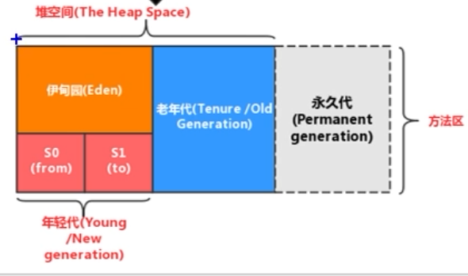
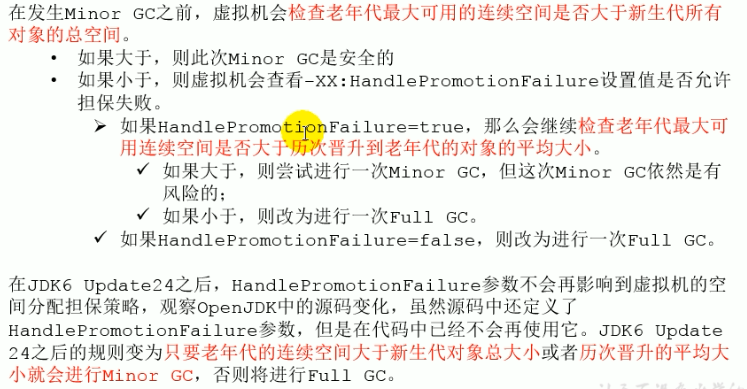
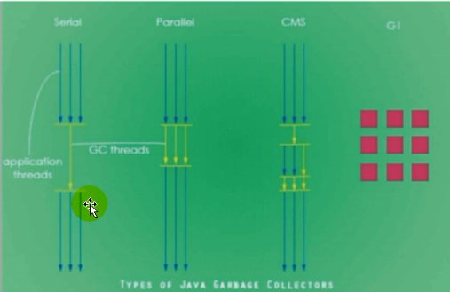

<center><font size="15">第一章 JVM与JAVA体系结构</font></center>


生命周期


<center><font size="15">第二章 类加载子系统</font></center>

# *类加载器

## 启动类加载器


# *运行时数据区

## 概述


主要包括五个部分，分别是**方法区**，**堆**，**程序计数器**，**虚拟机栈**，**本地方法栈**。

其中，前两个部分是线程共享的，而后三个部分是线程私有的。

程序计数器     不存在Error，不需要GC

虚拟机栈         存在Error，不需要GC

本地方法栈     存在Error，不需要GC（就像虚拟机栈一样）

方法区             存在Error，需要GC

堆                     存在Error，需要GC

### 注意概念的区分

这里 明确几点，网上说的东西，针对hotspot

除了私有的内存部分，对于线程共享的两个部分，堆区和方法区。JVM规范是叫方法区，厂商落地实现的叫元空间（或者是元数据区，在1.8之前，由于是从GC角度实现的方法区，所以方法区称为永久代，1.8之后具体实现改成了元数据区），另外还有代码缓存（JIT编译的代码），逻辑上可以归到方法区中，具体实现也有单独拿出来的（例如上图）。总的来说，线程共享内存部分可以分成两块内容，一块是堆，一块是堆外内存。这样分主要是考虑到垃圾回收处理。

**JVM规范中的方法区，对于Hotspot虚拟机来讲有两种实现，分别是永久代和元数据区**

#### 元数据区  VS  永久代

- 存储位置不同，永久代物理上是堆的一部分，使用的是虚拟机的内存，在逻辑上称为方法区，而元空间**属于本地内存**；难道是直接映射到了物理内存？

- 存储内容不同，类的元信息仍存储在元数据区，静态变量和常量池等并入堆中。相当于永久代的数据被分到了堆和元空间中。

每个JVM只有一个**Runtime**实例，即为运行时环境（运行时数据区）


### 线程的概述

在HotSpot JVM中，每个线程都与操作系统的本地线程有直接的映射

另外JVM运行时会有许多守护线程，在HotSpot中，主要包括以下几个守护线程

- 虚拟机线程：该线程的操作需要JVM到达安全点（垃圾回收时）才会出现的，这些操作必须在不同线程中发生的原因是他们都需要JVM达到安全点，这样堆才不会变化。这种线程的执行类型包括“stop the world”的垃圾收集，线程栈收集，线程挂起以及偏向锁撤销
- 周期任务线程：这种线程是时间周期事件的体现（比如中断），他们一般用于周期性的操作的调度执行
- GC线程：这种线程对在JVM中不同种类的垃圾收集行为提供了支持
- 编译线程：这种线程在运行时会将字节码编译到本地代码
- 信号调度线程：这种线程接收信号并发送给JVM，在它内部通过调用适当的方法进行处理


## PC 寄存机（程序计数器）

这是线程私有的一个内存部分，他是对物理PC寄存器的一种软件层面的模拟。因为是线程私有，所以生命周期与线程生命周期一致。

PC寄存器是**唯一一个**在JAVA虚拟机规范中没有规定 OutOfMemoryError（OOM）

作用：

用来存储指向下一条指令的地址。由执行引擎读取下一条指令。

设置PC寄存器的意义在于能够保存现场，在进行线程上下文切换的时候保存程序运行的进度


## 虚拟机栈

### 虚拟机栈概述

栈是运行时的单位，而堆是存储的单位——栈解决的是程序执行的问题，堆解决的是数据存储的问题。

每一个线程在创建的时候都会创建一个对应私有的虚拟机栈，内部保存一个栈帧（stack frame）对应着一次次的方法调用。

由于栈的特殊结构，所以对于栈来说不存在垃圾回收的问题，但是也会出现OOM

栈的异常：

- Java虚拟机规范允许虚拟机栈的大小可以是**动态**的或者**固定不变**的
  - 如果是规定大小的虚拟机栈，可以在创建线程的时候指定虚拟机栈的大小。如果线程请求的栈容量超过java虚拟机栈允许的最大容量，就会抛出**StackOverflowError**。最简单的就是递归的时候就会出现
  - 如果虚拟机栈可以动态扩展，并且在尝试扩展的时候无法获得足够的内存，或者在创建新的线程时没有足够的内存去创建对应的虚拟机栈，那Java虚拟机将会抛出一个**OutOfMemoryError**异常

### 栈的存储单位 栈帧

- 栈中的数据都是以栈帧为基本单位存储的
- 线程中正在执行的方法对应了一个栈帧，如果方法调用了一个新的 方法，对应的新的栈帧就会被创建，放在栈顶成为为当前栈帧
- 栈帧是一个内存区块，是一个数据集，维护方法执行过程中各种数据信息
- 栈是程序私有的，所以不同线程的栈帧无法相互引用（阿里有个技术可以）
- 执行引擎运行的所有字节码指令只针对当前栈帧进行操作
- **栈帧被弹出有两种情况**，一种是方法正常执行到return语句（包括catch异常并处理）；另一种是抛出异常（未处理）。两种情况都会导致栈帧被弹出

#### 栈帧的内部结构


每个栈帧中有五中结构

- 局部变量表LV
- 操作数栈OS（表达式栈）
- 动态链接DL（或者称为指向运行时常量池的**方法引用**）
- 方法返回地址RA（方法正常退出或者异常退出的地址）
- 一些附加信息（锁地址？）

后面三个有时统称为帧数据区

### 局部变量表

局部变量表也被称为局部变量数组或者本地变量表。他被定义为一个数字数组，主要用于存储**方法参数**和**定义在方法体内**的局部变量。局部变量表建立在线程的栈帧中的，是线程私有的数据，所以不存在线程安全的问题。其容量在编译期确定下来并保存在方法的一个属性中（maximum LV），方法运行期间不会被改变


#### slot的理解

- 参数值的存放总是在局部变量数组的index0开始的，到数组长度-1的索引结束

- 局部变量表最基本的存储单元是slot（变量槽）
- 局部变量表中存放编译期可知的各种基本数据类型（8种），引用类型，returnAddress类型的变量
- 在局部变量表里，**32位以内的类型只占用一个slot（包括returnAddress类型），64位的类型（long和double）占用两个slot**
  - byte、short、char在存储前被转换为int，boolean也被转换为int，0表示false，非0表示true
- 当一个实例方法被调用的时候，他的方法参数和内部的局部变量会**按照顺序**被复制到局部变量表中的每一个slot上，并且可以根据索引被访问
- 如果一个变量（long或者double）占用了两个slot，就会占用两个索引，访问该变量使用前一个索引
- 如果当前栈帧是**构造方法或者实例方法（非静态的）创建**的，那么该方法归属的对象的引用`this`将会存放在index为0的slot处
- slot可以被重复利用，一个变量超出了它的作用域之后就会在局部变量表中腾出slot，供其他局部变量使用（因为这些都是在编译期可以确定的，可以提前优化）


#### 静态变量 对比 局部变量 初始化的问题

- 参数分配完毕之后再根据方法体内定义的变量的顺序和作用域分配
- 静态变量有两次初始化，一次连接准备时的默认初始化，一次初始化；但是局部变量不存在默认初始化，所以需要人为初始化，否则无法使用。成员变量也会在实例创建的时候默认初始化

#### 局部变量表的性能问题

- 在栈帧中，与性能调优关系最密切的就是局部变量表；在方法执行时，虚拟机使用局部变量表完成方法的传递
- 局部变量表也是重要的**垃圾回收根节点**，只要被局部变量表中直接或间接引用的对象都不会被回收

### 操作数栈


### 代码追踪


通过字节码中操作数栈的操作分析常见的加加面试题

```java
//1:
int i1 = 10;
i1++;

int i2 = 19;
++i2;

//2:
int i3 = 10;
int i4 = i3++;

int i5 = 10;
int i6 = ++i5;

//3:
int i7 = 10;
i7 = i7++;
int i8 = 10;
i8 = ++i8;

//4:
int i9 = 10;
int i10 = i9++ + ++i9;

```


### 栈顶缓存技术

因为JVM是基于栈式架构的，使用的是零地址指令，虽然紧凑，但是完成一个简单操作的时候需要很多入栈出栈操作，也就意味着需要更多的指令分派次数和内存读写次数。

开发人员就提出 将栈顶的元素全部缓存在物理CPU的寄存器中，以此降低对内存的读写次数，提升执行引擎的执行效率

### 动态链接（为了实现动态链接而存在的引用，调用该方法时，需要

> Each frame contains a reference to the run-time constant pool for the type of the current method to support dynamic linking of the method code. The class file code for a method refers to methods to be invoked and variables to be accessed via symbolic references. Dynamic linking translates these symbolic method references into concrete method references, loading classes as necessary to resolve as-yet-undefined symbols, and translates variable accesses into appropriate offsets in storage structures associated with the run-time location of these variables.
> This late binding of the methods and variables makes changes in other classes that a method uses less likely to break this code.
>
> 为了支持动态链接到方法代码，每个栈帧都包含了一个引用（reference），该引用连接到当前方法所属的类（type of current method）的**运行时常量池**（书上说的是指向常量池中方法的符号引用）。一个方法的类文件代码中，通过符号引用指向（refers）一些需要被调用的方法和访问的变量。Dynamic linking 将这些符号引用翻译成了具体的方法引用（直接引用，或者说入口地址），如果未定义符号，可能还要家在一些必要的类来解析用于解析这些符号，另外，还需要将变量访问转化为运行时数据结构中的变量对应的偏移量
>
> 这种后期绑定


- 每一个栈帧内部都包含一个指向**运行时常量池**中该**栈帧所属方法的引用**。包含这个引用的目的就是为了支持当前方法的代码能够实现动态链接，比如invokedynamic指令
- 在Java源文件被编译到字节码文件中时，所有变量和方法都作为符号引用存在**class文件的常量池**里，比如：描述一个方法调用了另外的方法时，就是通过常量池中指向方法的符号引用来表示的，那么动态链接的作用就是为了将<span  style="color:red">这些符号引用转换为调用方法的直接引用</span>


### 方法调用 ——解析调用与分派调用

区别一个概念，就是**静态解析**，**静态解析针对的是在编译期确定，运行时不变的一些方法**，编译成字节码后由invokespecial和invokestatic调用的方法。常见的有私有方法，静态方法，构造器和父类方法。这四类方法称为非虚方法，其他的实例方法称为虚方法。另外由final修饰的方法，不允许重写，所以虽然是由invokevirtual调用的，但也是静态解析的。

**静态解析的方法可以在类加载时期将其符号引用转换成直接引用**（这是明确的）

接下来说分派，**分派的主要目的是当方法名（简单名称）一样的时候，确定使用方法的哪一个版本（重载，重写）**

分派可以是**静态分派**（英文文档中只有**重载解析**，没有静态分派这一概念）和**动态分派**。

对于静态分派要先将两个概念，即静态类型和实际类型。静态类型就可以简单理解为引用类型，实际类型可以理解为实例类型。

==重载方法版本的确定==时，区别就在于**调用方法的静态类型和参数的类型（静态）**，而**编译器对于传入参数的是通过静态类型来判断的其类型**的，实际类型并不可知，所以，在进行重载的时候就是所谓静态分派（重载解析），这一部分也在编译期间就完成了

==重写方法版本的确定==时，区别在于方法的接受者（调用的谁的方法）。虽然在编译期间**确定方法的符号引用时，是根据其静态变量确定的（体现在字节码文件中就是，invokevirtual后的参数的全限定名类型是静态变量的类型）**，但是在运行期间，会再次确定方法调用的版本。也就是invokevirtual实际运行时的解析过程是：

> 找到栈顶元素（引用）指向的**实际类型** ----> 在该实际类型中去匹配符号引用中的**描述符和<font color="red">简单名称</font>** -----> 如果成功匹配就检查权限，通过就调用，否则抛异常`java.lang.illegalAccessError` -------> 如果没找到匹配的方法，就向其父类中开始找 -----> 始终没找到，抛异常`java.lang.AbstractMethodError`

这里需要注意的是，编译器确定符号引用时是通过静态类型的，主要是为了类型检查。运行期动态分派是到实际类型中**匹配方法的描述符和简单名称，并不是全限定名**。

另外，不论是非虚方法调用还是虚方法调用，在进行符号引用到直接引用的转换之后就会将其缓存(invokedynamic不会），防止重复解析。

而这个直接引用，也称为方法的入口地址（比如方法的第一行指令的地址），在HotSpot VM实现中，是虚方法表的偏移量。

方法的绑定机制分为以下两种

- **静态链接**
  - 当一个字节码被装载经JVM内部时，如果被调用的目标方法在编译期可知，且运行期保持不变时，这种情况下将调用方法的符号引用转换成直接引用的过程称为静态链接
- **动态链接**
  - 如果被调用的方法在编译期无法被确定下来，也就是说，只能够在程序运行期将调用方法的符号引用转换为直接引用，由于这种引用转换过程具备动态性，因此称为动态链接

字节码中表现的就是调用虚方法（invokevirtual），如果不需要，可以用final来修饰


- 虚方法
- 非虚方法
  - 如果编译期就确定了具体的调用版本，且在运行时不可变，这样的方法就称为非虚方法
  - 静态方法、私有方法、final方法、实例构造器、父类方法都是非虚方法
  - 其他方法都是虚方法


虚拟机中提供的方法调用指令

- 普通调用
  - invokestatic：调用静态方法，解析阶段确定唯一的方法版本
  - invokespecial：调用\<init>方法，私有以及父类方法，解析阶段确定唯一的方法版本
  - invokevirtual：调用所有虚方法
  - invokeinterface：调用接口方法

- 动态调用
  - 解析阶段确定唯一的方法版本dynamic：动态解析出需要调用的方法，然后执行。是在Java7中出现，Java8Lambda表达式 的出现才有了真正的使用

动态类型语言和静态类型语言两者的区别就在于对于类型的检查是在编译期还是运行期，前者是静态的，后者是动态的。

Java是静态语言，但是有了invokedynamic之后就具备了一定程度上的动态语言的特性


#### 方法重写

- 找到操作数栈顶的第一个元素所执行的对象的实际类型，记做T
- 如果在类型T中找到与常量中的描述符和简单名称都相符的方法，则进行访问权限校验，如果通过则返回就这个方法的直接引用，如果不通过就返回java.lang.illegalAccessError
- 如果没找到满找继承关系从下往上依次对T的各个父类进行第二步的搜索和验证过程
- 如果始终没有找到合适的方法，抛出java.lang.AbstractMethodError异常

#### 虚方法表

- 在面向对象的编程中会频繁使用到动态分派，如果在每次动态分派的过程中都需要重新在类的方法元数据中搜索合适的目标（方法重写中按继承关系向上找）的话就可能影响执行效率。为了提高性能，JVM在类的方法区建立一个虚方法表（非虚方法不会在表中出现），使用索引代替查找

### 方法返回地址

存放调用该方法的PC寄存器的值（用于返回到调用方法时的执行位置）

一个方法的结束有两种方式

- 正常执行完成（包括捕获异常并处理）
- 抛出未处理的异常，非正常退出

无论通过哪种方式退出，在方法退出后都返回到该方法被调用的位置，方法正常退出时，调用者的PC计数器的值作为返回地址，即调用该方法的指令的下一条指令的地址，通过异常退出的，返回地址是要通过异常表来确定，栈帧中一般不会保存这部分信息


### 一些附加信息

对程序调试提供支持的信息，不一定有


### 虚拟机栈的面试题

举例栈溢出的情况（stackoverflowerror，典型情况：递归没有结束条件）

- 可以通过-Xss设置大小
- **stackoverflow 固定大小出现的错误（线程请求的内存超过了虚拟机的限制）**，典型情况 递归没有结束条件
- **OOM，动态变化时出现的错误（未超过虚拟机限制，虚拟机在扩展栈时，无法申请到足够内存）**。扩大到内存都容不下了

调整栈的大小就能保证不出现溢出吗（否

分配的栈内存越大越好吗（否

垃圾回收是否会涉及到虚拟机栈（否

方法内定义的局部变量是否线程安全（如果是参数，可能不安全；如果是返回值，也可能不安全，也就是说在栈帧内部产生并消亡的局部变量是安全的——**逃逸分析**）

**逃逸分析**


## 本地方法栈


### 本地方法接口


红框中就表示本地方法接口部分

其中包含了两部分，本地方法接口（JNI）和本地方法库


### 本地方法

简单的讲，一个本地方法就是一个Java调用非Java代码的接口。一个Native Method是这样一个Java方法：该方法的实现由非Java语言实现。

在定义一个本地方法时，使用native关键字修饰方法签名，并不提供实现的 实体，就像定义接口中的方法一样


### 为什么要用本地方法

- 与Java环境外交互
- 与操作系统交互


Java虚拟机栈用于管理Java方法的调用，而本地方法栈用于管理本地方法的调用。两个各方面的性质是相同的，线程私有、空间大小等


## 堆

### 堆的核心概述

- 一个JVM实例（对应一个JVM进程）只存在一个堆内存，堆也是Java内存管理的核心区域
- Java堆区在**JVM启动的时候被创建**，其空间大小也就确定了，是JVM管理的最大一块内存空间
  - 堆的大小也可以通过VM参数设置进行调节
- Java虚拟机规范规定，堆可以处于**物理上不连续的内存空间**中，但在**逻辑上它应该被视为连续的**
- 所有线程共享Java堆，还可以在Eden区划分线程私有的缓冲区（Thread Local Allocation Buffer，TLAB）
- JVM规范描述的是，所有的对象实例以及数组都应该在运行时分配到堆上。但是实际上在JVM发展过程中，出现了**逃逸分析**，也就是说局部变量如果没有发生逃逸，就可以在栈上分配，或者标量替换（详见对象分配的特殊情况）
- 数组和对象可能永远不会存储在栈上，因为栈帧中保存引用，这个引用指向对象或者数组在堆中的位置。


- 在方法结束后，堆中的对象不会被马上移除，仅仅在垃圾回收的时候才会被移除
- 堆是垃圾回收的重点区域

#### 内存细分


- 其中新生代又分为Eden区和Survivor1区和Survivor2区，在每一次垃圾回收中，只有一个Survivor区被使用，也就是说，总有一个Survivor区（s0或s1）是空的，所以在VM设置的时候会出现设置的值与实际的值不符合的情况


1.8之前，方法区实现叫永久代，1.8及之后称为元空间




- 存储位置不同，永久代物理上是堆的一部分，和新生代，老年代（堆区）（在计算机进程概念上的）逻辑地址地址是连续的，在逻辑上称为方法区，而元空间**属于本地内存**；

- 存储内容不同，**类的元信息仍存储在元数据区**，**静态变量和常量池等并入堆**中。相当于永久代的数据被分到了堆和元空间中。

### 设置堆内存大小与OOM

#### 设置堆参数

- `-Xms`用于表示堆区（年轻代+老年代）的起始内存，等价于`-XX:InitialHeapSize`

- `-Xmx`则用于表示堆区的最大内存，等价于`-XX:MaxHeapSize`
  - 一旦**堆区中的内存大小超过最大内存所指定的值，就会抛出OOM异常**
  - 通常**将Xms和Xmx设置为相同的值，目的是为了能够在Java垃圾回收机制清理完堆区之后不需要重新分隔计算堆区的大小**，从而提高性能

- 默认情况下，
  - 初始堆大小：物理电脑内存大小/64 
  - 最大内存大小：物理电脑内存大小/4

在设置大小的时候，实际使用的，总比设置的小，这是因为s0和s1区始终有一个是闲置不用的

#### 查看设置的参数

控制台：

- jps  /  jstat -gc PID
- -XX:PrintGCDetails

### 年轻代与老年代

存储在JVM中的Java对象可以被划分为两类：

- 一类是生命周期较短的瞬时对象

- 一类是声明周期很长，可能与JVM生命周期保持一致的对象

- Java堆区进一步细分的话可以分为年轻代，老年代，其中年轻代又可以分为Eden空间，Survivor0（s0）空间和Survivor1（s1）区，也称为from区和to区，这个叫法是逻辑上的叫法，还不断变动

  

**配置新生代与老年代在堆结构的占比**

- 默认`-XX:NewRatio=2`，表示新生代占1，老年代占2，新生代占整个堆的1/3
- 可以修改`-XX:NewRatio=4`表示新生代占1，老年代占4，新生代占整个堆的1/5

**查看新生代与老年代在堆结构的占比**

jinfo -flag NewRatio PID

**配置Eden空间在新生代空间中的的占比**

- 在HotSpot中Eden空间和另外两个Survivor空间缺省所占的比例是8:1:1，但是实验不是，需要通过`-XX:SurvivorRatio=8`显示指定。`-XX:SurvivorRatio`可以调整空间比例
  - 也可能会有一个自适应的机制，可以通过`-XX:-UseAdaptiveSizePolicy`来关闭
- 几乎**所有的Java对象都是在Eden被new出来的**，如果对象太大，直接放到老年代了
- 绝大部分的Java对象的销毁都在新生代进行了
- 可以**用`Xmn`设置新生代最大内存大小。-Xmn比-XX:NewRatio优先级高**

### 对象分配过程（垃圾回收角度的生命周期）

内存分配需要考虑如何分配内存，在哪里分配等问题外，还需要考虑内存回收算法，是否在进行内存回收后仍然会产生内存碎片的问题。

#### 对象分配的一般过程

**对象几乎总是new在Eden空间中（也有*特殊情况直接在老年代中*）**，随着对象的不断创建，Eden空间逐渐满载，当**<font color="red">满时触发YGC</font>（Young GC，也称为MinorGC）**，**Stop-the-World**，此时，**对整个新生代进行垃圾回收**，回收结束后，清空Eden，将Eden中的存活对象复制到to区（s0或s1），同时被复制到to区的还有经历了垃圾回收并存活的from区（s1或s0）中的对象，新复制到Survivor区的对象会有一个age**（在对象被创建时就包含在了对象头中）**，年龄计数器，初始值为1，每经历一次GC，年龄参数增长1。此后再进行循环——Eden中new对象，满了**对整个新生代**进行YGC，from区和Eden区存活对象复制到to区，**更新空的Survivor区为to区**。如果age参数达到阈值（默认为15，可以通过`-XX:MaxTenuringThreshold=`设置），**也就是说一个对象经历了15次YGC，就会被复制到老年代（该过程称为Promotion，在YGC时发生）。**

对于YGC需要注意，**<font color="red">只有在Eden区满时才触发</font>，并对整个年轻代（Eden和Survivor）进行垃圾回收，只有YGC的时候Survivor区才有可能被写满，这时如果没有年龄到达阈值的对象，就根据特殊规则将一部分对象直接复制到老年代（*==动态年龄判断和分配担保==*,）。**


总结：

- Survivor：复制之后有交换，谁空谁是to。
  - 主要是为了解决内存碎片的问题——紧凑
- GC：频繁在新生代收集，很少在老年代收集，几乎不在永久代/元空间收


### Minor GC，Major GC，FullGC

概述，详见垃圾回收部分。

JVM在进行GC时，并非每次都对三部分（新生代、老年代；方法区）内存进行回收，大部分时候都是针对新生代的回收（YGC），针对HotSpot MV实现，按照垃圾回收区域又将垃圾回收分成两种类型：一种是部分回收（Partial GC），一种是整堆回收（Full GC）

#### GC分类

- Partial GC：
  - 新生代收集（Minor GC / Young GC）：只针对新生代的垃圾收集
  - 老年代收集（Major GC / Old GC）：只针对老年代的垃圾收集
    - 目前只有CMS GC会有单独收集老年代的行为（还有Parallel Scavenge）。其他的收集器在Major GC前会进行Minor GC
    - 很多时候Major GC会和Full GC混淆，需要辨别是老年代回收还是整堆回收
  - 混合收集（Mixed GC）：收集整个新生代以及部分老年代的垃圾收集
    - 目前只有G1 GC会有这种行为

- Full GC：
  - 针对整个**Java堆（回收对象）和方法区（元信息卸载）**的垃圾收集
  - 这里还是有点问题，书上说Major和Full是一个概念


#### 分代式GC策略的触发条件

-XX:+PrintGCDetails

- Minor GC
  - 年轻代空间不足（主要是Eden满时，Survivor满不会触发），每次**Minor GC会清理新生代的内存**
  - **Minor GC会触发 STW**
- Major GC
  - **Major GC发生前一般会伴随至少一次的Minor GC**（特殊情况，Parallel Scavenge收集器的收集策略就是**直接进行Major GC**），也就是说，老年代空间不足时，先尝试触发Minor GC，如果空间还是不足，触发MajorGC
  - Major GC速度比Minor GC慢十倍以上，STW时间更长
  - 如果Major GC后，内存还是不足，就会报OOM
- Full GC


### 内存分配策略

- 优先分配到Eden
- 大对象直接分配到老年代
- 长期存活的 对象（Survivor中达到年龄阈值）分配到老年代
- ==动态对象年龄判断==
  - 如果Survivor区中，相同年龄的所有对象大小的总和大于Survivor空间的一半，年龄大于或等于该年龄的对象可以直接进入老年代，**无需等到阈值**
- ==空间分配担保==
  - `-XX:HandlePromotionFailure`
  - 

### 堆空间的分代存储

研究表明，不同对象的生命周期不同，70%的对象是临时对象。分代是为了优化GC性能


### 线程安全的对象分配内存：TLAB

堆是线程共享区域，对象实例在堆中创建非常频繁，并发环境下划分内存时线程不安全的，如果加锁，就会影响速度，所以需要解决线程安全问题 

#### 什么是TLAB和相关参数设置

- 从内存模型的角度（而不是垃圾收集的角度），**对Eden区进行划分**，JVM为每一个线程分配了一个私有的缓存区域，包含在Eden空间中
- 多线程同时分配内存时，使用TLAB可以避免线程安全问题，还能提升内存分配吞吐量，所以也称为**快速分配策略**

- 可以通过`-XX：UseTLAB`设置是否开启TLAB，默认情况是开启的
- JVM是将TLAB作为内存分配的首选，但是不是所有对象实例都可以在其中成功分配，因为它默认情况下很小只有Eden空间的1%。也可以通过选项`-XX：TLABWasteTargetPercent`设置其百分比大小
- 如果通过TLAB分配失败，那么就会使用加锁机制直接在Eden空间中分配内存
- 


### 对象分配的特殊情况

随着JIT编译技术的发展，**==逃逸技术==**的成熟，**==栈上分配、标量替换（分离对象）==**技术将“所有对象在堆上分配空间”变得不那么绝对。**经过逃逸分析后发现，一个对象并没有逃逸出方法的话，那么就可能被优化成栈上分配，就无须在堆上分配内存**，这也是最常见的**堆外存储技术**之一

还有一个特例是TaoBaoVM，通过GCIH（GC Invisible Heap）将一些生命周期较长的对象从堆移到堆外，并对GC不可见，从而降低GC回收频率

#### 逃逸分析

该方法可以有效减少Java程序中同步负载和内存堆分配压力的跨函数全局数据流分析算法

通过逃逸分析，HotSpot编译器能够分析出一个新对象的引用的使用范围从而决定是否要将该对象分配到堆上

**<font color="red">逃逸分析的基本行为就是分析局部变量引用的对象动态作用域</font>**

- 当一个对象**在方法中**被定义后，对象只在方法内部使用，则认为没有发生逃逸
- 当一个对象**在方法中**被定义后，被外部方法所引用（例如参数，返回值，给外部应用赋值等），则认为发生逃逸
- JDK6之后默认开启逃逸分析
  - `-XX:+DoEscapeAnalysis`显示开启逃逸分析
  - `-XX:+PrintEscapeAnalysis`查看逃逸分析结果

**逃逸分析的代码优化**

但是逃逸分析本身也是一个耗时的过程

- **栈上分配**。将堆分配转化成栈上分配。如果一个对象在子程序中被分配，如果指向该对象的指针永远不会逃逸（对象实例不会被外部使用），对象可能是栈分配的候选，而不是堆分配。栈上分配不但会**减少GC**，还会**增加内存分配速度**

- **同步省略**。如果一个对象被发现只能从一个线程被访问到，那么对于这个对象的操作可以不考虑同步
- 在动态编译同步块的时候，JIT编译器能够**通过逃逸分析判断同步块所使用的锁对象是否只能够被一个线程访问而没有被发布到其他线程**，如果没有，那么JIT编译器在编译这个同步块的时候就会取消对这部分代码的同步，提高性能。这就是**同步省略**或者是**锁消除**
  
- **分离对象或标量替换**。有的对象可能不需要作为一个连续的内存结构存在也可以被访问到，那么对象的部分（或者全部）可以不存储在内存，而**存储在CPU寄存器**中
- 标量（Scalar）是指一个无法在分解成更小的数据的数据，Java中的原始数据类型就是标量
  
- 相对于标量，那些还可以分解的数据称为聚合量（Aggregate），Java中的对象就是聚合量，可以分解成其他聚合量和标量
  
- 在JIT阶段，如果经过逃逸分析，发现一个对象不会被外界访问的话，那么JIT优化之后会将该对象拆解成若干个成员变量来代替

 ```java
class Customer{
    String name;
    int id;
    Acount acct;
}
class Acount{
    int num;
}

class test{
    public static void main(String[] args){
        Customer c = new Customer;
        //....
        Customer = null;
    }
}

//经过逃逸分析，main方法中的代码就会被优化成
class test{
    public static void main(String[] args){
        String name;
    	int id;
    	int num;
        //....
    }
}

 ```


栈上分配并未实现，看上去是栈上分配的效果，实际上是标量替换（实现了），所以对象实例都还是分配在堆上的

### JVM参数堆内存阶段总结

```java
/**
 * 测试堆空间常用的jvm参数：
 * -XX:+PrintFlagsInitial : 查看所有的参数的默认初始值
 * -XX:+PrintFlagsFinal  ：查看所有的参数的最终值（可能会存在修改，不再是初始值）
 *      具体查看某个参数的指令： jps：查看当前运行中的进程
 *                             jinfo -flag SurvivorRatio 进程id
 * 
 * -Xss<Bytes>：虚拟机栈大小
 * -Xms<Bytes>：初始堆空间内存 （默认为物理内存的1/64）
 * -Xmx<Bytes>：最大堆空间内存（默认为物理内存的1/4）
 * -Xmn<Bytes>：设置新生代的大小。(初始值及最大值)，优先级比NewRatio高
 * -XX:-UseAdaptiveSizePolicy：自适应调整堆中新生代占比
 * -XX:InitialHeapSize= ：堆的起始内存
 * -XX:MaxHeapSize= ：堆的最大 内存
 * -XX:NewRatio=：配置新生代与老年代在堆结构的占比
 * -XX:SurvivorRatio=：设置新生代中Eden和S0/S1空间的比例
 * -XX:MaxTenuringThreshold=：设置新生代垃圾的最大年龄,最大15
 * -XX:+PrintGCDetails：输出详细的GC处理日志
 * ① -XX:+PrintGC   ② -verbose:gc ：打印gc简要信息：
 * -XX:HandlePromotionFailure：是否设置空间分配担保
 * -XX：UseTLAB ：开启TLAB，为每个线程在Eden中划分一部分区域，优先分配在此，大小不够再到普通Eden区域分配
 * -XX：TLABWasteTargetPercent ：设置TLAB百分比大小
 
 * -XX:+DoEscapeAnalysis显示开启逃逸分析
 * -XX:+PrintEscapeAnalysis查看逃逸分析结果
 * -XX:+EliminateAllocations：开启标量替换（聚合量）
 */
```


## 方法区

### 栈、堆、方法区的交互换关系

从JMM角度已经在上面讲过运行时数据区的结构

从线程共享与否的角度来看（HotSpot VM实现，方法区实现为元空间）

	

方法区 栈、堆的关系


详见对象的实例化内存布局与访问定位

还有一种关系实现如下图，但是HotSpot是按上图实现的


### 方法区的理解

具体可以参照官方文档

- 根据官方文档，方法区可以看做是一块独立于Java堆的内存空间（从垃圾回收、压缩等角度）
- 方法区在JVM启动的时候被创建，它的实际物理内存空间中和Java堆区一样都可以是不连续的
- 方法区的大小，和堆空间一样可以选择固定大小或者可扩展
- 方法区的大小决定了系统可以保存多少个类，如果**加载了太多类，导致方法区溢出，虚拟机会抛出OOM**
- 关闭JVM会释放该区域的内存


### 设置方法区大小与OOM

#### 大小设置

JDK7 之前：

- 通过`-XX:PermSize`来设置永久代初始分配空间，默认值是20.75M
- 通过`-XX:MaxPermSize`来设置永久代最大可分配空间，32位机器默认64M,64位机器默认82M

JDK8之后：

- 通过`-XX:MetaspaceSize`和`-XX:MaxMetaspaceSize`来设置元空间的初始可分配空间和最大可分配空间。默认值依赖于平台，windows下，-XX：MetaspaceSize是21M，最大可分配空间没有限制
- 与永久代不同，**如果不指定大小限制，虚拟机会耗尽所有的系统内存**
- 元空间初始大小会影响Full GC触发 ，不能太大，不能太小
  - 根据设置的初始元空间大小（如果没有设置就是默认值），**Full GC会以此为阈值来触发，触发后调整阈值**，如果该次Full GC释放的空间多，就会降低阈值，否则就会提高阈值。所以初始元空间大小也会影响到Full GC的触发，为了避免频繁GC，建议设置的较高

#### OOM举例

借助CGLib使方法区出现OOM

如何解决OOM

1、**确定是ML导致的OOM吗**

- 要解决OOM异常一般的手段首先通过内存映像分析工具对dump出来的堆转储快照进行分析，重点是确认内存中的对象是否是必要的，也就是要先分清楚到底是出现了内存泄漏（Memory Leak）还是内存溢出 （Memory Overflow）
  - 内存泄漏：是指程序在申请内存后，**无法释放已申请的内存空间**，一次内存泄漏似乎不会有大的影响，但内存泄漏堆积后的后果就是内存溢出
  - 内存溢出：:指程序申请内存时，**没有足够的内存供申请者使用**

2、**如果是内存泄漏**，可以进一步通过工具查看泄漏对象到**GC Roots的引用链**。就可以找到泄露对象是通过怎么样的途径与GC Roots相关联并导致垃圾收集器无法自动回收他们的。从而定位泄漏代码的位置

3、**如果不存在内存泄漏**，**调整空间，优化生命周期**。这种情况换句话就是内存中的对象确实必须存活，应该检查内存大小参数，看是否能够调大，或者从代码上检查某些对象生命周期过长等问题

### 方法区的内部结构

运行时数据区中的数据除了JVM本身要使用的数据外，都是通过类加载器加载字节码文件所产生的。所以字节码文件中的数据被解析并存放到了运行时数据区的不同的区域。

通常将字节码文件中的类信息和常量放入方法区。历史上的经典存储结构：

方法区具体存储：**类型信息（包括了域(Field)信息、方法(Method)信息）、==运行时常量==（对应了字节码文件中的运行时常量池）、==静态变量==、JIT代码缓存**。**（个人理解：按类封装，对象头的Klass指针指向这个封装，封装理有这些东西）**

- 类型信息

  - 对每个加载的类型（类、接口、枚举、注解）JVM必须在方法区中存储以下**类型信息**

    - 全限定名（包名.类名）
    - 直接父类的全限定名（接口或者是Object没有父类）
    - 类型的修饰符（访问权限，是否抽象，final的某个子集）
    - 该类实现的直接接口的一个有序列表
    - **类加载器**
  - JVM必须在方法区中保存类型所有域的相关信息以及域的声明顺序，即**域信息**

    - 域名称、类型、修饰符
  - non-fina的静态变量

    - 静态变量和类关联在一起，随着类的加载而加载，他们成为类数据在逻辑上的一部分，被所有实例共享，可以通过类来访问，而不必通过实例。**注意这里的静态变量只是静态变量的符号引用，而不是对象实例**（引用指向的对象实例还是存放在堆空间中）
  - final 的静态变量（全局常量）

    - 被声明为final的静态变量的处理方法不同，每个全局常量在编译时就被分配了（写入了字节码文件，而non-final静态变量的初始化是通过\<clinit>方法完成的）
  - JVM必须在方法区中保存类型的**方法信息**

    - 方法名称，返回类型，参数数量和类型（按顺序），也就是方法签名
    - 方法修饰符（权限）
    - 方法字节码、操作数栈、局部变量表及大小（抽象和本地方法除外）
    - 异常表（抽象和本地方法除外），也就是每个异常处理的开始位置、结束位置、代码处理在程序计数器的偏移地址、被捕获的异常类的常量池索引
- **运行时常量池** 与 **常量池**
  - 字节码文件中的常量池被加载到方法区之后，称为运行时常量池
  - 字节码中的常量池表包含编译器生成的**字面量、对类型和域和方法的符号引用**
    - 字面量指**字符串字面量**和**声明为 final 的（基本数据类型）常量值**，这些字符串字面量除了类中所有**双引号括起来的字符串(包括方法体内的)**，还包括所有用到的**类名、方法的名字和这些类与方法的字符串描述、字段(成员变量)的名称和描述符**
    - 符号引用只不过是以一组符号来描述所引用的目标，和内存并无关，所以称为符号引用，直接指向内存中某一地址的引用称为直接引用；
  - 为什么需要常量池？
    - 类似享元模式（String，Integer1-127），**节省内存空间**
  - 运行时常量池是方法区的一部分，JVM为每个已加载的类都维护一个常量池，池中的数据通过索引访问
  - 运行时常量池包含了不同的常量，包括了从字节码文件的常量池中加载而来的常量，而其中的符号引用此时已经转化成真实的地址指针。
    - <span style="color:red">运行时常量池相对于字节码文件常量池的另一个重要特征是：具备动态性</span>
  - 如果**常量池所需空间大小超过了方法区的最大值，就会抛出OOM异常**（堆区）


### 方法区的演进细节（主要针对HotSpot）

在JDK7之前，HotSpot将方法区实现为永久代，JDK8之后，使用 元空间取代了永久代

准确的说，<font size="4">**JDK7的方法区就已经四分五裂了，已经将静态变量和字符串常量放到了堆中**，JDK8继承了JDK7的改变并移除了永久代，提出了元空间的概念。元空间和JDK7的永久代存储内容变化不大，主要是出于垃圾回收和容量限制的考虑</font>

个人理解

> JDK6 和 JDK7的永久代是JVM进程**虚拟地址空间**中的一部分，过大会导致OOM（JDK6包含了静态变量和字符串常量，JDK7将其放到了堆中）

> JDK8的元空间不是JVM进程虚拟地址空间的一部分，使用的**虚拟地址可以映射到物理内存的所有空闲区域**

#### 为什么要取消永久代

当年HotSopt实现的方法区——永久代，导致Java程序更容易OOM（因为永久代使用的是虚拟机的内存，元空间使用了本地内存），而且为了与JRocket相融合，所以用元空间替换了

永久代大小难以确定

永久代难以调优

#### 元数据区  VS  永久代

- 存储位置不同，永久代物理上是堆的一部分，使用的是**虚拟机的内存**，在逻辑上称为方法区，而元空间**属于本地内存**；

- 存储内容不同，类的元信息仍存储在元数据区，==**静态变量**和**字符串常量**==并入堆空间中。

#### 那么为什么要调整String table和静态变量引用的实例到堆中

从垃圾回收的角度来讲，永久代的回收效率很低，需要Full GC进行回收，导致String Table回收效率不高，放到堆里，能够及时回收内存


### 方法区的垃圾回收

虚拟机规范对于方法区的垃圾回收要求是比较宽松的，没说必须要实现。JDK的ZGC就不支持类的卸载（方法区的垃圾回收）。

有的会对静态变量和String Table进行垃圾回收，JDK8之后已经在堆中了，

类的卸载有必要，但是类的卸载条件非常苛刻：

- 类及其子类的实例都不存在
- 加载该类的类加载器已被回收
- 无法通过反射生成该类，即该类的Class对象没有被引用


# 对象实例化内存布局与访问定位

## 对象的实例化

### 创建对象的方式

- new（使用构造器，包括某些单例模式实现，工厂模式实现）
- Class类的静态方法newInstance()（反射，JDK8之后过时了，被替换成下面的了）
- Constructor类的静态方法newInstance(类名)（反射）
- 使用clone()（不调用构造器，对象需要实现Cloneable接口）
- 使用反序列化（从对象二进制流还原对象到内存）
- 第三方库

### 创建对象的步骤

- **判断对象是否被加载、连接、初始化**

  - 虚拟机遇到new指令，首先去检查该指令的参数是否能在Metaspace的常量池中定位到一个类的符号引用，同时检查该符号引用代表的类是否被加载、解析、初始化（即判断类元信息是否存在）。如果没有就通过双亲委派机制加载类。如果没有找到需要加载的类的字节码文件，就抛出ClassNotFoundException异常。

- **对象分配内存**

  首先要计算对象占用的空间大小，然后在堆内分配一块内存给新对象（Eden中，如果很大就在Old中），如果实例成员变量是引用变量，仅分配引用变量空间即可，即4字节大小

  - 如果内存规整，使用指针碰撞

    如果内存时规整的，VM使用指针碰撞（Bump the Pointer）来为对象分配内存。意思是，所有用过的内存在一边，空闲的内存在另一边，中间放着一个指针作为分界点的指示。分配内存就仅仅是发指针向空闲部分挪动一段对象大小。使用指针碰撞的分配方式前提是垃圾收集器选择Serial、ParNew这种基于压缩算法的收集器。

  - 如果内存不规整，VM需要维护一个列表，使用空闲列表分配

    如果已使用的内存和未使用的内存相互交错，那么VM采用空闲列表的方式（Free  List）来为对象分配内存。该列表记录了哪块内存是可用的，再分配的时候从列表中找到一块足够大的空间划分给对象实例，并更新列表内容。像CMS等不进行压缩的就需要维护空闲列表

  - 说明

    **具体使用哪种分配方式（或者本质上说内存是否规整）由采用的垃圾收集器是否带有压缩整理功能决定的。**

- **处理并发安全问题**

  在分配内存空间时，另一个问题就是内存的线程安全性

  - 采用CAS和失败重试保证更新的原子性
  - 每个线程预先分配一块TLAB

- **初始化分配到的空间**

  内存分配结束，虚拟机将分配到的内存空间都初始化为“零值”（不包括对象头）。这一步保证了对象的实例字段在Java代码中可以不用赋值初始值就可以直接使用，程序能访问到这些字段的数据类型所对应的零值。

- 设置对象的对象头

  将对象的所属类（即类的元数据信息）、对象的HashCode和对象的GC信息、锁信息等数据存储在对象的对象头中，详见对象的内存布局，该过程的具体设置方式取决于VM实现

- 执行\<init>方法进行初始化（主要是显示初始化，代码块初始化和构造器初始化）

  在Java程序的角度看，此时初始化才正式开始。初始化成员变量，执行实例化代码块，调用类的构造函数，并范围堆内该对象的首地址 给引用变量。

## 对象的内存布局


- 对象头（Header）	

  - 运行时元数据（Mark Word）

    - HashCode
    - GC分代年龄
    - 锁状态标志
    - 线程持有的锁
    - 偏向线程ID
    - 偏向时间戳

    64位JVM，开启指针压缩

  

  - 类型指针：指向元数据InstanceKlass，确定该对象的类型

  - 说明：如果是数组，应该要记录数组长度

    

- 实例数据（Instance Data）

  - 说明：它是对象真正存储的有效信息，包括程序中顶底的各种类型的字段（包括从父类继承下来的字段）
  - 规则
    - 相同宽度的字段总是被分配在一起
    - 父类中定义的变量会出现在子类之前
    - 如果CompactFields参数为true（默认）：子类的窄变量可能插入到父类变量的空隙

- 对齐填充（Pading）

## 对象的访问定位——对应方法的调用

JVM如何通过栈帧中的对象引用访问到其内部的对象实例的


### 对象访问方式

对象访问方式主要有两种

- 句柄访问

  - 需要专门开辟空间来存储句柄；在寻找实例数据的时候需要多找一次

  

- 直接指针

  - 垃圾回收时需要对栈空间中的引用进行地址修改

  


HotSpot VM采用的是直接指针的方式

# 直接内存

## 概念

- 不是虚拟机运行时数据区的一部分，也不是VM规范中定义的内存区域
- 直接内存时在Java堆外的，直接向系统申请的内存区间
- 来源于NIO，通过存在堆中的DirtctByteBuffer操作Native内存
- 直接内存的访问速度会优于Java堆
  - 出于性能考虑，读写频繁的场合可能会考虑使用直接内存
  - Java的NIO库允许Java程序使用直接内存，用于数据缓冲区

## 两种IO的性能问题：

- 普通IO：读写文件需要与磁盘进行交互，需要由用户态切换到内核态，且需要两份内存存储重复数据


- 直接内存：操作系统划出直接的缓冲区可以被Java代码直接访问，只有一份，需要维护物理内存映射文件。适合对大文件（几个G）的读写操作

  


## 直接内存的常见问题

- 直接内存也可能会导致OOM：Direct Buffer Memory
- 由于直接内存在Java堆外，因此它的大小不会直接受限于-Xmx指定的最大堆大小，但是受限于操作系统能给的最大内存
  - 直接内存可以通过MaxDirectMemorySize进行设置
  - 如果不指定，默认与对的最大值-Xmx参数一致分配回收成本比较高
- 不受JVM内存回收管理


# *执行引擎

## 概述

执行引擎是JVM核心组成部分之一。与虚拟机对应的是物理机，后者的执行引擎是建立在CPU、缓存、指令集和操作系统上的，而前者的执行引擎是由软件自行实现的，所以可以执行不被硬件直接支持的指令集格式


## Java代码编译和执行过程


以上是两种类型语言的编译和执行过程。橙色部分是javac编译成字节码的过程，JVM采用绿色部分的执行流程解释执行字节码文件


Java被称为**半编译半解释性语言**不是因为他需要先编译成字节码，后解释执行，而是执行引擎在执行代码时一部分解释执行，而有一部分会之间编译成机器语言缓存起来，方便调用

## 解释器

当JVM启动时会根据预定义的规范对字节码采用逐行解释的方式执行，将每条字节码文件中的内容翻译为对应平台的本地机器指令执行

## JIT编译器

JVM将字节码文件中的执行指令直接编译成和本地机器平台相关的机器语言

### 热点代码探测


#### 方法调用计数器


#### 回边计数器

作用是统计一个方法中循环体代码执行到次数，在字节码中遇到控制流向后跳转的指令称为回边（back edge）。显然，建立回边计数器统计的目的就是为了触发OSR（栈上替换）编译

## 说明

解释器相较于JIT编译器，响应时间快，可以省去编译时间立即执行。随着程序推移，JIT编译器根据热点探测功能，将有价值的代码编译成本地机器指令，换取更高的程序执行效率。

但是启动时间并不是唯一的重点，JRocket这个针对服务器端的JVM就没有解释器，全部依靠即使编译器执行

由于JIT编译器的存在，热机状态下可以承受的负载要大于冷机状态

# String Table

## String的基本特性

- 字符串，使用一对“”来表示，有两种声明方式两钟声明方式会在常量池中产生一个字符串：

  - 字面量赋值： String s = “abc”;  
  - 创建String类：String s = new String("abc");

- String类被声明为final的，不可被继承。JDK1.8及之前底层是final的char数组，之后是final的byte数组加上编码标记。为了区别存的字符集，还有一个解码标识，如果是中文，还是用两个byte存一个字符。（char是16位的，byte是8位的）

- String代表不可变的字符序列，即String的不可变性

  - 当对字符串重新赋值时，需要**重写指定内存区域赋值**，不能使用原有的value进行赋值。也就是说，原有的引用`value`是final的，无法被改变
  - 当对现有的字符串进行连接操作时，也需要**重新指定内存区域赋值**，不能使用原有的value进行赋值
  - 当调用String的replace()方法修改指定字符或字符串时，也需要重新指定内存区域赋值，不能使用原有的value进行赋值

- <span style="color:red">**字符串常量池中的字符串是唯一的，两个引用指向一样的字符串，那他们的地址一定是一样的**</span>

- String的 **String Pool是一个固定大小的HashTable**，默认大小长度为大小60013（jdk7）。如果放到String Pool中的字符串特别多，就会造成**hash冲突，调用String.intern()时性能会大幅下降**。使用`-XX:StringTableSize`可以设置大小，最小值为1009（JDK8）

- 在对字符串常量池中的常量池进行操作时，是用新增代替修改。

  **例如，a，b指向字符串常量池中同一个字符串，想要通过a修改成另一个字符串，此时的操作是在字符串常量中新增那另一个字符串，将a指向新增字符串，而不是对原有字符串进行修改**

  

## String的内存分配

Java中有8中基本数据类型（byte,char,boolean,int,long,double,short,float）和一种比较特殊的类型String。这些类型为了使他们速度更快，更节省内存，都提供了一种常量池的概念。常量池中的值都是唯一的

- 常量池就是类似一个Java系统级别提供的内存，8中基本数据类型的常量池都是系统协调的。String类的常量池比较特殊，主要有两种用法
  - **直接使用双引号声明的String对象会直接存储在常量池中**
  - 如果不是直接用双引号声明的String对象可以用intern本地方法使其变为常量池中的一员（比如通过StringBuilder构建的字符串是不在常量池中的）
- jdk1.6之前，字符串常量池存放在永久代中，1.7之后将字符串常量池（还有静态变量）放到了堆中。放到堆中和放在方法区之间的区别好处，可以从垃圾回收（频率低），大小设置等方面回答

## 字符串拼接操作

- **常量与常量的拼接结果在常量池，原理是==编译期优化==**（即编译期就拼接完成，在class文件中直接是拼接之后的结果）
- 常量池中不会存在重复内容的常量
- **拼接时只要其中有一个是变量（不是常量），结果就在堆中，即new String()了**。变量拼接的原理是StringBuilder
  - **只要字符串拼接有变量参与，其底层就会new一个StringBuilder**，然后通过append方法进行拼接，然后toString()；
- 如果拼接的结果调用intern()方法，则主动将常量池中还没有的字符串对象放入池中，并返回此对象地址（JDK7之后有区别了，是直接将引用放到常量池中）

以下图片通过后面的实例就可以搞清楚了


## intern()的使用

字符串调用intern()，会在字符串常量池中查找是否已经存在常量，如果不存在，就创建该常量，并将常量池中的常量的地址返回，如果已经存在，就直接返回该常量的地址


JDK8中，以上这一段代码通过字节码可以知道，字符串常量池中只有“qwe“,”asd“,”ag“,”t“,”y“,并没有”a “，”g“，也没有”ty“

**如何保证变量s指向的是字符串常量池中的数据（也就是说什么时候，字符串常量会入池）**

- 使用字面量定义的方式：String s = "asd";
- 字符串调用intern()方法：String s = new String("ddd").intern();
  - **<span style="color:red">其实在调用intern()方法之前，字符串常量池中已经存在"ddd"了，所以针对常量入池没啥用。</span>但是，因为intern之后会返回常量池中的常量的地址，所以在赋值之后，s指向了常量池中的地址，而不是堆中的那个String对象。**所以**s.intern()和s = s.intern()是有区别的**，


### "a" + "b" 和 new String("ab")会创建几个对象，new String("a") + new String("b")呢

**第一个问题**：编译器优化，只有常量池中常量的那一个对象

**第二个问题：**会创建两个对象，一个是String对象，是new在堆空间中创建的，另一个是字符串常量池中的“ab"，通过字节码指令ldc可以看出来

**第三个问题：**通过字节码可以看出来有6个（toString还有一个String）

new String("a") + new String("b") -> new StringBuilder() -> append -> **toString()**（这一步会额外在堆中创建一个value保存StringBuilder拼接成的对象

**StringBuilder中的toString**，很搞扯！！！

可以看到在StringBuilder中的toString方法中，只创建了一个String对象，**并没有在常量池中创建对象**，使用的是StringBuilder中的成员变量value（char数组）。


### 面试题


**JDK1.6时输出输出 false   false；JDK1.7之后输出false true。**

false显而易见，s指向的字符串虽然intern()了，但是，s并没有获得常量池中的地址。

后一个答案，在1.6中，创建了一个新的对象“11”，和之前的效果一样，也是没有获取到常量池中的地址。而在JDK1.7之后，StringBuilder保留一个char数组，该字符串是不进入字符串常量池的，当使用toString返回时，也同样不在常量池中创建常量(上面字节码体现)。重点来了，那么此时调用intern()方法会发生一件很恶心的事情，<span style="color:red">**常量池并不会创建一个字符串常量，而是会有一个记录，该记录记录了在堆中StringBuilder对象调用了toString方法所创建的String地址**</span>.


扩展：

问题又来了，如果将

```java
s3.intern();
String s4 = "11";

//换位，成如下顺序

String s4 = "11";
s3.intern();
```

在JDK7之后，结论发生变化，s3 == s4 为false。

原因就是之前那题的原因，s3的地址未更新，如果是s3 = s3.intern()就是true了

### intern()优点

当重复的字符串常量较多时，使用intern()会让后面的对象引用直接指向常量池中的常量，更节省空间，维护的实例数更少，且创建对象时间更短

## String Table的垃圾回收

-XX:+PrintGCDetails

-XX:+PrintStringTableStatistics

## G1中的String去重操作

注意这里的去重操作是指去掉堆中char型数组的重复，主要操作就是合并，如果堆中有重复的String，就去掉一个

# 垃圾回收

## 概述

- 哪些内存需要回收
- 什么时候回收
- 如何回收

### 什么是垃圾

垃圾就是在运行程序中，**对于JVM：没有活动对象持有的指针指向的对象是垃圾，对于程序员：逻辑上的生命周期已经结束的对象是垃圾**（要是一个对象）。主要是针对堆和方法区进行的，在栈结构中不需要垃圾回收（但是会有StackOverFlow异常）

如果不对垃圾进行回收，对内存进行清理，这些垃圾对象所占用的内存会一直保留到程序结束，容易导致内存溢出


### 早期间的垃圾回收

C/C++，垃圾通过手工进行，通过new申请，通过delete释放。这种方式可以灵活控制，但是对开发人员对内存的管理能力要求较高，如果忘记清除就会产生内存泄漏，内存泄漏累积就会造成OOM。


## 垃圾回收算法

垃圾收集算法主要有以下几种

- **复制算法**
- 标记清除算法
  - 标记阶段都差不多，主要在于清除阶段。分为**标记清除，标记压缩**算法
  - 标记阶段
    - 可达性分析
    - 引用计数法
  - 清除阶段
    - 清除
    - 压缩
- 分代收集算法
  - 分代收集算法只是整合了几个算法，通过分代内存思想，将不同的垃圾收集算法应用到不同的区域
  - 新生代（复制算法）
  - 老年代（标记清除，标记整理算法）
- **增量收集算法**
- **分区算法**

原理-背景-应用场景

### 存活判定阶段

垃圾标记阶段主要是为了判断对象是否存活

- 在队里存放着几乎所有的Java对象实例，在GC执行垃圾回收之前，首先需要区分出内存中哪些是死亡的对象，只有被标记为死亡的对象，GC才会在执行垃圾回收时，释放掉其占有的内存空间，该过程称为垃圾标记阶段
- 对象是否存活有一个指标——**当一个对象已经不再被任何的存活对象继续引用时，就可以判定其死亡**
- 一般有两种算法判断，分别是**引用计数算法**和**可达性分析算法**

#### 引用计数算法

**引用计数法对每个对象保存一个整型的引用计数器属性，用于记录对象被引用的情况**

- 对于一个对象A，只要有一个对象引用了A，则**A的被引用计数器**就加1,；当引用失效时，引用计数器就减1。只要独享A的引用计数器的值为0，即表示对象A不可能再被使用，可进行垃圾回收
- 优点：
  - 实现简单，垃圾对象便于识别；
  - 判定效率高，回收没有延迟（不需要STW了，其实都不用标记阶段，回收直接遍历内存，如果引用计数非0就是有效的）
- 缺点：
  - 需要单独的字段存储计数器，增加了存储空间的开销；
  - 每次复制都需要更新计数器，增加了时间的开销；
  - 引用计数器有一个严重的问题，就是无法处理**循环引用**的情况，容易**造成内存泄漏**。**所以Java没有使用该类算法**
- Java虽然没用，但是Python用了，用两种方法来规避其缺点
  - 手动解除：在适当的实际，接触引用关系
  - 使用弱引用weakref，weakref是Python提供的标准库，用于解决循环引用

#### 可达性分析算法（标记的是有用的）

可达性算法也叫追踪性垃圾收集或者根**搜索算法**，是Java，C#所选择的。可以有效解决在引用计数算法中循环引用的问题，防止内存泄漏的发生

可达性通过一组必须活跃的引用集合 “GC Roots”作为根进行搜索，基本思路如下：

- 可达性分析算法以根对象（GC Roots）为起始点，按照从上至下的方式**搜索被跟对象集合所连接的目标对象是否可到达**
- 使用可达性分析算法之后，内存中的存活对象都会被根对象集合直接或者间接的连接着，搜索所走过的路径称为**引用链（Reference Chain）**
- 如果目标对象没有任何引用链相连，则是不可到达的，就以为这该对象已经死亡，可以标记为垃圾对象。只有被根对象集合直接或者间接连接的对象才是存活对象

如果采用可达性分析算法来判断内存是否可以回收，分析**==工作必须在一个能保障一致性的快照中进行==**，否则结果的准确性无法保证，这也是导致GC是“Stop the World”的一个原因。——即使是号称（几乎）不会发生停顿的CMS收集器，**枚举根节点时也是需要停顿的（详见后面安全点和安全区域）**

##### GC Roots

可达性分析算法需要GC Roots，GC Roots并不是创建出来单独的引用，而是将现成的引用标记为GC Roots，GC Roots包含以下几类元素：

- **Java虚拟机栈中引用的对象**
  - 局部变量等
- **本地方法栈内JNI（通常说的本地方法）引用的对象**
- **方法区中的类静态引用的对象**
  - 比如：Java类的引用类型的静态变量
- **方法区中常量引用的对象**
  - 比如：字符创常量池String Table里的引用
- 所有被同步锁synchronized持有的对象
- Java虚拟机内部的引用
  - 基本数据类型对应的Class对象，一些常驻的异常对象，系统类加载器
  - 反映JVM内部情况的JMXBean，JVMTI中注册的回调、本地代码缓存等
- 除了以上这些固定的GC Roots集合以外，根据用户所选用的垃圾收集器，以及当前回收的内存区域不同，还可以有其他对象“临时性”加入，共同构成完整GC Roots集合，比如**分代收集和局部回收（Partial GC**）
  - 也就是说，比如新生代在回收的时候，需要考虑老年代中的引用可能指向新生代的对象，那么老年代中的引用就是Roots了
- 判断GC Roots的技巧：由于Roots采用栈方式存放变量和指针，所以如果一个指针，保存了堆内存里面的对象，但是自己又不存放在堆内存中，那它就是一个Root


#### 对象的finalization机制

Java语言提供了对象终止（finalization）机制来允许开发人员提供**<font color="red">对象被销毁前</font>的自定义处理逻辑**。

当垃圾收集器回收一个垃圾对象之前，**==如果对象的finalize方法被重写且未被调用过==**，总会先调用这个对象的`finalize`方法。

该方法是在Object中定义的，可以在子类中被重写，用于在对象被回收时进行资源释放，比如关闭文件、套接字和数据库连接等


注意：

- 永远不要主动调用某个对象的finalize方法，应该交给垃圾回收机制调用

  - 在finalize时，可能会导致对象复活
  - finalize方法的执行时间是没有保障的，完全有GC线程决定，极端情况下，如果不发生GC，那么该方法没有执行机会
  - 一个糟糕的finalize方法会严重影响GC性能

- 从功能上来说，finalize方法和C++中的析构函数比较类似，但是由于Java采用自动内存管理，所以两者还是有区别的。

- 由于finalize方法的存在，虚拟机中的对象一般处于三种可能的状态：

  如果所有的根节点都无法访问到某个对象，说明该对象已经不再使用。一般来说需要被回收，但不是非要回收，垃圾收集器会将其添加到Finalizer线程的一个回收队列中，等待执行finalize方法。该对象也有可能在一个条件下复活自己。所以对象有三种可能的状态

  - **可触及的**：从根节点开始可以到达该对象
  - **可复活的**：对象的所有引用都被释放，但是对象有可能在finalize()时复活（通过与外部建立连接）
  - **不可触及的**：对象的finalize方法被调用，并且没有复活，那么就会进入不可触及状态。该状态不可被复活，因为**finalize方法只会被调用一次或者零次**

  所以说，**只有不可触及的状态的对象，才会最终被回收**

标记 -> 是否执行finalize -> 清除

由于finalization机制，一个对象是否可回收，至少要经历两次标记过程（其实是三次，后面还有一次）：

**第一次：如果对象到GC Roots没有引用链，则进行一次标记**

**第二次：进行筛选，判断此对象是否有必要执行finalize()方法**

- 如果对象没有重写finalize方法，或者该方法已经被虚拟机调用过，则虚拟机认为没有必要执行，该对象被判定为**不可触及的**
- 如果对象重写了finalize方法，且还未执行过，那么**对象会被插入到F-Queue队列**中，由一个虚拟机自动创建的、低优先级的Finalizer线程触发其finalize方法
- **finalize**方法是对象逃脱死亡的最后机会。稍后GC会对F-Queue队列中的对象进行第二次标记，如果对象在finalize方法中与引用链上任何一个对象建立联系，那么第二次标记时，对象会被移出即将回收集合。如果之后对象再次出现不可达，那么会被直接标记为不可触及状态，不会再调用其finalize方法（finalize只调用1次或0次），

### MAT与JProfile的<span style="color:red">GC Roots</span>溯源

MAT是Memory Analyzer Tool的简称，是一款功能强大的Java堆内存分析工具，用于查找内存泄漏及内存消耗情况。


命令行使用jmap**获取dump文件** ：`jamp -dump:format=b,live,file=filename.bin <PID>`

使用JVisualvm导出dump文件

`-XX:+HeapDumpOnOutOfMemoryError`可以在出现OOM时自动生成dump文件 

### 垃圾回收阶段

当成功区分出内存中存活、死亡的对象后，GC接下来的任务就是执行回收，释放无用对象所占用的内存空间。目前JVM比较常见的有三种垃圾收集算法，分别是，标记清除算法、复制算法、标记压缩算法

#### 标记-清除算法

##### 执行过程

当堆中的有效空间被耗尽的时候，就会进行STW，期间进行两项工作，第一项是标记，第二项是清除

- 标记：Collector从**==引用根节点（对象）==**开始深度优先遍历（内存占用更少），**标记所有被引用的对象**，一般是在对象的**Header**中记录为可达对象
- 清除：Collector对**==堆内存==**从头到尾进行线性遍历，如果发现某个Header中没有被标记为可达对象，则将其回收

##### 优点

基础，便利

##### 缺点

- //效率不高（两次的遍历）；在GC时需要STW；

- 需要维护一个空闲内存列表，而且每次分配也需要去检索列表

- 该方式清理出的空闲内存虚拟地址区域是不连续的，容易产生外部碎片（和OS中一模一样）

##### 注意

清空不是将垃圾内存置空，而是将清除对象的地址保存在地址列表中，有对象需要加载时，判断空间是否足够，足够就放入。更像一个标记再标记的过程

#### 复制算法

##### 背景

为了解决标记清除算法在垃圾收集方面效率的缺陷，提出了复制算法

##### 核心思想

将内存空间分成两块，每次只是用其中的一块，在垃圾收集时将正在使用的内存中的存活对象复制到另一块内存中，之后清除正在使用的内存中的所有对象（垃圾），交换两个内存的角色，完成回收

##### 优点

- **没有标记和清除的过程，同时只要一次遍历**，实现简单，运行高效

- 复制过去以后保证空间的连续性，不会出现碎片问题

##### 缺点

- 需要两倍的内存空间（或者说可用的内存空间只有原先的一半）

- 对于G1这种分拆称为大量region的GC，复制而不是移动，意味着GC需要维护region之间对象引用关系，内存占用、时间花费不小

- 需要 STW

##### 注意

如果垃圾对象不多，那在进行回收时，就相当于将大量有用对象复制了一份，而没有清除多少垃圾所以没啥必要，所以最好是垃圾多，有用对象少的情况下，适用该算法。也就是说，复制算法的高效性是建立在存活对象少，垃圾对象多的前提下的

Survivor区就是采用的复制算法 ，扬长避短

#### 标记-压缩算法

##### 背景

复制算法的高效性在老年代不适用，老年代中更常见的情况是大部分对象都是存活对象。所以，基于老年代垃圾回收特性，需要使用其他算法。

在标记清除的基础上提出了标记压缩算法

##### 执行过程

第一阶段和标记清除算法一样，从根节点开始标记所有被引用的对象

第二阶段将所有存活对象有搜到内存的一端，按序排放。

第三阶段，清理边界外的所有内存空间


##### 优点

- 消除了标记清除算法中，内存区域分散的缺点
- 消除了复制算法中，内存减半的高额代价

##### 缺点：

- 从效率上来说，标记整理算法的速度是最慢的
- 移动对象的同时，如果对象被其他对象引用，则需要调整其引用地址
- 移动过程中需要STW

#### 小结

三种算法的对比

 


### 分代收集算法

分代收集算法基于这样一个事实：**不同的对象的生命周期是不一样的**，因此，不同生命周期的对象可以采取不同的收集方式，以便提高回收效率，一般是把堆分为新生代和老年代，，根据各个年代的特点使用垃圾回收算法，提高垃圾回收效率

在Java程序运行过程中，有些对象与业务相关，比如Http请求中的Session对象、线程、Socket连接等，生命周期较长，有些对象生命周期较短比如String对象

年轻代，使用复制算法

老年代，使用标记清除算法和标记压缩算法的结合

以CMS为例，==该垃圾回收器是只针对老年代进行垃圾收集的，他是**基于标记清除算法**设计的，如果出现了碎片化的情况，CMS采用**基于标记压缩算法的Serial Old回收器作为补偿措施**：当内存回收出现碎片，采用Serial Old执行Full GC达到对老年代内存的整理==

分代算法被虚拟机广泛采用，几乎所有的垃圾回收器都区分老年代、新生代（G1不是这样的）

### 增量收集算法、分区算法

以上的所有算法，在辣鸡回收过程中，应用软件将处于一种STW的状态，该状态下，所有的用户线程都会挂起，暂停一切活动，等待垃圾回收。为了解决该问题，对实时垃圾收集算法的研究导致了增量收集算法的诞生。

随着垃圾收集器的迭代，更多的关注的不是吞吐量，而是低延迟（STW时间少）

#### 增量收集算法

##### 基本思想

如果一次性将所有的垃圾进行处理，需要造成系统长时间的停顿，那么就可以让垃圾收集线程和应用程序交替执行，即**每次垃圾收集线程只收集一小片区域的内存空间，接着切换到应用程序，如此反复，直到垃圾收集完成**。

总的来说，增量收集算法的基础仍然是传统的标记清除和复制算法。增量收集算法通过对**线程间冲突**的妥善处理，允许垃圾收集线程以分阶段的方式完成标记、清理和复制工作

##### 缺点

使用这种方式由于在垃圾回收过程中，间断性的还执行了应用程序代码，所以能减少系统停顿时间，但是，因为线程切换和上下文转换的消耗，会使得垃圾回收的总成本上升，**造成系统吞吐量的下降**

#### 分区算法（G1）

一般来说**相同条件下堆空间越大，一次GC锁需要的时间就越长，有关GC产生的停顿也越长。**为了控制整个GC的时间，将一块大的内存分成多个小块，每次合理回收若干个小区间，而不是整个堆空间，从而减少一次GC所产生的停顿

分代算法将按照对象生命周期长短划分成两个部分，**分区算法将整个堆空间划分成连续的不同小区间（Region），当然，两者可以结合**，每一个小区间都独立使用，独立回收，该算法的好处是可以控制一次回收多少个小区间，从而控制GC时间。


##### G1垃圾收集器的分区	


## 垃圾回收相关概念

### System.gc()的理解

- 在默认情况下，通过System.gc()或者Runtime.getRuntime().gc()的调用，会**显式触发<span style="color:red">Full GC</span>**，同时对老年代和新生代进行回收，尝试释放被丢弃对象占用的内存。但是System.gc()**调用附带一个免责声明，无法保证对垃圾收集器的调用**（决定权在JVM）
- JVM实现者可以通过System.gc()调用来决定JVM的GC行为，而一般情况下，垃圾回收应该是自动进行的，无需手动触发

- 调用gc()主要是为了性能测试等
- 调用System.runFinalization()可以强制调用失去引用的对象的finalize()方法

### 内存溢出与内存泄漏

#### 内存溢出（OOM）

- javadoc中对OOM的解释是，没有空闲内存，并且垃圾收集器也无法提供更多内存
  - 如果是没有空闲内存，也就是JVM堆内存不够，可能有两个原因
    - JVM虚拟机的堆内存设置不够
    - 代码中创建了大量大对象，并长时间不能被垃圾收集器收集
    - 也就是说在JVM抛出OOM之前会进行垃圾回收，尽可能清理出空间。但是如果是分配一个超大对象，JVM也能够判断垃圾回收并不能解决问题，直接报OOM

#### 内存泄漏（ML） 

- 严格来说，只有对象不会再被程序使用到了，但是GC又不能回收他们的情况才叫内存泄漏。这里的存储空间并不是物理内存，而是指虚拟内存大小，这个虚拟内存大小取决于磁盘交换区设定的大小
- 也有广义上的内存泄漏，就是指生命周期变得比需要的长，比如可以是局部变量，定义成成员变量，静态变量等。 
- 内存泄漏的一些例子（要注意Java中使用的是可达性分析标记算法，循环引用不会导致ML）
  - 单例模式。单利的生命周期和应用程序是一样长的，所以单例程序中，如果持有对外部对象的引用的话，那么这个外部对象是不能被回收的，则会导致内存泄漏 产生
  - 一些提供close的资源未关闭导致内存泄漏。数据库连接，网络连接和IO必须手动close，否则是不能被回收的

### Stop the World

STW就是指GC事件中，会产生停顿，停顿产生是整个应用程序会被暂停。

可达性分析算法中枚举根节点会导致所有的Java线程停顿：

- 分析工作必须在一个能确保一致性的快照中进行
- 一致性指整个分析期间整个执行系统看起来想被冻结在某个时间点
- 如果出现分析过程中对象引用关系还在不断变化，则分析结果的准确性无法保证


所有的垃圾回收器都有STW事件

### 垃圾回收的并行与并发

从垃圾回收角度来看	并发是指用户线程与垃圾收集线程同时执行（交替执行）

### 安全点与安全区域

#### 安全点

**安全点(SafePoint）**的定义是A point in program where the state of execution is known by the VM，即程序中**虚拟机知道程序执行状态的点**。且根据OpenJDK官方定义 **安全点是在程序执行期间的所有`GC Root`已知并且所有堆对象的内容一致的点。**

总的来说，安全点就是指，当线程运行到这类位置时，堆对象状态是确定一致的，JVM可以安全地进行操作，如GC，偏向锁解除等。


在垃圾回收中，安全点的作用是在该程序位置上，调用栈、寄存器等一些重要的数据区域里什么地方包含了GC管理的指针，这些状态信息被封装到了OopMap 的数据结构中，每条线程到达安全点后，才能进行GC


每条线程到达安全点后，才能进行GC

在枚举根节点时，不需要从**全局性引用（静态变量和常量）**和**执行上下文（虚拟机栈和本地方法栈）**中找GC Root遍历，而是会将GC Root记录在一个OopMap的数据结构中，在类加载完成时和JIT编译过程中，将GC Root保存在OopMap中。

> OopMap记录的信息有：对象指针的类型和存放位置（栈上和寄存器），对象指针的有效范围


安全点的选择很重要，**如果太少，可能会导致GC等待时间太长**，

**如果太频繁，可能导致运行时的性能问题，且有空间开销**。大部分指令的执行时间都非常短暂，通常会根据**是否具有让线程长时间执行的特征**为标准。比如，选择一些执行时间较长的指令作为安全点，比如方法调用，循环跳转和异常跳转等

如何在发生GC时，让所有的线程都到最近的安全点？

- 抢险式中断（目前没有虚拟机采用了）
- 主动式中断：
  - 设置一个中断标志，各个线程运行到安全点时主动轮询该标志，如果中断标志为真，则将自己中断挂起

#### 安全区域

安全点机制保证了程序执行时，在不长的时间内就会遇到可进入的安全点。但是如果线程在等待或者阻塞状态，这时候就无法响应JVM的中断请求，JVM也无法一直等待线程被唤醒。对于这种情况就需要**安全区域（Safe Region）**的方式。

**安全区域**是指在一段代码片段中，对象的引用关系不会发生变化，在这个区域中的任何位置开始GC都是安全的。


## 引用

在JDK1.2版本之后，Java对引用的概念进行了扩充，将引用分为强引用（Strong Ref），软引用（Soft Ref），弱引用（Weak Ref）和虚引用（Phantom Ref），这**四种引用强度依次减弱**

除了强引用之外，其他三种引用可以在java.lang.ref包下找到

### 强引用

#### 定义

最传统的引用的定义，是指在程序代码之中普遍存在的引用赋值，**只要强引用关系还存在，垃圾回收器就永远不能回收掉被引用的对象**

#### 说明

- Java程序中，99%的引用都是强引用，也是默认的引用类型。

- **强引用的对象是可触及的，垃圾收集器就永远不会回收掉被引用的对象（引用存在就不会被回收）**

- 对于一个普通对象，如果没有其他引用关系，只要超过了引用的作用域或者显式的将（强）引用赋值为null，他就成为了垃圾

- 强引用是造成Java内存泄漏的主要原因之一，因为其他三类引用都是在一定条件下可以被回收

### 软引用（内存不足即回收）

#### 定义

软引用是用来描述一些还有用，但非必需的对象。在系统发生内存溢出之前，将会把这些对象（软可触及）列入回收范围中进行第二次回收（第一次回收那些不可触及的对象），如果这次回收之后还没有足够的内存，才会抛出内存溢出的异常

#### 说明

- 软引用通常用来指向内存敏感的缓存，比如告诉缓存。如果还有空闲内存就可以保留缓存，当内存不足的话就清理掉
- 垃圾回收器在某个时刻决定回收软可达的对象的时候，会清理软引用，并可选地把引用存放到一个引用队列

当内存足够时，不会回收软引用的可达对象

当内存不够时，就会回收软引用的可达对象

### 弱引用（发现即回收）

#### 定义

弱引用也是用来描述那些非必须的对象的，被弱引用关联的对象只能生存到下一次垃圾收集之前。当垃圾收集器工作时，无论内存空间是否足够，都会回收掉被弱引用关联的对象（发现就回收）

#### 说明

- 由于垃圾回收器的线程通常优先级很低，因此，并不一定能很快的发现持有弱引用的对象，在该情况下，弱引用对象可以存在较长的时间

- 弱引用和软引用一样，在构造弱引用时，也可以指定一个引用队列，当弱引用对象被回收时，就会加入指定的引用队列，**通过该队列可以跟踪对象的回收情况。**


软引用和弱引用都适合用来保存缓存数据

### 虚引用（对象回收跟踪）

#### 定义

一个对象是否有虚引用的存在完全 **不会对其生存时间构成影响**，也**无法通过虚引用来获得一个对象的实例**。为一个对象设置虚引用关联的**唯一目的就是能在这个对象被收集器回收时收到一个系统通知**（对象回收的跟踪）

#### 说明

不能单独使用，也无法通过虚引用来获取被引用的对象，通过引用的get方法获得对象时，得到的总是null

### 终结器引用

- 终结器引用用于实现对象的finalize方法

- 不需要手动编码，其内部配合引用队列使用

- 在GC时，终结器引用入队，由Finalizer线程通过终结器引用找到被引用的对象并调用它的finalize方法，第二次GC才能回收被引用对象

## 垃圾收集器

**==工作分代 ， 垃圾回收算法，工作流程（CMS，G1），串并行 ， 阶段是否STW（并发） ， 性能（应用场景），参数设置==** 

==组合，迭代==

### GC性能指标

- <span style="color:red">**吞吐量**</span>
  - 运行用户代码的时间占总运行时间（包括内存回收时间）的比例
- 垃圾收集开销
  - 吞吐量的补数，垃圾收集所用时间与总运行时间的比例
- <span style="color:red">**暂停时间(低延迟）**</span>
  - 执行垃圾收集时，程序的工作线程被暂停的时间
- 收集频率
  - 相对于应用程序的执行，收集操作发生的频率
- <span style="color:red">**内存占用**</span>
  - Java堆区所占的内存大小
- 速度
  - 一个对象从诞生到被回收锁经历的时间

目前的标准，在最大吞吐量优先的情况下，降低停顿时间

### 不同的垃圾回收器概述

不同的VM实现会有不同的垃圾回收器


#### 经典的垃圾收集器

- 串行回收器
  - Serial、Serial Old
- 并行回收器（多条垃圾回收线程同时进行）
  - ParNew、Parallel Scanvenge、Parallel Old
- 并发回收器（与用户线程交替进行）
  - CMS（Concurrent Mark Sweep）、G1



#### 经典收集器与垃圾分代之间的关系


老年代中的黑实线：

**一般都是年轻代回收器和老年代回收器搭配使用**，但是在CMS又搭配了一个老年代回收器，原因在于，**CMS不是内存满了才回收的**，因为可以并发的问题，他需要提前进行回收（内存需要有一定空余），如果没有及时回收，导致内存满了，就会造成CMS回收失败，所以需要Serial Old GC作为后备方案。

红线：

JDK8中，取消了红线的组合（废弃），在JDK9中，彻底的消除了（Remove），无法被使用了

绿线：

废弃了绿线的组合

绿框：

JDK9之后就废弃了CMS垃圾收集器，JDK14中移除了CMS


可见堆中的概述


#### 如何查看默认的垃圾收集器

`-XX:+PrintCommandLineFlags`查看命令行相关参数（包含了使用的垃圾收集器）

使用命令行指令 `jinfo -flag UseParallelGC PID`

JDK8当中，默认使用的是Parallel GC，JDK9当中，默认使用G1

### Serial回收器：串行回收

Serial收集器作为HotSpot中**Client模式**下**的默认新生代**垃圾收集器

1.3之前的默认垃圾收集器，1.3之后出现了并行收集器，但是在单线程环境下，还是很好的垃圾收集器

- **Serial垃圾收集器使用复制算法（新生代），串行回收和STW的机制执行内存回收**
- 除了年轻代之外，Serial收集器还提供用于**执行老年代垃圾收集的Serial Old收集器**。和新生代的不同在于内存回收算法采用的是**标记-压缩**算法
  - Serial Old是运行在Client模式下的默认的老年代垃圾收集器
  - Serial Old在Server模式下主要有两个用途
    - 与新生代的Parallel Scanvenge配合使用
    - 作为老年代CMS收集器的后备垃圾收集方案
- 优势在于简单易用，资源开销（内存，CPU）最少

该收集器是一个单线程收集器，单线程的意义不仅在于**仅使用一个线程**去完成垃圾收集工作，更重要的是它进行垃圾收集时，需要暂停其他所有的工作线程。

使用`-XX:UseSerialGC`可以用Serial GC 和 Serial Old GC

#### 优势

简单高效。没有线程上下文切换的开销

### ParNew回收器：并行回收

Serial回收器的多线程版本，Par是指Parallel，New是指只处理新生代

**除了采用并行回收的方式执行内存回收外**，他和Serial GC之间几乎没有区别（复制算法，STW）。

ParNew是很多JVM运行在Server模式下新生代的默认垃圾收集器。JDK8之后就被孤立了（JDK9中没有CMS了，所以没有老年代的垃圾收集器与之搭配）

唯一能和CMS搭配使用的

一般和CMS和SerialOld 搭配使用，已经被孤立了（serial old那条线也不用了）


### Parallel回收器：吞吐量优先

JDK8中的默认收集器

- Parallel Scanvenge收集器是Parallel收集器的新生代垃圾收集器，采用了**复制算法，并行回收和STW机制**
- 高吞吐量可以高效的利用CPU时间，尽快完成程序的运算任务，主要**适合在后台运算而不需要太多交互的任务**
- 在JDK6时，Parallel收集器提供了老年代回收器Parallel Old 以替代Serial Old收集器。Parallel Old收集器采用了**标记压缩算法，并行回收和STW机制**

ParNew VS Parallel

- 后者更注重一个**可控制的吞吐量**，也被称为吞吐量优先的垃圾收集器。其他收集器尽可能关注低延迟
- 后者有**自适应调节策略**，可以根据系统和性能监控动态调节一些基本参数
- 前者是唯一可以与CMS搭配的并行收集器


#### 参数设置

- `-XX:+UseParallelGC`手动指定年轻代使**用Parallel并行收集器执行内存回收
- `-XX:+UseParallelOldGC`手动指定老年代使用并行垃圾收集器
  - 分别适用于新生代和老年代，默认JDK8是开启的
  - 以上两个参数，是相互激活的，开启一个，另一个也会被开启
- `-XX:ParallelGCThreads`设置年轻代并行收集器的线程数。最好与CPU核心数相同或略小
- `-XX:MaxPauseMillis`设置垃圾收集器最大停顿时间（即STW时间），单位是毫秒
  
  - **尽可能将时间控制在设置的值之内，所以会调整Java堆大小或者其他的参数，如此一来，可能会频繁触发GC，导致吞吐量降低。**
- `-XX:GCTimeRatio`垃圾收集器开销，吞吐量的补数。
  
  - 与前一个参数有矛盾性，暂停时间越长，Ratio参数就容易超过设定的比例
- `-XX:+UseAdaptiveSizePolicy`在设置堆大小的时候提过，是因为Parallel Scanvenge GC有自适应调节策略，可以选择开启或不开启

  

### CMS回收器：低延迟（并发）

JDK6使其HotSopt提出的在**强交互应用中**有重大意义的垃圾收集器Concurrent Mark Sweep（CMS）。这是真正意义上的**并发收集器**，实现了用户线程和垃圾回收线程部分时间同时工作

CMS GC采用**标记清除算法、STW等机制**

#### CMSGC过程

CMS的过程比之前的收集器都要复杂，主要分为

- 初始标记阶段
- 并发标记阶段
- 重新标记阶段
- 并发清除阶段

四个阶段

- 初始标记阶段（Initial-Mark）：在这个阶段中，程序中所有的工作线程都将会**因为STW机制**出现短暂的暂停。这个阶段的主要任务**仅仅是标记出GC Roots能直接关联到的对象**。之后恢复其他线程运行。虽然是**单线程的**，由于直接关联的对象比较小，所以速度很快
- 并发标记（Concurrent-Mark）阶段：从**GC Roots的直接关联对象开始遍历整个对象图**的过程，这个过程**耗时较长**，但是**不需要STW**，即可以并发执行
- 重新标记（Remark）阶段：由于在并发标记阶段中，程序的工作线程会和垃圾收集线程同时运行或者交叉运行，因此为了**修正并发标记期间，因用户程序继续运作而导致标记产生变动的那一部分对象的标记记录**，这个阶段**多个标记线程是并行，且需要STW**的，停顿时间比初始标记阶段稍长，但是比并发标记时间短。
- 并发清除（Concurrent-Sweep）阶段：此阶段**清理删除掉标记阶段判断的已经死亡的对象，释放内存空间**，由于不需要移动存活对象，所以可以是并发的


#### GC过程分析

尽管CMS收集器采用并发回收，但是在**初始化标记和再次标记和两个阶段中仍然需要STW**，但是这两个STW时间都比较短。

由于最耗时的并发标记阶段和清除阶段都是并发的，所以整体的垃圾回收时低延迟的。

##### 触发时间

另外需要注意的是，在CMS回收过程中，**需要确保应用程序线程有足够的内存可用，因此CMS无法像其他垃圾收集器一样等到老年代几乎完全被填满了再进行收集**，而是**当堆内存使用率达到一定的<span style="color:red">阈值</span>时(如果老年代增长快，那么需要低阈值，如果老年代增长缓慢，可以用高阈值)，开始进行回收**，以**确保程序在CMS工作过程中依然有足够的空间支持引用程序运行**，如果CMS运行期间预留的内存无法满足程序需要，就会出现一次<span style="color:red">“Concurrent Mode Failure”</span>：此时虚拟机将启用后备方案，使用SerialOld GC

##### 碎片整理

CMS收集器的垃圾收集算法采用的是标记清除算法，意味着每次执行完内存回收后，可用空间都是不连续的，不可避免的产生一些内存碎片。所以使用CMS算法时，只能使用空闲列表的方式执行内存分配。

这也是不可避免的，因为标记压缩算法会涉及到有用内存的移动，无法和用户线程并发执行

#### 参数设置

- `-XX:+UseConcMarkSweepGC`，手动指定使用CMS。自动实现新生代的和后备方案的搭配
- `-XX:CMSInitiatingOccupanyFraction`设置堆内存使用率的阈值 
- `-XX:+UseCMSCompactAtFullCollection`用于指定在执行完FullGC后对内存空间进行压缩整理
- `-XX:CMSFullGCsBeforeCompaction`设置在执行多少次Full GC后对内存空间进行压缩整理
- `-XX:ParallelCMSThreads`设置CMS线程数量

#### 总结

##### 优点

并发收集低延迟

##### <span style="color:red">弊端</span>

- 会产生内存碎片较多。更容易**触发Full GC**
- CMS GC对CPU资源非常敏感。**占用用户线程，总吞吐量会降低**
- CMS 无法处理浮动垃圾。浮动垃圾也就是并发标记阶段产生的垃圾（在重新标记阶段并不能被标记），这些垃圾对象没有被及时回收，只能在下次GC时回收

### 旧时代垃圾回收器总结


### G1回收器：区域化分代式

#### 历史背景

已经有了强大的GC，但是应用层序对应的业务越来越庞大、复杂，用户越来越多，没有GC就不能保证应用程序正常进行，而频繁STW的GC又跟不上实际的需求，所以才会不断的尝试对GC进行优化。

为了**==实现延迟可控的情况下获得尽可能高的吞吐量的目的==**，所以有了G1（Garbage First）


#### G1 说明**

G1 GC有计划的避免在整个Java堆中进行全区域的垃圾收集，**G1跟踪各个Region**中的垃圾堆积的价值大小（回收所获得的的空间大小以及回收所需时间的经验值），在后台维护一个优先列表，**每次根据允许的收集时间，优先回收价值最大的Region**。

G1主要面向服务端，针对配备多核CPU和大容量内存的机器，兼顾了满足GC停顿时间和吞吐量的性能。

JDK7加入使用，JDK9之后称为默认收集器，JDK8默认还是Parallel GC

#### G1垃圾回收过程


- G1 GC的**垃圾回收过程**主要包括三个环节（必须出现）
  - 年轻代GC （Young GC，Minor GC）
  - 老年代并发标记过程（Concurrent Marking）
  - 混合回收（Mixed GC）（包括了YGC 和 OGC）
  - （如果需要，单线程、独占式、高强度的Full GC还是存在的，针对GC的评估失败提供一种失败保护机制，即强力回收，比如以为停顿时间设置的太小了，导致产出比回收多，出现OOM）

##### **整体过程**

- 新生代和之前的差不多。应用程序分配内存，当年轻代的Eden区用尽时开始新生代回收；G1的新生代收集阶段是一个**并行的独占式**收集器。，然后从新生代区间移动存活对象到Survivor区（类似之前讲过的）

- 当堆内存使用达到一定值（默认45%），开始老年代**并发标记过程**

- 标记完成后马上开始**混合回收过程**。对于一个混合回收期，G1 GC从老年区间移动存活对象到空闲区间（Region间是复制算法），这些空闲区间也就成为了老年代的一部分。和年轻代不同，老年代的G1回收器和其他GC不同，**G1的老年代回收器不需要整个老年代被回收，一次只需要扫描/回收一小部分老年带的Region就可以了**。同时，这个老年代Region是和年轻代一起被回收的

- 一个Web服务器，Java进程最大堆内存时4G，每分钟响应1500个请求，每45分钟会新分配大约2G内存。G1会没45秒进行一次年轻代回收，每31个小时整个堆的使用率会达到45%，就开始老年代并发标记过程，标记完成后开始四到五次的混合回收

  

##### 过程细节

- **新生代GC**（全程STW）
  
  - **第一阶段：扫描根（GC Roots）**。根引用连同RSet记录的外部引用作为扫描存活对象的入口
  - **第二阶段：更新RSet**。处理dirty card queue（见备注）中的card，更新RSet，**从而RSet可以准确的反映老年代对所在的内存分段中对象的引用**
    - 对应于应用程序的引用赋值语句（Object O = new Object（）），JVM会在之前和之后执行特殊的操作以在dirty card queue中入队一个保存了对象引用信息的card，在年轻代垃圾回收时，G1会对Dirty Card Queue中所有的Card进行处理，以更新RSet，保证RSet实时准确的反映引用关系
    - 为什么不在赋值时直接更新RSet——RSet需要线程同步，开销会很大，所以使用队列
  - **第三阶段：处理RSet**。识别被老年代对象指向的Eden中的对象，，这些被指向的Eden中的对象被认为是存活的对象
  - **第四阶段：复制对象**。此阶段，对象树被遍历，Eden区内存段中存活的对象会被复制到Survivor区中空的内存分段，Survivor区内存段中的存活对象如果。。。。。（同之前讲过的一样）
  - **第五阶段：处理引用**。处理软弱虚和终结器引用，JNI Weak等引用。最终Eden空间的数据为空，GC停止工作，而目标内存中的对象都是连续存储的，没有碎片。然后更新空闲内存列表
- **并发标记**
  - **初始标记阶段：**标记从根节点**直接可达**的对象，**这个阶段是STW的**，并且**会触发一次年轻代GC**
  - **根区域扫描阶段**：G1 GC扫描Survivor区中初始标记的存活区中扫描对老年代的引用（直接可达），并标记被引用的对象。这一过程必须在YGC之前完成
  - **并发标记阶段**：在整个堆（主要是老年代）中进行并发标记，此过程可能被YGC中断。在并发标记阶段**若发现区域对象中的所有对象都是垃圾**，**这个区域将被立即回收**，同时，并发标记过程中，会计算每个区域的对象活性（**存活对象占比**，用于计算回收价值）
  - **再次标记阶段**：由于应用程序虚持续进行，需要修正上一次标记的结果，该**过程是STW的**。G1中采用了比CMS更快的初始快照算法：snapshot-at-the-beginning（SATB 初始快照）
  - **独占清理**：计算各个区域中的存活对象和GC回收比例，并进行排序，识别可以混合回收的区域，为下一阶段做铺垫。**该阶段是STW的**
    - 该阶段并不会进行实际的垃圾收集
  - **并发清理阶段**：识别并清理完全空闲的区域
  - 这个过程有点像CMS
- **混合回收**

  当越来越多的对象到老年代Region中时，JVM会触发一个混合的垃圾收集器，即Mixed GC。该算法除了会回收整个新生代Region，还会回收一部分的Old Region。需要注意区别 Mixed GC 和Full GC

  - 并发标记结束后，老年代中百分百为垃圾的内存分段被回收了（并发标记阶段），部分为垃圾的内存分段被计算了出来（并发标记阶段），默认情况下，这些部分为垃圾的分段会分8次被回收（可以通过`-XX:G1MixedGCCountTarget`设置次数）
  - 混合回收的回收集（Collection Set）包括八分之一的老年代内存分段，Eden区内存分段，Survivor区内存分段，混合回收的算法和新生代的算法完全一样，只是回收集多了老年代的内存分段。
  - 由于老年代中的内存分段默认分8次回收，G1会优先回收垃圾多的内存分段。垃圾占内存分段比例越高，越优先被回收。并且有一个阈值会决定内存分段是否被回收（可以通过`-XX:G1MixedGCLiveThresholdPercent`设置阈值，默认为65%）。如果占比低 ，以为着存活对象占比多，复制的时候开销较大
  - 混合回收并不一定要执行8次。有一个阈值`-XX:G1HeapWastePercent`，默认为10%，意思是允许整个堆内存中有10%的空间被浪费。也就是说如果发现可以回收的垃圾占堆内存的比例低于10%，就不进行混合回收（获益较低）

##### **Remembered set**

在G1的回收过程中，存在**几个问题**：

- 一个对象被不同区域（跨代的）引用的问题
- 一个Region不能是孤立的，一个Region中的对象可能被其他任意Region中的对象引用，判断对象存活时，是否需要扫描整个Java堆才能保证正确性？
  - 这个问题在许多分代垃圾收集器中都存在，只是在G1中更加突出
- 回收新生代时是否需要同时回收老年代，这样的话会降低Minor GC的效率

**解决方法**

- 无论是G1还是其他的分代式垃圾收集器，JVM都**通过Remembered SET来避免全局扫描**

- **G1垃圾收集器会对每一个Region都维护一个Remembered Set**

- 每次Reference类型数据写操作时，都会产生一个**Write Barrier（**写屏障）暂停中断操作，然后检查将要写入的引用指向的对象是否和该Reference类型数据在不同的Region（G1以外的其他收集器，会检查老年代对象是否引用了新生代对象）

- 如果检查结果不同（处于不同的Region），通过CardTable**把相关引用信息记录到引用指向对象所在的Region对应的Remembered SET**中（相当于Remembered Set中保存的是反向引用）

- 当进行垃圾收集时，在GC根节点的枚举范围加入Remembered Set，就可以保证不进行全局扫描，也不会有遗漏

  

#### G1 GC的特点（优势）

- **并行与并发**	

  - 并行性：G1在回收期间，可以有多个GC线程同时工作，有效利用多核计算能力，此时用户线程STW
  - 并发性：G1拥有与应用程序交替的能力，部分工作可以和应用程序同时进行，因此，一般来说，不会在整个回收阶段发生完全阻塞应用程序的情况
  - 在回收过程的不同阶段中，部分是并行的，部分是并发的

- **分代收集**

  - 虽然G1对整个运行时内存又做了分区的工作，但是**依然属于分代型垃圾回收器**，依然会在逻辑上区分老年代和新生代，在新生代中依然有Eden区和Survivor区。但是从堆的逻辑结构上来看，不要求整个Eden区、或者老年代都是连续的，也不坚持固定大小和数量

    

  - **将堆空间分为若干个区域，这些区域中包含了逻辑上的年轻代和老年代**

  - 这样的逻辑上不连续结构导致G1可以同时对新生代和老年代进行回收

- **空间整合**

  - G1将内存划分为一个个的Region，内存的回收是以Region作为基本单位的，**Region之间使用的是复制算法**，但是整体上实际可看做是标记压缩算法，两种算法都可以避免内存碎片

- **可预测的停顿时间模型（软实时，即尽可能保证在规定时间内收集垃圾）**

  - G1可以建立可预测的停顿时间模型，能让使用者明确指定在一个长度为M毫秒的时间片段内，消耗在垃圾收集上的时间不超过N毫秒
    - 由于分区的原因，**G1可以只选取部分区域（Region）进行内存回收**，这样缩小了回收的范围，因此对于全局停顿情况的发生所能也能得到较好的控制
    - G1跟踪各个Region里面的垃圾堆积的价值大小（回收所获得的的空间大小以及回收所需时间的经验值），在后台维护一个优先列表，每次根据允许的收集时间，优先回收价值最大的Region，保证获取尽可能高的收集效率
    - 最好情况下，G1和CMS可能稍有差距，但是不会出现CMS中的各种问题

  **在小应用上，CMS比G1好，G1会产生更大的的内存占用和额外执行负载（空间换时间）**

  大应用上，G1好一点

  平衡点在6-8G之间

#### G1 Full GC

会导致G1垃圾回收器Full GC的情况

Evacution的时候没有足够的空间来存放晋升的对象

并发处理过程完成之前空间耗尽

停顿时间设置太小，内存太小

#### 参数设置


#### 适用场景

- **面向服务端**。大内存，多核处理器


#### Region

虽然G1的特有的分区方式仍然保留新生代和老年大的概念，但是新生代和老年代不再是物理隔离的了，而且是逻辑上的，他们都是一部分Region（不需要连续）的集合，通过Region动态分配


一个Region只有可能属于Eden，Survivor或者Old/Tenured内存区域。但是一个Region只能被一个角色占用（垃圾回收之后可以相互转化）。另外还有一种内存区域成为Humongous，是专门为存储大对象准备的。

- 为啥要设置Humongous
  - 对于堆中的大对象，默认会被直接分配到老年代，但是如果是一个短期存在的大对象，就会对垃圾收集器造成负面影响，为了解决这个问题，G1划分了一个Humongous区域，专门用来存放大对象。**如果一个H区装不下一个大对象，那么G1会寻找连续的H区唉存储**，G1的大多数行为都会吧H区看做老年代的一部分来看待。


##### Region的细节


对于**一个Region**来说，其内部内存分配主要使用两种技术，一种是指针碰撞，一种是TLAB

- Bump-the-Pointer（指针碰撞）。Region内部的空闲内存是整合的，非碎片化的，所以适用指针碰撞
- TLAB


### 垃圾回收器总结


### GC日志分析

#### 基本参数设置总结

-XX:+PrintGC 输出GC日志

-XX:+PrintGCDetails 显示详细的堆的使用情况和垃圾回收情况

-XX:+PrintGCTimeStamps 输出GC的时间戳

-XX:+PrintGCDataStamps 输出GC的时间戳

-XX:+PrintHeapAtGC 在进行GC的前后打印出堆的信息

<span style="color:red">**-Xloggc:<路径> 日志文件的输出路径**</span> 

#### 控制台打印的GC信息

YoungGC：


OldGC


#### GC日志分析工具

GCViewer（GitHub 开源）、GCEasy（网页），两个日志分析工具，还有其他的


### 垃圾回收器的新发展


# 常用调优工具

JDK命令行

Jconsole

Jvisualvm

Jmap

Jprofiler 客户端和IDEA插件都需要

GCViewer

GC Easy

Java Flight Recorder