# 传输层

qq聊天-udp

qq传文件-tcp

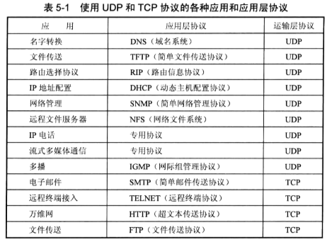

传输层和应用层的关系

（端口复用）

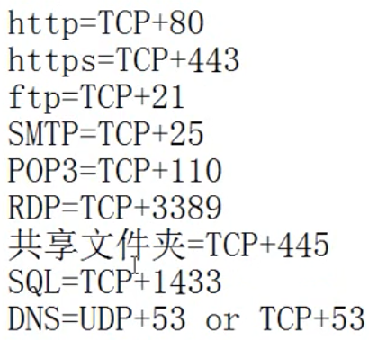

应用层协议和服务之间的关系

服务运行后在TCP或UDP某个端口侦听客户端请求


## 运输层概述

运输层协议由**端系统**实现，数据载体（运输层分组）称为<span style="color:red">运输层报文段（segment）</span>

- 与网络层的关系
  - **运输层为不同主机的进程提供了逻辑通信，网络层为不同主机提供了逻辑通信**

- UDP 用户数据报协议
  - 一种不可靠、无连接的协议
  - 将使用了UDP协议的运输层报文段称为数据报（与网络层分组的名称相同）
- TCP 传输控制协议
  - 一种可靠、面向连接的协议
  - 将使用了TCP协议的运输层分组称为报文段
- **运输层的多路复用** 和 **运输层的多路分解**
  - 运输层协议是将网络层协议从主机间通信扩展为进程间通信
  - 多路分解是指运输层通过端口，将从网络层接收到的数据报拆分解析，并将报文段的数据传输到不同的端口（进程）
  - 多路复用是指运输层从不同的端口（进程）收集应用层数据分组，将其封装成报文段并通过网络层统一向目的主机传输
- **可靠传输**和**不可靠传输**
  - 可靠传输通过流量控制、序号、确认和定时器等技术实现

## 多路复用 和 多路分解

### 多路分解

将运输层报文段中的数据交付到正确的套接字的工作称为多路分解

### 多路复用

从源主机不同的套接字中收集数据块，并为每个数据块封装上首部消息从而生成报文段，然后将报文段传递到网络层的工作称为多路复用

### 工作机理

- 套接字有唯一标识符（UDP的二元组或者TCP的四元组）
- 每个报文段有特殊字段来指示该报文段所要交付的套接字
  - 这些特殊字段是**源端口号字段** 和 **目的端口号字段**

#### 无连接的多路复用与多路分解

以多路分解为例

<span style="color:red">一个UDP**套接字**由一个包含了**目的IP地址和目的端口号** 的二元组标识的</span>

主机上的每个套接字被分配了一个端口号，当报文到达主机时，运输层检查报文段中的目的端口号，并将其**定向到相应的套接字**。然后报文段中的数据通过套接字进入其所连接的进程


#### 面向连接的多路复用与多路分解

以多路分解为例

<span style="color:red">一个TCP**套接字**由一个包含了**源IP地址、源端口号和目的IP地址、目的端口号** 的四元组标识的</span>。两个具有不同的源IP地址和源端口号的TCP报文将被定向到不同的套接字（建立连接的体现）

##### TCP建立连接

- TCP服务器应用程序有一个welcome socket，在6789号端口号等待TCP客户机的连接建立请求（应用层中提过的欢迎套接字）
- 一个TCP连接请求只不过是一个目的端口为6789，对TCP首部的特定连接建立位置位的报文段（包含源端口号）。
- 报文段被分配进6789端口，相应进程进行处理，并创建套接字，并通过四元组标识

## TCP 传输控制协议

流量控制、建立会话（netstat -n）、可靠传输、编号、分段。在web中获取web对象时会建立并行连接

- **TCP是面向连接的传输层协议**。也就是需要建立连接，维护连接状态
  - 可以进行拥塞控制
  - 可以进行流量控制
  - 所以提供可靠交互，保证数据的不丢失、不重复、无差错，且有序。
  - 可以双工通信（因为TCP有连接的概念，所以是由单双工的概念，UDP没有连接，所以没有双工的概念）
  - 每一条TCP只能是点对点通信
- **面向字节流**。TCP将上层或者下层数据看成没有结构的字节流。只是依照顺序将其发送或者接收
- 开销较大，头部有20个固定字节

主要解决三个问题

- TCP如何实现可靠传输
- TCP如何实现流量控制
- TCP如何避免网络拥塞


### 可靠数据传输的原理

TCP是建立在不可靠数据传输协议（IP协议）上层的协议

以下表述中rdt表示可靠数据传输，udt表示不可靠数据传输

#### 一个可靠数据传输协议的诞生

- 完全可靠信道上的数据传输，rdt1.0

  - 完全可靠信道指信道具有以下特点：

    1）**传输信道不产生差错**；

    2）**不管发送方以多块的速度发送数据，接收方总是来得及处理收到的数据**。

  - 状态机：

    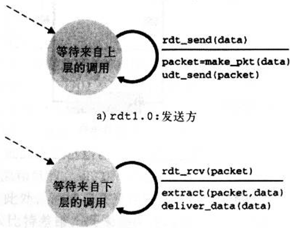

- 具有比特差错信道上的数据传输，rdt2.0（也称为停等协议）

  - 自动重传请求（ARQ，Automatic Repeat reQuest）协议

    - 差错检测。接收方需要对接收到的数据进行差错检测，以确定数据传输过程中是否出现错误。
    - 接收方反馈。接收方需要将差错检测的结果（肯定确认 ACK，否定确认 NAK）反馈给发送方。
    - 重传。发送方接收到了否定确认时，需要重传该分组（这里显然是同步传输，确认一个，发送下一个，所以称为**停等协议**）。

  - ARQ协议的一个问题在于反馈出错怎么办

    - 发送方收到出错的反馈，请求重传（如此死循环）
    - 增加足够的检验和比特，这样就能够直接解决问题（如果不丢失分组）
    - 直接重发。但是引入了冗余分组，接收方不知道是重传还是一个新分组

  - 状态机

    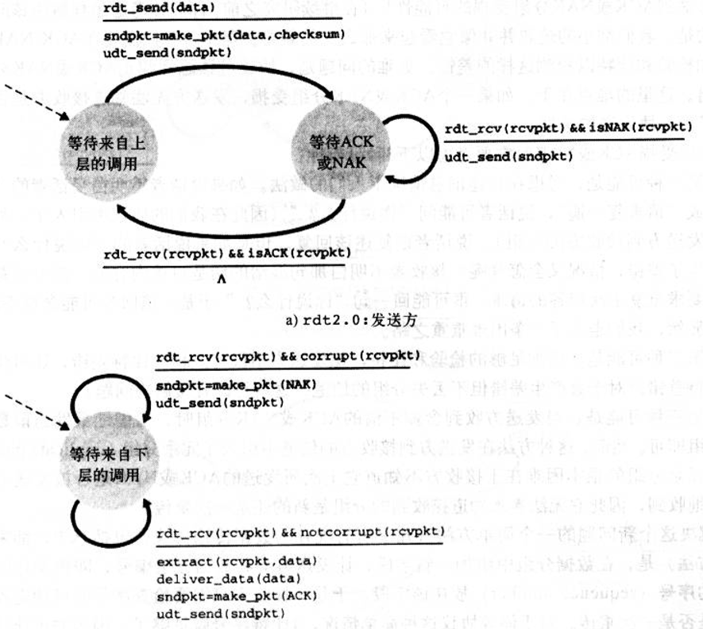

- **具有比特差错**信道上的数据传输，rdt2.1

  为了解决反馈出错问题，采用第三种，直接重发的方式。此时通过发送方将分组编号，接收方判断序号来确定是否是重传分组。**增加了序号**

  - 通过发送对应序号的反馈，让发送方判断是否直接重发

    - 顺序肯定确认：发送方传输下一个分组
    - 否定确认：发送方重传当前分组
    - 失序确认：发送方接收到不是当前等待确认反馈的分组的确认反馈，重发当前分组

  - 可以看到，当接受放接收到差错分组，可以再一次确认上一次的分组，从而实现重发当前分组，这时就实现了无NAK的可靠数据传输协议rdt2.2（发送方接收到冗余ACK，重发当前分组）

  - 状态机

    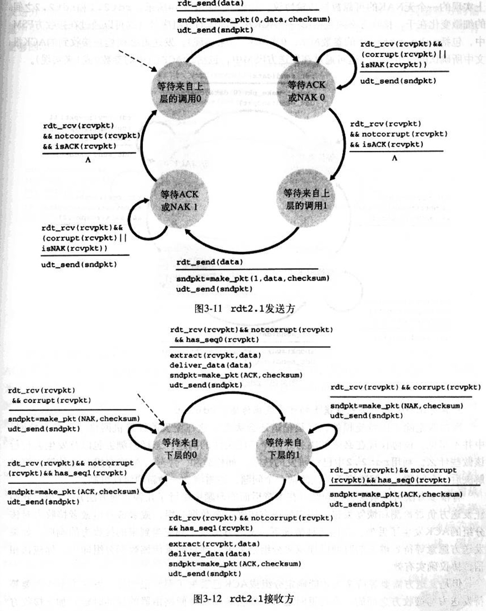

- **具有比特差错**的**丢包**信道上的可靠数据传输，rdt3.0

  具有比特差错的可靠数据传输以上已经实现，如果信道丢包，如何实现可靠传输

  - 定时重发（通过序号解决冗余分组问题）

  - 所以，为了实现一个可靠数据传输，需要以下技术：**检验和、序号、定时器、确认反馈**

  - 状态机

    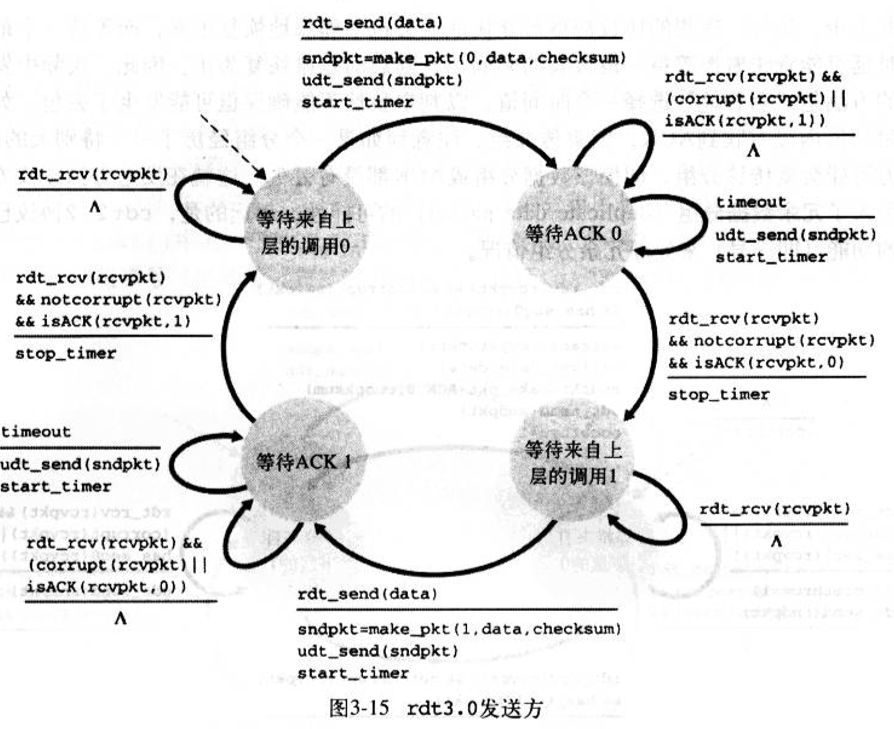

#### 流水线可靠传输

以上介绍了一种可靠数据传输协议的必要技术，但是，最后的结果（rdt3.0）并不是完美的，因为其核心，是一个**停等协议（同步的）**，网络利用率较低

为了解决问题，使用流水线技术，流水线技术要求：

- 增加序号范围（每个分组必须有唯一的信号）
- 发送方必须缓存已发送，但未被确认接收的分组，接受方需要缓存已被接收但是乱序的分组
- 流水线可靠传输解决丢包损坏或者过度延时的两个基本方法
  - 回退N步
  - 选择重传

##### 回退N步（GBN），通常被称为滑动窗口协议

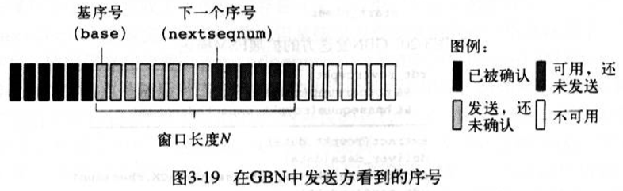

窗口长度N的意义在于TCP的拥塞控制。

- GBN的发送方的事件响应
  - **上层的调用**。当上层发送数据包时，发送方需要检查发送窗口是否已满（已存在N个未被确认的分组），并将结果反馈给上层
  - **收到ACK**。在GBN中，对序号n的分组的确认采取<span style="color:red">**累积确认**</span>的方式，表明接收方已正确接收到序号n以前的所有分组。如果收到**冗余的ACK**（这意味着失序或损坏），重传[base,nextseqnum)部分的分组
  - **超时事件**。如果出现超时，发送方将重传[base,nextseqnum)部分的分组
    - 定时器动作：全部确认后，定时器停止；当接收到确认信号时，如果仍存在已发送但未被确认的分组，定时器重置
- GBN接收方动作
  - 按序接收分组并交付上层，如果失序，或者其他情况（比特差错），丢弃分组，发送上传一次的ACK（冗余ACK）
  - 接收方不缓存正确但失序的分组
- 发送方是冗余ACK时重传，接收方是失序、损坏等情况发送冗余ACK

##### 选择重传（SR）

GBN的问题在于，当窗口较大时，前面的分组差错将会引起大量的重传操作。

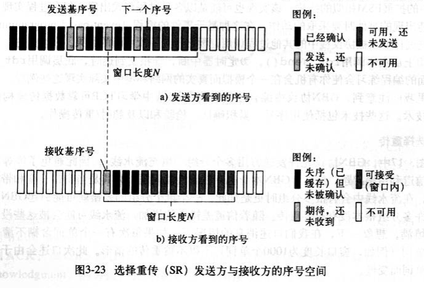

- SR发送方动作
  - **从上层收到数据**。从上层收到数据后，发送方需要检查发送窗口是否已满（已存在N个未被确认的分组），并将结果反馈给上层
  - **超时**。设置定时器，与GBN不同的是，现在每个分组有自己的逻辑定时器
  - **收到ACK**。如果收到ACK且分组在窗口内，则被标记为已接收，更新基序号到第一个未被确认的分组，发送窗口内未被发送的分组（假如窗口移动了）
- SR接收方动作
  - **窗口内分组被正确接收**。发送收到的分组对应的ACK，如果失序，则缓存；如果没有失序，则以此为起点交付窗口内所有的连续分组，并更新窗口；
  - **窗口之前的分组被正确接收**。可能出现这种情况的情景：ACK丢失或网络拥堵，导致发送方超时重传。此时必须要再次发送ACK，否则发送方窗口无法更新
  - 其他情况都忽略分组


### 面向连接的TCP

TCP协议在通信之前必须先建立通信（握手），并初始化一些**变量**

- 端系统的缓存大小
- 端系统的进程连接套接字

TCP数据报中的应用层数据长度需要根据最大报文段长MSS（只有数据部分，不包括首部）来设置，MSS根据以太网数据帧长度（最大传输单元MTU，同样不包括以太网协议首部，只有上层协议，即数据部分）来设置.并在建立连接时完成协商

#### 报文结构

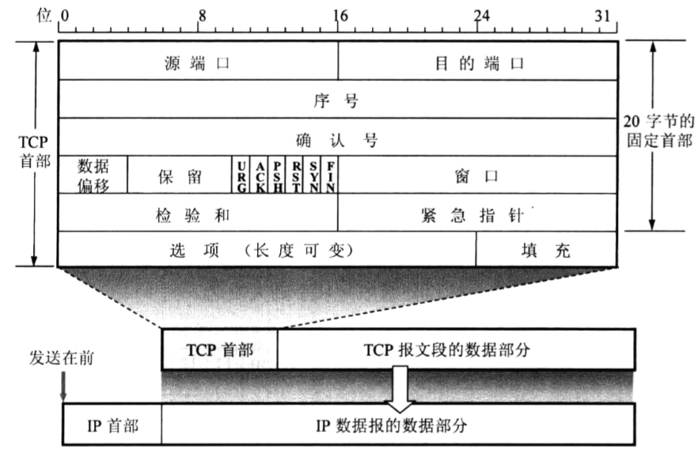

**多路复用/分解技术实现**

- 源端口
- 目的端口

**可靠传输技术实现**

- 序号：TCP 将数据看成一个无结构但有序的字节流。报文段序号是该报文段首字节的字节流编号。报文段的第一个序号是双方在建立连接时商议产生的，一般是该端口的上一次通信结束的序号加1.
- 确认号：因为TCP是双工通信。发送方在发送数据时，也从接收方接受数据。确认号是发送方期望从接收方接收到的下一个字节的序号，被封装在本身要传递的数据的分组的确认号内（这种确认被称为捎带）。另外，<span style="color:red">**TCP是累积确认**</span>，即确认号为N，则表示N-1及之前的数据均已收到。**但是TCP并未规定收到失序分组如何处理（GBN OR SR），由编程人员处理**。
- 检验和

其他

- 接收窗口：用于流量控制，指示接收方愿意接收的字节数量
- 首部长度（数据偏移）：因为TCP首部长度可变，所以设置偏移量来标识应用层数据的起始位置
- ACK：确认号中的值是有效的
- RST、SYN、FIN：建立、断开连接时的标志位
- URG：标志该报文段中存在被发送方应用层标志为紧急的数据，具体的数据内容由**紧急指针**指示（指示的是最后一个字节）
- PSH：指示接收方立刻将数据交给上层

#### 一些可靠数据传输的特殊的情况

- 超时间隔
  - 由网络拥堵造成的超时，如果此时还是不断重传就会加剧网络拥堵，所以可以根据算法加大超时间隔
- 快速重传
  - 如果不是因为网络拥堵造成的超时，如何判断？因为是流水线方式，所以如果不断接收到冗余ACK（因为TCP没有显式的NAK）就表示接收端失序了，有前面的分组损坏了，**如果连续接收到3个冗余ACK（注意是一个初始ACK，后接三个重复的ACK），就执行快速重传**
- **GBN OR SR**
  - 虽然TCP是累积确认，但是它与GBN的区别在于，许多TCP实现会在接收端将失序分组缓存起来。GBN会重传所有分组，而TCP只会重传第一个未被确认的分组（考虑下，如果后面已被接收缓存，那么重传首个分组就可以解决问题，如果还有未被确认的会继续重传，也就是失序时用多次重传来解决一次重传多个的问题）。
  - **TCP的修改——选择确认（selective acknowledgment）（RFC标准提供的建议）**：也就是不采用累计确认机制。所以TCP是GBN和选择重传协议的混合体

#### TCP的流量控制

TCP为上层提供了**流量控制服务**（可以说是一个速度匹配服务），和**拥塞控制**一样都是对发送方的遏制。但是两者是针对不同情况的。

- 接收缓存。在建立连接的时候，双方会约定一个存在在接收端的一个接收缓存
- 接收窗口。在建立连接的时候，双方会约定一个存在在接收端的一个接收窗口，用于告知发送方还有多少缓存空间。一开始接收缓存=接收窗口，如果接收窗口为0 ，发送端仍然会发送1字节的无效数据报，主要目的就是为了获取接收窗口大小（因为只有有数据或者需要反馈确认时才发送分组，所以可能需要发送方不断询问）

#### RED 随机早期检测

该检测是基于一个事实，即网络数据的突发性特点，来提前进行数据分组的淘汰策略，从而避免了一旦路由器缓存满时，后续的所有分组都将被淘汰的情况，（这种情况会导致大量的TCP连接进入慢启动状态）这种情况即全局同步

#### TCP报文段的发送时机：

（1）TCP维持一个变量MSS，等于最大报文段的长度。只要缓冲区存放的数据达到MSS字节时，就组装成了一个TCP报文段发送出去

（2）由发送方的应用进程指明要发送的报文段，即：TCP支持推送操作

（3）发送方的一个计时器期限到了，这时就把当前已有的缓存数据装入报文段（但长度不能超过MSS）发送出去。

#### 效率问题

**Nagle算法**

是为了减少广域网的小分组数目，从而减小网络拥塞的出现；

实现规则

1. 如果包长度达到MSS，则允许发送；
2. 如果该包含有FIN，则允许发送；
3. 设置了TCP_NODELAY选项，则允许发送；
4. 未设置TCP_CORK选项时，若所有发出去的小数据包（包长度小于MSS）均被确认，则允许发送；
5. 上述条件都未满足，但发生了超时（一般为200ms），则立即发送。

该算法要求一个tcp连接上最多只能有一个未被确认的未完成的小分组，在该分组ack到达之前不能发送其他的小分组，tcp需要收集这些少量的分组，并在ack到来时以一个分组的方式发送出去；其中小分组的定义是小于MSS的任何分组；

该算法的优越之处在于它是自适应的，确认到达的越快，数据也就发哦送的越快；而在希望减少微小分组数目的低速广域网上，则会发送更少的分组；

**延迟确认**

接收方收到数据包以后如果暂时没有数据要发给对端，它可以等一段时再确认（Linux上默认是40ms）。如果这段时间刚好有数据要传给对端，Ack就随着数据传输，而不需要单独发送一次Ack。如果超过时间还没有数据要发送，也发送Ack，避免对端以为丢包。

**糊涂窗口**

https://blog.csdn.net/wdscq1234/article/details/52463952

对于接收端有三种方法实现，不通知窗口变化，延迟ACK，累积ACK，后面两种不好

.jpeg)

#### TCP连接建立（3次挥手）

假设客户机C，服务器S，其连接建立过程如下

- 第一步：C发送请求报文段（也称为**SYN报文段**），该报文段没有应用层数据，但是**SYN标志位有效**（置1），同时会有一个客户机自己确定的**起始序号（client_isn）**放在序号字段中。传递给下层以发送至S。此时C进入SYN_SENT状态
- 第二步：SYN报文段到达S，S为该TCP连接**分配TCP缓存和相关变量**。并发回允许连接的报文段（**SYNACK报文段**），该报文段也不包含应用层数据，但是**SYN标志位有效**（置1），**确认号字段被置为client_isn+1**，确定S自己的**起始序号（server_isn）**并放在序号字段中。传递给下层发送给C，此时S进入SYN_RCVD状态
- 第三步：SYNACK报文段到达C，客户机为该连接设置缓存和变量。并反馈给S一个确认报文段，该报文段中SYN无效（置0），将server_isn+1 后放入确认号字段。序号为x+1（x+1之前的已经被确认）。此时C进入ESTABLISH状态，S收到确认信号后也进入ESTABLISH状态

PS:SYN为1 时，不允许携带数据（前两次握手），第三次可以携带数据，但是通常不携带数据

https://yq.aliyun.com/articles/15118

Q：为什么需要三次握手，而不是两次

A：

```
1:C ---> S    syn
2:C <--- S    ack
3:C <--- S    syn
4:C ---> S    ack
```

既要双方做好发送数据的准备工作(双方都知道彼此已准备好)，也要允许双方就初始序列号进行协商，这个序列号在握手过程中被发送和确认。.<span style="color:red">**本质原因是为了让双方的序号都能够得到确认**</span>

Q：初始序号是必要的嘛？

A：是必要的如果没有初始序号，那么在中间握手过程中如果出现超时，产生请求重发时，可能会使两边的对应连接的变量缓存等混淆

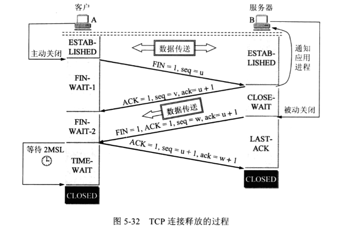

#### TCP连接断开（4次挥手）

- 客户端进程发出连接释放报文，并且停止发送数据。释放数据报文首部，**FIN=1**，其序列号为seq=u（等于前面已经传送过来的数据的最后一个字节的序号加1），此时，**客户端进入FIN-WAIT-1（终止等待1）状态**。 TCP规定，FIN报文段即使不携带数据，也要消耗一个序号。
- 服务器收到连接释放报文，发出确认报文，ACK=1，ack=u+1，并且带上自己的序列号seq=v，此时，服务端就进入了**CLOSE-WAIT**（关闭等待）状态。TCP服务器通知高层的应用进程，客户端向服务器的方向就释放了，这时候处于半关闭状态，即客户端已经没有数据要发送了，但是服务器若发送数据，客户端依然要接受（这也就是第二、第三次挥手不能像握手时一样合并成一次）。这个状态还要持续一段时间，也就是整个**CLOSE-WAIT状态**持续的时间。
- 客户端收到服务器的确认请求后，此时，客户端就进入**FIN-WAIT-2**（终止等待2）状态，等待服务器发送连接释放报文（在这之前还需要接受服务器发送的最后的数据）。
- 服务器将最后的数据发送完毕后，就向客户端发送连接释放报文，FIN=1，ack=u+1，由于在半关闭状态，服务器很可能又发送了一些数据，假定此时的序列号为seq=w，此时，服务器就进入了**LAST-ACK**（最后确认）状态，等待客户端的确认。
- 客户端收到服务器的连接释放报文后，必须发出确认，ACK=1，ack=w+1，而自己的序列号是seq=u+1，此时，客户端就进入了**TIME_WAIT**状态**（这个状态是防止ACK未被服务器接收，需要重发的情况）**。注意此时TCP连接还没有释放，必须经过**2∗MSL（最长报文段寿命）**的时间后，当客户端撤销相应的TCB后，才进入CLOSED状态。
- 服务器只要收到了客户端发出的确认，立即进入CLOSED状态。同样，撤销TCB后，就结束了这次的TCP连接。可以看到，服务器结束TCP连接的时间要比客户端早一些。


#### TCP拥塞控制

TCP必须要提供<span style="color:red">端到端的拥塞控制</span>（端到端是因为网络层不向上层提供显式的网络拥塞反馈）。

TCP采取的方法是——让**发送方**根据感知到的网络拥塞情况来限制自身向连接发送流量的速率。

- Q1:发送方如何限制自己向连接发送流量
- Q2:发送方如何感知他与接收方之间的网络拥堵情况
- Q3:当感知到网络拥塞时，采用什么算法来限制自己的发送速率

##### Q1

运行在**发送方**的TCP连接控制（接收缓存、发送缓存，普通变量）等变量外，还控制一个**拥塞窗口（cwnd）**。**任何一个发送方中未被确认字节数不能大于接收缓存和拥塞窗口中的较小值**。该方法限制了未被确认的字节数，间接限制了发送的字节数。

##### Q2

如果发生丢包事件，必然是网络拥堵，路由器缓存溢出导致的，如果是超时引起的重传，就是网络拥堵

如果产生冗余ACK（考虑3次冗余ACK的快速重传机制），意味着不是网络拥堵造成的丢包，所以适用快速重传机制。

假如网络没有拥塞，如果ACK报文到达时延较大（可能是因为网络中有高时延路径或者是低带宽链路），那么拥塞窗口的增长速度较慢，反之较快

##### Q3

如果算法不够完美，就会出现带宽没有充分利用或者拥塞问题没有解决的问题。这个算法有几个指导性的原则：

- 一个丢失的报文段意味着拥塞，因此当丢失报文段时应该降低TCP发送方的速率。
- 一个确认报文段指示该网络正在向接受方交付发送方的报文段，因此，当对先前未确认报文段的ACK到达时，能够增加发送方的速率。
- ***** 带宽探测。TCP发送方会在接受到ACK时不断增加发送速率（得寸进尺），直到发生丢包事件，就后退；稳定之后再循环。

##### **<span style="color:red">TCP拥塞控制算法</span>**

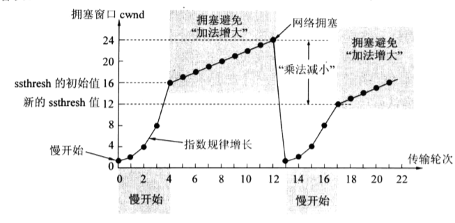

① 慢启动（TCP强制）

当TCP连接开始时，进入慢启动状态，cwnd的值通常设置为一个MSS（max segment size，指有效的应用数据）的较小值。那么发送速率为MSS/RTT。慢启动状态下，接收到第一个ACK后，cwnd增加为2 * MSS（翻倍），当接下来发送的两个报文的ACK到达后，cwnd增加为4 * MSS。所以，如果顺利，接下来cwnd会以指数型增长。

何时退出慢启动状态？有三种情况

- 当前cwnd出现丢包，记录慢启动状态阈值ssthresh=cwnd/2，然后cwnd被重新设置为1 * MSS，**重新进入慢启动状态**
- 当慢启动状态cwnd再次到达或者超过ssthresh时，退出慢启动状态，进入**拥塞避免状态**
- 如果出现三个冗余ACK，那么进行快速重传，ssthresh减半，TCP在ssthresh处连接进入**快速回复状态**

② 拥塞避免（TCP强制）

拥塞避免是进入慢速增加cwnd，将cwnd的增速从慢启动时的指数增加，改变成线性增加。（每收到ACK，cwnd就增加MSS * MSS / cwnd 个字节）

何时退出拥塞避免状态？

- 当出现超时丢包时，ssthresh被设置为cwnd的一半，同时记录之，将cwnd设置为1* MSS，并**进入慢启动状态**

- 当出现三次冗余ACK指示的丢包时，cwnd会加上3个MSS之后再减半，此时**进入快速回复状态。**（因为这时网络不一定是拥堵，还能发回3个冗余ACK，所以不进入慢启动状态）

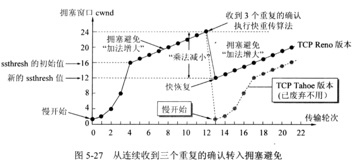

③ 快速重传


④ 快速回复（推荐，非强制）

也就是出现了冗余ACK的情况，此时将cwnd设置为ssthresh减半后的数值并进入拥塞避免状态


总结：由以上可以看出忽略TCP建立连接时慢启动状态，其算法可以归结为加性增，乘性减（Additive-Increase,Multiplicative-Decrease，AIMD控制算法），分别对应了拥塞避免和快速回复两个状态

## UDP 用户数据报协议

一个数据包就能完成数据通信、不建立会话、多播

### 特点

- **UDP是无连接的**。无需建立连接和维护连接状态。也就没有了建立连接的时延。无连接状态。TCP需要在端系统中维护连接状态（包括了接收和发送缓存，拥塞控制参数、序号与确认号参数）。
  - UDP没有拥塞控制功能，所以网络拥塞不会降低其发送速率，某种意义上延迟较小
  - UDP没有流量控制功能，如果发送速率太快，那么溢出缓存的报文段将被抛弃
  - UDP不保证可靠交付
  - 没有单工双工的概念
  - **可以一对一，一对多，多对多**
- **UDP面向报文**，也就是对应用层数据既不合并，也不拆分，直接封装发送
- 分组首部开销小，只有8个字节，TCP有20字节的固定头部

### 首部格式

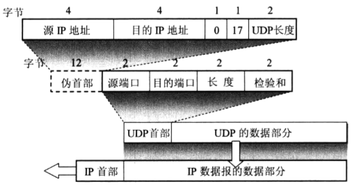

UDP**首部**有八个字节

- 源端口：源端口号。需在需要对方的回信时选用，不需要时可用0
- 目的端口：目的点口号。这在重点交付报文时必须要使用
- 长度：UDP用户数据报的长度，最小值是8（Byte，仅有首部）
- 检验和：检验UDP用户数据包在传输中是否有错误，错误就丢弃

**伪首部是在计算检验和的时候添加的**

UDP没有流量控制，如果发送端发的过快，接收端缓存溢出，那么后来的分组都被丢弃