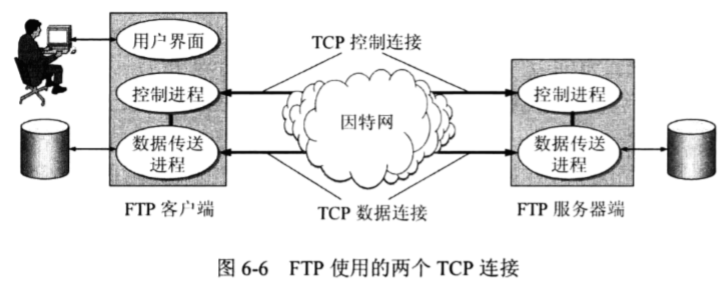
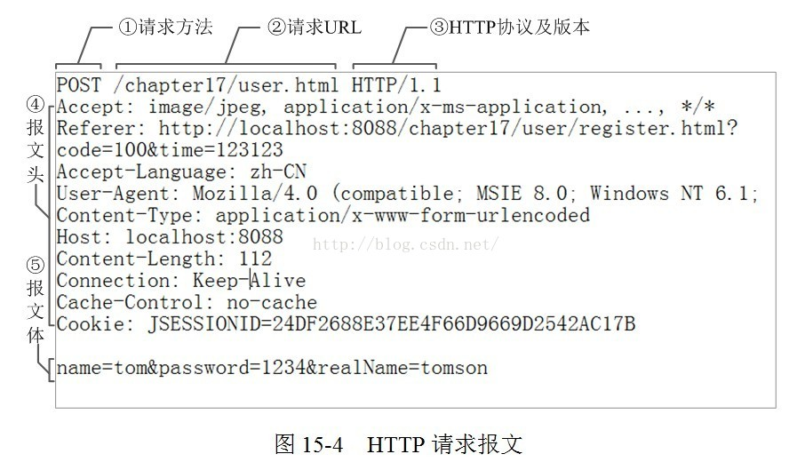

# 应用层


**应用层有多种协议**：文件传输协议FTP、域名系统DNS、远程终端TELNET（TErminalNET）、远程桌面RDP、动态主机配置协议DHCP、SSH（SafeSHell）、电子邮件协议SMTP,POP3,IMAP、万维网WWW（也就是HTTP、HTTPS）

相当于每一个应用层协议都对应了一个服务


## 套接字编程

### 概念

套接字（socket）是一个抽象层，应用程序可以通过它发送或接收数据，可对其进行像对文件一样的打开、读写和关闭等操作。套接字允许应用程序将I/O插入到网络中，并与网络中的其他应用程序进行通信。网络套接字是IP地址与端口的组合

RFC793的定义：端口号拼接到IP地址就构成了套接字。所谓套接字，实际上是一个通信端点，每个套接字都有一个套接字序号，包括主机的IP地址与一个16位的主机端口号，即形如（主机IP地址：端口号）

### TCP套接字

#### 工作机理

客户机：C   服务器：S

当S中进程运行时，C通过创建一个套接字向S发起连接，该套接字的目标地址为\<S的IP:进程的Port>。完成套接字创建后，C和S会进行TCP的连接建立，即三次握手，同时创建一个TCP连接。这个三次握手发生在传输层，对应用层来说是透明（不可见）的

在三次握手期间，实际上C的套接字首先与S上的欢迎套接字（也就相当于所有连接请求的统一的入口）进行通信，通信过程中S创建一个新的套接字以传输该连接请求之后的数据，这个新的套接字称为**连接套接字**（实际上，欢迎套接字和连接套接字使用的是同一个端口号）


TCP协议在TCP套接字之间提供可靠字节流服务

#### Java实现套接字编程


就是对流的编程


C：


S:


### UDP套接字


## 域名系统服务（Domain Name System）

### DNS服务概述

计算机在访问网站的 时候，需要将域名转换成具体的IP地址。**DNS服务器**需要将域名解析成IP地址。

除了进行主机名到IP地址的转换之外，DNS还提供另外的一些服务

- 主机别名
- 邮件服务器别名
- 负载分配（load distribution 在多个目标服务器之间协调）

DNS协议运行在UDP协议之上，使用53号端口，通常被其他协议（HTTP，FTP协议）所使用。

> #### 什么是域名
>
> 尽管IP地址能够唯一地标记网络上的计算机，但IP地址是一长串数字，不直观，而且用户记忆十分不方便，于是人们又发明了另一套字符型的地址方案，即所谓的域名地址。IP地址和域名是一一对应的，这份域名地址的信息存放在一个叫域名服务器(DNS，Domain name server)的主机内，使用者只需了解易记的域名地址，其对应转换工作就留给了域名服务器。域名服务器就是提供IP地址和域名之间的转换服务的服务器。
>
> 顶级域名：com edu net cn org gov ,代表了网站的性质
>
> 二级域名：baidu taobao alibaba ,代表了具体的一个应用，全球唯一
>
> 三级域名：dba
>
> 注：名称空间下可以有多个服务器，例如申请了hzf.com这个域名，那么可以使用www.hzf.com，ftp.hzf.com，email.hzf.com等。这涉及到了主机别名
>
> #### 域名解析测试
>
> WIndows下可以通过nslookup来查看DNS解析结果
>
> 有些有多个IP的网站是为了负载均衡，但是我电脑上只能解析出一两个，可能用了代理？
>
> #### 域名注册
>
> 可以通过域名注册网站注册域名


### 域DNS工作机理与域名解析

#### DNS服务器层次结构

DNS服务器是由多个服务器组成的，其中包括了一个**根DNS服务器**。，其下连接了多个不同的**顶级域名服务器**（com，net等）。不同的域名服务器解析对应的顶级域名的域名，且知道它们各自的根是谁；根DNS不负责域名解析，但是它知道什么域名应该分配给哪个DNS服务器解析。


- 根DNS服务器（不止一个根DNS服务器）
- 顶级域（TLD）服务器
- 权威服务器
- 本地DNS服务器
  - 本地DNS服务器并不属于DNS服务器层次结构，每个ISP都有一台本地DNS服务器。主要起着代理的作用，将解析请求转发到DNS服务器层次结构中。

DNS是一个典型的分布式数据库

#### 解析过程

当主机向指定的DNS服务器请求域名解析时，主机通过53号端口向本地DNS服务器发送请求，如果在本地DNS服务器的缓存中存在对应的IP，那么应答。如果该域名正好对应了所请求的DNS服务器，那么直接返回解析结果，如果该域名并不对应DNS服务器，那么可以通过两种解析请求算法（**迭代请求**，**递归请求**)来进行域名解析。下图中1和8是递归查询，234567是迭代查询。也就是说，通常，从请求主机到本地DNS服务器的查询时递归的，其余查询时迭代的。


#### DNS缓存

原理：在请求链中，当一个DNS服务器接收䘝DNS回答时，DNS服务器能将回答中的信息缓存在本地存储器，但不是永久缓存，通常设置为两天之后丢弃。

#### DNS记录

实现DNS分布式数据库的所有DNS服务器共同存储着资源记录（RR）。资源记录的格式

```
(Name,Value,Type,TTL)
```

其中Name，Value都取决于Type

- Type：
  - 值为A，则Name是主机名，Value是主机名的IP地址（直接的地址转换）
  - 值为NS，则Name是域，Value是知道如何获取该域中主机IP 地址的权威DNS服务器的主机名（间接的地址转换，地址转换的前几步）
  - 值为CNAME，则Value是别名为Name的主机对应的规范主机名（别名
  - 值为MX，则Value是别名为Name的邮件服务器的规范主机名（别名

举例：在自己的DNS服务器下添加A记录：


#### DNS报文

DNS只有两种报文，分别是查询报文和应答报文，两种报文有相同的格式


详解：<D:/DOCUMENT/自学笔记/计算机网络%20韩立刚/应用层.assets/DNS报文格式解析（非常详细）.html>


### 安装自己的DNS服务器

1、解析内网自己的域名

2、降低到Internet的域名解析流量

3、域环境

## DHCP 动态主机配置协议

计算机IP地址可以分为静态IP地址和动态IP地址

- 静态IP地址
  - 计算机位置比较固定（例如机房中的台式机、服务器等），可以将其IP地址设置为静态IP地址
- 动态IP地址
  - 计算机需要在不同的网段之间移动并联网（比如笔记本在不同的场所需要连接不同网段的互联网），就需要使用动态IP地址。如果多个移动设备在同一网段使用同一IP地址，那么就会产生冲突，所以可以由服务器同一分配。
  - 
  - 
- 这种自动获得地址分配的技术在通信上所使用的协议就是DHCP协议

DHCP运行在UDP协议之上

### DHCP主要作用

> 协议配置
>
> 计算机通过协议软件来配置

DHCP动态主机配置协议提供了一种机制称为**即插即用（plug and play networking）**。该机制允许计算机在加入网络时才被确定其IP地址，且不需要手工参与。

### DHCP运行机理


#### 广播与应答

DHCP使用客户-服务器(C/S)模式，需要IP地址的主机在启动时就向DHCP服务器**广播发送**<span style="color:red">发现报文（DHCPDISCOVER）</span>（该报文将目的IP地址设置为1，即255.255.255.255，源地址设置为0），此时主机成为DHCP客户，广播发送是因为不知道DHCP服务器的IP地址。这样，在本地网络上的所有主机都能够接收到这个广播报文，但是只有DHCP服务器才能够应答。

DHCP服务器应答时会先搜索其数据库中该计算机的配置信息，如果有，那么返回该配置信息，如果没有，那么在地址池中取一个地址分配给该计算机。该回答报文叫做<span style="color:red">提供报文（DHCPOFFER）</span>

获得地址分配的主机发送一个请求报文（DHCPREQUEST）表示接受分配的IP，DHCP服务器返回一个应答报文（DHCPACK）表示已经成为绑定状态，并规定了租用期，主机可以在这段时间内使用该IP地址。后续主机发送的的DHCPREQUEST是为了更新租用期

#### 中继代理的单播

通常不是每一个网络有设置一个DHCP服务器，所以通常每一个网络至少有一个**DHCP中继代理（通常是一台路由器）**，该代理配置了DHCP服务器的IP地址，当寻求发现报文传送到该代理时，就会以单播的形式传送到DHCP服务器并等待应答。（跨网段分配IP地址）


### 一些配置

在cmd中可以通过ipconfig /all查看详细的网络信息，包括DHCP服务器即租约等。可以通过IPconfig  /release来释放租约


## FTP文件传输协议

在早期，文件传输占因特网通信量的三分之一，使用的就是FTP协议

该协议提供**交互式（区别于TFTP）**的访问，允许客户指明文件的类型与格式，允许文件具有存取权限。

与数据库的区别在于，数据库是一个独立的应用，FTP协议是操作系统直接对远地共享文件进行访问的服务，如同对本地文件的访问一样。同样文件传输协议也不是远程桌面协议，在建立FTP服务器时，会指定客户端所访问的文件夹

FTP主要功能是减少或消除在不同操作系统下处理文件的不兼容性

- 基于TCP的FTP协议
- 基于UDP的FTP协议

### FTP运行机理



FTP使用客户-服务器(C/S)模式。一个FTP服务器进程可同时为多个客户进程提供服务。FTP的服务器进程由两大部分组成：一个朱金城，负责接收新的请求；另外所有若干个丛书进程，负责处理单个请求.

另外FTP会保留用户的状态信息，跟踪用户在远程目录树上的位置，区别于Http

#### 工作过程

(1) 打开标准端口21,接收控制请求

(2) 启动从属进程(控制进程和数据传输进程)来处理进程发送的请求.

(3) 回到等待状态

#### 连接方式

每次数据传输都会在客户端和服务器端建立一对连接，分别为控制连接和数据连接

因为控制指令和数据分开，所以也是带外传送的（out-of-band)

- 控制连接（TCP连接）
  - 使用端口21，用于发送FTP命令信息（拷贝剪切等）
- 数据连接（TCP连接）
  - 使用端口20，用于数据的实际上传、下载
  - 实际上，数据连接有两种类型，分别是主动模式和被动模式
    - 主动模式下，在传输数据时，服务端从20端口主动向客户端发起连接
    - 被动模式下，在传输数据时，服务端在指定范围内的某个端口被动等待客户端发起连接（监听）
    - 如果，防火墙只开放了21端口和20端口，那么就必须使用主动连接来传输数据，被动连接无效

#### 传输模式

- 文本模式：ASCII模式，以文本序列传输数据
- 二进制模式：Binary模式，以二进制序列传输数据


#### 升级版的FTP

对于使用FTP修改文件，只能是先下载文件，然后修改，然后再上传，此时可以使用NFS协议，NFS可以远程打开文件并修改，在数据链路上传输的仅仅是修改的数据。

但是NFS是基于UDP/IP的，FTP是基于TCP/IP的

### 基于UDP的TFTP

简单文件传输协议TFTP是基于UDP的传输协议,也是用客户-服务器模式。该协议只支持文件的传输不支持交互


## TELNET远程终端协议

TELNET是一个简单的远程终端协议，基于TCP的应用层协议。用户使用该协议可以远程的注册（登录）到另一个主机上（使用主机名和IP地址）。可以将本地操作传输到远程主机上，同时将响应传回本地主机。

TELNET可以适应多操作系统的差异，例如不同系统的换行符 等

### TELNET运行机理

TELNET使用客户端-服务器方式。通过网络虚拟终端（NVT，NetWork Virtual Terminal）进行数据传输。客户端将本地数据和命令转换成NVT格式，服务器端将NVT格式转换成对应操作系统的相应的命令、所以NVT就像一个中介，称为虚拟终端

## RDP远程桌面协议

## HTTP超文本传输协议

### web简介

#### WEB页面

WEB页面也叫文档，是由对象组成的。对象就相当于文件，HTML文件，JEPG文件等都是对象。

WEB对象通常存储在WEB服务器中，供客户端进行访问，所有对象都由URL寻址定位。

#### URL

##### 格式

<协议>://<主机>:<端口>/<路径>

### HTTP

- Http是使用的客户端-服务器方式，是基于TCP的应用层协议

- 当客户端和服务器建立TCP连接之后，应用层就可以通过套接字访问TCP连接，发送Http请求报文和接收报文
- 服务器在于客户端交互过程中并不存储关于客户机的状态信息（区别于FTP）。所以Http是一个**无状态协议**
- Http可以使用持久连接也可以使用非持久连接，Http默认使用的是流水线方式的持久连接（注意这里说的是传输层的连接，也就是TCP，而不是应用层，Http的连接）。另外Http协议本身是无连接的，也就是说在交换Http报文之前不需要建立应用层连接

#### 非持久连接和持久连接

- 非持久连接：当运行于TCP之上时，每个客户机和服务器交互的请求/响应对是经一个单独的TCP连接发送

  - 假设客户端向服务器端请求一个含有多个对象的WEB页面，WEB页面URL为weburl

    （1）客户端向该域名所对应的IP地址主机的80端口发起访问请求，建立TCP连接

    （2）客户端经套接字向TCP连接发送一个Http请求报文，该报文中包含了需要请求访问的WEB页面路径weburl

    （3）Http服务器经套接字接收该请求报文，并根据URL检索出WEB页面，在一个Http响应报文中封装该页面对象（HTML页面，其中的图片对象等此时还是一个URL字符串）

    （4）发送成功后，Http服务器进程通知该TCP连接断开。服务器端接收到客户端确认接收的信号，才会真正断开TCP连接（四次挥手）

    （5）Http客户端进程接收响应报文，TCP连接关闭。浏览器解析HTML文件，获得其他内置对象的URL

    （6）为了获得WEB页面中其他对象，再次重复上面步骤（有10个URL，可以串行获取，也可以并行建立TCP连接获取）

  - 可见每个TCP连接都只传输一个请求报文和一个响应报文

  - 往返时间（RTT，Round-Trip Time）

    - 

- 持久连接：当运行于TCP之上时，一系列客户机和服务器交互的请求/响应对是经一个相同的TCP连接发送

  - 区别于非持久连接，持久连接方式可以长时间不断开TCP连接，直到超过一个可配置的超时间隔的时间，才会断开

#### HTTP 报文格式

详见https://baijiahao.baidu.com/s?id=1662842929861521073&wfr=spider&for=pc

以及<D:\DOCUMENT\自学笔记\圣思园javaweb\3-HTTP深度剖析.md>

HTTP消息由客户端到服务器的请求和服务器到客户端的响应组成。请求消息和响应消息都是由开始行（请求行/响应行），消息报头，空行和消息正文（请求正文/响应正文）组成

##### 请求报文




- 

##### 响应报文


状态代码由三位数字组成，第一个数字定义了响应的类别，且有五种可能取值。

- 1xx：指示信息--表示请求已接收，继续处理。
- 2xx：成功--表示请求已被成功接收、理解、接受。
- 3xx：重定向--要完成请求必须进行更进一步的操作。
- 4xx：客户端错误--请求有语法错误或请求无法实现。
- 5xx：服务器端错误--服务器未能实现合法的请求。

常见状态代码、状态短语和状态描述的说明如下。

- 200 OK：客户端请求成功。
- 400 Bad Request：客户端请求有语法错误，不能被服务器所理解。
- 401 Unauthorized：请求未经授权，这个状态代码必须和WWW-Authenticate报头域一起使用。
- 403 Forbidden：服务器收到请求，但是拒绝提供服务。
- 404 Not Found：请求资源不存在，举个例子：输入了错误的URL。
- 500 Internal Server Error：服务器发生不可预期的错误。
- 503 Server Unavailable：服务器当前不能处理客户端的请求，一段时间后可能恢复正常，举个例子：HTTP/1.1 200 OK（CRLF）。

#### Cookie

由于Http是无状态的，客户端的状态信息传递，Http通过Cookie来完成

在用户端系统中有一个Cookie文件（浏览器保存）；在服务器端也有一个数据库保存Cookie；在请求报文和响应报文的请求头、响应头中，有一个Cookie的头部字段，用于客户端和服务器的Cookie信息的交互

##### 工作过程


#### Web缓存（代理）

Web缓存（Web Cache）也叫代理服务器（Proxy Server），就像Ngix那样子，它有自己的磁盘存储空间

##### 主要用途

1、节省内网访问Internet的带宽

2、绕过防火墙（一些VPN）

3、避免跟踪

##### 工作过程

1）客户端向Web缓存建立TCP连接并发送Http请求

2）Web缓存查看本地是否存在所请求的内容，存在的话就返回，没有存在就与初始服务器建立TCP连接并发送Http请求

3）当服务器发送所请求的内容之后，Web缓存会在本地存储一份，以供后续访问

所以Web缓存的工作方式使其又是客户端，又是服务器

#### 条件GET方法

##### 什么是条件GET方法

请求报文中请求方法是GET，请求头中包含一个`If-modified-since:`，那么就是条件GET

##### 做什么用

是为了让Web缓存证实自己保存的对象是最新的，也就是说是由Web缓存发送给服务器的

## SMTP（发送），POP3、IMAP（接收）等邮件服务协议

> ### 电子邮件系统概述
>
> - 用户代理（UA）
> - 邮件传输代理（MTA）
> - 邮件访问代理（MAA）
> - 邮件服务器（MS）
> - 简单邮件传输协议（SMTP）

### SMTP

基于TCP的简单邮件传输协议，使用的是持续连接（TCP） 

SMTP是一个推协议，主要是将邮件推送到SMTP服务器，他如果用户需要从SMTP服务器获取邮件，需要使用“拉协议”，POP3（POST OFFICE PROTOCAL3），IMAP（INTERNET MAIL ACCESS PROTOCAL）等


##### 报文格式

```
From:
To:
Subject:

Data Data Data......
```

以上是ASCII编码的报文格式，如果需要使用其他编码技术，如图片需要使用图片信息，需要使用MIME（Multipurpose Internet Mail Extension）扩展报文


## P2P