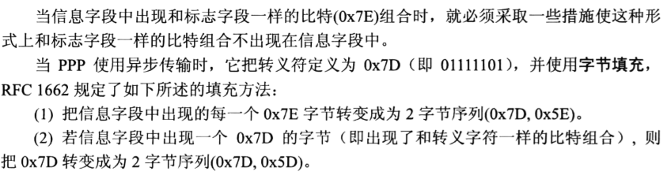

# 数据链路层

## 概述

**数据链路层信道主要有两种类型**：**点对点信道**、**广播信道**，前者一对一通信，后者一对多通信

**数据链路层的研究对象**：不同的网络之间（一个局域网，经过路由器到另一个局域网）的传输是网络层需要讨论的问题，数据链路层需要讨论的问题是数据如何从一个主机到另一个主机。

**数据链路层的信道使用的协议（PPP协议，以及CSMA/CD协议）**

数据链路层的三个基本问题：封装成帧，透明传输，差错控制

以太网MAC层地址

各种数据交换器件的作用及使用场合

## 点对点信道

### 概念

- **链路**：一个节点到相邻节点的一段**物理线路**，中间没有其他交换节点
- **数据链路**：将**实现数据传输必要的通信协议的软硬件添加到链路上**，就构成了数据链路。例如使用网络适配器，那么链路就变成了数据链路（网络适配器中封装了协议）
- **帧：帧是点对点信道的基本数据单元**

### 数据链路层协议解决的三个基本问题

- 封装成帧：**在上层数据报的前后添加首部和尾部，标记开始和结束（帧定界）**

  - 网络中传输的都是以分组（IP数据报）为单位的数据
  - 帧长等于IP数据报加上首部和尾部的长度
  - 每一种链路层协议规定了所能传送的**帧的数据部分长度上限**——**最大传送单元（MTU）**
  - 帧首部一般用SOH和EOT（0x01和0x04）表示，并不是三个字母

  

  

- 透明传输：**透明传输主要是解决数据中可能出现与帧首部、尾部相同的数据部分的问题**（如果是文本数据，也就是ASCII编码的数据不用担心这种情况（自动实现了透明传输）因为ASCII编码不会出现SOH，EOT），但是如果是二进制文件，就有可能出现这种情况）

  - 具体的避免方法是在**数据中出现的SOH和EOT**前**插入转义字符ESC（0x1B)**；

    

- 差错控制：差错控制主要是**防止出现比特差错**。比特差错是差错的一种，错误比特占总比特的位数称为误码率，采用CRC（循环冗余检验）

  - 循环冗余检验原理：70页
  - **为什么数据链路层有差错控制，TCP中还需要进行差错控制？**有博客说是因为TCP报文段在IP层可能会分片，但是TCP报文段长度被MSS限制，MSS又是根据MTU来确定的，为什么会在网络层造成分片。
    - TCP是数据若校验（校验和），以太网是数据强校验（CRC）
    - CRC只对链路上的错误负责，和TCP中间还隔着一层网络层，网络层中可能需要进行QOS，TTL-1，NAT等操作

### 点对点协议PPP（Point-to-Point Protocal）

#### 特点

因特网用户需要连接ISP（因特网服务供应商）才能接入因特网，PPP协议是用户计算机和ISP进行通信时所用 的链路层协议

- 简单，不需要纠错，序号，不需要控制流量，（这些放在高层协议中了，如TCP），仅仅完成CRC检验，也就是比特差错控制
- 封装成帧
- 透明传输（不管传什么，不要让上层多做操作，如果有冲突，数据链路层加转义字符）
- 差错检测
- 多种网络层协议
- 多种类型链路
- 设置最大传送单元
- 网络层地址协商。PPP协议必须听一种机制使通信的两个网络层知道对方的地址
- 数据压缩协商

PPP协议只支持全双工的

#### 组成

PPP协议有三个组成部分

- **一个**将IP数据报封装到串行链路的方法
- **一个**用来建立、配置和测试**数据链路连接**的链路控制协议LCP（也就是面向连接的）
- **一套**网络控制协议NCP（不同的NCP支持不同的网络层协议）

#### 帧格式

##### 字段意义

F（0x7E）是PPP数据帧的开始，结束表示，A和C分别是地址字段和控制字段，但是由于历史原因，并没有进行定义（也就是说不携带PPP数据帧的信息）

协议的两个字节可以判断是IP数据报，还是LCP数据，还是网络层控制数据

尾部第一个两字节字段是使用CRC的帧检测序列FCS

##### 字节填充

##### 零比特填充

#### 工作状态

## 广播信道

### 数据链路层，以太网，局域网，和MAC之间的关系

以太网用无源电缆作为总线来传送数据帧，也就是说以太网本质是一种**基带总线局域网**。

有两个标准，一个是DIX Ethernet V2，另一个是IEEE802.3

**局域网工作的层次跨越了数据链路层和物理层**，同时IEEE802标准制定委员会**将局域网的数据链路层差分为两个子层**，分别是**逻辑链路控制层（LLC）**和**媒体接入（访问）控制层（MAC）**。后来由于竞争关系，以太网在局域网市场中，TCP/IP协议簇更倾向使用DIX标准，所以**LLC层的作用已经消失了**，许多网络适配器生产厂商已经没有LLC协议，只有MAC协议了。

### 适配器

其主要作用是将计算机的数据进行串行->并行转换，传输到网络上。适配器实现了数据链路层和物理层，两者紧密结合，集成度高

## 使用广播信道的以太网

### 使用集线器的星型拓扑

### 以太网的信道利用率

### 以太网的MAC层

局域网中，**硬件地址又称为物理地址或者MAC地址**（因为这种地址用在MAC帧中）

一般**局域网中每一台计算机的MAC地址被固定在适配器的ROM中**，而IP地址则是由计算机保存（因为IP会随时间地点发生变化，而MAC地址只会随适配器变化）。

现在**适配器中的MAC地址都使用的是48位（6字节）地址**。其中高3字节需要适配器生产厂家向IEEE申请，是公司的标志称为组织唯一标志符（OUI），后三个字节是厂家自行指派，称为扩展的唯一标识符（EUI）

因为适配器生产时，**MAC地址已经被固化在ROM中，所以也称为硬件地址或者物理地址**

以太网适配器的数据接收：

**以太网适配器还可以设置一种特殊的工作方式，即混杂方式**，通过该方式，可以将所有在以太网上传输的帧（达到本站，但并非发往本站的数据）进行接收，即实现**监听、嗅探**

#### MAC帧的格式

常用的以太网帧有两种格式，DIX Ethernet V2和IEEE的802.3标准格式

六字节目的地址，六字节源地址就不讲了

两字节的类型字段主要是指出上层使用的是什么协议

接下来是数据字段，最小46字节是因为，整个MAC帧，最小64字节，减去头部尾部18字节，就是46字节，当上层数据不满46字节时，就填充。。最大1500 就是MTU

然后是CRC校验字段

没有结束标志和帧长度，如何定界。通过曼彻斯特编码，电平不再变化时，就是传输结束了

## 扩展的以太网

### 物理层扩展以太网

### 链路层扩展以太网

#### 网桥

#### 多接口网桥——以太网交换机

## PPP和MAC

PPP是一种协议，MAC是一种层次，MAC是802.3/Ethernet链路层的寻址机制

MAC是802.3/Ethernet链路层的寻址机制

**PPP使用的是点对点信道，所以不需要地址；MAC是广播信道，所以需要地址**

**PPP是广域网范畴的，MAC是局域网范畴**

PPP和MAC虽然都有帧封装，但是封装是不同的

