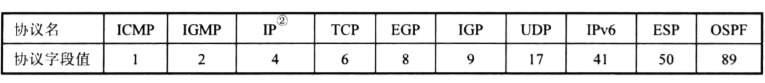

# 网络层

主要的内容包括

- 网络层提供的两种不同服务
- 虚拟互联网络概念
- 网际协议IP及其和物理地址的关系（ARP）
- 网际控制报文协议ICMP和几种常用的路由协议
- IP多播
- 路由选择协议的工作原理

## 网络层提供的两种服务

可靠交付应当由谁负责，网络还是端系统？

如果由网络负责可靠交付，则需要建立虚电路（建立连接），采用虚电路服务

如果由端系统负责可靠交付，则可以使用数据报服务

**实际上，网络层只向上提供简单灵活的、无连接的、尽最大努力交付的数据报服务**

也就是说网络层只向其他网络发送数据报，不建立点对点的连接。

## 网际协议IP

与网际协议IP一同使用的还有三个协议

- **地址解析协议ARP（Address Resolution Protocal）**（RARP，逆ARP）
- **网际控制报文协议ICMP（Internet Control Message Protocal）**
- **网际组管理协议IGMP（Internet Group Management Protocal）**

四者之间的关系如下

其中ICMP和IGMP需要用到IP，IP又需要用到ARP，所以如图画出其层次关系图

因为**IP是用来进行不同计算机网络之间的通信**，所以在TCP/IP中的网络层通常也称为网际层，或IP层

### 虚拟互联网络

讨论IP协议前需要了解什么是虚拟互联网络

现实生活中的网络为了隔离各种用户的需求，他们都通过**中间设备**连接在一起：

- 物理层使用**转发器（repeater）**
- 数据链路层使用**网桥（交换机）或者桥接器（bridge）**
- 网络层使用**路由器（router）**
- 网络层以上使用的设备叫**网关（gateway）**。使用网关连接的不兼容的系统需要在高层进行协议的转换

使用网桥或者交换机，仅仅是将网络扩大了（还是局域网），并不是网络互连。所以通常使用路由器来进行不同网络之间的连接.

参与连接的**计算机网络**都是**用相同的网际协议IP**，所以可以将互联的不同的网络（异构网络，比如无线网络，卫星网络等）看成是一个统一的**虚拟互联网络**（也就是逻辑互联网络）。这种使用IP协议的虚拟互联网络就是IP网

### 分类的IP地址

整个因特网是一个单一的、抽象的网络。

**IP地址**就是给因特网上**每一个主机（或路由器）**的**每一个接口**分配一个在全世界范围内是唯一的32位标识符。

IP地址的编址方式经过了**三个历史阶段**

- 分类的IP地址
- 子网的划分（分类编址改进）
- 构成超网（无分类编址）

分类的IP地址就是将**IP地址划分为若干个类，每一个类都由两个字段组成**

​		为什么要分类呢?因为一开始考虑到有的网络很大,计算机很多,需要许多地址,有的网络很小,不需要那么多地址

​		分类有啥好处呢？在路由器可以仅仅根据网络号来分派分组，减少了路由表占用的内存即查找时间

分类IP地址定义为**{\<网络号>,\<主机号>}**，所以说IP地址不仅仅指示一个主机，同时**指明了主机所连接到的网络**。用户申请IP，实际上申请的是接入网络的同一网段的网络号，其中的主机号，由该网段管理者自行分配。

通常的IP地址采用点分十进制记法192.168.1.1

- A类地址
  - 网络号通常可以表示**126个网段（2 ^ 7 - 2）**，**其中网络号全为0时**指当前网络；**网络号为01111111（127）**是作为本地软件环回测试使用(如果主机发送一个目的地址为环回地址，比如127.0.0.1，的IP数据报，那么主机不会将数据发送到任何网络)。
  - 主机号可以表示16777214个主机，和网络号相似，主机号全0表示主机所在的网络地址，而全1表示主机所在网络上的所有主机

- B类地址
  - 网络号，B类地址网络号无法指派128.0.0.0（后面全0），所以可以表示**2^14-1个网段**（为啥没有全1的烦恼呢，因为前面是10开头的，不会有全1，10111111表示191）
  - 主机号，B类地址最大主机数是2^16-2，需要剔除全0 和全1的主机号，前者表示当前主机，后者表示当前网段上的所有主机

- C类地址
  - 网络号，无法指派192.0.0.0，最小的网络地址是192.0.1  .0，共2^21 - 1个网段
  - 主机号，除去全0 ，全1

### IP地址和硬件地址

**物理地址（MAC地址）是数据链路层和物理层使用的地址**，而**IP地址是网络层和以上各层使用的地址，是一种逻辑地址。**

物理地址、硬件地址、MAC地址通常作为同义词

- 在IP层抽象的互联网上只能看到IP数据报。也就是说路径上的路由器的IP地址不会出现在IP报的首部中
- 路由器只根据目的站的IP地址的网络号进行路由选择

- 在局域网的链路层，只能看见MAC帧
- IP抽象的互联网屏蔽了下层的复杂细节

两个问题，

①路由器如何知道为IP数据报正确包装目的MAC地址——ARP

②路由器如何将MAC地址和IP地址映射起来——路由表、转发表

### 地址解析协议 ARP

已经知道一个机器的IP地址，找出其对应的MAC地址，需要用到ARP协议

ARP协议是解决**同一个局域网上的**主机或路由器的IP地址-MAC地址映射问题，无法解析其他局域网的MAC地址。ARP协议对上层是透明的，其工作过程上层是无法察觉的，只知道结果——MAC地址。

ARP分组采用的是IP协议，所以将ARP划归到网络层。

#### 工作机理

- **ARP高速缓存**
  - 每一个主机都设有一个ARP cache，存有当前局域网上的各个主机和路由器的IP地址到硬件地址的映射表，该表会动态更新
- **生存时间**
  - **ARP cache中的映射地址都被设置了生存时间**

##### 一次地址解析

主机A需要向当前局域网的其他主机发送IP数据报时，先查找ARP cache是否缓存了目的主机的IP地址-MAC地址对，如果没有，就进行以下步骤

① 主机A在**当前局域网广播ARP请求分组**。报告自己的IP地址和MAC地址，请求目标IP地址的MAC地址

② 当前局域网上的所有主机（需要运行ARP进程）都会收到该ARP请求分组

③ 如果目标主机收到该请求，就会向A主机发送自己的IP地址和MAC地址（单播的响应），其他主机由于IP地址不匹配，不响应该请求。

④ 主机A接收ARP响应，并更新ARP cache

注意：ARP请求是广播的，ARP响应是单播的。

​			另外在A广播ARP请求的同时也携带了自身的MAC地址和IP地址，接收请求的主机也能够记录A的IP-MAC对

##### 常见的几种地址解析情况

- 主机—>主机（同一局域网）
  - 常规操作
- 主机—>主机（跨局域网）
  - 通过常规操作解析当前局域网的一个路由器的硬件地址，将IP数据报交给它进行常规操作，返回数据
- 路由器—>主机（同一局域网）
  - 由路由器进行常规操作
- 路由器—>主机（跨局域网）
  - 通过常规操作解析网络的另一个连接了另一个局域网的路由器的地址，将IP数据报交给它转发

### IP存在的意义

全世界存在着各种各样的网络，使用不同的硬件地址。使用IP统一格式，方便计算机之间的访问交互

### IP数据报格式

- 版本：IPv4，IPv6

- 首部长度：单位是32bit，也就是说，如果没有可变部分，首部长度字段值就是5（0101），首部长度为5 * 32 bit = 20Byte。最长为15（1111），所以IP报文首部最长60字节，如果报文首部不是4字节的整数倍，就需要在末尾用增加字段填充

- 区分服务：标记是否紧急？

- 总长度：首部和数据之和的长度，单位为字节。该值不能超过一个数据蒸中的数据字段的最大长度（MTU，最大传送单元），超过最大传输单元的数据需要进行分片传输

- 标识：每产生一个数据报，计数器就加一，并将计数器的值赋给标识。但是IP协议是无连接服务，这个标识不是序号，只是为了将分片的数据归为一组（分片的数据都有同样的标识），以便重装

- 标志
  - MF：值为1，表示之后还有分片，为0 表示是最后一个分片
  - DF： 值为1表示不能分片，为0表示可以分片
  
- 片偏移：片偏移以8字节作为偏移单位，每个分片的长度一定是8字节的整数倍

- 生存时间：TTL（Time To Live），指数据报在网络上传输时的最大跳数限制，防止他在网络上无限循环传输，浪费资源

- 协议：

  

- 首部检验和：**只检验首部，不包括数据部分**

### IP层转发分组的流程

路由器通过不同的接口将IP数据报转发到不同的网络。所以数据报在网络上传输时，是从一个路由器到下一个路由器（如果已经处于目标主机所在网络，就可以是主机或者交换机）

所以在**路由表**中，**每一条路由的主要信息是{\<目的IP地址>,\<下一跳IP地址>}**

所以需要根据  目的IP地址来获得下一跳IP地址

- 特定主机路由
- 默认路由

- **问题来了，如何找到下一跳路由的地址——使用ARP，获取MAC后将数据封装成IP数据报，然后交给下层**

分组转发算法：

① 从数据报首部提取目的主机的IP地址D，得出目的网络地址为N（网络号）

② 如果N是该路由器直接相连的网络，就直接交付，完成。

③ 若路由表中有目的地址为D 特定主机路由，则把数据报传送给路由表中所指明的下一跳路由器

④ 若路由表中有到达网络N的路由，则把数据报传送给路由表中指明的下一跳路由器

⑤ 如果有默认路由，则转发给默认路由

⑥ 报告转发分组出错

那么**路由表是如何建立的？**需要划分子网、构造超网的概念

## 划分子网和构造超网

### 划分子网

#### 两级IP—>三级IP

之前介绍的两级IP地址包括了{\<网络号>,\<主机号>}。有三个缺点：第一，IP地址空间的利用率有时很低；第二，给每一个物理网络分配网络号会使路由表变得很大；第三，两级IP地址不够灵活

通过**划分子网（也称为子网寻址，子网路由选择）**，在原IP地址中增加一个**子网号字段**，使两级IP变成三级IP地址

**划分子网基本思路**

- 一个拥有多个网络的单位，将**其所属的网络划分为若干个子网，对外仍表现为一个网络**
- 划分网络的方法是在主机号中取若干位作为**子网号**。于是两级IP地址就变成了三级IP地址**{\<网络号>,\<子网号>,\<主机号>}**
- 外部的数据报仍然通过网络号找到对应的网络，之后，由路由器根据网络号和子网号找到目的子网，将数据交付给主机

划分子网后的主机通信过程

#### 子网掩码

现在的因特网标准规定，所有的网络都需要使用子网掩码，如果一个网络没有划分子网，那么就使用默认子网掩码，通过子网掩码，路由器可以从目的IP地址中获取网络号，查找路由表。显然

- A类地址的默认子网掩码是255.0.0.0
- B类地址的默认子网掩码是255.255.0.0
- C类地址的默认子网掩码是255.255.255.0

示例：

现在一个目的IP地址为B类地址的数据报，其目的IP地址为145.13.3.10，到达网络路由器R1，，路由器如何转发至其子网。由于数据包中未标明是否划分了子网，所以需要通过**子网掩码**来测试。

外部路由器采用两级IP地址子网掩码的方式找到网络号，当数据报到达对应的网络中时，路由器采用三级IP地址的子网掩码，可以看到子网号

划分子网增加了灵活性，但却减少了能够连接在网络上的主机数。划分的子网越多，连接的主机数越少（根据IP地址的主机号位数决定）

下面的表中，子网数不能全为1或者0，所以都减少了两个

#### 使用了子网的时IP层转发分组流程

使用了子网之后，路由表需要包含以下三项内容：**目的网络地址、子网掩码、下一跳地址。**

分组转发算法：

① 从数据报首部提取目的主机的IP地址D

② 判断是否为直接交付。对路由器直接相连的网络诸葛检查：用各个网络的子网掩码和D进行位与操作，若匹配就直接交付（将D转换成MAC地址，将数据包封装成帧发送）

③ 若路由表中有目的地址为D 特定主机路由，则把数据报传送给路由表中所指明的下一跳路由器

④ **对路由表中的每一行（目的网络地址，子网掩码，下一跳地址），用子网掩码与D进行位与操作，若结果匹配目的网络地址，则发送到下一跳路由器**

⑤ 如果有默认路由，则转发给默认路由

⑥ 报告转发分组出错

TODO：变长子网掩码，变长子网划分

### 无分类编址CIDR（构成超网）

CIDR即无分类域间路由选择

主要有两个特点

- **CIDR消除了传统分类地址以及划分子网的概念**。CIDR将32位地址划分成两个部分，即**网络前缀****和**主机号**，也就是说从划分子网的三级地址变回了两级编址，但是这两级没有分类了。
  - CIDR-IP =:: {\<网络前缀>,<主机号>} 或者 {\<CIDR-IP> / \<前缀位数>}
- **CIDR将网络前缀相同的连续IP组成一个CIDR地址块**。已知块内的任何一个地址就可以知道该地址块的地址界
  - 

#### 网络前缀

无分类编址是在IPv4的地址空间好紧的情况下提出的。正式命名是**无分类域间路由选择（Classless Inter-Domain Routing，CIDR）**。它有两个主要特点

- CIDR消除了A,B,C类地址以及划分子网的概念。将IP地址划分为两个部分，重回两级编址，同时采用斜线记法，注明网络前缀所占位数：
  - ​	{\<网络前缀>,\<主机号>,/\<网络前缀所占位数>}

- CIDR将**网络前缀都相同**的**连续的**IP地址作为一个CIDR地址块
- CIDR不再划分子网，但是仍然使用32位子网掩码，其中1的个数就是网络前缀所占位数，也可以兼容划分子网，就需要从主机号中借出相应的位数来划分子网。

TODO: 没看完这部分

## 网际控制报文协议ICMP

ICMP是为了优先的转发IP数据报和提高交付成功的机会，该协议**允许主机或者路由器报告差错情况和提供异常报告。**，也就是发送主体是主机或者路由器的网络层

ICMP的报文封装在IP数据报中，作为数据部分，看起来像是传输层协议，实际是IP层协议。

### ICMP报文种类

#### ICMP差错报告报文格式

- 当路由器或者主机无法交付数据报就向数据源发送终点不可达
- 当路由器或者主机因为拥塞丢弃数据报时就发送源点抑制报文
- 当TTL为0就发送时间超过
- 当参数不正确，就发送参数问题
- 重定向就发送重定向

#### ICMP询问报文

- 回送请求和回答：向目的主机发出请求，要求其回送数据，以验证通信是否正常（**ping指令**）
- 时间戳请求和回答：用于进行时钟同步和测量时间

**ping指令就是ICMP协议的询问报文。**

**tracrt指令封装了无法交付的UDP数据报，并向目的主机发出一连串的这样的数据报。如果无法交付，就由络层返回端口不可达报文，所以也就是差错报告报文**

每次

## 因特网路由选择协议

### RIP（Routing Information Protocal）

### OSPF（Open Shortest Path First）

### BGP(Border Gateway Protocal)

## IP 多播

### 基本概念

### 局域网上的硬件多播

#### 多播的两种协议

**1、网际组管理协议IGMP**

**2、多播路由选择协议**

