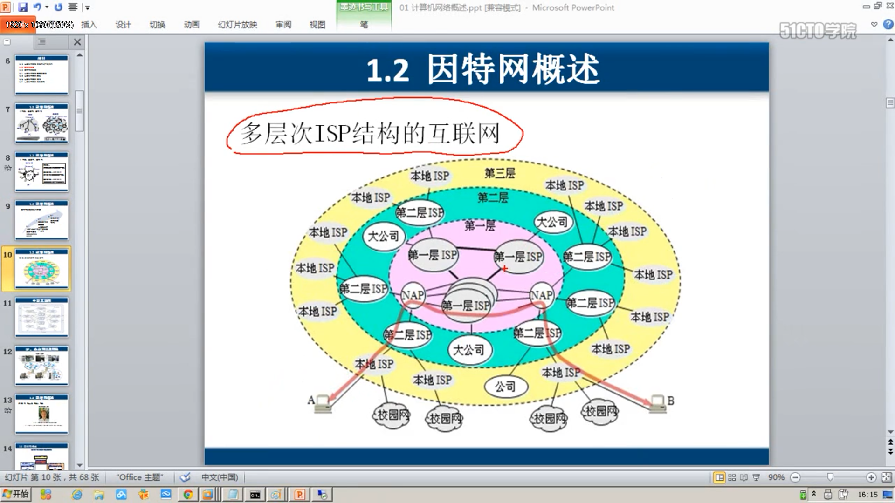
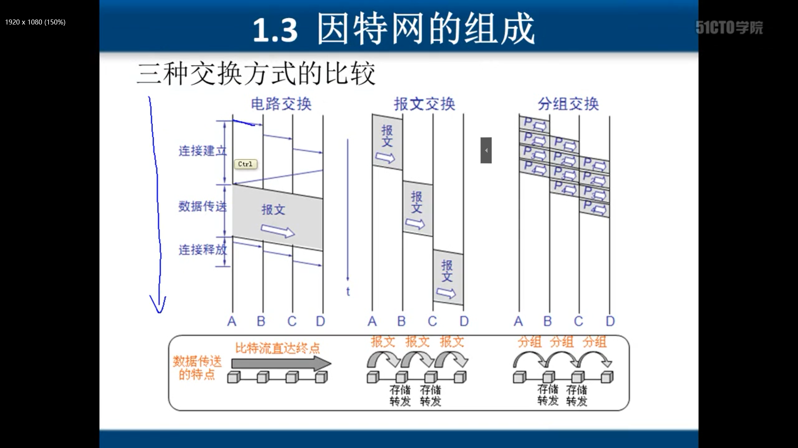
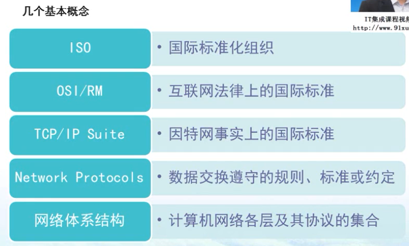
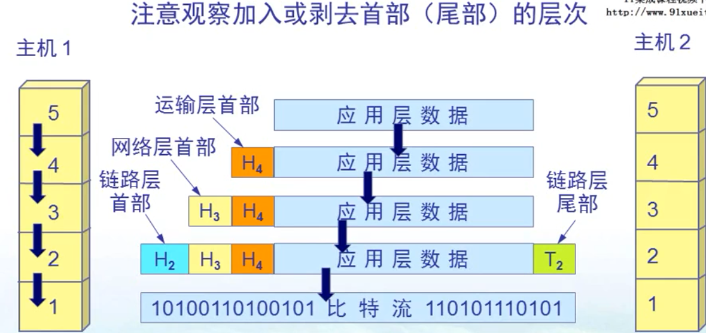
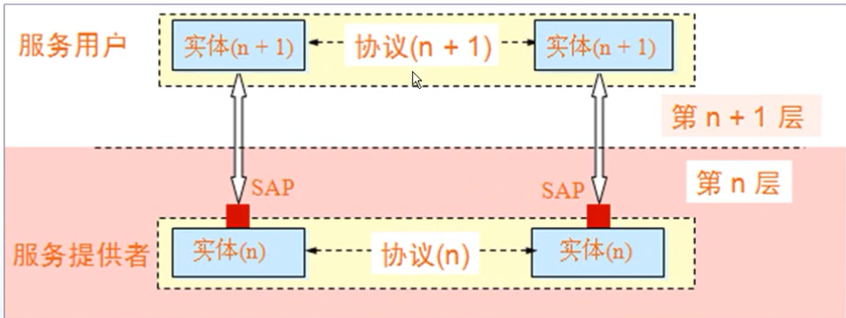
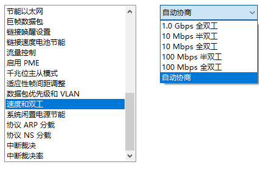
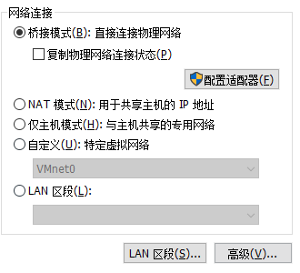
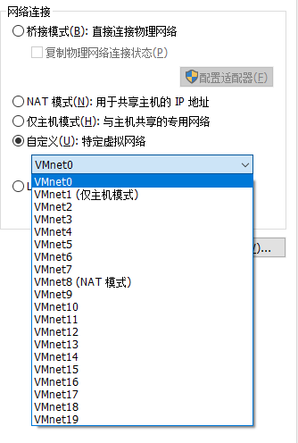
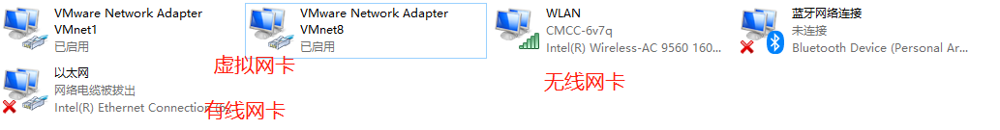

# 第 一 章  计算机网络概述

## 计算机网络在信息时代的作用

电信网络、计算机网络、有线电视网络等

计算机网络提供连通性（彼此联通，交换信息）和共享性（信息共享，软硬件共享）

## 因特网概述

网络（NetWork）

互联网（internet，NetWork of NetWorks）

因特网（Internet，全球最大的互联网，使用TCP/IP协议）

- ARPANET向互联网发展

- 三级结构的英特网

- 多层次ISP（Internet Service Provider）结构的因特网

  - 

    

## 因特网组成

因特网

- 边缘部分

  - **客户服务器方式（C/S，Client/Server）**
  - **对等方式（P2P，Peer-To-Peer）**

- 核心部分

  - **电路交换（Circuit Switch)**
    - 类似于电话机，在需要信息交换的时候进行拨号，通话结束，关闭连接
      - 1、建立连接（申请占用通信资源）
      - 2、通话（一直占用通信资源）
      - 3、释放连接（释放通信资源）
    - 电路交换适用于数据量很大的实时性传输——核心路由器之间可以使用电路交换
  - **分组交换（Packet Switch）**（流水线）
    - 发送端将数据分组，并加上首部信息，分多次发送
    - 接收端将解析分组的首部信息，并将信息进行拼接
    - 路由器的存储转发功能，也就是在路由器交换时，当多个分组需要经由统一线路转发时，可以先将一个分组转发，其他分组暂时存储在路由器中
    - 优点：高效、灵活、可靠
    - 问题：时延、开销大
  - **报文交换（Message Switch）**
    - 报文交换就是直接将数据接上相应的首部信息，进行交换，不进行分组
      - 一般比分组的长
      -  时延较长
  - 三种方式的比较
    - 

  

## 计算机网络的类别

作用范围

- 广域网
- 局域网
  - 之前：在一个区域内的网络
  - 现在：使用了局域网技术的网络
- 城域网
- 个人区域网

使用者

- 公用
- 专用网

拓扑结构

- 星型
- 网状
- 环型
- 总线型
- 树型

交换方式

工作方式

- 资源子网
- 通信子网
- 接入子网

##  计算机网络的性能

### 速率

连接在计算机网络上的主机在**数字信道**上传送数据位数的速率，也称为data rate或bit rate

### 带宽

数据通信领域中，**数字信道**所能传送的最高数据率

### 吞吐量

即在单位时间内通过某个**网络**的数据量

### 时延

- 发送时延
  - 发送时延 = 数据块长度（比特）/ 信道带宽（比特/秒）
- 传播时延
  - 传播延迟 = 信道长度（米）/ 信号在信道上的传播速率（米/秒）
- 处理时延
  - 网络节点存储转发处理的时延
- 排队时延
  - 网络节点缓存队列排队时间

网络中，在节点A（路由器，交换机等）中产生**处理时延和排队时延**，在发送器产生**传输时延（即发送时延）**，在链路上产生**传播时延**

### 时延带宽积

时延带宽积 = 传播时延 * 带宽

### 往返时间

RTT（Round-Trip Time），从发送方发送数据开始到发送方收到接收方确认

### 利用率

- 信道利用率 = 有数据通过的时间 /（有数据通过的时间 + 没有数据通过的时间）
- 网络利用率 = 信道利用率的加权平均值
- 网络当前的时延 = 网络空闲时的时延 /（1 - 信道利用率）

## 计算机网络的体系结构

OSI（开放式系统互联）七层模型

**应用层（Application）**

​	能够产生网络流量，能够和用户交互的应用程序

**表示层（Presentation）**

​	数据加密、压缩等，开发人员需要考虑的问题

**会话层（Session）**

​	服务和客户端建立的会话，可以用于查木马（通过netstat -nb指令）

**传输层（Transport）**

​	可靠传输（TCP）建立会话、不可靠传输（UDP）不建立会话，流量控制

**网络层（NetWork）**

​	IP地址编址 选择最佳路径（动态路由协议）

**数据链路层（Data Link）**

​	数据如何封装 添加物理层地址（MAC地址）

**物理层（Physical）**

​	规定电压、接口等标准

其中应用层、表示层、会话层通常合并为一层——应用层（五层模型）

**五层模型**

**应用层（Application）**—> 传输数据单元（PDU）

**传输层（Transport）**—> 运输层报文，TCP中为数据段

分组传输，将需要传输的内容分成段，加上头部，称为段

**网络层（NetWork）**—> IP数据报（IP分组）

传输层的段在网络层加上IP协议首部，称为数据包，也就是数据报（也就是说数据包包括了IP地址）

**数据链路层（Data Link）**—>数据帧

网络层的数据包再加上包含了MAC地址的首部后，称为数据帧

**物理层（Physical）**—>0101110100

传输模型（发送），接收反之

### TCP/IP四层结构

将网络层和传输层单独拿出来研究，其上层为**应用层**，其下层为**数据交互层**

### 网络安全和OSI参考模型

物理层安全

数据链路层安全  ADSL密码 AP密码

网络层安全

应用层安全 SQL注入、上传漏洞

### 开放式系统信息交换涉及的几个概念

#### 实体（Entity）

交换信息的硬件或软件进程

#### 协议（Protocol）

控制两个**对等实体**通信的规则

#### 服务（Service）

下层向上层提供服务，上层需要使用下层提供的服务来实现本层的功能

#### 服务访问点（SAP，Service Access Point）

相邻两层实体间交换信息的地方，比较抽象，可能是一个函数、参数、属性

## 第一章练习

查看会话

查看简历会话的程序

ping www.baidu.com

ping www.inhe.net 返回时间

#### 查看计算机网络连接状态

只查看了有线网络的，修改mac地址、网络速度自动协商等

## 一些有助于理解的操作

#### 虚拟机网络设置

- 桥接模式，那么相当于网络直接使用物理网卡连接到了局域网中，外部网络可以直接访问虚拟机的操作系统，无需主操作系统作为中介
- 自定义模式（可以选择不同的虚拟机网络），这时会创建一个虚拟网卡。该网卡管理所有虚拟机的网络（有时候不止一个虚拟机），也即网卡和虚拟机的网络在同一个网段，如果主机需要访问虚拟机的资源，就需要访问该虚拟网卡
  - 

- NAT（地址转换），也就是在该网络中的虚拟机在上网的时候，连接路线为，虚拟机->虚拟网卡->主机网卡->因特网。在通过主机网卡的时候，所有的虚拟机的IP分组中的IP地址被替换成了主机的IP地址，接收信息的时候就会相反的转换。需要注意的就是需要将虚拟机网络配置和NAT网卡（假如192.168.80.0）一样的网段（虚拟机就应该是192.168.80.1）

  