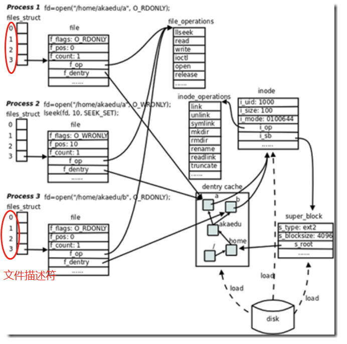

在研究NIO的通道概念时，实际就是操作系统IO中的通道的传输方式（其他还有DMA，中断，轮询等）

从DMA发展为通道，等等通道是由完全独立的处理器（附属CPU）详见OS


在直接缓冲区的NIO读写中，不需要进行通道的操作（channel.read(),channel.write()），而是直接对缓冲区进行操作（buffer.put(),buffer.get()）

用直接缓存时需要注意，缓存读取完毕，但是垃圾回收可能不进行，程序无法停止


这里通道间数据传输只有FileChannel有，具体需要看博客，视频只是有个框架

分散读取和聚集写入只需要在read和write时候传入缓冲区数组即可


Charset

——————————

网络IO

在前的C/S架构通信中，通常服务器需要风带客户端请求，所以会为每一个请求建立一个线程，如果该线程对应的客户端未发送请求，那么该线程将一直阻塞等待。也可以说是服务端等待客户端数据时，线程阻塞。


NIO非阻塞网络通信

NIO不采用阻塞队列实现网络的同步通信，而是采用了一个Selector（选择器）技术，选择器会将所有通道注册到该选择器上，监控这些通道的IO状况。如果监听到了合适的请求（准备就绪），那么选择器就会将该通道上的请求，分配到服务器的一个或多个线程上去执行

SelectableChannel下的所有实现都是非阻塞的（因为该类有一个方法configureBlocking方法），且一开始创建的时候是阻塞的，需要调用该方法切换到非阻塞模式


# 网络通信模型

Linux 五种网络模型

## 一些基本概念

### 用户空间 VS. 内核空间

用户空间和内核空间实际是对内存的划分，为了保护硬件安全，操作系统结合CPU权限级设立了内核态和用户态，同时在内存中设置了内核空间和用户空间，即仅有内核态能访问的地址空间和用户态也能访问的地址空间。

针对 Linux 操作系统而言，将最高的 1G 字节 (从虚拟地址 0xC0000000 到 0xFFFFFFFF)，供内核使用，称为内核空间，而将较低的3G字节 (从虚拟地址 0x00000000 到 0xBFFFFFFF)，供各个进程使用，称为用户空间。

### 文件描述符fd

#### 进程表（进程控制块，PCB）

进程被创建时，Linux内核调用系统函数在内存中开辟空间创建并存储**进程控制块PCB**，具体实现是**task_struct**结构体，用于存放在进程运行过程中所有的进程相关信息。

#### 文件描述符表

文件描述符表是进程表中的其中一项内容，用于存放所有打开文件的相关信息。<span style="color:red">**文件描述符表中的所有表项都由一个索引 和 一个指针组成。该索引就是文件描述符，该指针指向已打开的文件对应的file结构体**</span>。文件描述符表在Linux中用file_struct数据结构实现。

PS：每一个已打开的文件在内存中都有对应的file结构体（linux中即**file**数据结构，在打开文件时创建，代表该代开的文件，被所用需要用到该文件的进程引用)表示，其中存储了该文件的一些权限等信息（详见OS，文件系统中索引方式）。前文提到的指针指向的就是这个结构体

详见：

https://www.cnblogs.com/Jezze/archive/2011/12/23/2299861.html



file结构体 详见

https://blog.csdn.net/mm_hh/article/details/71374563?utm_source=blogxgwz6


#### 文件描述符 fd

文件描述符（File Descriptor）是用于表述指向文件的引用的抽象化概念。

在形式上，fd是一个非负整数，是作为一个索引存在在文件描述符表中，指向打开的文件

详见。所以实际上仅仅是个索引而已

https://blog.csdn.net/cywosp/article/details/38965239?utm_medium=distribute.pc_relevant.none-task-blog-BlogCommendFromMachineLearnPai2-3.channel_param&depth_1-utm_source=distribute.pc_relevant.none-task-blog-BlogCommendFromMachineLearnPai2-3.channel_param

### 缓存IO（标准IO）

#### 说明

目前的操作系统采用了**延迟读**这一技术来减少磁盘IO占用的时间。所谓延迟读就是首相将需要写入磁盘的数据先放到一个由OS内核所设置的缓冲队列中，直到强制写入命令或者填满时再将其写入。内核缓冲区也称为页缓存，也是可以从中读的。

所以说，**不带缓冲不是内核不提供缓冲**，而是用户进程在IO时直接进行系统调用（read，wirte），而非函数库调用。而**带缓冲是指用户进程本身就实现了缓冲技术**，在进行IO时，首先将数据放到用户缓冲区中，然后再调用系统调用将其复制到内核缓冲中

而这里所说的缓冲IO和非缓冲IO指的是在用户空间是否存在缓存。非缓存IO会直接对内核空间的缓存进行读写，而缓存IO在系统调用上一层又添加了一层缓存层，先将数据写入缓存层，再将其复制到内核缓存。

**内核缓冲区的设置是为了实现延迟读的技术，减少磁盘IO（或者其他设备IO）的时间。**

**而用户缓冲区的设置是为了减少系统调用导致进程上下文切换的时间**

  无缓存IO操作数据流向路径：**数据——内核缓冲区——磁盘**
  标准IO操作数据流向路径：**数据——流缓冲区——内核缓冲区——磁**

不带缓存的I/O对文件描述符操作，下面带缓存的I/O是针对流的。

另外还需要注意区别**缓冲区和缓存的区别**，前者是延迟写，后者是提前读（和存储已经读）

#### 缓冲IO（标准IO）的类型

用户缓冲区的类型：

- 全缓冲。当填满标准I/O缓存后才执行I/O操作。除了设计到终端设备文件的流，磁盘上的文件通常是全缓存的。
- 行缓冲。当输入输出遇到新行符或缓存满时，才由标准I/O库执行实际I/O操作。当涉及到终端设备的时候就是行缓存，比如stdin、stdout通常是行缓存的。
- 无缓冲。相当于read、write了。stderr通常是无缓存的，因为它必须尽快输出。


## Linux 网络IO概述

网络IO的本质其实是Socket数据的读取，socket在linux系统中被抽象成为流，实际IO可以理解为对流的操作

对于一次IO操作，根据缓存IO原理，数据会被先拷贝到内核空间的缓冲区中（从网络物理接口中读取信息，内核态操作）。然后被拷贝到用户空间。也就是说read操作发生时，首先是**socket等待数据，然后是读取数据到内核空间，然后将数据复制到用户空间**

提高IO效率在网络通信中能够大大提高性能


这里主要的难点是要区分，应用进程阻塞非阻塞和socket阻塞非阻塞的区别。

同步阻塞IO：应用进程因为socket阻塞而阻塞

同步非阻塞IO：应用进程轮询，socket非阻塞，所以应用进程也非阻塞

IO多路复用：应用进程调用select系统调用而阻塞，select轮询各个非阻塞socket

1 .阻塞的套接字，会让read阻塞，直到读到所需要的所有字节；

2 .非阻塞的套接字，会让read读完fd中的数据后就返回，但如果原本你要求读10个数据，这时只读了8个数据，如果你不再次使用select来判断它是否可读，而是直接read，很可能返回EAGAIN或=EWOULDBLOCK(BSD风格) ，

## 同步阻塞IO （Synchronous Blocking IO）

同步阻塞模型是最常用的模型，默认情况下**所有的socket都是blocking的****，即阻塞等待数据到来完整到来。<span style="color:red">（**实际就是socket线程调用系统调用`recv/recvform`获取数据，但是数据没有准备就绪，所以socket进程就被阻塞在系统调用中**）</span>.

也就是说一个进程对应一个socket，在等待数据时无法进行其他操作。


## 同步非阻塞IO （Synchronous  Non-Blocking IO）

同步非阻塞IO模型即轮询（polling）方式。该模型中，**socket以非阻塞的形式打开**（需要被设置成non-blocking）。

在网络 IO 时候，非阻塞 IO 也会进行 recvform 系统调用，检查数据是否准备好，与阻塞 IO 不一样，“非阻塞将大的整片时间的阻塞分成 N 多的小的阻塞，所以进程不断地有机会 ‘被’ CPU光顾，看数据有没有准备好”（具体实现之一就是while循环），所以称为轮询方式。但是在数据拷贝过程中，进程仍然是处于阻塞状态。

Linux下，可以设置socket为非阻塞的


具体流程如下

当用户进程发出 read 操作时，如果 **kernel 中的数据还没有准备好，那么它并不会 block 用户进程，而是立刻返回一个 error（while(socket.read(buffer) == -1，轮询）**。从用户进程角度讲，它发起一个 read 操作后，并不需要等待，而是马上就得到了一个结果。用户进程判断结果是一个 error 时，它就知道数据还没有准备好，于是它可以再次发送 read 操作。一旦 kernel 中的数据准备好了，并且又再次收到了用户进程的 system call，那么它马上就将数据拷贝到了用户内存，然后返回。


同步阻塞和同步非阻塞都是同步的，也就是说都需要数据到达后才能进行数据处理的工作，而阻塞非阻塞则是进程的运行状态。同步阻塞性能差，但是延迟低（数据一到就执行处理）。非阻塞可以做其他操作，但是可能会造成延迟（刚轮询完数据就到了，间隔了一个轮询间隔），导致吞吐量降低。这里的阻塞都是针对用户进程来说的，对于Socket来说阻塞非阻塞有其他的含义，见IO multiplexing

## 多路复用IO （IO multiplexing）

Java NIO网络通信所使用的模型（selector实现），在Linux操作系统层面，使用select，poll和epoll实现多路复用IO，也称为event driven IO即事件驱动IO

多路复用IO（select/epoll,没有poll）用一句话总结就是，将所有socket整合在一个线程（内核态）中，由该线程专门进行轮询操作，当某个socket有数据到了，就通知用户进程

**当用户进程调用了select，那么整个进程都会被block**，然后由内核调用select监视socket，一旦有一个socket有数据了，就返回，此时用户再调用read

- select轮询和同步非阻塞的轮询的区别在于：**一个select操作可以对多个socket进行监听，一旦数据准备就绪，就会返回进程可读给上层轮询，然后上层函数调用系统调用`recvform`将数据由内核拷贝到用户进程，拷贝过程中进程依旧是阻塞的**
  - 同时也是使用select的一个重要原因<span style="color:red">**I/O多路复用并不是能解决轮询问题**，**只是他可以同时处理多个链接**，原来单路的话是一个处理完才能接入新的连接，多路复用就是可以同时接入多个连接。。一个进程接收多个Socket的数据，以免一个Socket对一个进程导致线性资源（内存）开销</span>，可以看到这里使用了两个系统调用，比阻塞还多一个，所以IO multiplexing的唯一优势应该只有 同时处理多个connection了。
- **而对于IO multiplexing模型中的每一个socket一般都被设置为non-blocking。但是如图所示用户进程还是阻塞的，只不过被select系统调用阻塞，而非被socket阻塞**


## 信号驱动IO （Signal-Driven IO)


## 异步非阻塞IO （Asynchronous IO）

同步是需要主动等待消息通知，而异步则是被动接收消息通知，通过回调、通知、状态等方式来被动获取消息。


异步IO用的很少

用户进程发起read操作之后，立刻就可以开始去做其它的事，。而另一方面，从kernel的角度，当它收到一个asynchronous read之后，**首先它会立刻返回，所以不会对用户进程产生任何block**。然后，kernel会等待数据准备完成，然后将数据拷贝到用户内存，当这一切都完成之后，kernel会给用户进程发送一个signal，告诉它read操作完成了。

异步IO即AIO，也是一门新技术，难技术可以查一查，实际也可以通过对select进一步封装实现。


## 总结

### synchronous IO 和 asynchronous IO的区别

- A synchronous I/O operation causes the requesting process to be blocked until that I/O operation completes;
- - An asynchronous I/O operation does not cause the requesting process to be blocked

两者的区别就在于synchronous IO做”IO operation”的时候会将process阻塞。按照这个定义，之前所述的blocking IO，non-blocking IO，IO multiplexing都属于synchronous IO。有人会说，non-blocking IO并没有被block啊。这里有个非常“狡猾”的地方，定义中所指的”IO operation”是指真实的IO操作，就是例子中的recvfrom这个system call。non-blocking IO在执行recvfrom这个system call的时候，如果kernel的数据没有准备好，这时候不会block进程。但是，当kernel中数据准备好的时候，recvfrom会将数据从kernel拷贝到用户内存中，这个时候进程是被block了，在这段时间内，进程是被block的。而asynchronous IO则不一样，当进程发起IO 操作之后，就直接返回再也不理睬了，直到kernel发送一个信号，告诉进程说IO完成。在这整个过程中，进程完全没有被block。


# IO multiplexing之 select，poll，epoll

select，poll，epoll都是IO多路复用的机制。I/O多路复用就是通过一种机制，**一个进程可以监视多个描述符（文件描述符，socket在linux中被视为文件），一旦某个描述符就绪（一般是读就绪或者写就绪）**，能够通知程序进行相应的读写操作。但select，poll，epoll本质上都是同步I/O，因为他们都需要在读写事件就绪后自己负责进行读写，也就是说这个读写过程是阻塞的，而异步I/O则无需自己负责进行读写，异步I/O的实现会负责把数据从内核拷贝到用户空间。

## select

函数声明

```c
int select (int n, 
            fd_set *readfds, 
            fd_set *writefds, 
            fd_set *exceptfds, 
            struct timeval *timeout
           );
```

select函数监视的文件描述符分成3类，分别是writefds，readfds，exceptionfds。还有监听的超时时间

当用户进程调用该函数时，用户进程会被该函数阻塞，直到有文件描述符就绪为止（有数据可读，可写，或者exception）或者超时。当有数据时，select返回通知阻塞的应用进程，应用进程通过系统调用，遍历fdset来查看具体哪个文件可读、可写、或者exception。

select在各个平台都实现了，但是几个缺点

- 存在**监听数量上限**，一般为1024在linux上，可以修改内核提升上限，但是效率会降低

## poll

函数声明

```c
int poll (struct pollfd *fds, 
          unsigned int nfds, 
          int timeout
         );
```


```c
struct pollfd {int fd; /* file descriptor */
               short events; /* requested events to watch */
               short revents; /* returned events witnessed */
              };
```

区别于select的地方在于，poll仅仅使用pollfd一个数据结构，（**该结构为链表，所以没有数量限制**）来存储所有的被监听的文件描述符，pollfd结构包含了要监视的event和发生的event，不再使用select“参数-值”传递的方式。


## poll 和 select共同点

select和poll都需要在返回数据就绪信号后，<span style="color:red">**遍历文件描述符来获取已经就绪的socket**</span>。但是一般监听很多，但是有数据的很少，所以在遍历的时候效率会线性下降


## epoll

epoll是select和poll的增强版，epoll更加灵活，没有描述符数量限制。他使用一个文件描述符管理多个描述符。

epoll对select和poll的增强最关键一点在于，epoll可以理解为event poll，**实际上是事件驱动的（每个事件关联上fd）**，不再是收到就绪数据后再进行遍历，而是根据事件与描述符对就绪描述符**采取监听回调机制。**在具体是线上，epoll使用“事件”的就绪通知方式，通过epoll_ctl注册fd，一旦该fd就绪，内核就会采用回调机制来激活该fd，epoll_wait便可以收到通知

每个fd定义的回调函数来实现的。只有就绪的fd才会执行回调函数

epoll并不是一个函数，他是一组函数，具体函数声明：

```c
int epoll_create(int size);//创建一个epoll的句柄，size用来告诉内核这个监听的数目一共有多大
int epoll_ctl(int epfd, //epoll_create()的返回值
              int op, //表示对fd相对于epoll句柄的操作，用三个宏来表示
              //添加EPOLL_CTL_ADD，删除EPOLL_CTL_DEL，修改EPOLL_CTL_MOD。分别添加、删除和修改对fd的监听事件。
              int fd, //是需要监听的fd（文件描述符）
              struct epoll_event *event//告诉epoll需要监听什么事件，结构在下
             );
int epoll_wait(int epfd, //
               struct epoll_event * events,// 
               int maxevents, //
               int timeout//
              );
```

**1、** **epoll_create(int size)**

创建一个epoll句柄，size函数用来告诉内核这个epoll监听的数目有多大

这个参数不同于select()中的第一个参数，**给出最大监听的fd+1的值，参数size并不是限制了epoll所能监听的描述符最大个数，只是对内核初始分配内部数据结构的一个建议**。也就是说可以动态扩容

epoll本身会占用创建好的一个fd，当使用完epoll必须关闭资源

**2、epoll_ctl(int epfd, int op, int fd, struct epoll_event *event)**

该函数是epoll的事件注册函数，告诉内核要监听什么类型的事件而是注册事件并设置option，简单来说就是用于对发生在指定的描述符fd上的时间进行op操作

epoll_event结构如下，该结构定义了用户态关心的事件类型和触发时数据的载体epoll_data

```c
struct epoll_event {
    __uint32_t events; /* Epoll events */
    epoll_data_t data; /* User data variable *///其中有fd的信息
};
//其中events可以是以下几个宏的集合：
//EPOLLIN ：表示对应的文件描述符可以读（包括对端SOCKET正常关闭）；EPOLLOUT：表示对应的文件描述符可以写;
//EPOLLPRI：表示对应的文件描述符有紧急的数据可读（这里应该表示有带外数据到来）;
//EPOLLERR：表示对应的文件描述符发生错误；EPOLLHUP：表示对应的文件描述符被挂断;
//EPOLLET： 将EPOLL设为边缘触发(Edge Triggered)模式，这是相对于水平触发(Level Triggered)来说的。
//EPOLLONESHOT：只监听一次事件，当监听完这次事件之后，如果还需要继续监听这个socket的话，需要再次把这个socket加入到EPOLL队列里
```


其中有水平触发和边缘触发

水平触发就是一旦有就绪数据，向上层报告，上层未处理的话，下次遍历继续报告；边缘就是只报告一次

**3、** **epoll_wait(int epfd, struct epoll_event * events, int maxevents, int timeout)**

等待事件的产生，类似于select()调用。参数events用来从内核得到事件的集合maxevents告之内核这个events有多大，这个maxevents的值不能大于创建epoll_create()时的size，参数timeout是超时时间（毫秒，0会立即返回，-1将不确定，也有说法说是永久阻塞）。该函数返回需要处理的事件数目，如返回0表示已超时。


所以说整个epoll的逻辑已经显而易见了，首先通过创建函数，创建一个epoll句柄，然后通过创建并设置epoll_event数据结构将fd与需要监听的事件绑定，然后调用epoll控制函数将该监听注册到epoll句柄中。然后调用等待函数等待事件就绪。

这里有个疑问，为什么在调用控制函数的时候也将fd传入，在创建epoll_event事件时也将fd传入。其实为事件

### **工作模式**

　　epoll对文件描述符的操作有两种模式：LT（level trigger）和ET（edge trigger）。LT模式是默认模式，LT模式与ET模式的区别如下：

　　LT模式：缺省的工作方式，并且同时支持block和no-block socket。**当epoll_wait检测到描述符事件发生并将此事件通知应用程序，应用程序可以不立即处理该事件。下次调用epoll_wait时，会再次响应应用程序并通知此事件。**

　　ET模式：高速工作方式，只支持non-block socket**当epoll_wait检测到描述符事件发生并将此事件通知应用程序，应用程序必须立即处理该事件。如果不处理，下次调用epoll_wait时，不会再次响应应用程序并通知此事件。**

　　**ET模式在很大程度上减少了epoll事件被重复触发的次数，因此效率要比LT模式高。epoll工作在ET模式的时候，必须使用非阻塞套接口，以避免由于一个文件句柄的阻塞读/阻塞写操作把处理多个文件描述符的任务饿死。**


假如有这样一个例子：

1. 我们已经把一个用来从管道中读取数据的文件句柄(RFD)添加到epoll描述符

2.  这个时候从管道的另一端被写入了2KB的数据

3. 调用epoll_wait(2)，并且它会返回RFD，说明它已经准备好读取操作

4. 然后我们读取了1KB的数据

5. 调用epoll_wait(2)......

**LT模式**：如果是LT模式，那么在第5步调用epoll_wait(2)之后，仍然能受到通知。
**ET模式**：如果我们在第1步将RFD添加到epoll描述符的时候使用了EPOLLET标志，那么在第5步调用epoll_wait(2)之后将有可能会挂起，因为剩余的数据还存在于文件的输入缓冲区内，而且数据发出端还在等待一个针对已经发出数据的反馈信息。只有在监视的文件句柄上发生了某个事件的时候 ET 工作模式才会汇报事件。因此在第5步的时候，调用者可能会放弃等待仍在存在于文件输入缓冲区内的剩余数据。

```c
while(rs){
    buflen = recv(activeevents[i].data.fd, buf, sizeof(buf), 0);
    if(buflen < 0){
        // 由于是非阻塞的模式,所以当errno为EAGAIN时,表示当前缓冲区已无数据可读
        // 在这里就当作是该次事件已处理处.
        if(errno == EAGAIN){//ErrorAGAIN
            break;
        }else{
            return;
        }
    }else if(buflen == 0){
        // 这里表示对端的socket已正常关闭.
    }if(buflen != sizeof(buf){
        rs = 1; // 需要再次读取
    }else{
        rs = 0;
    }
}
```


所以epoll可以解决select中提到的三个缺点，首先epoll不是单一的函数，而是由三个函数组成的一种机制，epoll_create是创建一个epoll句柄；epoll_ctl是注册要监听的事件类型；epoll_wait则是等待事件的产生


更多参考

https://zhuanlan.zhihu.com/p/87843750

