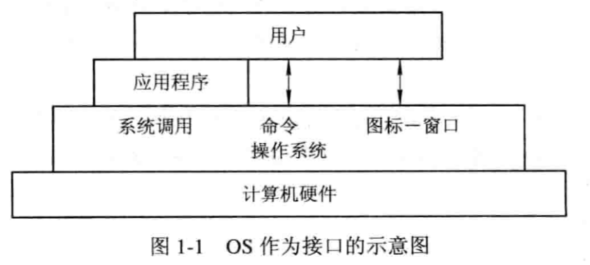
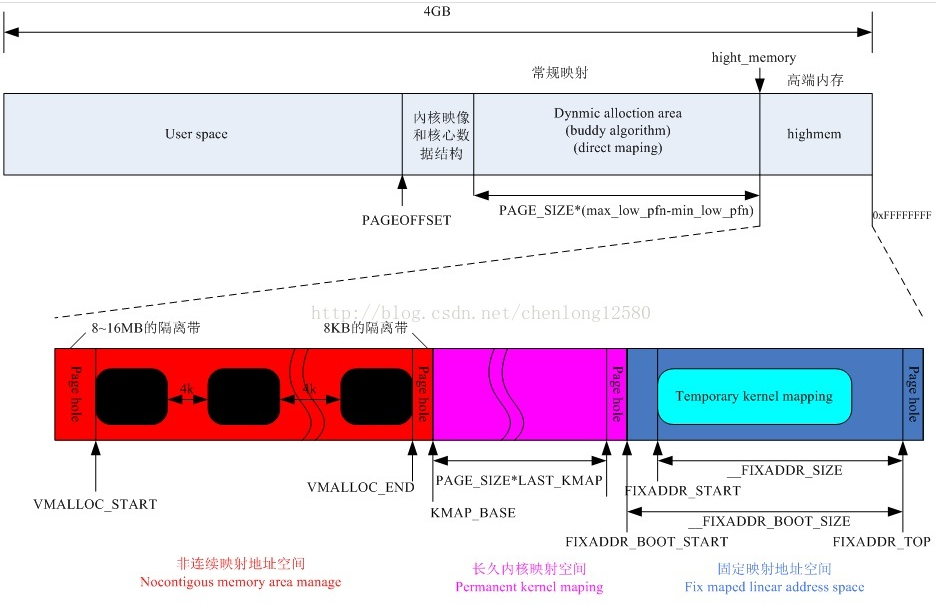
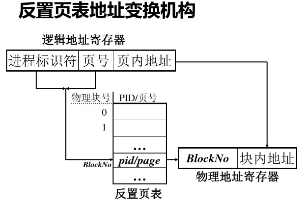

# 操作系统引论

## 操作系统的作用

操作系统向下负责资源管理，向上负责与用户的交互。实现了对资源的抽象

### 用户接口

作为用户和计算机硬件之间的接口存在。用户有三种方式与操作系统进行交互。通过程序、命令（或者窗口化时的图标）



### 硬件管理（主要功能）

主要负责四大**资源**的管理：**处理器，存储器，IO，文件系统**。

从而产生了4种管理器，分别是，处理器管理；存储器管理器，IO管理器，文件管理。

### 资源抽象

通过操作系统向用户提供硬件资源的服务，实际上操作系统就是一台虚拟机

## 操作系统的发展历程

### 未配置操作系统

### 单道批处理系统

### 多道批处理系统

### 分时系统

### 实时系统

### 微机操作系统

## 操作系统基本特性

并发和共享是操作系统的两个基本特性，他们互为存在条件，相互依赖。

### 并发

#### 并行与并发

相似又有区别。

并行是实际意义上的同时进行，需要有多个处理器来操作不同的

并发是宏观上的同时进行，但是微观上，他是多个程序分时（时间片）交替进行，造成了宏观上同时进行的假象。

#### 进程

**什么是进程。**进程是在系统中能独立运行并作为<span style="color:red">**资源分配的基本单位**</span>，其组成单位是**机器指令，数据，堆栈**，是一个能独立活动的**实体**

**为什么要引入进程。**如果不引入进程的话，那么同一个应用程序的计算程序和IO程序只能是顺序进行的。如果为该应用程序创建两个进程，那么这计算进程和IO进程就可以同时进行了。从而极大提高资源利用率，增加系统吞吐量

### 共享

**什么是共享**。OS 环境下的共享意为**资源共享** 或者**资源复用**。是指系统中的资源可供**内存**中**多个并发执行的进程**共同使用。这限定了使用的时空，即进程存在于内存时，在内存中使用。

管理共享资源。僧多粥少，所以要操作系统要对资源进行管理，由于资源属性不通，管理方式也不同。

#### 管理方式

##### 互斥共享

在同一时刻只能由一个进程访问的资源称为**临界资源** 或 **独占资源**，通过互斥共享方式来管理这些资源。在进程使用资源前必须先提出申请，资源不被其他程序占用才能够使用，且使用时独占资源。

##### 同时访问

在同一时间段内由多个进程同时访问的资源可以被进程同时访问。这里的同时在单机意义上是并发同时，即多个进程交替访问。例如磁盘等资源。

### 虚拟

在OS中，将通过某种技术讲一个物理实体变为若干个逻辑上的对应物的功能称为**虚拟**。在OS中实现虚拟主要有两种技术，分别是**时分复用技术**和**空分复用技术**。

### 异步

进程以人们不可预知的速度推进，这就是进程的异步性。举例：进程不确定何时才需要使用IO，需要使用IO时IO资源未必能正好等他使用（被占用）。所以异步也是操作系统的重要特征

## 操作系统的主要功能

**引入操作系统的目的**在于为多道程序的运行提供良好的运行环境。

### 处理机管理功能

对处理机的管理可以归结为对进程的管理，因为进程是处理机分配和运行的基本单位。处理机的主要功能有，创建和撤销进程（进程控制），协调进程实现进程间通信，将自己分配给进程（调度）

#### 进程控制

作业在执行时，需要为作业创建一个或多个进程和并**分配必要的资源**。同时在作业执行完毕时撤销进程并**释放资源**。所以进程控制的主要功能就是创建、撤销进程（分配、释放资源），以及控制进程的状态转换

#### 进程同步

之前说过计算机具有异步性，所以需要处理机来完成进程之间和资源的同步的功能。

常用的协调方式有两种，即资源共享中的两种管理方式。互斥和同时访问，前者的最简单实现是锁技术，后者是信号量机制

#### 进程通信

各个进程也有可能需要交换信息（例如一个进程的输出作为另一个进程的输出）。如果在一台机器上，操作系统就会采用直接通信的方式，例如源进程通过发送命令将消息（message）发送到目标进程消息队列上，目标进程利用接收命令读取

#### 调度

调度包括了作业调度和进程调度两步

##### 作业调度

作业调度的基本任务是从后备队列中选择作业，创建进程并分配资源，并加入就绪线程队列

##### 进程调度

进程调度的任务是从进程的就绪队列中选择进程，将处理机分配给他，投入执行

### 存储器管理功能

#### 内存分配与回收

内存分配的主要任务是

- 为程序分配内存空间
- 提高存储器的使用率，减少碎片（这里是指不可用的内存空间）产生
- 允许处理器动态申请内存空间并完成分配

内存分配主要有两种方式

##### 静态分配

在作业装入内存时确定分配给它的内存大小，之后不允许动态分配，也不允许其移动

##### 动态分配

在作业装入内存时也确定了给他们分配的内存大小，但是允许之后动态分配，也允许其移动

#### 内存保护

内存保护的主要任务是

- 确保程序在自己的内存空间中运行，互不干扰
- 不允许用户程序访问操作系统的程序和数据，也不允许用户程序转移到非共享的其他用户程序中去运行

实现保护机制的技术主要是设置两个界限寄存器

#### 地址映射

逻辑地址一般都从0开始。地址映射功能是将地址空间中的逻辑地址转换为内存空间中与之对应的物理地址

#### 内存扩充

借助虚拟存储技术，存储器管理可以实现逻辑上扩充内存容量。系统需要设置内存扩充机制以实现两个功能，从而实现逻辑扩充内存。这两个功能是请求调入和置换

### 设备管理功能

#### 缓冲管理

如果在IO设备和CPU之间引入缓冲，可以有效的缓和CPU和IO速度不匹配的问题，提高CPU利用率，提高系统吞吐量。现代OS最常见的缓冲机制有

- 单缓冲
- 双缓冲（双向同时传输数据）
- 公用缓冲池（多个设备同时使用）

以上的缓冲区都需要由设备管理器的缓冲管理机制管理

#### 设备分配与回收

设备分配的任务是根据请求、现有资源的情况以及分配策略，为进程分配设备。如果在IO设备和CPU之间还存在通道和控制器，则还需要分配相应的控制器和通道。为了实现设备分配，系统中设置了设备控制表、控制器控制表等数据结构。需要考虑设备的同步问题。还需要在设备使用完后进行回收

#### 设备处理

设备处理程序又称为设备驱动程序，任务是实现CPU和设备控制器之间的通信，即CPU发送指令完成指定的IO操作，同时CPU需要接受从控制器发来的中断请求并响应。

### 文件管理功能

#### 文件存储空间管理

主要任务是对每个文件提供外存空间，提高外存利用率和存取速度。系统要对存储空间的使用情况进行记录。还需要对存储空间进行分配和回收

#### 目录管理

主要任务是建立目录项，包括文件名、属性、物理位置等。方便用户查询、共享等

#### 文件的读/写管理和保护

##### 文件的读写管理

根据用户的请求将数据写入外存或从外存读入。

##### 文件保护

为了防止系统种的文件被非法窃取和破坏，需要提供有效的存取控制功能。

- 防止未经核准的用户修改文件
- 防止冒名顶替的用户修改文件
- 防止以不正确的方式修改文件

### 操作系统与用户直接的接口

#### 用户接口

##### 联机用户接口

通俗理解一问一答。用户在终端输入，计算机处理并返回结果

##### 脱机用户接口

通俗理解批处理。用户批量写好作业的指令，将指令与作业交给操作系统，操作系统自动解释运行

##### 图形用户接口

最简单的Windows操作系统，gnome等

#### 程序接口

为用户程序在执行中访问系统资源所提供的，是用户程序取得操作系统服务的唯一途径。

### 现代操作系统新功能

#### 系统安全

#### 网络的功能和服务

#### 支持多媒体

## OS结构设计

利用不同的软件工程学开发方法开发的操作系统具有不同的结构。

### 传统操作系统结构

#### 无结构操作系统

#### 模块化操作系统

#### 分层式操作系统

### C/S架构模式

### 面向对象

### 微内核


# 进程

## 前趋图和程序执行

### 前趋图

前趋图是指一个**有向无循环图**（Directed Acyclic Graph，DAG），用于描述进程之间执行的先后顺序。图中的节点用于描述一个进程或者程序段，有向边表示节点之间存在的**偏序**或**前趋关系**

前趋图必须无向，因为它描述了执行的先后顺序


### 程序的执行

啥是程序，由能够完成特定功能的一组有序指令的集合，存放在某种介质上

#### 程序的顺序执行

程序顺序执行也就是当一个程序执行完成后，才去执行下一个程序

主要特征：

- 顺序性：严格按照程序规定的顺序执行
- 封闭性：指程序在封闭环境下运行，运行时独占资源，资源状态只能由运行时的程序锁改变，程序的执行结果不受外界干扰
- 可再现性：只要运行程序的环境和初始条件相同，程序重复运行可以获得相同的结果

#### 程序的并发执行


程序并发执行的原因在于，两个程序在前趋图中不存在前趋关系，例如I1和C2，S1和S2

主要特征：

- 间断性：程序在并发执行时，由于共享系统资源，致使他们之间存在相互制约、竞争的关系。所以存在执行——暂停——执行这种间断性的活动规律
- 失去封闭性：并发执行下，系统中的各种资源将被并发进程共享，资源的状态会被其他的进程所改变，从而失去了封闭性
- 不可再现性：由于失去了封闭性，也将导致其失去可再现性，运行结果可能会受到运行顺序的干扰（目前还没定义进程，也没定义资源管理）

## 进程的描述

### 进程的定义

为了能够让程序在并发执行的情况下，仍然保留封闭性和可再现性，就需要对程序的并发执行进行控制，所以引入了进程的概念。

为了使程序（包括数据）能够独立运行（封闭性），操作系统为程序配备了一个专门的**数据结构**，称为**进程控制块（Process Control Block，PCB）**。进程控制快用来描述进程的**基本情况**和**运行情况**，从而操作系统能够控制进程。这样，**由程序段、相关的数据段和PCB这三部分组成了进程实体（又称进程映像）**。一般，将进程实体简称为进程。

从程序运行的角度，可以有**如下较典型的定义**：

- 进程是程序的一次执行
- 进程是一个程序及其数据在处理机上顺序执行时所发生的活动
- **进程是具有独立功能的程序在一个数据集合上运行的独立的过程，是系统资源分配（①）和调度（②）的基本单位**

在引入了进程实体的概念后，**可以将进程定义为：进程是进程实体的运行过程，是系统进行资源分配和调度的一个独立的基本的单位**。

进程控制块（PCB）在UNIX系统中又被分成了几个部分——进程表项（核心数据）、U(User)区（用户进程表项的扩充数据）、系统区表（各个区的物理地址信息）、进程区表（各个区虚拟地址及其对应的物理地址）具体内容见下链接。Linux中，PCB的具体实现是**task_struct**的数据结构

http://blog.chinaunix.net/uid-24180259-id-2624385.html

### 进程的特征

进程和程序时两个概念，进程除了拥有程序没有的程序控制块数据结构外，还具有以下特征：

- 动态性：**进程**实际就是**进程实体**的执行过程，所以动态性就是**进程**最基本的特征。动态性还体现在，它由创建而产生，调度而执行，撤销而消亡，具有一定的生命周期，而程序是存放在某种介质上的，是静态的
- 并发性：指多个**进程实体**同存于内存，且在一段时间内同时运行，这也是**进程**的重要特性，从而成为操作系统的重要特征
- 独立性：独立性是指**进程实体**是一个能**独立运行**、**独立获得资源**、**独立接受调度**的**基本的单位**，未建立PCB的程序都不能作为一个独立单位参与运行
- 异步性：指**进程按照异步方式执行**，也就是按各自独立、不可预知的速度向前推进。操作系统为了保证程序异步运行，但仍有可再现性，引入了进程，配置了相应的进程同步机制

### 进程的基本状态及转换

#### 进程的三种基本状态

由于进程在运行过程中呈现间断性的规律，所以在其成名周期内具有多种状态，一般每一个进程应处于以下三种状态之一

- 就绪（Ready状态）。这是指进程已处于准备好运行的状态，即进程已经分配到除了CPU以外所有初始的资源，只要再获得CPU就可以运行。通常处于就绪状态的进程被排成一个队列（例如按照优先级），称为就绪队列
- 执行（Running）状态。指进程已经获得CPU，正在执行的状态。在多处理机系统中，可以有多个进程处于执行状态
- 阻塞（Block）状态。指正在执行的进程由于发生某事件暂时无法继续执行的状态，亦即进程的执行受到阻塞。此时引起进程调度，OS将处理机分配给另一个就绪进程。通常阻塞的进程也排成一个队列，称为阻塞队列

#### 三种基本状态的转换


I/O请求可以抽象为临界资源

#### 创建状态和终止状态

为了满足PCB对数据和操作的完整性要求以及增强管理的灵活性。通常在系统中又为进程创建了两种常见状态，——创建状态和终止状态

- 创建状态。进程是由创建产生的，创建是一个复杂的过程：

  ①申请空白PCB，并向其中填写用于控制和管理进程的信息

  ②为进程分配运行时所必须的初始资源

  ③将进程转入就绪状态并添加到就绪队列中

  - 如果在分配过程中，无法分配到必须的初始资源，则创建工作无法继续，将此时的状态称为创建状态
  - 引入创建状态是为了能够保证进程的调度必须在创建工作完成后进行（完整性要求），同时OS可以根据系统性能推迟新进程的提交（使其进入创建状态）（灵活性）

- 终止状态。进程的终止需要有两个步骤

  ①等待操作系统进行善后处理

  ②将PCB复位并将PCB空间返回给系统

  - 如果进程被终结（正常执行完毕、操作系统强制、出错等），它进入终止状态，将其信息提取完毕后，开始PCB资源释放等工作。


### 挂起操作和进程状态的转换

挂起是指进程处于静止状态，如果进程在执行状态，对其进行挂起操作，它将暂停，如果是对就绪状态的进程进行挂起操作，它将暂时不接收调度。与挂起状态对应的是激活操作

#### 为什么引入挂起操作

- 终端用户的需要。用于观察、分析程序执行，可以暂停程序的执行（debug？）
- 父进程请求。有时父进程需要挂起某个子进程，以便考察和修改该子进程
- 负荷调节的需要。
- 操作系统的需要

#### 引入挂起原语操作后三个进程状态的转换

引入挂起原语Suspend和激活原语Active后，进程可能发生以下几种状态转换

a表示活动（激活），s表示静止（挂起），Readys表示静止就绪，Blockeda表示活动阻塞。注意，在静止（挂起）状态下，也能够进行Ready状态和Blocked状态的转化，即静止阻塞转化为静止就绪。

- Readya ---Suspend---> Readys
- Blocked ---Suspend---> Blockeds
- Readys ---Active---> Readya
- Blockeds ---Active---> Blockeda

#### 引入挂起操作后五个进程状态的转换


### 进程管理中的数据结构

OS对于资源、进程的信息的组织和维护是通过建立和维护各种数据结构实现的

#### 操作系统中用于管理控制的数据结构

OS中，对于每个资源和进程都设置了一个数据结构，用于表征其实体，分别称为**资源信息表**和**进程信息表**。其中分别包含了资源和进程的表示、描述、状态等信息以及一些指针，通过这些指针，可以将**同类资源、进程的信息表，或者同一进程占用的资源信息表**分类连接成不同队列，以便OS查找。如下图所示，这些数据结构一般分成四类：**内存表**、**设备表**、**文件表**和用于进程管理的**进程表**。（个人理解，存储、IO、文件、处理机，四大资源）


<span style="color:red">**进程表中的表项即进程控制模块PCB**</span>

#### 进程控制块PCB的作用

OS的核心为每个进程专门定义了一个数据结构——进程控制块（PCB），作为进程实体的一部分，它记录了操作系统所需的用于描述经常当前情况以及管理进程运行的全部信息。

PCB主要作用：

- 作为独立运行基本单位的标志。当一个程序（包括数据）配置了PCB，就标识它已经称为一个在多道程序下独立运行的合法的基本单位。系统是通过PCB感知进程的存在，也就是说PCB是进程存在的唯一标志
- 实现间断性运行方式。进程被中断（阻塞，时间片等原因），需要进行中断现场保护，系统将中断现场信息保存在中断进程的PCB中，供恢复时使用
- 提供**进程管理**所需信息。当调度程度调度到某进程时，只能根据PCB中的保存程序和数据在存储器中的地址的指针，找到对应的程序和数据。在整个进程的生命周期中，操作系统总是根据PCB实施对进程的管理和控制
- 提供**进程调度**所需要的信息。只有处于就绪状态的进程才能被调度执行，而在PCB中提供了进程处于何种状态的信息。还存储了别的信息，比如优先级、等待时间和已执行时间（调度算法中）
- 实现与其他**进程的通信**。进程同步机制是用于实现诸进程的协调运行的，在采用信号量机制时，要求每个线程中都设置有相应的用于同步的信号量，这就存储在PCB中。在PCB中还具有用于实现进程通信的区域或通信队列指针等

#### 进程控制块中的信息

①进程标志符

- 进程标识符。进程标识符用于唯一的标识一个进程。一个进程通常有两种标识符：
  - 外部标识符。为了用户对进程访问。由创建者提供，还需要设置父进程标识以及子进程标识。还可以设置用户标识，用于指示拥有该进程的用户
  - 内部标识符。为了方便系统对进程的访问，OS设置了内部标识符，通常是唯一的数字标识符。就是PID

②处理机状态。处理机状态也称为处理机长下文（Context）是由处理机中的寄存器中的内容组成的（CPU运算的中间过程等，都会存到寄存器中）。保存处理机状态就是保存中断现场信息

③进程调度信息。OS进行调度时，需要了解当前调度的进程的状态机调度信息，包括进程状态、进程优先级、进程调度所需其他信息、事件（例如阻塞原因）

④进程控制信息。用于进程控制所必须的信息，包括程序和数据的地址、进程同步和通信机制（消息队列指针、信号量等）、资源清单、链接指针（本进程所在队列中，下一个进程的PCB首地址）

#### 进程控制块的组织方式

一个系统可能有许多的PCB，目前组织他们的数据结构一般有三种

- **线性方式**。将所有的PCB组织在一张线性表中，将该表首地址方法到一个专用区域。但是在查找时需要扫描整张表
- **链接方式**。将所有具有相同状态进程的PCB通过链接字，连接成一个队列，形成阻塞队列、就绪队列等
- **索引方式**。根据进程状态，建立索引表，形成阻塞索引，就绪索引表等


## 进程控制

进程控制主要完成的是进程的创建、终止以及进程状态之间的相互转换的控制。通常由OS内核中的原语实现的。

### 操作系统内核

现在操作系统一般划分为几个层次，然后将不同的功能设置在不同的层次中。

通常将与硬件联系紧密的模块（中断处理模块等）、各种常用设备的驱动程序以及运行频率较高的模块（如始终管理、进程调度和许多模块所公用的一些基本操作）安排在紧靠硬件的软件层中，将他们常驻内存，被称为**OS内核**。分层的目的在于，第一，保护这些重要软件；第二提高OS运行效率。

为了防止OS本身及关键数据遭到破坏，通常**将处理机的执行状态分成用户态和内核态**

- **内核态**：也称为系统态，管态。*能执行一切指令，访问所有寄存器和存储区*
- **用户态**：也称为目态。*仅能执行规定的指令，访问指定的寄存器和存储区*。一般情况下，应用程序运行在用户态

**操作系统内核**主要包含两方面的功能

- 支撑功能。有三种最基本的支撑功能
  - 中断处理。内核最基本的功能，OS赖以活动的基础
  - 时钟管理。内核基本功能，管理进程时间片等
  - 原语操作。原语就是由若干条指令组成，用于完成一个过程。与一般的过程的区别在于：**他们是原子操作**。原语在执行过程中不允许被中断。在内核中有许多原语，用于对链表操作的原语、实现进程同步的原语等
- 资源管理功能（都在引论中的操作系统功能，少了文件管理）
  - 进程管理（处理机管理？）。
  - 存储器管理。
  - 设备管理。

### 进程的创建

#### 进程的层次结构

OS中，允许一个进程创建另一个进程，将创建进程的进程称为父进程，被创建的进程称为子进程，由此形成一个进程的层次结构。层次结构关系由PCB维护（记录了父进程及子进程）

子进程可以继承父进程所拥有的资源。父进程不能拒绝子进程的继承权

Windows中，没有父进程子进程的关系，如果一个进程创建了另一个进程，意味着它获得了新创建进程的句柄，该句柄可以在不同进程中传递。也就是说，Windows中的进程只存在控制与被控制（获得句柄与否）的关系

#### 进程图

用进程树描述进程之间的继承关系


#### 引起创建进程的事件

导致一个进程去创建另一个进程的典型事件有4类

- **用户登录**。在分时系统中，用户在终端键入登录命令，如果登录成功，OS将为其创建一个进程。
- **作业调度**。在多道批处理系统中，当作业调度程序按一定的算法调度到某些作业时，将其装入内存，为其创建进程。
- **提供服务**。当运行中的用户进程提出某种服务请求，系统将创建一个进程来提供用户所需服务。
- **应用请求**。以上三种都系OS创建进程。这类事件是用户进程自己创建进程

#### 进程的创建过程

①申请空白PCB，为新进程申请获得唯一的数字标识符（内部标识符），并从PCB集合中索取一个空白PCB

②为新进程分配开始运行所需的资源，包括物理逻辑资源（内存，文件，IO，CPU时间片等）

③初始化进程控制块PCB。包括**初始化标识信息**，将系统分配的标识符和父进程标识符填入PCB；**初始化处理机状态信息**，是程序计数器指向程序的入口地址，栈指针指向栈顶；**初始化处理机控制信息**，将状态设置为就绪状态，将优先级（通常）设置为最低优先级

④如果进程就绪队列能够接纳新进程，便将新进程插入就绪队列

### 进程的终止

#### 引起进程中的（Termination of Process）的事件

- 正常结束，表示进程的任务已经完成，准备退出运行。任何系统中，都有一个进程结束的指示，批处理系统中是holt指令，分时系统中，用户可以用logs off去表示进程运行完毕
- 异常结束，表示继承在运行时发生了某种异常事件，是程序无法继续运行。常见异常有
  - 越界访问，访问该进程以外的内存储区
  - 保护错，对文件采取权限以外的操作（只读文件写操作等）
  - 非法指令，试图运行一条不存在的指令，可能是程序错误转移到了数据区
  - 特权指令错误，用户试图使用OS的命令
  - 运行超时，进程的执行时间超过了指定的最大值
  - 等待超时，进程等待某事件的时间超过了最大值
  - 算术运算错误，除以0
  - IO故障，IO过程中产生故障
- 外界干预
  - 操作员或者操作系统干预
  - 父进程请求
  - 因父进程终止，其子孙进程也需要终止

#### 进程终止的过程

①根据被终止进程的标识符，从PCB集合中检索出该进程PCB，读取该进程状态

②若进程处于执行状态，立即终止该进程的执行，并将调度标志置为真，用于指示该进程被终止后应重新进行调度

③若该进程有子孙进程，应将所有子孙进程都予以终止，以防其成为不可控进程

④将被终止进程所拥有的的全部资源归还给父进程或OS

⑤将被终止进程的PCB从所在的队列或链表中移除，等待其他程序来收集信息

### 进程的阻塞与唤醒

#### 引起进程阻塞和唤醒的事件

- 向系统请求共享资源失败
- 等待某种操作的完成
- 新数据尚未到达
- 等待新任务的到达

#### 进程阻塞过程

阻塞是进程自身的一种主动行为。进程通过阻塞原语block将自己阻塞。进程此时还在运行状态，立即停止执行，将PCB中的状态由运行改为阻塞，将PCB插入到对应事件的阻塞队列。调度程序进行重新调度，切换进程上下文

#### 进程唤醒过程

当被阻塞进程所期待的时间发生，则由**有关进程（比如提供数据的进程）**调用原语wakeup，等待该事件的进程唤醒。

wakeup的执行过程是：首先将被阻塞的进程从等待该事件的阻塞队列中移出，将他们的状态改为就绪，并插入就绪队列中

block和wakeup是一对作用刚好相反的原语

### 进程的挂起与激活


#### 进程的挂起过程

#### 进程的激活过程

## 进程同步

在OS引入进程之后，可以使多道程序并发执行，提高了资源利用率和系统吞吐量。但是如果对进程不加以控制，那么仍旧像程序并发执行一样，是不可再现、不封闭的。

所以需要对进程进行控制，在多道程序系统中，引入进程同步机制。硬件同步机制、信号量机制、管程机制等，以此来实现封闭性和可再现性。

### 进程同步的基本概念

进程同步的主要任务是对多个相关进程在**执行顺序**上进行协调，使其按照一定顺序和规则共享资源，使程序在并发情况下有可再现性

**也就是说多个进程按照顺序逐一访问某个资源，这种制约关系成为同步，需要和互斥区别开来**

#### 两种形式的制约关系

进程由于共享资源，之间可能存在两种制约关系

- 间接相互制约关系
  - 对于共享系统资源的进程来说，他们就是间接相互制约的关系
- 直接相互制约关系
  - 对于同一个任务，建立了多个进程，多个进程需要相互合作，他们之间就构成了直接相互制约的关系（例如他们共用一个缓冲池，一个进程的输出是另一个进程的输入）

#### 临界资源

对于生产者消费者之间的缓冲区，是一种典型的临界资源，需要互斥访问

#### 临界区

无论是硬件临界资源还是软件临界资源，多个进程必须互斥的对其进行访问，**在每个进程中访问临界资源的那段代码称为临界区（例如Java中synchronized关键字修饰的代码）**。

那么对临界资源的互斥访问问题，转化成了各个进程互斥的进入自己的临界区。

所以，每个进程在进入临界区前，对需要访问的临界资源进行检查，如果没有被占用，就进入临界区访问临界资源，并将其设置为正在被访问；如果其他代码的临界区占用，则无法进行访问。

在临界区代码前加上检查资源访问情况的代码称为**进入区**，在之后复位访问状态的时候也需要加上代码，称为**退出区**

#### 同步机制应遵循的规则

对于临界区的实现，可以有软件的办法，更多的是在系统中设置专门的同步机构来协调个进程的运行。所有的同步机制都应遵守下面四个准则

- **空闲让进**。当无进程处于临界区时，也就是临界资源处于空闲状态，应允许一个请求进入临界区的进程立即进入临界区，访问临界资源
- **忙则等待**
- **有限等待**。对要求访问临界资源的进程，应保证在有限时间内能进入自己的临界区，以免陷入四等状态
- **让权等待**。当进程不能进入自己的临界区时，应立即释放处理机，以免进程进入忙等状态

### 硬件同步机制

现在已经很少用软件的方法解决进程互斥进入临界区等问题。

实际上对临界区管理时，是**将访问标志看做是一把锁**，先测试再访问，同时要关锁。所以测试、关锁操作必须是连续的（原子的），不允许分开。有多中方法来实现这种锁机制

#### 关中断

关中断的意思就是关闭中断，即当进程进入临界区，对锁进行测试之前，先关闭中断，等上锁之后（或者没有获取到，被阻塞），再打开中断，期间，执行该进程的处理机将不响应中断。但是，该方法存在3个问题

- 首先就是关闭中断会限制处理机交叉执行程序的能力，导致并发性差，吞吐量降低
- 其次，如果一个系统有多个处理机（例如多核CPU），那么关中断只针对运行当前进程的处理机，在其他处理机上仍能够响应中断，有可能破坏上锁的原子性，仍不安全
- 滥用关中断权利可能导致严重后果

#### 利用Test-and-Set指令实现互斥

借助一条硬件指令（TS，Test-and-Set）实现互斥。该指令是一个函数过程，但其执行过程不可分割，即为一条原语。该机制下，**每个临界资源都被设置了一个布尔值**，即为lock，初始时false表示空闲

#### 使用swap指令实现进程互斥

该机制下，为每个临界资源都设置了一个全局布尔量lock，初始为false。在进程中再利用一个局部布尔量，访问临界资源时，利用swap指令不断尝试替换lock的值，如果替换成功（即上锁），就可以访问临界资源

该方法的一个问题就是，如果替换不成功**，不断尝试替换的过程就会循环运行**（由处理机来执行），进程进入忙等状态，不符合让权等待，处理机吞吐量下降

### 信号量机制（是啥）

信号量从整型信号量经历了记录型信号量，进而发展为信号量集，现在已被广泛应用于OS

#### 整型信号量

最初整型信号量被定义为一个**用于表示资源数目的整型量S**，不同于一般的整型，它只能被两个原子操作wait和signal访问分别被称为P，V操作


**需要注意的是，S表示该类可用资源数量。如果资源数量为0，则表示没有资源可用，那么进入忙等**，所以忙等判定条件时小于等于0

#### 记录型信号量

在整型信号量的wait操作中，有个while，只要S不大于零，就会不断测试，进程处于忙等状态。

记录型信号量解决了这个问题，但是会出现多个进程同时访问同一临界资源的现象，为此，记录型信号量除了整型变量外，还用一个进程链表指针list，用于连接所有等待的进程（阻塞队列？）


**需要注意的是，不同于整型信号量机制，这里wait是先减再判定，且减了之后就放入阻塞了，只有在释放资源的时候才会加加，所以，可用资源小于0才会阻塞（如果刚等于0，就表示当前这个请求刚好用掉最后一个资源）。**所以叫记录型信号量，先预约了

**那为什么在资源数小于等于0时唤醒队列呢，是因为，之前先减了，进入队列后没加回来，也就是都先预定了。每次释放资源，只要小于等于0，就以为着还有进程在等待，都会唤醒一次。那么大于零是什么情况，大于0就是队列为空，大家都有资源可用**

#### AND型信号量

在一个进程需要多个临界资源才能继续工作的情况下，用前面的信号量机制可能会导致死锁，例如进程A,B都需要两个临界资源C，D才能运行，如果A得到了C的锁，B得到了D的锁，那么就进入了死锁状态，两个因为都不能运行结束释放锁，且都得不到必要的资源以运行。

AND型信号量就解决了这个问题，对于若干个临界资源的分配方式采用原子操作方式，要么将进程所需的临界资源一次性全部分配，要么一个资源也不分配。以此避免死锁发生，所以在wait操作中，增加了AND条件


**如果没有获得所有资源，那么将所有资源的信号量都复位到开始测试的时候**

#### 信号量集

https://blog.csdn.net/qq_38410730/article/details/81674118

如果一个进程需要多个同类临界资源，之前的信号量机制只能一次次的进行加一操作，效率低，也增加了死锁的操作（需要多个周期，周期之间不是原子的）。

另外为了确保系统安全，资源分配数量还有下限值。达到下限值就进行管制，不予分配了

针对这两个问题，对AND信号量进行扩充，一次不再加1，而是分配该资源的下限值。对信号量Si来说，测试值不再是1，而是资源分配的下限值ti，要求Si>=ti，一旦允许分配，则进行Si - di操作，di是进程需求量，而不是简单的Si - 1


一般信号量集有几种特殊的情况


### 信号量的应用（用在哪）

#### 利用信号量实现进程互斥

为了使多个进程互斥访问临界资源，需要为该临界资源设置一个**互斥信号量mutex**，初始值为1。然后将个进程访问该资源的临界区置于wait(mutex)和signal(mutex)之间即可。

wait和signal必须成对出现，对于mutex有三种取值，分别是-1,0,1

#### 利用信号量实现前趋关系

如果两个进程有前趋关系，只需要使进程P1和P2共享一个公用信号量S即可。进程P1前wait(S)进程P1结束后signal(S)

#### <span style="color:red">信号量与互斥量的区别</span>

也就是同步和互斥的区别：

https://www.cnblogs.com/leijiangtao/p/4684331.html

### 管程机制

**信号量机制中的PV操作需要进程自备，也就是进程各自完成同步**，这会对系统管理带来麻烦，也可能导致死锁，这便产生了一种新的进程同步工具——管程（Monitor）

**ATTENTION！！**

管程**封装了需要同步的进程中的PV操作、锁和资源**于一个数据结构，每个进程需要获取管程中的锁以执行管程中的操作，从而操作对应的资源，获取的同时，互斥信号量状态改变，防止其他进程获取资源

https://blog.csdn.net/qianbailiulimeng/article/details/84403957

#### 管程的定义

由于临界资源的同步属性和操作（资源特性）可以用数据结构来描述。所以，可以用共享数据结构抽象表示系统中的共享资源，将对临界资源的访问看作是对该共享数据结构的特定操作，这组操作被定义为一组过程。进程对该临界资源的申请、访问、释放都需要通过这组过程，间接的对共享数据结构实现操作。

**管程是<span style="color:red">"基于Mutex互斥信号量</span>实现的同步**

**代表共享资源的数据结构以及对该共享资源数据结构实施操作的一组过程所组成的资源管理程序共同构成了一个<span style="color:red">操作系统资源管理模块</span>，称为管程（Monitor）**。管程被请求和释放资源的**进程所调用**

所以管程的定义由四部分组成

- 管程的名称
- 局部于管程的共享数据结构说明
- 对该数据结构进行操作的一组过程
- 对局部于管程的共享数据设置初始值的语句
- 


​	管程体现了面向对象的设计思想。从语言角度看有以下特性

- 模块化。他是资源管理的一个模块，是一个基本程序单位，可以编译单位
- 抽象数据类型。有数据，有操作
- 信息掩蔽。内部数据对外部不可见

**管程 与 进程的区别**

- 两者都定义了数据结构（PCB+数据，抽象数据结构（操作+数据）），但是进程的数据结构是私有的（PCB），管程定义的是公共数据结构（比如内部的消息队列，是可以被多个进程访问的）
- 内部操作不同，进程的操作是程序顺序执行的操作；管程的操作是内部数据同步、初始化操作
- 目的不同，进程是为了解决并发的问题，管程是为了解决临界资源互斥访问的问题
- 进程可以并发执行；管程不能与其调用者并发
- 进程具有动态性，即创建、执行、撤销；管程是一个模块，是进程调用的

#### 条件变量

当一个进程调用管程，即此时他占有管程，但是如果该进程因为一些原因被阻塞，那么该管程也将不可被其他进程调用，这就导致了资源浪费。

所以管程引入**条件变量（Condition）**。一般一个进程被阻塞的原因有多个，所以有多个条件变量。

条件变量本质是一个抽象数据类型，内部保存了一个链表，作为等待队列；同时提供了两个操作，wait和signal，由进程调用。

举例：条件变量condition  x。被描述为一个公共内存地址的访问。如果正在调用管程的进程因为无法访问x对应的公共内存地址，则进程调用x.wait()将自己挂起，等待被唤醒；如果正在调用管程的进程发现了x对应的公共地址可以被访问，则调用x.signal唤醒条件变量x中等待的线程，区别于信号量，这里的signal是即时有效的，不像信号量，signal后会自加

问题来了，P占用了管程，管程中条件变量x的等待队列中有Q，如果P唤醒了Q，那么谁先执行，谁后执行呢？P等待还是Q等待，要根据不同的实现

## 经典的进程同步问题

### 生产者-消费和问题

#### 记录型信号量


注意到几个细节

- wait和signal必须成对出现
- 同一信号量的wait和signal必须成对出现
- 同一信号量的wait和signal处于不同的进程（同一进程的话wait了，就醒不过来了）

#### AND信号量

记录型信号量中，需要有两个资源，一个是互斥量的资源、一个是队列的资源

两者需要同时满足，所以可以用AND来优化，即用Swait(empty,mutex)和Ssignal(full,mutex)来替代

#### 管程


### 读者-写者问题


### 哲学家进餐问题

用AND信号量量就能最简单的解决该问题

## 进程通信

信号量等进程同步也可已归为进程通信，但是是低级通信。目前高级通信可以分为四大类，**共享存储器系统**，**管道通信系统**，**消息传递系统**以及**客户机服务器系统**

### 进程通信的类型

#### 共享存储器系统

在该进程通信系统中，相互通信的进程共享某些数据结构或共享存储区。从而又可以分为两种模式

##### 基于共享数据结构的通信方式

要求相互通信的进程，公用某些数据结构，以实现信息交换，例如生产者-消费者中的有界缓冲区。操作系统仅仅提供共享存储器，有程序员负责对公用数据结构的设置及对进程间同步的处理。该方式适用少量的数据，通信效率低下，属于低级通信。

##### 基于共享存储区的通信方式

针对共享数据结构的数据传递量少的问题，使用共享数据区的通信方式。OS在内存中划出共享存储区域，进程可对其进行读写以实现通信。由进程负责数据的形式和位置以及访问控制，而非OS。具体过程：需要通信的进程在通信前，先向OS申请获得公共存储区中的一个分区，并将其附加到自己的地址空间中，即可进行正常读写，完成后归还。

#### 管道通信系统

https://blog.csdn.net/qq_38410730/article/details/81569852

管道（pipe）是指用于连接一个读进程和写进程以实现其通信的一个**共享文件**。写进程以**字符流的形式**将大量的数据送入管道（pipe文件）；而读进程从管道中接受数据。

管道机制必须提供以下三方面的协调能力

- 互斥。即当一个进程对管道进行操作时，另一个进程必须等待
- 同步。当管道为空时，读进程需等待，由写进程完成写入后，将其唤醒。vice versa
- 确定对方是否存在（类似建立连接）。只有确定对方存在才能进行通信
#### 消息传递系统

该机制中，进程不必借助任何共享数据结构、存储区或文件。而是以格式化的消息（message）为单位，将通信数据封装在内。利用操作系统的一组通信原语，在进程间传递消息。

该方式的通信过程对用户透明。在计算机网络中，这个消息就是报文。

基于消息传递系统的通信方式属于高级通信，因实现方式不同，进一步分成两类

- 直接通信。发送进程利用OS所提供的发送原语，将消息发送给目标进程
- 间接通信。发送进程和接收进程通过中间实体（称为邮箱）的方式进行消息的发送和接收，完成进程间通信

#### 客户机-服务器系统

前面的几种进程通信机制也可实现不同计算机的通信。在网络环境中，当前驻留的通信实现机制是客户机-服务器系统，其主要的实现有三种：套接字，远程方法调用和远程过程调用

##### 套接字

套接字最开始是UNIX OS下的网络通信接口。主要是为了解决多对进程同时通信时端口物理线路的多路复用（多路分解）的问题。

套接字的本质是一个通信标识类型的**数据结构**，包括了**通信目的地址、通信使用的端口号、通信网络的传输层协议、进程所在的网络地址，以及客户机或者服务器提供的系统调用。**

通常，套接字包含两类

- 基于文件型：通信进程都运行在**同一台机器**的环境中，套接字是基于本地文件系统支持的，一个套接字关联到一个特殊的文件，通信双方通过对该文件读写实现通信（类似pipe）
- 基于网络型：该类型通常采用非对称方式通信。TCP那一套理论（发起链接-分配套接字绑定端口-建立连接-通信）

套接字优势在于对于不同的应用程序或网络通信，能够确保通信双方的逻辑链路的唯一性

##### 远程过程调用和远程方法调用

https://www.jianshu.com/p/7d6853140e13

https://developer.51cto.com/art/201906/597963.htm

https://baijiahao.baidu.com/s?id=1637758852641939872&wfr=spider&for=pc

远程过程（函数）调用，当前很火的RPC，本质是一个通信协议，应用在通过网络连接的系统之间。即允许本地主机通过网络，远程调用另一台主机的进程，而细节对程序员透明，就像是一般的过程调用。如果在RPC中的涉及的软件采用面向对象编程，则成为远程方法调用。

远程调用涉及本地客户进程和远程服务器进程两个进程，通常被称为网络守护进程，一般情况下进程处于阻塞状态，等待消息。

为了实现过程的透明性，RPC引入了存根（stub）的概念。本地客户端的每个独立运行的远程过程都有一个客户存根，本地进程调用远程过程实际上是调用该过程关联的存根。在服务器端，每个可被调用的远程过程也对应了一个存根。

从整个RPC过程来看，主要是，客户端调用存根，存根将消息打包，由客户端进程发送；服务器端接收并调用存根，存根发送给过程并将返回信息打包交给服务器进程，由服务器进程返回给客户端进程；客户端进程接收消息并交给存根，存根拆封并将结果返回

存根是个中间商。

### 消息传递系统的实现方式

前一节讲过消息传递系统根据实现可分为两种方式

#### 直接消息传递

通过OS提供的直接通信原语（send，receive）进行通信。

##### 消息格式

分为网络通信和本地通信，后者可以是简单的格式

##### 进程同步方式

##### 通信链路

在计算机网络中，通过建立连接来建立一条通信链路，用完之后拆除链路。在单机系统中，直接利用通信原语，系统会自动建立链路（单工或双工的）

#### 邮箱通信（间接消息传递）


## 线程基本概念

#### 回顾进程

进程的定义中有两个重要的性质——分配资源的基本单位；可以独立调度分派运行的基本单位。

进程在OS中通过PCB来标识并让外界感知自己，许多信息都保存在PCB中。所以能够保证其定义中的两个重要性质，并提供了并发的基础。

但是，进程并发执行需要付出较大的时空开销，特别是进程上下文切换时，需要消耗大量时间。所以**限制并发的正是在于进程上下文切换的开销**

#### 引出线程

为了能够解决进程并发时上下文切换开销较大的问题，尝试将资源分配和调度运行拆分开来，由OS分别进行处理，所以形成了线程的概念。

### 进程 VS. 线程

#### 调度的基本单位

传统OS，进程是独立调度分派的基本单位，在调度并进行上下文切换时，开销大

引入线程的OS，线程是调度分派运行的基本单位，所以线程是能独立运行（在一个进程中）的基本单位。线程上下文切换时，只需要保存少量寄存器内容，开销小

#### 并发性

引入线程的OS中，不仅进程之间可以并发，一个进程中的线程也能够并发

#### 拥有资源

线程只拥有一些寄存器和TCP，不拥有其他系统资源。

但是线程可以共享进程所拥有的系统资源，也就是说统一进程下的所有线程都有相同的地址空间，且可以共享进程打开的文件等

#### 独立性

不同进程间的线程相互隔离程度很高，同一进程下的线程可以共享进程资源，但是要注意线程同步

#### 系统开销

线程声明周期中的所有系统操作（创建、调度、撤销等）开销都比进程小

#### 支持多机系统

单线程进程只能在一个处理机上执行，多线程进程可以在多个处理机上执行

### 线程的状态和TCB

#### 线程状态

和进程一样，线程也有三种状态

- 执行状态
- 就绪状态
- 阻塞状态

线程的状态转换和进程的状态转换是一样的

#### TCB

包含以下信息

- 线程标识符
- PC、状态和通用寄存器的内容
-  线程运行状态
- 优先级
- 线程专有的存储区(用于保存现场)
- 信号屏蔽
- 堆栈指针（包括了指向用户自己的堆栈指针和指向核心栈的指针）

#### 多线程OS中的进程

- 进程已是不可执行的实体，但是基本的运行状态还是有的
- 进程是一个拥有资源的基本单位。资源包括，用于的地址空间、进程（线程）之间的同步与通信机制、打开的文件、申请到的IO、地址映射表等
- 多个线程可以并发执行

## 线程的实现

线程有两种实现方式，分别是内核支持的和用户级的

### 线程实现方式

#### 内核支持线程（KST，kernel supported thread）

KST是在**内核支持下运行的，**其创建、阻塞、撤销和切换，都在**内核空间实现**。

为了而管理KST，在内核空间为每个线程设置了TCB，通过TCB感知线程的存在并加以控制

KST主要优缺点：

- 内核能够同时调度同一进程中的多个线程并行执行
- 进程中的一个线程被阻塞，内核可以调用其他线程，也可以运行其他进程
- **内核支持线程具有很小的数据结构和堆栈，线程切换速度块，开销小**
- 内核本身也可以采用多线程技术
- 缺点在于，如果用户应用程序实现的是KST，那么在线程切换时需要从用户态先切换到内核态（应用程序运行在用户态），然后切换线程，开销较大

#### 用户级线程（ULT，user level thread）

用户级线程与内核无关（对ULT的操作都无需内核支持），其TCB设置在用户空间中，所以内核也无法感知到ULT的存在。

**设置了ULT的系统，调度仍是以进程为单位进行的**

ULT优缺点：

- 线程上下文切换不需要切换到内核态
- 调度算法可以是进程专用的（一个进程一种调度）
- 用户级线程的实现与OS无关
- 系统调用的阻塞问题。在OS看来，一个进程对应了一个线程，所以一个线程被阻塞，那么该进程中的所有线程都将被阻塞
- 在单纯的ULT实现方式中，多线程并没有什么卵用，因为处理机调度是由OS内核执行的，而在OS看来，一个进程中没有多线程

#### 组合方式（Java多线程实现方式）

有些OS提供了ULT/KST组合线程，允许用户建立管理调度用户线程，同时内核也能建立管理调度线程。组合方式的线程实现，同一个进程内的多个线程可以同时在多个处理器上执行，而一个线程阻塞时，不会导致该进程中的其他线程阻塞（解决了用户线程的问题）

组合方式有三种模型 U:1，1:1，U:K，分别是多个用户线程对应一个内核线程，一个用户线程对应一个内核线程，多个用户线程对应多个内核线程。


### 线程的实现

#### KST实现

KST在内核空间中实现，一种简单的控制方法就是系统在创建进程是，**在内核空间**中为其分配一个**任务数据区（每个进程一个）**（PTDA，per task data area），除了进程资源的信息外，其中包含了若干个TCB空间。

内核支持线程的调度和切换和进程的调度切换相似，也分为抢占式和非抢占式，调度算法上也可以采用时间片算法，优先权算法等

#### ULT实现（包含了组合方式的ULT实现）

用户级线程是在用户空间中实现的，他们都具有相同结构，且运行在一个**中间系统上**

中间系统有两种实现方式，即**运行时系统**和**内核控制线程**

##### 运行时系统

运行时系统本质上是**所有进行线程控制和管理的函数的集合**。用户级线程在切换时无须从用户态转入内核态，而是通过系统调用使用内核提供的服务。

总结就是这些系统调用是用户级线程和内核之间的一组接口，接口两端相互透明

##### 内核控制线程（组合方式的ULT）

内核控制线程又称为轻型进程（LWP，light weight process）。每一个进程可以有多个LWP，每个LWP有自己的TCB，且可以共享进程的资源，它通过系统调用来获得内核提供的服务。所以以该方式实现的用户线程需要绑定一个LWP，以此便具有了内核支持线程的所有属性。该方式即**组合方式**

考虑系统开销，LWP通常被集合成一个缓冲池，称为线程池。LWP也可被用户线程多路复用，而LWP和内核级线程则是一对一的关系，内核级线程只能感知到LWP，无法感知用户线程。

总而言之用户线程通过LWP与内核线程建立多对一或一对一的映射


### 线程的创建和终止

如同进程，线程也是有生命周期的

#### 线程的创建

应用程序的初始化线程在创建其他线程时，需要通过系统调用，向内核提供线程的信息，内核创建函数执行完成后，返回一个线程标识符以供使用

#### 线程的终止

## Linux 线程实现

Linux线程实现主要是根据POSIX库，基于LWP实现的，也就是pthread_create相关的函数实现的

https://blog.csdn.net/tianyue168/article/details/7403693/

# 处理机调度与死锁

## 处理机调度的层次和调度算法的目标

调度的实质是一种资源分配，处理机调度就是对处理机资源的分配。

### 处理机调度的层次

#### 高级调度
高级调度又称为**长程调度或作业调度**，**调度对象是作业**。作业调度周期长，大约几分钟一次，频率低

主要功能是根据算法，决定将外存上处于后备队列中的哪些作业调入内存，为其创建进程

分配资源。高级调度主要用于多道批处理系统中，在**分时和实时系统中不涉及高级调度**

#### 中级调度

中级调度又称**内存调度**。

主要目的是提高**内存利用率和系统吞吐量**。将一些暂时无法运行的进程，调至外存进行等待。中级调度实际就是存储器的对换功能，详见存储器管理中的对换章节

#### 低级调度

低级调度又称为**进程调度或短程调度**，**调度的对象是进程（或者内核级线程）。**频率高，运行时间短

主要功能是根据某种算法，决定就绪队列中的哪个进程获得处理机。

进程调度是最基本的一种调度，在所有设置了进程的OS中都必须配置该级调度

### 处理机调度算法的目标

处理机的调度算法是和调度目标相关的，没有一种算法能够完全满足多种目的

#### 处理机调度算法的共同目标

- 提高资源利用率
- 公平性
  - 防止进程出现饥饿现象
- 平衡性
  - 从资源的角度来说的，CPU密集型和IO密集型的两种进程如何分配。使所有可用资源保持忙碌状态，以达到平衡性
- 策略强制执行
  - 必须保证某些策略，如安全策略必须执行，即使造成延迟

#### 批处理系统目标

- 平均周转时间短
  - 周转时间包括，作业在后备队列上的等待调度的时间，进程在就绪队列上等待调度的时间，进程在CPU上执行的时间，等待进程完成IO操作的时间
- 处理机利用率高
  - 处理机利用率指的是CPU完成任务计算所占其工作时间的比例，所以尽可能选择大作业进行处理，避免频繁的切换
- 系统吞吐量大
  - 吞吐量是指单位时间内完成的任务数，所以吞吐量高需要尽量选择短作业进行处理，但是这会导致频繁的切换作业，导致利用率降低

#### 分时系统目标

- 响应时间快
  - 响应时间即作出处理机作出回应的时间
- 均衡性

#### 实时系统目标

- 截止时间保证
  - 截止时间指，任务必须开始执行的最迟时间或必须完成的最迟时间
- 可预测性

## 作业与作业调度

### 批处理系统中的作业

#### 作业和作业步

#### 作业控制块（JCB）

#### 作业运行的三个阶段和三种状态

### 作业调度的主要任务

#### 接纳多少个作业

#### 接纳哪些作业

### 先来先服务（FCFS）和短作业（STF）优先调度算法

#### 先来先服务调度算法

#### 短作业优先调度算法

### 优先级调度算法和高响应比优先调度算法

#### 优先级调度算法

#### 高响应比调度算法

## 进程调度

### 进程调度的任务、机制和方式

#### 进程调度的任务

- **保护处理机的现场信息**。在进行调度时，首先需要保存当前简称的处理机的现场信息
- **按某种方式选取进程**。调度程序按某种算法从就绪队列中选取一个进程，将其状态噶为你运行状态，并准备将处理机分配给它
- **将处理机分配给进程**。由分派程序将处理机分配该进程，此时需要根据PCB信息还原现场。

#### 进程调度的机制

为了实现进程调度，在调度机制中，主要由以下三个部分组成


- 排队器
  - 按照进程调度策略，将待调度的进程排成一个或者多个队列，以便调度程序能够方便的调度队首进程
- 分派器
  - 分排气按照进程调度程序选择的进程，将其从就绪队列中取出，然后进行分派器->新进程的上下文切换，将处理机分配给新的进程
- 上下文切换器
  - 进程调度时，会有两对上下文切换操作
    - OS保存当前进程的上下文，装入分派程序（分派器）的上下文
    - 进程保存分派器的上下文，装入新选择的进程的上下文

进程上下文切换需要执行大量的load、store操作，开销巨大，现在已有硬件实现上下文切换的方式，即有两组或者多组寄存器，一组在处理机内核态（系统态）使用，另一组供应用程序使用。系统和应用程序之间的上下文切换只需要改变指针即可

#### 进程调度的方式

一开始的进程调度是非抢占式的，但是有其局限性，后来就发展了抢占式

##### 非抢占式

进程获得CPU使用权会一直使用下去，直到进程完成或者被阻塞，也就是说是由于进程自身的因素，主动放弃CPU使用权。该情况下有几种引起进程切换的因素。

①当前进程执行完毕，或者因某事件导致无法继续执行（例如出错）

②当前进程需要进行IO，导致暂停执行

③当前进程进行通信或者同步过程中，执行了某种原语操作，例如Block

非抢占式适用于批处理系统，但是分时系统或者实时系统不适用（一些交互性强的不适用

##### 抢占式

该方式允许**调度程序**根据某种原则，暂停某个执行的进程，并将处理机分配给其他进程。也就是说是由于外力导致的进程放弃CPU使用权。

这些原则主要有

①优先权原则。允许优先级更高的新到进程抢占当前进程的处理机

②短进程优先原则。允许新到的短进程抢占当前场景成的处理机。实际也是以其任务长短作为优先级

③ 时间片原则。CPU将自己按时间划片，允许各个进程使用时间片轮转运行，但是时间片一到就需要重新进行进程调度

### 轮转调度算法

轮转调度（Round Robin）算法是分时系统中最简单常用的**基于时间片**的**抢占式调度算法**

#### 基本原理

轮转调度算法中，就绪队列中的进程按照FCFS的策略排列，系统设置若干毫秒的时间片中断，一旦计时完成，激活进程调度程序，重新分配CPU并将旧进程添加到FCFS的队尾。如此就能保证每个进程能够按照时间片轮流运行

#### 进程切换时机

该算法中有两种情况引起进程切换

- 时间片未用完，进程已执行完成

- 进程未执行完成，但是时间片用完，进程调度程序被激活

#### 时间片大小

该算法中最重要的无疑是时间片大小的确定。时间片较小就会频繁切换进程，导致CPU利用率低，如果时间片较大，就会退化成FCFS算法，交互式、短作业用户需求无法满足。


### 优先级调度算法

RR算法中，所有进程获得CPU的机会均等，但是实际情况下，任务有轻重缓急，所以，引入优先级，形成了优先级调度算法

#### 优先级调度算法的类型

优先级调度算法按理来说是抢占式的进程调度方式，但是实际上它还是被分成了抢占式和非抢占式两种优先级调度算法

- 非抢占式优先级调度算法。指优先级调度发生在当前进程主动放弃CPU（阻塞，执行完成，异常退出等）的情况下
- 抢占式优先级调度算法。指优先级调度发生在进程创建和当前及才能拿主动放弃CPU的情况下。如果新到进程优先级高于当前执行进程，那么当前进程必须将CPU使用权让给高优先级进程。抢占式的优先级调度常用于实时性较高的系统中

#### 优先级类型

##### 静态优先级

- 进程类型，系统进程高于用户进程
- 进程对资源的需求，一般是资源越少，优先级越高
- 用户的要求

静态优先级系统开销小，但是不精确，低优先级进程长时间无法运行

##### 动态优先级

进程有初始优先级，但是优先级会随着等待时间、或者执行进度改变，以获得进程调度的公平性。不但是对等待的进程有优先级的调整，还可以对运行中的进程进行动态调整

### 多队列调度算法

一个就绪队列的进程调度算法是低级的，无法满足多种调度策略，在多处理机系统中，发展了多队列调度算法，满足了多用户对进程调度策略的不同要求

简而言之就是将原本一个就绪队列拆分成多个（拆分原则是按照类型、性质等因素划分），不同的就绪队列中的进程有优先级区别，就绪队列之间也有优先级区别。

### 多级反馈队列（MFQ）调度算法

前面的调度算法有一定局限性，即如果未指明进程长度，则无法由进程长度确定优先级。所以引入了多级反馈队列（MFQ）调度算法。

#### 调度机制

- 设置多个就绪队列，并为每个队列设置不同的优先级。同时不同队列所能分配到的时间片大小也不同，优先级越高的队列时间片越小。**基于设置优先级和时间片大小，所以是多级不是多个**
- 每个队列中采用FCFS算法。新到进程进入内存后，将其放至第一个队列队尾，当前执行的进程如果在时间片内未执行完，就转入第二个就绪队列中等待。在最后一个队列中采用RR算法。
- 进程调度按照**队列的优先级**进行调度，仅当第一队列为空才调度第二队列的进程。也就是说，高优先级的先进行，直到低优先级，一旦有更高优先级的进程进入内存，就**立即进行进程切换**

调度机制融合了RR算法（时间片和最后一个队列直接用了RR），FCFS算法，抢占式优先级调度算法，多队列算法

#### 性能

MFQ算法本身就是为了满足不同用户对于进程调度的不同需求的。

终端型用户：交互性强，但是主要是短作业，可在第一级队列就完成大部分作业

段批处理作业：响应时间和终端型用户差不多，

长批处理作业，长批处理作业会被添加到后续等级的队列中，且每个队列采用FCFS策略，不会有作业长期无法处理

### 基于公平原则的调度算法

以上大多是基于优先级的算法和轮转算法。但是没有考虑到调度的公平性（就算是多级队列，如果一直有短作业进入，那么长作业还是执行不了的

#### 保证调度算法

提供性能保证，做到调度的公平性。

#### 公平分享调度算法

即分配给每个进程相同的时间。这个好像RR算法。

## 实时调度

### 实现实时调度的基本条件

#### 提供必要的信息

#### 系统处理能力强

#### 采用抢占式的调度机制

#### 具有快速切换机制

### 实时调度算法分类

#### 非抢占式

#### 抢占式

## 这里还有一点实时调度算法的内容，暂时不看

## 死锁概述

什么是死锁——多个进程在运行过程中，因为资源的抢夺或者执行顺序的错乱造成的一种僵局，若无外力作用，这个僵局将会一直持续下去，即成为死锁

死锁的产生主要是进程对**资源的争夺**和进程**推进顺序不当**造成的

### 资源问题和进程推进顺序问题

引起死锁的主要原因是**资源的争夺和进程推进顺序问题**，其中主要是

- 需要采取互斥昂文的，不可以被抢占的资源，即临界资源。如打印机，数据，队列，信号量等
- 进程推进顺序非法

#### 可重用资源和消耗性资源

- 可重用资源可以供用户重复使用多次。具有以下性质
  - 每一个可重用资源中的单元只能分配给一个进程使用，不允许进程共享
  - 可重用资源使用时，必须要有程序，即请求资源->使用资源->释放资源
  - 每一类可重用资源的单元数都是相对固定的，进程在运行期间不能创建、删除
- 可消耗资源又称为临时资源，进程运行时由进程动态创建、消耗的。具有以下性质
  - 单位数目可以不断变化，进程可以创建他们，并放入缓冲区。通常是生产者消费者模型
  - 最常见的可消耗性资源就是用于进程通信的消息等

#### 可抢占资源和不可抢占资源

- 可抢占性资源是指进程获得该类资源后，又可被其他进程或者系统抢占，**该类资源不会引起死锁**，例如高优先级资源抢占低优先级进程的CPU资源，CPU就是一个可抢占资源，或者进程对换时，内存也是一个可抢占资源
- 不可抢占性资源指一旦被分配给某个进程自制，就不能将其收回，只能在进程使用完之后自己释放，例如打印机，磁带机等

### 计算机系统中的死锁

计算机中的死锁是由于多个进程对资源的争夺产生的，主要是**不可抢占资源和消耗性资源**

#### 竞争不可抢占性资源引起死锁

竞争不可抢占性资源引起的死锁的典型就是哲学家就餐问题。

#### 竞争消耗性资源引起死锁

竞争消耗性资源的典型就是在利用消息通信机制进行通信时，多个进程都优先执行receive原语，然后再执行send原语，那么就会永远死锁在receive方法中，无法继续执行

#### 进程推进顺序不当引起死锁

例如一个进程获取了某个资源的使用权，如果先释放该资源，再去请求另一个资源，这是正常的，但是当在并发时，不释放该资源就直接去请求另一个资源，而另一个进程恰好也做了同样的事情，所以就发生了死锁，主要还是资源问题

### 死锁的定义、必要条件和处理方法

#### 死锁定义

如果一组进程中的**每一个进程都在等待仅由该组进程中的其他进程才能引发的事件，那么该组进程是死锁的**

#### 死锁的必要条件

产生死锁有四个必要条件

- **互斥条件**。即进程对资源的排他性使用，在一段时间内某资源只能被一个进程占用（但是这也是进程同步，保证数据安全的首要前提）
- **不可抢占条件**。进程获得的资源是不可抢占的，必须由进程自己释放
- **请求和保持条件**。进程已经保持了至少一个资源，但是又提出了新的资源请求，而该资源被其他进程排他性占有，请求进程被阻塞，但对自己获得的资源保持不放
- **循环等待条件**。死锁发生时，必然存在一个进程-资源的唤醒链？

#### 死锁的处理方法

- 预防死锁。设置限制条件，破坏产生死锁的四个条件中的一个来预防死锁
- 避免死锁。区别于预防死锁，避免死锁不去破坏条件，而是在资源分配的过程中有意识的去避免分配结果进入不安全状态
- 检测死锁。允许发生死锁，通过检测机构及时检测死锁，然后采取适当措施，把进程从死锁中解脱出来
- 解除死锁。常用的方法就是结束某些进程，释放一些资源，让资源进入正常的循环争夺

从上到下，不安全性提高，但是并发程度和资源利用率也提高了


## 预防死锁

这种方法严格防止死锁的出现，

### 破坏请求和保持条件

#### 第一种协议

**一次性分配所有资源**，以避免在进程执行过程中，请求资源的行为，从而破坏了请求条件，预防了死锁。

但是这种需要一次性分配所有资源的方法会**严重浪费资源**，也会造成其他**的进程有可能处于饥饿状态**

#### 第二种协议

边用边请求，边用边释放，该协议破坏了保持条件

### 破坏不可抢占条件

资源是不可抢占的，但是进程可以主动放弃资源的使用，从而破坏了不可抢占条件。但是同时，也可能会使已经执行的程序全部失效，增加系统开销，降低了吞吐量。

### 破坏循环等待条件

这种方法需要将资源按照一定的权重按序排列，进程在请求资源的过程中，只能请求比已有资源更高的资源，如果要请求低级资源的话，需要首先释放已经占有的高级资源，然后再去请求低级资源。

这种方法的关键在于，权重的分配（资源顺序），动态扩展资源数的时候需要重新分配

### 无法破坏互斥条件

因为资源互斥访问是保证程序，可再现性，封闭性的前提

## 避免死锁

这种方法不是事先采取限制措施，破坏死锁条件，而是在资源动态分配的过程中，防止系统进入不安全的状态，所施加的限制条件较弱，目前常用此方法来避免发生死锁

### 系统安全状态

避免死锁将系统状态分为安全状态和不安全状态。当系统处于安全状态时，可以避免发生死锁，反之当系统处于不安全状态时，可能发生死锁

#### 安全状态

避免死锁允许进程动态请求资源，但是在具体资源分配的时候需要计算安全性，所谓的安全性就是系统能在某种进程推进顺序（P1->P2->...->Pn）安全进行的情况下为每个进程分配资源，此时该推进顺序称为安全序列。如果没有这样的安全序列，说明系统处于不安全状态（并不一定会发生死锁）。

所以避免死锁的关键在于分配资源时，通过计算，避免系统进入不安全状态。

#### 由安全状态向不安全状态的转换

### 利用银行家算法避免死锁

## 检测和消除死锁

### 死锁的检测

为了能够检测死锁，系统需要**保存资源的请求和分配信息** 并 提**供一种算法以检测是否存在死锁**

#### 资源分配图

资源分配图描述了**资源和进程的分配以及请求两种关系**


#### 死锁定理

从资源分配图中可以进行推演，找一个没有被阻塞的进程进行执行，执行完成释放资源，如果最后能够消除所有的边，那么该图称为**可完全简化**的，反之则称为**不可完全简化**的

当系统处于状态S时，S状态为死锁的充要条件为，S的资源分配图不可完全简化。

这称为死锁定理

#### 死锁检测中的数据结构

通过维护各个进程的资源分配状态，使其成为一种数据结构，并对该数据结构进行如上推演，最后判断是否存在死锁

### 死锁的解除

死锁的解除通常有两种方法。

- 将某些进程中的不可抢占资源抢占了，分配给另外的死锁资源，使其顺利进行从而解除死锁状态
- 终止（或撤销）一些进程

#### 终止进程的方法

- 终止所有死锁进程
- 逐个终止进程，尝试能否通过终止最少进程来进行死锁解除。这样子的终止需要遵守一定的代价考虑
  - 进程优先级
  - 进程执行时间和待执行时间
  - 已使用的资源，和需求资源

#### 付出代价最小的死锁解除算法

# 存储器管理

## 存储器的层次结构

### 多层结构的存储器系统

#### 存储器的多层结构

#### 可执行存储器

### 主存储器与寄存器

#### 主存储器

#### 寄存器

### 高速缓存和磁盘缓存

#### 高速缓存

#### 磁盘缓存

## 程序的装入和链接

### 程序的装入

#### 绝对装入方式

#### 可重定位装入方式

#### 动态运行时的装入方式

### 程序的链接

#### 静态链接

#### 装入时动态链接

#### 运行时动态链接

## 内存碎片

在介绍内存分配方式之前，先讲一下外部碎片和内部碎片的问题。内存碎片即碎片化内存，主要因为动态分配，回收产生的一系列小且不连续的内存块

### 外部碎片

因为内存的分配回收会导致产生不连续的空闲空间，此时这些不连续的空闲空间无法满足新的连续分配要求。从而导致了有空间无法被分配的情况，形成外部碎片。通俗理解就是**外部碎片可以被分配，但是要求连续分配的话容量不够**。

### 内部碎片

因为所有的内存分配必须起始于可被 4、8 或 16 整除（视处理器体系结构而定）的地址或者因为MMU的分页机制的限制，所以一个不满足大小要求的分配请求会被分配到一个稍大的内存区域，因此会产生一个已经被分配，但是无法被利用的空间区域，即为内部碎片。

也就是说内部碎片**是已经分配**给一个进程（作业），但是**无法被利用**的内存区域

## Linux中的内存分配与管理

**分配是管哪些物理地址可使用，而映射是管哪些虚拟地址可访问，两者没有必然的联系**

整个内核，由buddy管理算法来管理所有物理页，只有经过它分配出去的物理页，OS和应用程序才能使用。

映射是指建好页表，即某块**虚拟地址空间**到**物理地址空间**的映射，有了这个映射，处理器就可以访问这块虚拟地址空间

### 内存分配器 slab-slub-slob

众所周知，操作系统进行内存分配的时候，是**通过伙伴系统，以页为单位分配的**，也可以称为内存块或者堆。但是内核对象远小于页的大小，而这些对象在操作系统的生命周期中会被频繁的申请和释放，并且实验发现，这些对象初始化的时间超过了分配内存和释放内存的总时间，所以需要一种**更细粒度的针对内核对象**的分配算法，于是SLAB诞生了

但是这个世界上没有完美的算法，一个算法要么占用更多的空间以减少运算时间，要么使用更多的运算时间减少空间的占用。优秀的算法就是根据实际应用情况在这两者之间找一个平衡点。SLAB虽然能更快的分配内核对象，但是metadata，诸如缓存队列等复杂层次结构占用了大量的内存。于是SLUB诞生了

**Linux系统中，伙伴系统（基于页框）可以和分页系统共同作用，用于<span style="color:red">消除外部碎片</span>**

**这样分配到的内存以页为单位，可能还是有过大的容量，所以再利用slab来<span style="color:red">消除内部碎片</span>**

### malloc

强推连接：

https://blog.csdn.net/gfgdsg/article/details/42709943

malloc和free的具体步骤：

https://blog.csdn.net/dog250/article/details/5302960

​	

**malloc通过两个系统调用完成任务并返回分配内存的首地址，并在首次访问的时候发生缺页中断来进行物理地址分配**

malloc的两个系统调用：**brk**， **mmap**。前者用于分配小内存，后者分配大内存，大小的界定可以`mallopt()`调整。

- brk通过移动进程地址空间的堆指针的形式来分配虚拟内存。
- mmap则可以将进程的虚拟空间的一部分映射到物理地址空间，同样采用的是首次访问->缺页中断->分配物理地址空间->加载内容的方式初始化。这里映射不仅可以映射到物理的RAM或者swap，还可以映射到文件和文件位置

所以brk是产生外部碎片的主要原因，看下图

<span style="color:red">（注意下面这样的是进程的虚拟地址，是在malloc角度看的（也就是说看着连续，物理空间中可能不连续，但是堆一般是连续的），如果从更底层的物理内存分配看，就需要用buddy system和slab/slub来分配内存了）</span>


利用brk分配ABD，当释放了B时，brk不移动，只是将空闲内存添加到空闲分区表，此时，如果没有比B还小的内存需要分配的话，原来B的位置就成了外部碎片。只有当D释放了，原B位置上的碎片才能够被合并成大块。<span style="color:red">这是上面连接中的解释。但是我有一点疑问，因为这是进程的虚拟空间地址，并**不代表其映射的物理空间内存也是被隔开了**，如果没有被隔开就可以与其他空闲内存合并呀。他给出的解释是，释放了但是并没有将其直接以空闲分区的形式交还给OS，而是继续占用，以供重用，如果该进程又需要同样大小的内存，OS可以重新将其分配给进程</span>。所以也体现了mmap和brk的区别，后者可重用，前者就直接释放了。

```c
4. 解除分配函数 free
void free(void *firstbyte) {
     struct mem_control_block *mcb;
/* Backup from the given pointer to find the
  * mem_control_block
  */
    mcb = firstbyte - sizeof(struct mem_control_block);
/* Mark the block as being available */
   mcb->is_available = 1;
/* That''s It!  We''re done. */
   return;
 }
```


### malloc / brk / mmap /slab / buddy之间的关系


https://zhuanlan.zhihu.com/p/36140017


### Linux中的段页地址变换机构


### 逻辑地址，虚拟地址，线性地址，物理地址概念与转换

https://blog.csdn.net/yusiguyuan/article/details/9664887

https://blog.csdn.net/yusiguyuan/article/details/9668363

MMU**不同阶段的寻址方式和地址的作用范围决定了地址的名称**。

**逻辑地址是编译器（也就是程序在进程机器语言级翻译的时候）所被分配的地址，是针对于程序而言的，对程序开发者可见。**一种常见的逻辑地址表述方式：segment:offset

逻辑地址通过X86架构的MMU进**行分段地址转换**，从而得到了一个新的地址，该地址称为线性地址，线性地址**通过分页地址转换**，得到最终需要的物理地址。

这一点在分页 VS. 分段中也有提及

而虚拟地址，有很多种说法，更倾向于，虚拟地址等价于线性地址地址


### Linux中内存管理


- **最右侧的进程地址空间**（线性空间，**虚拟空间**）部分：分为两部分，一部分为内核空间，一部分为用户空间。因为32-bit下的CPU最大的寻址范围是0-4g，所以进程能被分配到的最大内存就是4g其中1g是内核空间
  - 在**用户空间**中，有五个部分，分别是堆，栈，数据段，代码段，和BSS。brk系统调用扩展的是堆指针，而mmap分配的是堆和栈之间的空闲部分线性地址
    - **只有在真正访问一个线性地址的时候才建立这个地址的物理映射**(只分配虚拟空间，不对应物理内存(因此没有初始化)，第一次读/写数据时，引起内核缺页中断，内核才分配对应的物理内存，然后虚拟地址空间建立映射关系）
  - 在**内核空间**中（1G大小），（X86 32-bit）系统中将其分成两大部分，分别是896M的直接映射区，和128M的高端映射区。
    - <span style="color:red">直接接映射区</span>（共896M线性地址空间）中的地址与物理地址只有一个offset的偏差，也就是**VA（虚拟地址）=PA（物理地址）+PAGE_OFFSET**。对应的是Linux内存管理的**`ZONE_DMA`，`ZONE_NORMAL`**两个区域（共896M物理空间）
    - <span style="color:red">高端映射区</span>（共128M线性地址空间）需要MMU通过TLB表来建立动态的映射关系，并将虚拟地址映射到了内存的**`ZONE_HIGHMEM`**区域。如图所示主要有三种映射方式，也即**固定映射地址空间（临时映射）**，**永久内核映射空间**，**非连续映射地址空间（动态内存映射区域，vmalloc region）**
  - 对于高端映射区的由来及三种映射方式的具体内容：
    - https://www.cnblogs.com/hehe001/p/6334424.html
    - http://ilinuxkernel.com/?p=1013
    - 
    - 
  - 对于高端内存的理解。
    - **首先是高端内存的由来**。因为进程内核空间只有1G，直接映射只能访问1G的物理空间，所以将物理空间划分开来，不同的区域对应不同的映射方式（最重要就是理解这一点，在64位机器中，是没有高端内存的，因为物理内存小于内核地址空间）
    - **高端内存是站在内核角度针对物理内存进行的划分**，主要是用于区别一些常用的模块、数据以及不常用的数据。这里的常用不常用是相对来说的，例如用户的数据时不常用的，内核的一些数据时常用的
    - 所以在用户角度是没有像高端内存这样的抽象的（**没有意义的**），内核在为用户分配内存的时候就**直接分配的高端内存（因为用户数据不常用）**，但是这对用户来说是透明的
    - 总之，内核的高端线性地址是为了访问内核固定映射以外的内存资源。实际上高端内存是针对内核一段特殊的线性空间提出的概念，和实际的物理内存是两码事。进程在使用内存时，触发缺页异常，具体将哪些物理页映射给用户进程是内核考虑的事情。在用户空间中没有高端内存这个概念。
- **中间由伙伴系统和SLAB管理的是真正的物理内存**，Linux将物理内存分为3部分进行管理。分别是**`ZONE_DMA`，`ZONE_NORMAL`，`ZONE_HIGHMEM`**，
  - **DMA内存区域**通过DMA的使用，直接映射到内核的地址空间
  - **普通内存区域**，常规的页框
  - **高端内存区域**。包含896MB以上的内存页框，不直接进行映射，可以通过永久映射和临时映射进行该部分内存页框的访问
  - 


## 连续分配 存储管理方式

首先明确，连续分配是针对作业来说的，即一个作业在内存中连续存储，而不是针对分区来说的，分区可以分散

### 单一连续分配

早期的单道程序环境下，存储管理器将内存划分为系统区和用户区，用户区的内存空间由单道程序独占	

### 固定分区分配

早期的多道程序将存储器的用户空间**划分成固定大小的区域，在每个区域中只装入一道程序**

#### 划分分区的方法

- 分区大小相同：灵活性差
- 分区大小不同：需要预知（或者调查）运行作业的大小

#### 内存分配

### 动态分区分配

动态分区，也称为可变分区分配。是为了提高内存的使用率，减少空间浪费的分配方式。主要涉及到三项技术，分别是**动态分区分配的数据结构，动态分区分配算法，动态分区分配回收操作**。

这里描述的动态分配算法虽然是连续的，然后也**可以与分页分配系统整合，通过连续的页框分配，实现动态分区连续分配，比如伙伴系统的应用**

#### 动态分区分配中的数据结构

有两种基础数据结构都可以实现分区分配，空闲分区表结构和空闲分区链结构。维护了分区大小，起始位置和状态等信息

其优点与缺点就是数组和链表的缺点

#### 动态分区分配算法

有传统的顺序搜索算法和较新的基于索引搜索的算法

##### 1、基于顺序搜索的动态分区分配算法

- **首次适应（FF）算法**

  - 分区按照**地址递增**的顺序在表（链表）中组织
  - 每次分配**从头开始找空闲区**
  - 找到空闲区并分配后将剩余的空间分割并保留在空闲区表中

  该方法优先使用低地址，但是**增加了查找的时间复杂度**，同时，适应算法会**导致很多的空间碎片**，难以利用，导致无法使用，浪费空间

- **循环首次适应（next fit，NF）算法**

  - 基本思路和FF一样，但是NF是**从上次分配的地址开始查找空闲分区**

  只是对FF进行了**时间复杂度优化**，内存资源分配更均匀，但是**缺少大空间**，时间碎片的问题更加严重

- **最佳适应（BF）算法**

  - 每次为作业分配适合的且最小的空间
  - 将分区按照**从小到大**的顺序在空闲分区表（链表）中组织，这样，从头遍历时首次适应的肯定是最佳适应的

  会导致一个问题，就是每次分配是最佳适应的，但是产生的碎片也是很小的，这样会有更多的小碎片无法被使用

- **最坏适应（WF）算法**

  - 每次为作业分配适合的且最大的空间
  - 将分区按照**从大到小**的顺序组织，这样每次检查第一个表项并成功分配后，重新组织表。所以只需要检查第一个表项的分区是否满足要求即可

  该算法**查找效率高**，**碎片问题能够得到缓解**（每次产生 的碎片足够大，可以再利用）。但是**内存缺乏大空间**（都被分割了），仅仅对中小作业友好

##### 2、基于索引搜索的动态分区分配算法

- **快速适应（QF）算法**

  - 快速适用法相对于前面的几种顺序适应的方法，最大的区别在于其先将相同大小的内存分区进行分类，所以也叫分类搜索

  - 每一类代表一种分区大小并指向该类大小分区的第一个节点（每一类分区按照空闲链表的方式组织）

  - 第一步：根据长度搜索分类，找到适合大小的分类并获得索引

  - 第二步：根据索引找到该类分区的链表，将链表中的第一个分区直接分配，更新链表

    根据**大小查找速度快，分配速度快**，且**不进行分割，空闲碎片少**。但是在回收时**为了有效合并分区，回收算法比较复杂**，且**不进行分割就是将分区完全分配给某一进程**，存在浪费，典型的空间换时间

- **伙伴系统（buddy system）**

  最复杂的一种算法了。无论是已经分配的分区，还是空闲分区，其大小够规定为2的k次幂，类似QF，将大小相同的分区归为一类并组织成一个链表，按照先 搜索分区分类表，找到对应大小的分类，假如是2的i次幂大小，然后搜索链表，如果链表为空，则表示该类大小已经被分配完了，需要搜索下一个大小，即2的i+1次幂，如果找到了，就将2的i+1次幂的空间分成两份，即两个2的i次幂，这两部分称为伙伴，然后分配一个，另一个添加到2的i次幂链表中。如果2的i+1次幂链表为空，则继续往上寻找。并依次分配

  - 使用到的想法有：QF的分区分类想法，BF的最佳适应想法，伙伴系统原生的分裂想法
  - 分配时可能需要多次分裂，同时回收时需要多次合并

  关于时间和空间效率，时间取决于分配搜索和回收合并，差于QF，优于其他顺序适应方法之间，空间则是优于QF，差于其他顺序适应

  **这里描述的是基于字节的伙伴系统，Linux系统中，伙伴系统（基于页框）可以和分页系统共同作用，用于消除外部碎片**

  

- **哈希算法**

#### 动态分区分配回收操作

##### 分配

在分配前，有一个预先设定的值，称为**不再切割的分区大小**

在分配过程中，首先根据分配算法找到准备分配的分区，如果分区分配后的剩余空间大于不再切割的分区大小，那么就对该分区进行分割，一部分给需要分配的进程（作业），一部分留在空闲区表（链表）中。如果超过了，就不进行分割。

##### 回收

在回收时，根据回收区前后分区的空闲状况，有四种不同的情况

- 回收区与插入点前的一个空闲分区相连，那么就将回收区和前一个空闲分区合并，使用前一个分区的表项
- 回收区与插入点之后的一个空闲分区相连，那么就将回收区和后一个空闲分区河边，使用回收区的分区表项
- 回收区插入点前后都有空闲分区，那么就将三个分区合并，使用前一个分区的表项，取消后一个分区的表项。
- 回收区不和任何空闲分区相连，那么即为其分配一个新表项并插入空闲分区表

### 动态可重定位分区分配

这也是现代内存分配中非常重要的一环。

如果内存中出现了大量的外部碎片，导致无法继续分配空间，就会使系统吞吐量下降。所以可以利用动态可重定位分区分配的方式来进行内存分配

#### 紧凑

紧凑就是为了解决外部碎片的问题，整理内存，整合其空闲区域。但是整合必然需要移动已经分配的内存，以致地址发生变换，需要将移动了的程序或数据的地址进行修改，影响系统效率。需要通过动态重定位解决

#### 动态重定位

**当为进程建立映射时，并不直接分配内存，而是要等到首次访问映射地址，发生缺页中断时才进行内存分配和初始化（程序装入也是如此）**	。而映射也就是程序地址与重定位寄存器内的值整合（相加或者其他算法）后定位到的物理内存，所以在内存紧凑时，只需要修改重定位寄存器即可

#### 动态重定位分配算法

动态重定位分配算法只是在**动态内存分配算法之上，加上了紧凑这一步**以及逻辑的地址到物理地址的映射的重定位寄存器而已

## 对换

#### 多道程序环境下的对换技术

#### 对换的引入

#### 对换的类型

### 对换的空间管理

#### 对换空间管理的目标

#### 对换区空闲盘块管理中的数据结构

#### 对换空间的分配和回收

### 进程的换出与换入

#### 进程的换出

- 对于换出进程的选择：**优先考虑阻塞或者睡眠的进程**，同时需要**兼顾到进程的驻留时间**，防止频繁被换入换出，如果没有阻塞或者睡眠的进程，**选择优先级最低的进程换出**

- 进程换出的过程：需要明**白换出的只能是非共享的程序、数据段**。在换出时，先**申请对换空间**，如果换出未出错，则**回收已经换出部分的空间**以供其他进程使用

#### 进程的换入

## 离散分配 分页存储管理方式

常规的连续分配方式会产生许多碎片，虽然通过紧凑可以整合，但是需要巨大的系统开销。

考虑将一个进程直接分散装入到许多不相邻的分区中就可以充分利用空间。

基于这一思想，产生了离散分配方式，根据分配时地址空间的基本单位不同，可以分成三类：

- 分页存储管理方式。该方式中，将用户程序的<span style="color:red">**地址空间**分为**若干个固定大小的区域**</span>，称为页或者页面，相应的<span style="color:red">**将内存空间分为若干个物理块或页框**（frame）</span>。页和页框大小相同
- 分段存储管理方式。将用户程序的**地址空间**分为**若干个大小不同的段**，每一段定义一组相对完整的信息，在内存中以段为单位离散分配
- 段页式存储管理方式。（目前引用比较广泛）

### 分页存储管理的基本方法

#### 页面和物理块

##### 页面

该方式将进程的**逻辑地址**分成若干个页，为每个页添加编号；同时将内存的物理地址分为若干个块，也为每个块加以编号。

分配时，以块为单位，将进程中的页装入可不相邻的块中。通常进程中的最后一个块装不满一个页，称为页内碎片

##### 页面大小

页面太小，可以减少页内碎片，但是增加了应用程序的页表长度，降低了换入换出的效率

页面太大，增大页内碎片

通常，页面内大小应该是2的幂，1KB-8KB，在**Linux中是4kb**

#### 地址结构

该方式的地址结构包含两部分，页号P，位移量W。


从其位数也能判断地址空间的大小

对于特定机器，地址结构是一定的，给定一个逻辑地址空间中的地址A，页面大小为L，页号P和页内地址可以如下求得


INT是整除函数

#### 页表

因为**进程将自己的页离散的存储在内存的物理块中**，为了能够让他找到自己的内容，系统需要为每个进程创建一张**页面映射表**，简称**页表**。也就是**通过页号到页表中查询内存块号**，通过块号找到物理内存


通常会在页表的表项中设置**存取控制字段**，用于对该存储块中的内容加以保护。该字段主要决定了该部分内容的读取权限。

### 地址变换机构

该机构实现了逻辑地址到内存地址的转换。由于**页内地址（地址结构中的偏移量）和物理块中的地址是相等的（对于1KB的页，都是0 - 1023）**，所以，**地址变换机构实际上只是将逻辑地址中的页号转换成内存中的物理块**号。但实际上页表已经完成了两者的映射，所以，地址变换任务是借助页表来完成的

#### 基本的地址变换机构

进程运行时，需要进行大量的内存访问，所以地址变换非常频繁，所以地址变换机构采用**硬件实现**

**页表功能是由一组专门的寄存器来实现的**，一个页表项用一个寄存器。但是寄存器太贵，页表又有很多，所以**页表实际还是驻留在内存中的**。

实际上，系统中只设置一个**页表寄存器（PTR，Page-Table Register）。用于存放页表在内存的起始地址和长度，当进程开始执行时，这两部分内容从PCB被加载到PTR中**。所以在单机系统中，只需要一个页表寄存器。

分页地址变换机构主要完成的工作：

当进程请求访问一个逻辑地址，该机构会将逻辑地址分为页号和页内地址两部分，以页号为索引，通过硬件操作查询页表。查询开始前会进行越界判断。未出现错误，则①通过计算得出对应的物理块号（使用页表寄存器的信息），将物理块号加载进物理地址寄存器，同时，②将页内地址也加载进物理地址寄存器的块内地址字段中。从而完成了逻辑地址到物理地址的转换


#### 具有快表的地址变换机构

基本地址变换机构中，需要两次访问内存，一次通过页表查询页号对应的块号（页表在内存中），另一次通过第一次获得的地址访问内存获得物理块中的数据。极大降低了计算机处理速度。

为了提高地址变换速度（优化第一次内存查询），在地址变换机构中，增设一个能**并行查询的特殊高速缓冲寄存器**	，称为**联想寄存器**，或**快表**（IBM称为TLB，即转换检测缓冲区），这些缓冲寄存器用以存放当前访问的页表项（利用了时空局部性原理）。

此时地址变换过程是：

当CPU给出有效地址，地址变换机构将页号首先送入寄存器查询，如果查询到了，则直接拼接页内地址，得到物理地址，完成转换；如果没有查询到，那么首先需要去内存的页表中查询对应的物理块号，送往物理地址寄存器，然后**将查询到的页表项更新到缓冲器中**，如果缓冲器已满，则换出一个老的且不需要了的页表项。


### 访问内存的有效时间

内存的有效访问时间定义为从进程发出指定逻辑地址的访问请求开始，经地址变换，在内存中找到对应的实际物理地址单元并取出数据，所花费的时间。

对于基本的分页地址变换机构来说，内存访问时间为两次访问内存的时间和

对于块表分页地址变换机构来说，内存访问和快表大小与命中率有关

### 两级和多级页表

现在的计算机支持非常大的逻辑空间，所以页表也就变得非常大。且页表要求连续

通过两个途径可以解决问题

- 对于页表连续，可采用页表离散分配的方式
- 只将当前需要的部分页表项调入内存，其余的驻留在磁盘中

#### 两级页表

两级页表就是将大页表再进行分页，使每一页的大小与内存物理块的大小相同，然后离散的将各个页存放在不同的物理块中。同时，为离散的页表的分页建立一张页表，称为**外层页表**。此时，逻辑地址应该由三部分组成，分别是，**外层页号**，**外层页内地址**，**页内地址**。（可能还有状态位，用于表征页表是否调入内存）


两级页表将内层页表离散的分配到内存分区，解决了需要连续空间的问题，但是没有解决页表占用内存过大的问题。所以正在运行中的内存，通常仅将外层页表放在内存中，将内层页表驻留在磁盘中，必要时，调用一页或几页进入内存。具体的请求调页，详见虚拟内存器一章。

#### 多级页表

对于32位机器，两级页表就很合适，但是对于64位机器


这里的计算，64位OS中，一个地址可以有64位，若页面大小采用4KB，即页内地址占用12位，还有52位。此时物理块也是12位。那么根据两级页表结构的分析，就会有52位的作为外层页号加外层页内地址，如果用42位做外页的页号，那么会有4096G个外层页表项，每个页表项占用64位，即4个字节，那么需要16384GB的连续内存空间，显然不合理。

现代存储器为了解决地址过大的问题，可以采用多级列表，也可以将直接寻址的寄存器较少为45位长度，这样只需要三级列表就可以实现分页存储管理

### 反置页表

#### 引入

现代操作系统允许逻辑地址远大于物理地址，如果继续采用常规分页方式进行分页，那么需要维护很大的页表，占用较大对内存空间。从而引入了反置页表。反置页表为每一个物理块物理块（页框）设置了页表项，并**按物理块编号排序，页表项中包含了该物理块对应的逻辑页号**，以及**所属进程的标识符**（所属进程需要访问多个页号中的内容）

#### 地址变换

反置页表进行地址变换时，根据进程标识符和页号，检索反置列表，如果匹配，则匹配的表项的序号就是物理块号。对于具有请求调页功能的存储器管理系统，如果未命中，则可能表示该页信息未载入内存，此时产生请求调页中断




但是在进行反置页表匹配时，是顺序匹配，开销很大，所以通过Hash的手段，将其转化为基于索引的匹配，此时需要解决哈希冲突等问题，详见文件系统。

## 离散分配 分段存储管理方式

OS从单道向多道发展时，存储管理方式**由单一连续分配发展为固定分区分配**；为了适应不同应用程序大小，又发展为**动态分区分配**；为了提高内存利用率，又发展为**离散分配方式(分页)**。这些发展都是为了提高资源使用效率

而分段分配更多的是为了满足逻辑需求。

### 分段存储管理方式的引入

引入分段存储管理方式主要基于两个状况：程序逻辑是段式的；实现和满足信息共享、信息保护、动态链接等是以段为基本单位的。也就是说**段是信息的逻辑单位**，相对的，**页是存放信息的物理单位**

#### 方便编程

编程时通常将程序逻辑分段，每一个段的地址从逻辑0开始编址，所以在进行内存访问时需要知道段号，偏移地址以定位该段程序逻辑

#### 信息保护

对于不同逻辑的访问权限如果有限定，利用分段式可以很容易的使用标志位限定访问权限；但是如果用分页式在一段逻辑所分布的地址空间中，头一页和最后一页可能有其他的逻辑，难以实现信息保护

#### 信息共享

分页时，一个逻辑、数据地址空间可能被分成了多个页，难以实现信息共享。分段就可以简化共享实现

#### 动态增长

实际应用中的数据段可能会在运行时动态增长

#### 动态链接

系统只将真正要运行的目标程序装入内存，而不是将所有目标程序链接起来，等到需要运行时，再去链接相应的目标程序。也就是说，动态链接是以逻辑为单位的，所以分段存储管理方式适合动态链接。

### 分段系统的基本原理

#### 分段

将作业的地址空间划分成若干个段，每个段定义了一组逻辑，且**从0开始编址并使用连续地址空间**。**每个段的长度不等**，通常用段号代替段名。所以段地址呈现二维特性，即包含了地址空间，又标识了逻辑关系。逻辑地址由段号和段内地址组成（分页的逻辑地址是一维的，可以通过计算得到页号和页内地址）。分段很像java class文件中的各种表

#### 段表

前面的动态分配，OS为每一个进程分配连续内存空间。在分段系统中，OS为每一个段（逻辑块）分配连续分区。进程中的各个段，可以装入离散的分区。（也就是说逻辑之间是离散的，逻辑内部是连续的）。所以需要为离散部分创建一个段表。

和分页一样，段表实现逻辑地址到物理地址的映射通常在内存中，设置一个段表寄存器，标志了段表在内存中的起始地址和长度


#### 地址变换机构

分段系统地址变换机构的也有和分页一样的，利用局部性原理进行的优化，即分页中的快表，从而避免两次访问内存。


### 分页 VS. 分段

都是离散分配，都是需要地址映射实现地址变换

区别在于：

- 页是信息的物理单位，段是信息的逻辑单位。**前者是系统行为，对用户不可见**
- **页的大小固定且由系统决定**，所以只要给出一维逻辑地址就能通过硬件解析需要映射的逻辑地址。而段的长度不确定
- 分页系统的用户程序地址空间是一维的，分页的逻辑地址是一维的，用户只要给出线性地址，系统硬件就可以通过计算得到页号和页内地址；逻辑地址由段号和段内地址组成，是二维的。

### 信息共享

总结就是分段系统信息共享更方便

#### 分页系统中对程序和数据的共享


#### 分段系统中程序和数据的共享


### 段页式存储管理方式

分页提高胸膛利用率，分段满足用户多方面需要，两者并不冲突，，所以发展成了结合体，段页式存储管理。

#### 基本原理

先将进程的地址空间按逻辑块分段，再将段分成若干个页，类似于两级页表。


为了实现逻辑地址到物理地址的映射，需要设置段表和页表


#### 地址变换过程


同样的，为了优化三次内存访问，也可以设置高速缓冲存放最近被访问过的段号、页号的物理地址

# 虚拟存储器

## Linux中的虚拟存储器设置


## 虚拟存储器概述

第四章的内存管理方式都有一个共同的特点，即，都是在将所有的作业装入内存的情况下。如果作业的数据太大，无法一次都加载到内存，那么就需要进行容量扩充。有两种扩充的方式

一种是从物理上扩充容量

另一种是从逻辑上扩充容量，这就是虚拟存储技术所有解决的主要问题

### 常规存储管理方式的特征和局部性原理

#### 常规存储管理方式的特征（也是限制内存利用率的两个问题）

- **一次性**。即，将所有一次性全部装入内存后才开始运行。这导致了大作业无法在小内存冲运行，也限制了更多作业进入内存参与并发
- **驻留性**。即，作业被装入内存后，在执行完成之前，将一直驻留在内存中，任何部分都不会被换出。

#### 局部性原理

局部性依据的四个论点：

- 程序执行时，除了少部分的转移和过程调用指令外，大多数情况下都是**顺序执行**的
- 过程调用将会使程序的执行轨迹由一部分区域转至另一部分区域。但是**调用深度大多数情况下不超过5**
- 程序中存在**许多循环结构**
- 程序中包括许多对数据结构的处理，往往局限于很小的范围内

局部性主要体现在两个方面：

- 空间局部性。一旦程序访问了某单元，不久之后，**其附近单元也会被访问**。即程序在一段时间内所访问的地址可能集中于一定范围内
- 时间局部性。如果程序中的**某条指令被执行**，不就之后该指令可能再次被执行；如果**某些数据被访问**，那么不就之后该部分数据可能再次被访问（典型原因是由于大量的循环存在）

#### 虚拟存储器的基本工作情况

虚拟存储器设置了两个新的功能，即缺页中断（调页请求），置换。

**缺页中断**主要是要访问的页（段）不在内存中，可能还在外存中，就需要向CPU发送一个终端，请求调页

**置换**主要是由于内存已满，但是需要的数据正在缺页中断中请求调入内存，CPU就会选择部分无效内存暂时先换到外存中。

### 虚拟存储器的定义和特征

#### 虚拟存储器的定义

所谓**虚拟存储器**就是指**具有请求调入功能**和**置换功能**，**从逻辑上对内存进行扩充**的一种**存储器系统**，用户实际感受到的逻辑地址空间远大于物理地址空间。

#### 特征

与传统存储器管理方式相比，虚拟存储器有以下三个重要特征

- 多次性。针对传统的一次性，虚拟存储器可以将作业中的程序和数据分多次加载到内存（可能是请求到了，也可能是根据局部性原理将其添加到内存），而不需要在程序开始前将其全部加载到内存
- 对换性。针对传统的常驻性，作业中的程序和数据可能会被置换到外层以给更需要的数据腾出内存空间。甚至允许将暂时无法执行的进程也换到外存中。
- 虚拟性。虚拟性是建立在多次性和对换性指上的。是指从逻辑上扩充容量，使用户看到的内存容量远大于实际内存容量。

### 虚拟存储器的 实现方法

首先，明确，虚拟存储器实现是建立在分页、分段、段页式存储管理方式上的，也即离散式分配。如果是连续分配，那么就需要在一开始就分配一段连续内存，并在其中为之后的程序、数据换入预留空间。有些预留空间可能处于暂时或永久的空闲状态，会导致资源的严重浪费。

又根据管理方式的不同，分为请求分页存储管理方式和请求分段存储管理方式，还有段页式的请求存储管理方式

## 请求分页存储管理方式

### 请求分页中的硬件支持

#### 请求页表机制

相对于传统的分页存储管理方式，请求分页存储管理方式的页表项新增了几个必要的项目，以满足换进换出的的需要：


- 状态位（存在位）P：由于在请求分页中，系统仅将部分数据、程序加载到内存，所以有些页可能还在外存，需要判断是否需要请求换页，所以用状态位来标识。
- 访问字段A：用于记录该页在一段时间内的被访问次数，以便在CPU（置换程序）需要换出部分内存时提供参考
- 修改位M：顾名思义就是标识该页换到内存之后是否被修改，如果被修改了，那么在换出的时候需要重新写入磁盘，如果没有被修改，那么直接用置换页面覆盖即可，这样可以减少系统的开销和磁盘IO
- 外存地址：用于指出该页在外存上的地址，通常是物理块号，供换入时参考。

#### 缺页中断机构

每当要访问的页面不再内存中时，就产生一次缺页中断。作为中断，也需要CPU进行中断现场保护等操作。但是**缺页中断是一种特殊的中断**，与一般的中断主要有以下两方面的区别：

- **在指令执行期间产生和处理中断信号**。一般的终端都是在当前指令结束后，检查是否有中断。而缺页中断是在指令执行期间，发现指令数据不再内存中，就立即保护中断现场，处理中断。

- **一条指令在执行期间可能产生多次中断**。比如一条copy指令

  

#### 地址变换机构

在传统的分页存储管理方式的变换机构中添加了产生和处理缺页终端，置换页面的功能。


### 请求分页中的内存分配


## 请求分段存储管理方式

